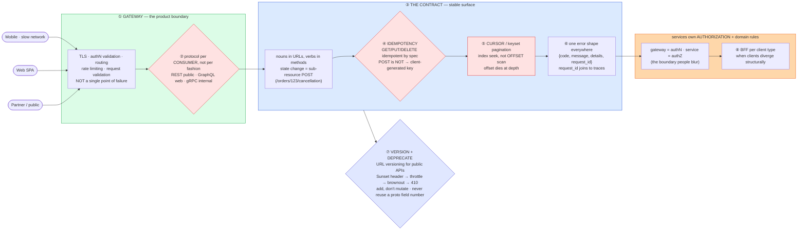

# API Design (REST · GraphQL · gRPC · Gateway) — Mermaid Diagrams

> **Reference:** [questions.md](./questions.md) · [answers.md](./answers.md) · [deep-dive.md](./deep-dive.md)
>
> **Note on this file:** the per-question diagram set (Diagrams 1–N per [`docs/instructions.md` §2.1](../../docs/instructions.md)) is still to be authored for this topic. The **one-page master diagram** below — the artifact you revise from and reproduce on the whiteboard — is complete.
>
> Cross-links: [communication-protocols](../communication-protocols/) (the umbrella: sync vs async) · [rate-limiting](../rate-limiting/) · [observability](../observability/) · [distributed-transactions](../distributed-transactions/) (idempotency) · [cdn-edge](../cdn-edge/)

---

## 🎯 The One-Page Master Diagram — THE ONE TO DRAW IN THE INTERVIEW (final consolidated design)

> **When to use:** final revision, 10 minutes before the interview — and the single diagram to reproduce on the whiteboard. If you can narrate it end-to-end and name the tradeoff at each **red** box, you're ready.
> Spec: [`docs/instructions.md` §2.1](../../docs/instructions.md) · AWS names: [`docs/AWS_SERVICE_MAP.md`](../../docs/AWS_SERVICE_MAP.md).
> ⚠️ AWS services are **defensible defaults**; every quota is an order-of-magnitude planning number to **verify against current docs**.

### The central split in one sentence

**Separate the **contract** (the stable public surface: resources, status codes, versioning, pagination, error shape) from the **implementation** behind the gateway — that separation is what makes safe evolution possible — and match the protocol to the consumer rather than picking one winner: REST for public/external, GraphQL for frontends that need flexible shapes, gRPC for internal service-to-service.**

### The 60-second narration

*(one line per numbered box ①–⑧)*

1. **The gateway is where authentication, validation, rate limiting, routing and observability converge** — it's a product boundary, not a proxy. And say the obvious risk out loud: it must not become the single point of failure, so it's multi-AZ and stateless.
2. **The first red box: choose the protocol per consumer, and reject the framing of the question.** "REST vs GraphQL vs gRPC" is a false choice — the industry-standard answer is a multi-protocol surface: REST for public and partner consumers (cacheable, universal, debuggable), GraphQL where a frontend needs to pick its fields in one round trip over a slow network, gRPC internally for typed, binary, streaming calls. Note gRPC's real weakness: no native browser support without a proxy.
3. **The contract is the thing you can't take back.** Nouns in URLs, verbs as HTTP methods — and when an action isn't CRUD, model the *state transition as a sub-resource* (`POST /orders/123/cancellation`) instead of inventing `POST /cancelOrder`.
4. **The second red box: `POST` is not idempotent, so retries need a client-generated idempotency key.** GET/PUT/DELETE are idempotent by specification; POST isn't, and mobile clients on flaky networks *will* retry. Also distinguish 201 (created, synchronously) from **202 (accepted)**, which is what you return when the work is async — and pair it with a status URL.
5. **The third red box: cursor/keyset pagination, always, for anything large.** `OFFSET 1000000` makes the database count and discard a million rows; a keyset cursor is an index seek and is equally fast at any depth. This is the single most common "worked in staging, died in production" API bug.
6. **One error shape everywhere**, including a `request_id` that joins straight to your traces — an API whose errors are unstructured strings cannot be debugged by its consumers or by you.
7. **Evolution is a process, not a version number:** URL versioning for public APIs (what Stripe, GitHub and Twilio do), and the deprecation ladder — `Sunset` header → throttle → scheduled brownouts → `410 Gone`. The invariant across REST, protobuf and Avro is identical: **add, don't mutate; default, don't require; deprecate, don't delete; never reuse a field number.**
8. **The boundary people blur: the gateway validates *authentication*, the service enforces *authorization*.** The gateway cannot know whether *this* user may cancel *that* order. And when client needs diverge structurally rather than cosmetically, a **BFF** per client type is the honest answer — accepting that you now own more surfaces.

### The five numbers that justify the design

| Number | Derivation | Therefore |
|---|---|---|
| **500K+ API calls/s across consumers** | stated constraint | The gateway is on every request: stateless, multi-AZ, and cheap per request — anything per-request-expensive there is a scaling wall |
| **p99 < 100 ms reads / < 500 ms writes at the gateway** | stated SLA | Bounds how much the gateway may do inline: token validation and routing yes; heavyweight enrichment no |
| **`OFFSET n` cost grows linearly with n** | database scan semantics | Cursor pagination isn't a preference, it's the only option that holds a latency SLA at depth |
| **GraphQL N+1: 1 query → 1 + N fetches** | naive resolver behaviour | Forces DataLoader batching per event-loop tick, plus depth limits and cost analysis, or one query can DoS you |
| **Backward compatibility = "never break an existing client"** | stated constraint | Makes additive-only evolution a hard rule, and makes the deprecation ladder a product process rather than an engineering afterthought |

### The patterns this assembles

| Pattern | Where | The move |
|---|---|---|
| [Dealing with Contention](../../patterns/dealing-with-contention.md) **●** | ④ | The idempotency key is a conditional/unique write — rung 1 — and it belongs *inside* the business transaction |
| [Scaling Reads](../../patterns/scaling-reads.md) **●** | ⑤ | ETag/conditional GET (`304`), cache-friendly resource URLs, cursor pagination to keep reads index-only |
| [Long-Running Tasks](../../patterns/long-running-tasks.md) **●** | ④ | `202 Accepted` + job resource + status polling; anything past the gateway timeout becomes async by necessity |
| [Rate limiting](../rate-limiting/) **●** | ① | Per-key quotas at the earliest choke point, with `429` + `Retry-After` as part of the contract |
| [Real-Time Updates](../../patterns/realtime-updates.md) ○ | ② | Where the consumer needs push, the answer leaves REST entirely — WS/SSE, per [communication-protocols](../communication-protocols/) |

### The three things that break (and the mitigation)

| Failure | Blast radius | Mitigation | How you detect it |
|---|---|---|---|
| **A "small" breaking change ships** | Every existing client breaks at once, and mobile clients cannot be force-upgraded — the damage is permanent for old app versions | Additive-only evolution, contract tests in CI against the published schema, and a deprecation ladder with real dates; version in the URL for public APIs | Contract-test failures pre-merge; 4xx spike by client version after deploy; usage-by-version dashboards |
| **Offset pagination on a large collection** | Deep pages time out and hammer the database; usually discovered by a partner scraping page 5,000 | Keyset/cursor pagination with an opaque cursor, plus a hard page-size cap | Query latency vs page depth; slow-query log grouped by endpoint; max observed offset |
| **One consumer's retry storm** | A partner's aggressive retries saturate a shared backend and turn one client's bug into everyone's outage | Per-key rate limits with `429` + `Retry-After`, plus documented backoff-with-jitter guidance in the contract; quotas per plan | 429 rate by API key; retry-amplification ratio; concentration of traffic by consumer |

### The AWS-specific traps to name unprompted

| Trap | Why it bites here | What you say |
|---|---|---|
| **API Gateway integration timeout** (~29 s historically **⚠️ verify**) | Long operations | *"Anything longer becomes `202` plus a status URL — the gateway ceiling forces the long-running-task pattern, which I'd want anyway."* |
| **API Gateway adds hops and per-request cost** | 500K req/s | *"At this volume I'd weigh ALB straight to the service for the hot path and keep API Gateway where I need usage plans, keys and throttling."* |
| **AWS has no managed gRPC broker** | Internal RPC | *"gRPC is run-it-yourself on ALB/NLB — HTTP/2 end-to-end, and I'd confirm the LB's gRPC support in current docs."* |
| **WAF/API Gateway throttling protects AWS's edge, not your database** | False sense of safety | *"Backpressure into my own system is mine: load shedding and queue-depth-driven admission control."* |
| **Cognito vs a dedicated IdP** | Enterprise federation | *"Cognito for standard OIDC/user pools; complex enterprise federation goes to a dedicated IdP."* |
| **AppSync ≠ free GraphQL** | Managed GraphQL | *"AppSync is defensible, but resolver-level N+1 and query cost limits are still my problem — managed doesn't mean safe."* |

### If you only remember one thing

> **The contract is the product: separate it from the implementation, match the protocol to the consumer (REST public / GraphQL web / gRPC internal), make POST retry-safe with a client-generated idempotency key, paginate by cursor rather than offset, and evolve additively behind a real deprecation ladder — because you can change your services any time and your contract almost never.**
