# CDN & Edge Computing — Mermaid Diagrams

> **Reference:** [questions.md](./questions.md) · [answers.md](./answers.md) · [deep-dive.md](./deep-dive.md) · use-case survey: [fundamentals/Use_Cases_for_Caching.md](../../fundamentals/Use_Cases_for_Caching.md)
>
> **Note on this file:** the per-question diagram set (Diagrams 1–N per [`docs/instructions.md` §2.1](../../docs/instructions.md)) is still to be authored for this topic. The **one-page master diagram** below — the artifact you revise from and reproduce on the whiteboard — is complete.
>
> **Cross-links (depth lives there, not here):** [distributed-caching](../distributed-caching/) (the tier behind the edge) · [scaling-reads pattern](../../patterns/scaling-reads.md) · [video-streaming](../video-streaming/) (HLS/ABR delivery) · [file-storage](../file-storage/) (signed-URL delivery) · [e-commerce](../e-commerce/) (immutable version keys) · [rate-limiting](../rate-limiting/) (edge as the first choke point)

---

## 🎯 The One-Page Master Diagram — THE ONE TO DRAW IN THE INTERVIEW (final consolidated design)

> **When to use:** final revision, 10 minutes before the interview — and the single diagram to reproduce on the whiteboard. If you can narrate it end-to-end and name the tradeoff at each **red** box, you're ready.
> Spec: [`docs/instructions.md` §2.1](../../docs/instructions.md) · AWS names: [`docs/AWS_SERVICE_MAP.md`](../../docs/AWS_SERVICE_MAP.md).
> ⚠️ AWS services are **defensible defaults**; every quota is an order-of-magnitude planning number to **verify against current docs**.

### The central split in one sentence

**Decompose content by **cacheability** first (static assets and video segments behave nothing like HTML or API responses, and treating them alike either over-caches dynamic data or misses your hit-ratio target), then design for **what happens on a miss** — because at 10M req/s a 95% hit ratio still sends 500K req/s to an origin sized for exactly that, so origin shield, request collapsing and stale-while-revalidate are what make the number survivable.**

```mermaid
flowchart LR
    USER(["500M users · 190 countries<br/>10M req/s peak"])

    ROUTE{"① how they REACH a PoP<br/>Anycast: one IP, BGP picks nearest in TOPOLOGY<br/>GeoDNS: many IPs, picks by RESOLVER location<br/>(blind to resolver ≠ client)"}

    CLASS{"② CLASSIFY BY CACHEABILITY — do this FIRST<br/>immutable assets: long TTL, versioned key<br/>video segments: immutable · manifest: short TTL<br/>HTML/API: short or no-store"}

    subgraph KEY["③ THE CACHE KEY IS THE DESIGN"]
        direction TB
        K1["strip tracking query params<br/>or you cache N copies of one object"]
        K2{"Vary: Cookie → per-user key → hit ratio ≈ 0<br/>NEVER do it"}
        K3["headers: s-maxage overrides max-age<br/>for SHARED caches only"]
        K1 --> K2 --> K3
    end

    subgraph MISS["④ WHAT HAPPENS ON A MISS — the real design"]
        direction TB
        COLL["request collapsing<br/>N concurrent misses → 1 origin fetch"]
        SHIELD["⑤ ORIGIN SHIELD (mid-tier)<br/>collapses misses across MANY PoPs → ~1 fetch"]
        SWR["stale-while-revalidate<br/>serve stale instantly, refresh behind<br/>→ no expiry latency cliff"]
        COLL --> SHIELD --> SWR
    end

    PURGE{"⑥ INVALIDATION: purge is slow + rate-limited<br/>→ design NOT to need it: versioned immutable keys<br/>surrogate keys to purge a GROUP in one call<br/>&lt; 30s propagation = your blast-radius safety net"}

    EDGE["⑦ edge compute + security<br/>runs decisions a cache rule can't<br/>CDN is a trusted MITM (keyless SSL keeps your key)<br/>cache poisoning: key on ALL inputs you reflect"]

    ORIGIN[("origin — 500K req/s ceiling")]
    MULTI["⑧ MULTI-CDN — vendor-wide outages are real<br/>(Fastly, June 2021: one config change,<br/>~1 hour, many major sites)<br/>steer by real-user metrics"]

    USER --> ROUTE --> CLASS --> K1
    K3 --> COLL
    SWR -->|"only the survivors"| ORIGIN
    CLASS -.-> PURGE
    ROUTE -.-> EDGE
    ORIGIN -.-> MULTI

    style KEY fill:#dbeafe,stroke:#1d4ed8
    style MISS fill:#dcfce7,stroke:#16a34a
    style ORIGIN fill:#dbeafe,stroke:#1d4ed8
    style EDGE fill:#e0e7ff,stroke:#4338ca
    style MULTI fill:#fed7aa,stroke:#ea580c
    style ROUTE fill:#fef9c3,stroke:#ca8a04
    style CLASS fill:#fee2e2,stroke:#dc2626
    style K2 fill:#fee2e2,stroke:#dc2626
    style PURGE fill:#fee2e2,stroke:#dc2626
```

### The 60-second narration

*(the whole system, one short line per numbered box — say this end to end)*

1. Anycast advertises one IP from many PoPs; BGP routes to the nearest.
2. Classify content by cacheability before you touch a CDN setting.
3. The cache key *is* the design. Strip tracking parameters.
4. What happens on a miss distinguishes a senior answer: request collapsing.
5. An origin shield collapses misses from many PoPs into one origin fetch.
6. Purge is slow and rate-limited, so design not to need it.
7. Edge compute runs the decisions a cache rule can't express.
8. Close on the operational failure: vendor-wide CDN outages are real.

### The 3-minute walkthrough

*(the same flow with the reasoning attached — this is what you say during the architecture block, while drawing)*

1. **First, how a user even reaches a PoP** — and the distinction interviewers probe: **Anycast** advertises one IP from many PoPs and lets BGP route to the nearest one *in network topology* (not necessarily geography); **GeoDNS** hands out different IPs based on the *resolver's* location, which is blind to the case where the resolver isn't near the client (public DNS resolvers break this assumption).
2. **The first red box, and the move that sets up everything else: classify content by cacheability before you touch a CDN setting.** Immutable assets get long TTLs under versioned keys. Video segments are immutable; the *manifest* is not, so it gets a short TTL. HTML and API responses get short TTLs or `no-store`. Treating these alike either serves stale dynamic data or misses the 95% target — and the classification is driven by `Cache-Control` on the **origin response**, not by CDN-side rules.
3. **The cache key *is* the design.** Strip tracking query parameters or you store N copies of one object and shred your hit ratio. `s-maxage` overrides `max-age` for shared (CDN) caches, which is how you keep browsers and edges on different clocks deliberately. And the second red box is the classic self-inflicted wound: **`Vary: Cookie` makes the key per-user and drives the hit ratio to nearly zero.**
4. **Now the part that actually distinguishes a senior answer: what happens on a miss.** **Request collapsing** holds concurrent misses for the same URL and makes one origin request instead of thousands.
5. **An origin shield is a mid-tier cache** that collapses misses arriving from *many* PoPs into roughly one origin fetch — without it, a viral URL misses independently at every PoP simultaneously. **Stale-while-revalidate** serves the stale object instantly and refreshes in the background, removing the latency cliff at expiry. These three mechanisms together are what make a 95% hit ratio realistic in production rather than aspirational.
6. **The third red box: purge is slow and rate-limited, so design not to need it.** Versioned immutable keys mean a change is a *new object*, never an invalidation. **Surrogate keys** let you tag responses and purge a whole group (`product-9876`) in one call. And the <30 s propagation requirement is really a **safety net**: it bounds the blast radius of a caching mistake.
7. **Edge compute runs the decisions a cache rule can't express** (A/B assignment, auth checks, redirects, request normalization). Two security points worth volunteering: the CDN terminates TLS, so it is a **trusted man-in-the-middle** — keyless SSL exists so your private key never leaves your infrastructure; and **cache poisoning** happens when an unkeyed header is reflected into a cached response, so key on every input you reflect.
8. **Close on the operational failure that makes this a staff-level answer: vendor-wide CDN outages are real.** In June 2021 a single customer configuration change triggered a latent bug in Fastly's configuration layer and took down many major sites globally for about an hour (publicly reported — treat the internal detail as reported, not confirmed). A single-CDN platform has no defence against a CDN-layer bug, which is why serious platforms run multiple CDNs with real-time steering by real-user metrics.

### The five numbers that justify the design

| Number | Derivation | Therefore |
|---|---|---|
| **95% of 10M req/s ⇒ 500K req/s to origin** | (1 − hit ratio) × traffic | Exactly the stated origin ceiling — so hit ratio is not a vanity metric, it is *the* capacity constraint |
| **95% → 90% doubles origin load to 1M/s** | miss rate doubling | Your origin dies from a 5-point hit-ratio dip; that's why you alert on the ratio, not just on errors |
| **~3–4 RTT of setup at ~10 ms vs ~120 ms** | TCP + TLS handshakes × RTT | The latency win is mostly *handshake* elimination, not bytes — which is why the edge helps even for small responses |
| **p99 < 50 ms globally** | stated SLA | Requires terminating at a nearby PoP; no origin round-trip can meet it from the far side of the world |
| **< 30 s purge propagation** | stated requirement | Bounds the blast radius of a caching mistake — a safety net, not a routine tool |

### The patterns this assembles

| Pattern | Where | The move |
|---|---|---|
| [Scaling Reads](../../patterns/scaling-reads.md) **●** | ②③④ | The outermost tier of the ladder: most traffic must never reach an origin at all |
| [Dealing with Contention](../../patterns/dealing-with-contention.md) **●** | ④ | Request collapsing is single-flight applied at the edge — the cheapest coordination available |
| [Handling Large Blobs](../../patterns/large-blobs.md) **●** | ⑦ | Signed URLs for private objects; bytes stream from the edge, never through your API |
| [Rate limiting](../rate-limiting/) ○ | ⑦ | The edge is the cheapest place to reject volumetric abuse |
| [Real-Time Updates](../../patterns/realtime-updates.md) ○ | ② | What *can't* be cached — and why a live manifest gets a short TTL instead |

### The three things that break (and the mitigation)

| Failure | Blast radius | Mitigation | How you detect it |
|---|---|---|---|
| **Thundering herd on a newly viral URL** | It was never cached, so every PoP misses simultaneously and the origin sees many multiples of its normal load within seconds | Origin shield to collapse cross-PoP misses, request collapsing within each PoP, and stale-while-revalidate so a refresh never blocks a response | Origin RPS vs edge RPS ratio; miss rate for a single URL; origin queue depth and 5xx rate |
| **Cache key explosion** (`Vary: Cookie`, unstripped query params) | Hit ratio collapses toward zero and the origin absorbs traffic it was never sized for — the failure is a *config* change, not a traffic change | Explicit key allowlists (strip trackers, normalize), never vary on cookies, and treat key configuration as reviewable code | Hit ratio by URL pattern; cardinality of cache keys per path; sudden origin-load step change after a deploy |
| **CDN vendor-wide outage** | Everything served through that CDN is unreachable — no amount of origin capacity helps, because users cannot reach you | Multi-CDN with real-user-metric steering and a tested failover; keep DNS TTLs low enough to steer; verify the fallback path regularly | Synthetic + RUM availability per CDN; steering-decision logs; time-to-shift-traffic in a drill |

### The AWS-specific traps to name unprompted

| Trap | Why it bites here | What you say |
|---|---|---|
| **CloudFront invalidation is slow and rate-limited** | People design around invalidation | *"Versioned immutable keys with long TTLs and short TTLs on manifests — I invalidate almost never, and I'd verify current invalidation limits."* |
| **CloudFront's grouping is not Fastly-style surrogate keys** **⚠️ verify** | Purge-by-tag is assumed | *"If I need tag-based group purge I'd confirm what CloudFront supports today, or keep a version-key strategy that makes group purge unnecessary."* |
| **Lambda@Edge vs CloudFront Functions** | Different limits and placement | *"CloudFront Functions for lightweight header/URL work at viewer time; Lambda@Edge when I need more runtime — and Fastly/Cloudflare Workers if I need heavier programmable edge logic."* |
| **Origin Shield must be enabled deliberately** | Assumed default | *"Origin shield is a configuration decision — without it a viral object misses at every PoP independently."* |
| **S3 as origin has per-prefix request limits** (~5,500 GET **⚠️ verify**) | The origin itself throttles | *"Spread keys across prefixes; a single hot prefix behind the CDN is still a bottleneck on a mass miss."* |
| **Signed URLs vs signed cookies** | Access control at the edge | *"Signed URLs per object, signed cookies for a whole path — and revocation is at the signing layer, since I cannot recall a cached response."* |

### If you only remember one thing

> **Classify content by cacheability, then design the *miss* path — at 10M req/s a 95% hit ratio still means 500K req/s at your origin, so origin shield, request collapsing and stale-while-revalidate are the load-bearing mechanisms; versioned immutable keys mean you never depend on purge, and multi-CDN exists because vendor-wide outages are real.**
