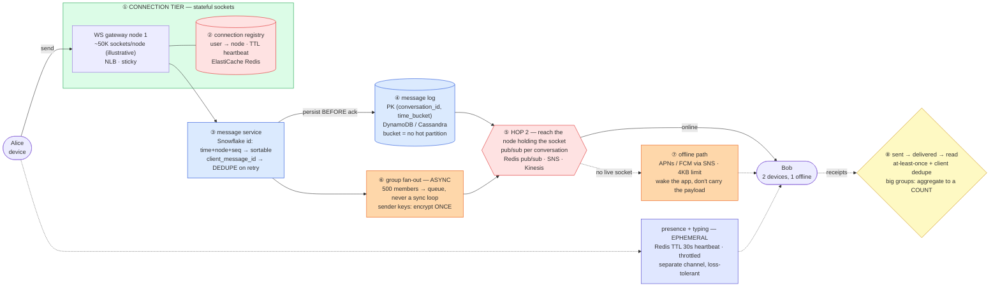

# Chat System (WhatsApp / Slack) — Mermaid Diagrams

> **Reference:** [questions.md](./questions.md) · [answers.md](./answers.md) · [deep-dive.md](./deep-dive.md) · [interview-answer.md](./interview-answer.md)
>
> **Note on this file:** the per-question diagram set (Diagrams 1–N per [`docs/instructions.md` §2.1](../../docs/instructions.md)) is still to be authored for this topic. The **one-page master diagram** below — the artifact you actually revise from and reproduce on the whiteboard — is complete.
>
> Cross-links: [communication-protocols](../communication-protocols/) (WebSocket vs SSE vs poll) · [notification-system](../notification-system/) (push fallback) · [message-queues](../message-queues/) (fan-out backbone) · [kv-store](../kv-store/) (message store) · [file-storage](../file-storage/) (media) · [collaborative-editing](../collaborative-editing/) (presence on a separate channel)

---

## 🎯 The One-Page Master Diagram — THE ONE TO DRAW IN THE INTERVIEW (final consolidated design)

> **When to use:** final revision, 10 minutes before the interview — and the single diagram to reproduce on the whiteboard. If you can narrate it end-to-end and name the tradeoff at each **red** box, you're ready.
> Spec: [`docs/instructions.md` §2.1](../../docs/instructions.md) · AWS names: [`docs/AWS_SERVICE_MAP.md`](../../docs/AWS_SERVICE_MAP.md).
> ⚠️ AWS services are **defensible defaults**; every quota is an order-of-magnitude planning number to **verify against current docs**.

### The central split in one sentence

**A chat system is a *connection-routing* problem wearing a messaging costume: the hard part is not storing the message, it is that the recipient's socket lives on a different server than the sender's — so you need a connection registry plus a pub/sub backplane (hop 2), a durable per-conversation log for everyone who is offline, and push notifications as the fallback channel; presence and typing indicators ride a separate ephemeral path so a mouse-twitch can never delay a message.**

### The 60-second narration

*(the whole system, one short line per numbered box — say this end to end)*

1. HTTP can't express "the server speaks first", so the connection tier is stateful WebSockets.
2. The crux is a connection registry mapping user → node, kept fresh by heartbeats.
3. Snowflake-style message ids: globally unique and sortable without a coordinator.
4. Persist before you ACK, into a per-conversation log with time buckets.
5. Hop 2 is reaching the node holding the recipient's socket. The actual hard part.
6. Group fan-out is async, always. Never a synchronous loop.
7. Offline is a first-class state, not an error.
8. Three states, three acknowledgements: sent → delivered → read.

### The 3-minute walkthrough

*(the same flow with the reasoning attached — this is what you say during the architecture block, while drawing)*

1. **HTTP request/response cannot express "the server speaks first," so the connection tier is stateful WebSockets** behind an L4 load balancer — and stateful is the word that creates every other problem on this board.
2. **The red registry is the crux: a connection registry mapping user → node**, kept fresh by heartbeats with a TTL. Alice's socket is on node 1; Bob's is on node 7. Without this you have no idea where to deliver.
3. **Message ids are Snowflake-style** (timestamp + node + sequence) so they are globally unique *and* sortable without a coordinator — that's what makes "give me messages after X" a range scan. The client also sends its own `client_message_id`, which is how a retry is deduped instead of duplicated.
4. **Persist before you ACK**, into a per-conversation log partitioned by `(conversation_id, time_bucket)`. The time bucket is not decoration: without it a busy conversation is one ever-growing hot partition.
5. **The second red box is hop 2 — getting the message to the node holding the recipient's socket.** This is the actual hard part of chat, and the part candidates skip. A pub/sub topic per conversation (or a routed lookup via the registry) fans the message to exactly the nodes that need it.
6. **Group fan-out is async, always.** Alice → a 500-person group is a queued job, never a synchronous loop; a loop makes her send latency a function of group size. With end-to-end encryption, **sender keys** let her encrypt once for the whole group instead of 500 times.
7. **Offline is a first-class state, not an error.** No live socket → the message is already durable in the log, and a push notification (APNs/FCM) wakes the app. Keep the payload out of the push — it's size-limited (~4 KB) and travels through a third party.
8. **Three states, three acknowledgements: sent → delivered → read**, flowing back to the sender. Delivery is at-least-once, so the client dedupes on `client_message_id`. And for a 5,000-member group you *aggregate receipts to a count* rather than tracking 5,000 read rows per message — the honest scaling answer.

Presence and typing sit deliberately off to the side: a Redis key with a ~30 s TTL heartbeat, throttled, and allowed to be wrong. It must never share a path with durable messages.

### The five numbers that justify the design

| Number | Derivation | Therefore |
|---|---|---|
| **~50K sockets per node** (illustrative planning figure — verify) | file descriptors + memory per connection | Sizes the gateway fleet, and tells you a node crash reconnects ~50K clients at once → jittered backoff is mandatory |
| **Fan-out cost = group size × devices** | one message → N members × M devices | A 500-member group with 2 devices each is 1,000 deliveries from one send — which is why fan-out is a queue, not a loop |
| **~30 s presence TTL** | heartbeat interval × safety factor | Defines "online" and bounds how wrong presence can be; it's a cheap Redis TTL, never a durable write |
| **Push payload ≤ ~4 KB** (platform limit — verify) | APNs/FCM constraint | The push is a *wake-up*, not the message; the client fetches from the log |
| **Read:write is receipt-dominated in groups** | 1 message → N delivered + N read events | Per-member receipts multiply writes by group size → aggregate above a threshold |

### The patterns this assembles

| Pattern | Where | The move |
|---|---|---|
| [Real-Time Updates](../../patterns/realtime-updates.md) **●** | ①②⑤ | Hop 1 = WebSocket; **hop 2 = registry + pub/sub backplane**. This topic is the canonical hop-2 problem |
| [Scaling Writes](../../patterns/scaling-writes.md) **●** | ④⑥ | Bucketed partition keys to avoid a hot conversation; async fan-out to flatten group cost |
| [Multi-Step Processes](../../patterns/multi-step-processes.md) **●** | ③④⑦⑧ | Persist → route → push-fallback → receipts, each step idempotent and re-drivable |
| [Dealing with Contention](../../patterns/dealing-with-contention.md) ○ | ③ | `client_message_id` dedupe is a conditional/unique write — rung 1 again |
| [Large Blobs](../../patterns/large-blobs.md) ○ | media | Presigned direct-to-S3 upload; the message carries a CDN URL, never the bytes |

### The three things that break (and the mitigation)

| Failure | Blast radius | Mitigation | How you detect it |
|---|---|---|---|
| **A gateway node dies** | ~50K clients reconnect simultaneously; their registry entries are stale, so messages route to a dead node | Registry entries carry a TTL and are re-registered on reconnect; jittered client backoff; deliveries fall back to the durable log + push | Reconnect-rate spike; delivery attempts to unknown nodes; connection-count cliff |
| **A celebrity/large group message** | One send becomes tens of thousands of deliveries and receipts — the send path stalls for everyone | Async queued fan-out with per-conversation ordering; receipt aggregation above a size threshold; sender keys so encryption is once, not per member | Fan-out lag per conversation; send-to-first-delivery p99; receipt write rate vs message rate |
| **Client was offline for a week** | Naive "replay everything" floods the device and the log | Client sends `last_message_id`; server returns a bounded page and a cursor — a range scan on the sortable id, not a full history dump | Sync-payload size distribution; time-to-first-paint after reconnect; count of oversized sync responses |

### The AWS-specific traps to name unprompted

| Trap | Why it bites here | What you say |
|---|---|---|
| **API Gateway WebSocket is per-message priced** | Chat is the highest-message-count product there is | *"Self-managed WebSocket on an NLB plus a DynamoDB/ElastiCache connection registry — API Gateway WebSocket hides hop 2, which is exactly why it's priced per message."* |
| **DynamoDB hot partition** (~1,000 WCU/partition **⚠️ verify**) | One busy conversation is one partition key | *"That's why the key is `(conversation_id, time_bucket)` — the bucket rolls the partition forward instead of letting it grow hot."* |
| **DynamoDB TTL is not a scheduler** (~48 h best-effort **⚠️ verify**) | Presence and typing look like TTL jobs | *"TTL is fine for *expiring* a presence key since staleness is tolerable — but I'd never use it where a precise timer is required."* |
| **SQS FIFO throughput is per message-group** **⚠️ verify** | Ordering per conversation is desirable | *"Group by `conversation_id` — many small groups. Grouping coarser would serialize unrelated chats."* |
| **NLB + sticky sessions ≠ free affinity** | Stateful sockets need routing | *"The registry is the routing truth; I don't rely on LB stickiness to find a user's node."* |
| **No exactly-once delivery** | Receipts assume it | *"At-least-once plus `client_message_id` dedupe gives an exactly-once *effect* — the client is the dedupe point."* |

### If you only remember one thing

> **Chat is a hop-2 problem: the message is easy to store and hard to *route*, because the recipient's socket is on another server — so a connection registry plus a pub/sub backplane does the routing, a durable per-conversation log (persisted before the ACK) serves everyone offline, push is only a wake-up, and presence rides a separate throwaway channel.**
