# Collaborative Editing — Quick Revision

> **What this is:** the 10-minute version of a 2,300-line folder. Built for the morning of the interview.
> **Deep version:** [`README.md`](./README.md) · [`answers.md`](./answers.md) — every section here links back.
> **Script to read aloud:** [`diagrams.md`](./diagrams.md) — the **🎤 30-Minute Interview Transcript** at the very end.
> **Interviewer signal:** "design Google Sheets" · "real-time multiplayer" · "collaborative editor" · "how do concurrent edits converge".

Framing: **Google Sheets**, not Docs. Collaborative *text* is the easier sub-case. The calc plane is what makes Sheets genuinely harder, and it's where senior answers separate from the pack.

---

## The one-sentence split

**A spreadsheet is two agreement problems bolted together: the sync plane agrees on what users *typed*, the calc plane agrees on what formulas *produced*.**

You never merge computed outputs. You merge inputs on the sync plane, then recompute outputs on the calc plane.

A collaborative text editor has only the first plane. Naming the second is the highest-signal thing you do here.

---

## Diagram 1 — The two planes

> **When to use:** the opening 90 seconds. This is the diagram you draw first.

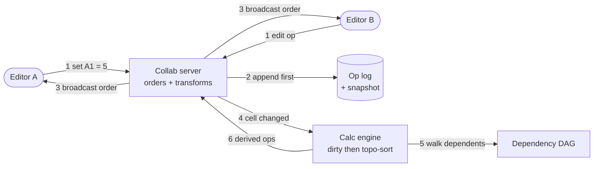

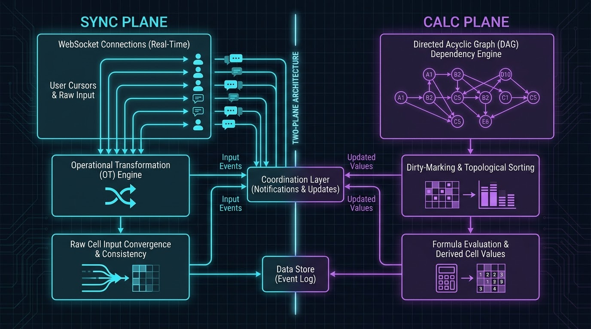

**The pen version**

```text
  Editor A ─┐
            ├─▶ [Collab server] ──▶ (op log + snapshot)
  Editor B ─┘        │  ▲
                     │  │ derived ops
                     ▼  │
              [Calc engine] ──▶ (dependency DAG)

     SYNC = agree on inputs      CALC = agree on outputs
```

**Draw order (~60s)**
1. Two stick figures on the left. Label them Editor A and Editor B.
2. One box in the middle: "Collab server". Arrows in from both editors.
3. Cylinder to its right: "Op log + snapshot". Arrow across, label it "append **first**".
4. Arrows back from the server to both editors: "broadcast ordered ops".
5. Box below the server: "Calc engine". Arrow down, label "cell changed".
6. Cylinder beside it: "Dependency DAG". Arrow across, then an arrow back up to the server.
7. Draw a line separating top from bottom. Write SYNC above, CALC below.

**Say while drawing**
1. "Two editors, one document. Everything funnels through one server."
2. "That server is the sequencer. It assigns every op an order."
3. "It appends to the log *before* it acks. That's the durability rule."
4. "Then it broadcasts the agreed order to everyone."
5. "A changed cell wakes the calc engine."
6. "The engine walks the dependency graph and recomputes only what's dirty."
7. "Computed values flow back as ordered ops. Two planes, one pipe."

**What the interviewer is checking**
- Do you name the calc plane at all, or treat this as Google Docs?
- Do you say "append before ACK" unprompted?
- Do computed values re-enter through sync, or do you try to merge them?

→ [v1 Diagram 1](./diagrams.md#diagram-1--the-two-plane-architecture-start-here) · [answers Q2](./answers.md)

---

## The document model

A sheet is almost entirely empty. A 26-column × 100k-row sheet is ~2.6M addressable cells with maybe a few thousand populated.

So: **a sparse map, not a dense array.** A cell is a record, not a value — it holds the formula source *and* the last computed value.

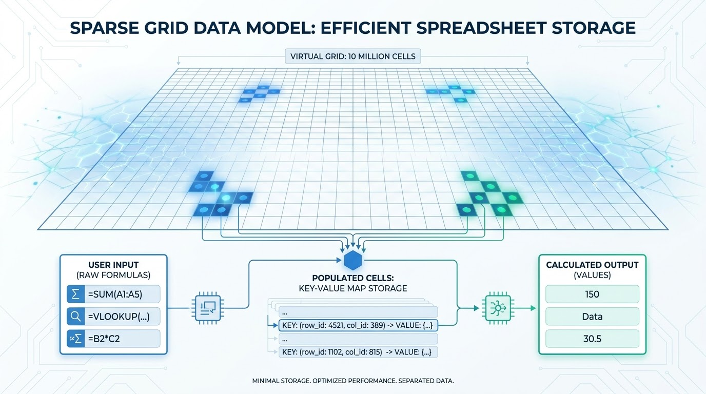

Persistence is one mechanism doing four jobs: **periodic snapshot + append-only op log.**

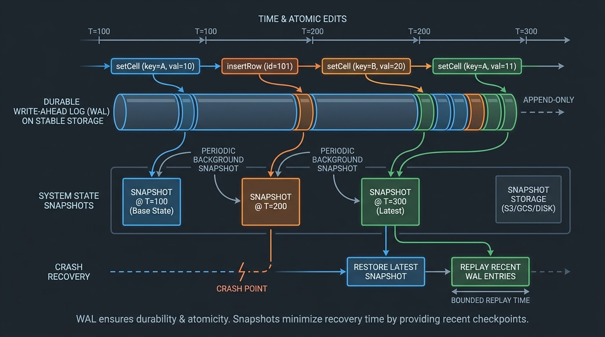

```text
  snapshot (every N ops / T seconds)  +  every op since  =  the document
```

Replay is the document. That single shape gives you durability, fast open, version history, and crash recovery — the same pattern as [storage-engines](../storage-engines/).

**The durability rule, in one sentence: append the op to the log before you ACK it.** A crash can then only lose edits that were never acknowledged, and clients resubmit those idempotently.

→ [v1 Diagram 2](./diagrams.md#diagram-2--document-model--persistence-snapshot--op-log) · [answers Q6–Q7](./answers.md)

---

## Convergence — OT vs CRDT

Two users edit the same cell at the same instant. "Correct" means two things, and you must name both:

- **Convergence** — everyone who saw the same ops ends in the same state.
- **Intention preservation** — a merge never silently discards someone's edit.

Last-write-wins gives you convergence cheaply. It fails intention preservation — it converges by throwing an edit away.

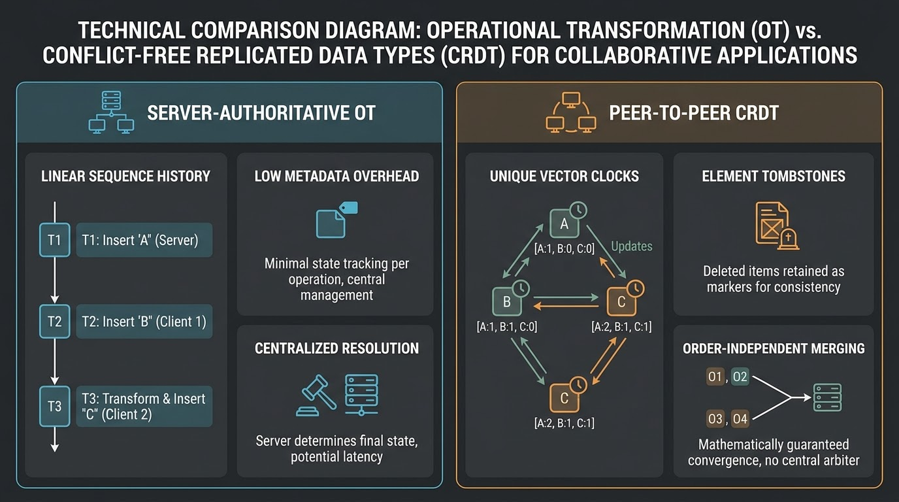

| | OT | CRDT |
|---|---|---|
| How | Transform each op against the ops it didn't see | Merge in any order, by construction |
| Needs | A server imposing a total order | No coordinator |
| Pays in | A sequencer on the path | Per-element IDs and tombstones |
| Pick when | Server is present, cell counts are huge | Local-first, peer-to-peer, offline-heavy |

**For Sheets: OT.** The server is already there, and ~10⁷ cells makes per-element CRDT identity metadata expensive. Say the alternative and why you didn't pick it.

### The OT client loop

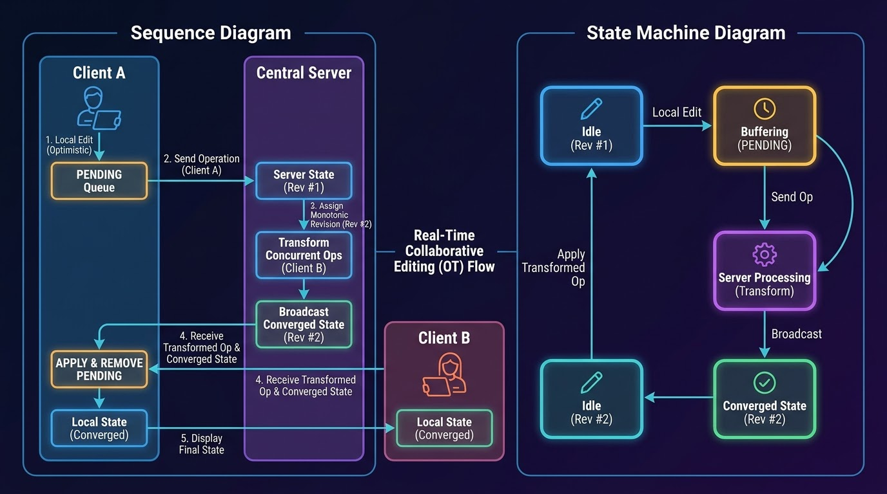

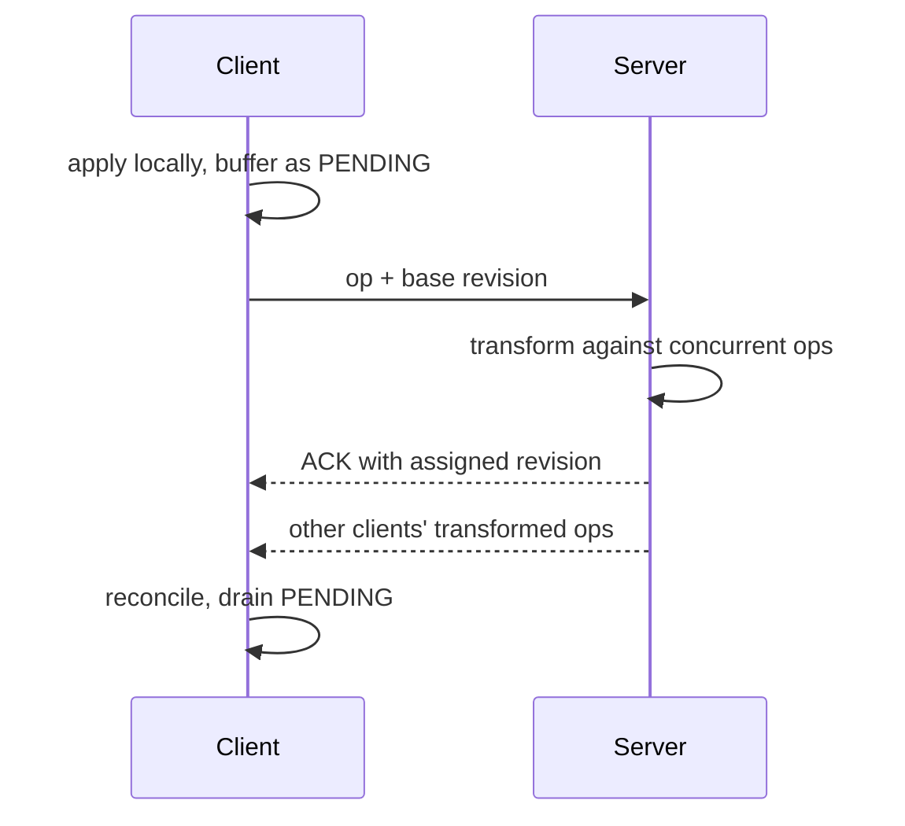

**Say while drawing:** "Apply locally now, buffer it as pending, and reconcile when the server's version comes back."

→ [v1 Diagram 3](./diagrams.md#diagram-3--ot-optimistic-local-edit--server-transform) · [answers Q10–Q12](./answers.md)

---

## Structural ops — the signature hard problem

This is the part that makes Sheets harder than Docs, and it's where the interview is won.

**The failure story:** address cells by `(row, col)`. User A inserts a row above row 5. User B concurrently writes `=SUM(A1:A6)` in `A7`. Every address below the insert shifts, *and* every formula reference below it must be rewritten — in **both planes at once**.

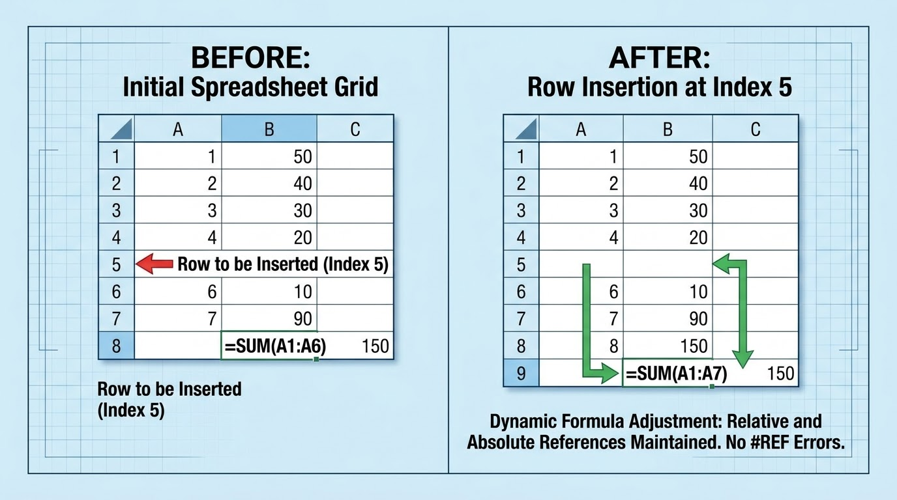

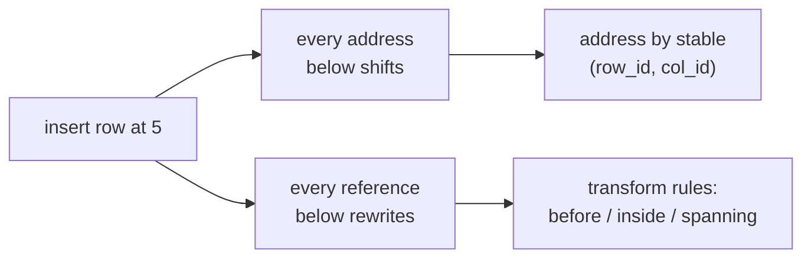

**The fix, in two parts:**

1. **Stable identities.** Address a cell by `(row_id, col_id)`, never by its display coordinates.
2. **Explicit transform rules** for references that start *before* the boundary, end *inside* it, or *span* it.

Why this deserves airtime: a naive implementation produces a **plausible wrong number**. Nothing crashes. That's worse than a crash, and it's why this needs property-based convergence tests rather than hand-waving.

→ [v1 Diagram 4](./diagrams.md#diagram-4--the-signature-hard-problem-concurrent-row-insert-shifts-references) · [answers Q13](./answers.md)

---

## The calc engine

A user changes `A1`. `B1 = A1*2` and `C1 = B1+1` depend on it. Recompute exactly those, in that order, and nothing more.

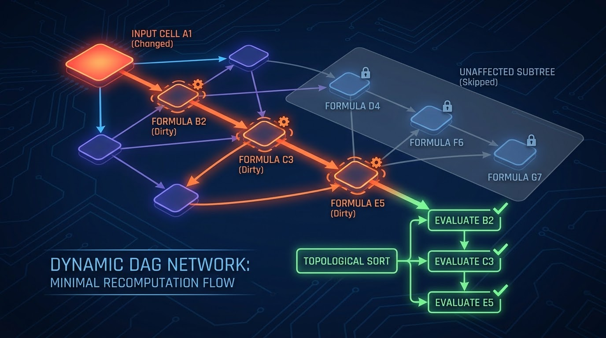

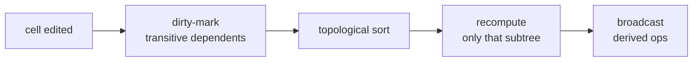

Never rescan the sheet. One input feeds *its* dependent subtree — that's the only work.

**Determinism is the whole ballgame.** Clients recompute optimistically for instant feedback while the server recomputes authoritatively. If those disagree, collaborators watch their numbers flicker and correct themselves.

So: identical function semantics, IEEE-754 floating point, locale-independence, and volatile or external inputs — `NOW()`, `RAND()`, `IMPORTRANGE` — **resolved server-side**. The server value wins.

*Name-drop only:* circular reference detection runs on edge insert. Selective undo uses inverse ops plus transform.

→ [v1 Diagram 5](./diagrams.md#diagram-5--calc-engine-dirty-mark--topo-sort--minimal-recompute) · [answers Q15–Q19](./answers.md)

---

## The scaling shape is unusual — say so

This is the insight that signals real experience.

Most real-time systems — chat, feeds, location — are **throughput** problems: huge op rates over mostly stateless workers. Collaborative editing is the opposite.

```text
Per editor:     ~1–5 ops/s (coalesced)
Busy doc:       ~10 editors → ~50 ops/s        ← tiny
Live docs:      ~1M × 1–10 MB = 1–10 TB RAM    ← the real constraint
Total docs:     ~10⁸                            ← storage, not memory
```

Per-document op rate is **tiny**. But each document is a small, stateful, latency-sensitive session that must live in memory to be sequenced and recomputed.

**So you scale *across* documents, never within one.** Stateless gateways route by `doc_id` to stateful doc-servers, each the single writer for the documents it owns.

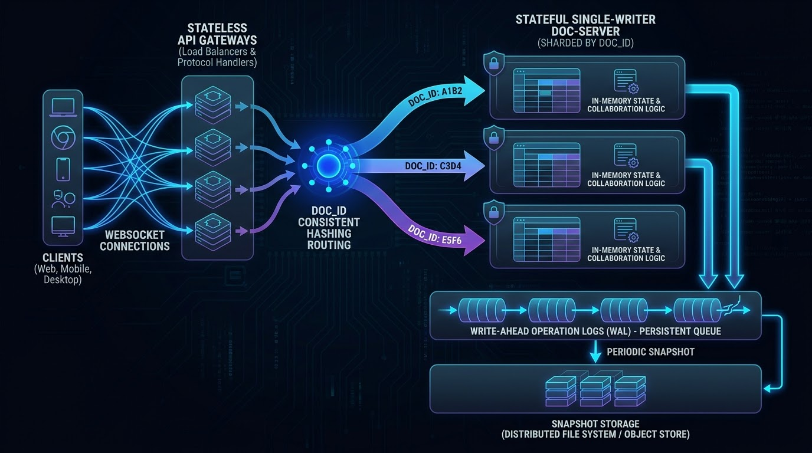

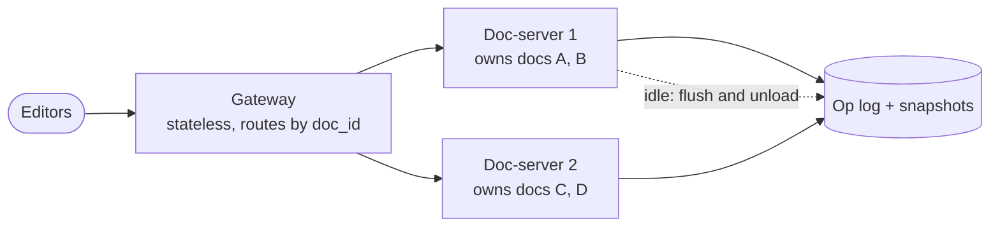

Idle documents flush a snapshot and unload, so live memory tracks *active* documents rather than the 10⁸ that exist. That's mandatory, not an optimization.

→ [v1 Diagram 7](./diagrams.md#diagram-7--end-to-end-system-at-scale) · [answers Q20–Q23](./answers.md)

---

## Single-writer safety — lease plus fencing

One in-memory owner turns "agree on op order" into a plain append. No per-op consensus, no clock sync. That's why the whole design is cheap.

But a network partition means the old owner isn't dead — just unreachable. Two owners appending to one log produces an unmergeable history. Silent corruption.

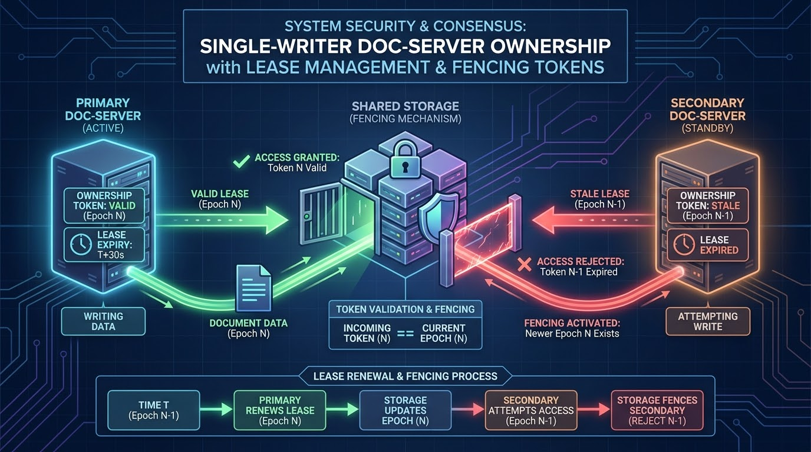

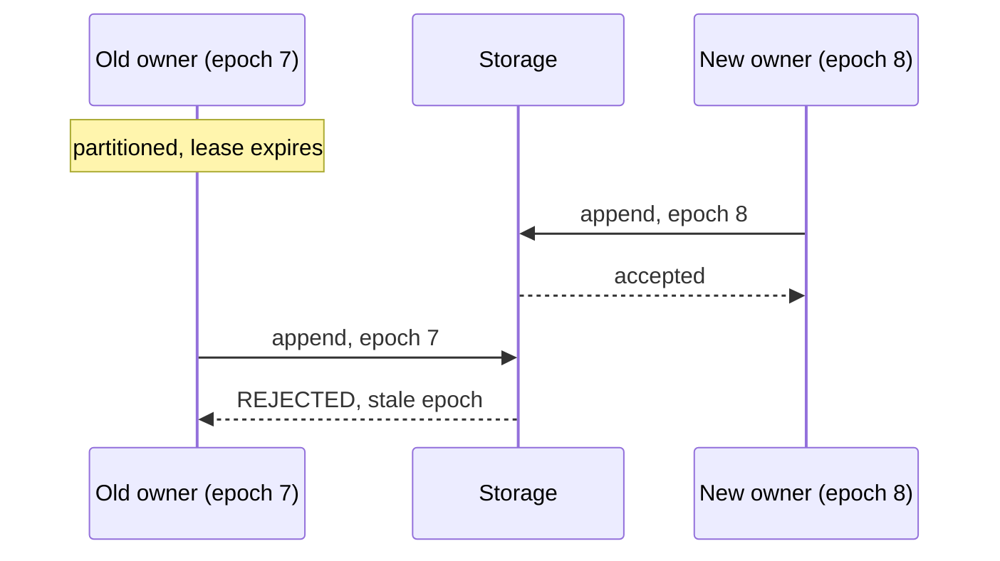

**The lease alone is not the guarantee. The fencing token is.** Storage rejects appends carrying a stale ownership epoch, so a partitioned old owner *physically cannot* double-write.

This is the [ZooKeeper/coordination pattern](../../patterns/zookeeper.md) — the *resource* enforces it, not the lock.

→ [v1 Diagram 9](./diagrams.md#diagram-9--single-writer-safety-lease--fencing-prevents-split-brain) · [answers Q32](./answers.md) · [consensus](../consensus/)

---

## Two channels — edits and presence


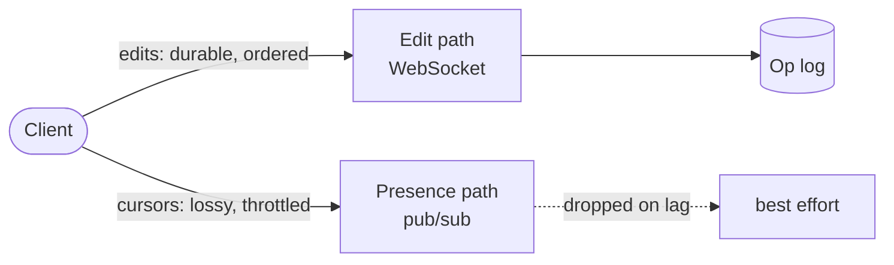

Cursors are high-frequency and worthless a second later. Putting them on the durable edit path would let a mouse movement block a keystroke.

**Never mix them.** Presence is throttled, lossy, and best-effort by design.

→ [v1 Diagram 11](./diagrams.md#diagram-11--two-channels-durable-edits-vs-ephemeral-presence) · [answers Q25–Q28](./answers.md)

---

## The decision tree

```text
Is this collaborative TEXT or a SPREADSHEET?
├─ text ────────────────▶ sync plane only. OT or CRDT, and you're mostly done.
└─ spreadsheet ─────────▶ two planes. Say so immediately.
   │
   ├─ Convergence mechanism?
   │    server present + huge cell count ──▶ OT
   │    local-first / peer-to-peer        ──▶ CRDT
   │
   ├─ Who orders ops?
   │    ──▶ ONE in-memory owner per doc_id
   │        + lease  (who owns it)
   │        + fencing token  (storage rejects stale epochs)
   │
   ├─ Structural ops (row/col insert)?
   │    ──▶ stable (row_id, col_id) + explicit transform rules
   │        THIS is the hard part. Budget time for it.
   │
   ├─ Recompute?
   │    ──▶ dirty-mark → topo-sort → only that subtree
   │        deterministic, volatile functions server-side
   │
   ├─ Durability?
   │    ──▶ append to op log BEFORE ACK. Snapshot periodically.
   │
   └─ Scale?
        ──▶ across documents, never within one.
            Stateless gateway → stateful doc-servers → idle unload.
```

---

## Collaborative Editing in an Interview

### When to reach for this

- "Design Google Sheets / Docs / Notion / Figma"
- "Real-time multiplayer" or "collaborative" anything
- "How do two people editing the same thing not clobber each other?"
- Any question where offline edits must reconcile later

### Where it breaks down

| Limit | What you say instead |
|---|---|
| It's a **chat or feed** problem | Those are throughput problems. This one isn't — don't reuse the instinct |
| Editors span **continents** | Single-writer means someone is always far from the sequencer. Name the ~250 ms RTT tradeoff |
| **Local-first / no server** | OT needs a sequencer. Switch to a CRDT and pay in metadata |
| The doc is **enormous** (10⁷ cells) | Rules out per-cell CRDT metadata; forces a virtualized grid |
| You need **strong consistency across docs** | This gives strong *eventual* consistency per document. Cross-document is a different problem |

### The five sentences that score

1. "A spreadsheet is two agreement problems. Sync agrees on inputs, calc agrees on outputs."
2. "You never merge computed values. You merge inputs and recompute."
3. "One in-memory owner per document turns ordering into a plain append."
4. "Structural ops are the hard part — a row insert moves every address and every reference."
5. "Append to the op log before you ACK, or a crash loses an accepted edit."

---

## Real systems

| Case | What's done | Lesson |
|---|---|---|
| **Google Sheets** | OT, server-authoritative | Server present ⇒ OT is cheaper than per-element CRDT identities |
| **Figma** | Server-authoritative, CRDT-ish | A coordinator plus CRDT-style merge is a valid middle ground |
| **Automerge / Yjs** | Peer-to-peer CRDT | No coordinator, paid for in metadata and tombstones |
| **Google Docs** | Sync plane only | The easier sub-case — no calc plane at all |

*OT/CRDT theory here is standard and checkable. Claims about how Google or Figma implement collaboration internally are informed illustration, not verified internals.*

→ [v1 QB4](./questions.md)

---

## The eight questions, answered in one breath

<details>
<summary>🔴 <b>deep-dive</b> — full answers to all 42 questions + 6 bonus live in answers.md</summary>

The one-liners below are the spoken version. [`answers.md`](./answers.md) has the complete answers for Q1–Q42 and QB1–QB6, each with a table or code and a **Key takeaway** line.

</details>

**Q2. Name the two planes.**
Sync agrees on the raw cells users typed — a convergence problem, solved with OT or CRDT. Calc agrees on the derived cells formulas produce — a dependency DAG with deterministic recompute. Different consistency needs, different resource profiles.

**Q10. Two users edit one cell. What does "correct" mean?**
Two things. Convergence: everyone who saw the same ops ends identical. Intention preservation: nobody's edit is silently dropped. Last-write-wins gives the first and fails the second.

**Q13. Concurrent row insert while someone edits a formula below it.**
The signature hard problem. A row insert shifts every address *and* rewrites every reference below it, in both planes. Fix: address by stable `(row_id, col_id)`, plus explicit transform rules for references starting before, ending inside, or spanning the boundary.

**Q15. `A1` changes; `B1` and `C1` depend on it. Recompute what?**
Dirty-mark the transitive dependents, topologically sort them, recompute only that subtree. Never the whole sheet.

**Q19. Where does recompute run?**
Both. Client recomputes optimistically for instant feedback; server recomputes authoritatively and wins. That only works if it's deterministic — identical semantics, IEEE-754, locale-independent, volatile functions resolved server-side.

**Q21. Why single-writer per document?**
One in-memory owner makes op ordering a plain append — no per-op consensus, no clock sync. Recompute needs the whole sheet in one place anyway. Route by `doc_id` from a stateless gateway.

**Q24. The doc-server crashes mid-edit.**
Because we append before ACK, only *unacknowledged* edits are lost, and clients resubmit them idempotently. Recovery is: load the latest snapshot, replay the op tail. Snapshot age bounds replay time.

**Q32. Partition — two servers each think they own the document.**
Lease expiry plus a fencing token. Storage refuses appends from the stale epoch, so the partitioned owner physically cannot write. The lease says who owns it; the fencing token is what makes it safe.

---

## Cheat sheet

| Term | One line |
|---|---|
| **The split** | Sync agrees on inputs; calc agrees on outputs |
| **Never merge outputs** | Merge inputs, then recompute |
| **Docs vs Sheets** | Docs has one plane. The calc plane is what makes Sheets hard |
| **Convergence** | Same ops seen ⇒ same state |
| **Intention preservation** | A merge never silently drops an edit |
| **Why LWW fails** | Converges by throwing an edit away |
| **OT** | Transform against the server's total order. Needs a sequencer |
| **CRDT** | Merge in any order. Pays in per-element IDs and tombstones |
| **Pick for Sheets** | OT — server is present, ~10⁷ cells makes CRDT metadata costly |
| **Structural ops** | A row insert shifts every address *and* every reference below |
| **The fix** | Stable `(row_id, col_id)` + transform rules: before / inside / spanning |
| **Why it matters** | Produces a *plausible wrong number*. Worse than a crash |
| **Calc engine** | Dirty-mark → topo-sort → recompute only that subtree |
| **Determinism** | Identical semantics, IEEE-754, locale-independent |
| **Volatile functions** | `NOW()`, `RAND()`, `IMPORTRANGE` resolved server-side |
| **Durability rule** | Append to the op log **before** you ACK |
| **Recovery** | Latest snapshot + replay the op tail |
| **Single writer** | One in-memory owner ⇒ ordering is a plain append |
| **Lease** | Says who owns the document |
| **Fencing token** | Storage rejects the stale epoch. *This* is the guarantee |
| **Scaling shape** | Tiny op rate, many stateful sessions. Scale across docs |
| **Idle unload** | Flush a snapshot and unload. Mandatory, not an optimization |
| **Presence** | Separate, throttled, lossy channel. Never mixed with edits |
| **Gap detection** | Revision numbers; client sees 41 then 43 and resyncs |
| **Consistency model** | Strong eventual consistency, per-document total order, read-your-own-writes |
| **~50 ops/s** | Busy doc. Not a throughput problem |
| **1–10 TB RAM** | 1M live docs × 1–10 MB. The real constraint |
| **~100–200 ms** | Remote-edit visibility. Local is instant |
| **Client model** | Optimistic apply + PENDING buffer + reconcile on ACK |
| **Frontend** | Virtualized canvas grid — render only visible cells |

---

## Image index

| Image | Shows | Section |
|---|---|---|
| `two_plane_architecture.jpg` | Sync plane vs calc plane | Diagram 1 |
| `sparse_grid_data_model.jpg` | Sparse cell map, not a dense array | The document model |
| `snapshot_and_op_log.jpg` | Snapshot + append-only log = the document | The document model |
| `ot_vs_crdt_comparison.jpg` | Transform-against-order vs merge-in-any-order | Convergence |
| `ot_client_server_loop.jpg` | Optimistic apply, pending buffer, reconcile | Convergence |
| `structural_edit_reference_shift.jpg` | A row insert shifting addresses and references | Structural ops |
| `dependency_dag_recompute.jpg` | Dirty-mark → topo-sort → minimal recompute | The calc engine |
| `system_architecture_scale.jpg` | Stateless gateways → stateful doc-servers | The scaling shape |
| `single_writer_lease_fencing.jpg` | Stale epoch rejected at the storage layer | Single-writer safety |
| `two_channel_transport.jpg` | Durable edits vs ephemeral presence | Two channels |

---

## Related

- **Full depth:** [`README.md`](./README.md) · [`answers.md`](./answers.md) · [`deep-dive.md`](./deep-dive.md) · [`diagrams.md`](./diagrams.md)
- **Patterns:** [ZooKeeper & coordination](../../patterns/zookeeper.md) — lease + fencing · [Dealing with Contention](../../patterns/dealing-with-contention.md) — a lease is rung 4 · [Real-Time Updates](../../patterns/realtime-updates.md) — the two-channel split
- **Topics:** [consensus](../consensus/) — total order, leader leases · [storage-engines](../storage-engines/) — WAL + snapshot · [chat-system](../chat-system/) · [sse](../sse/) · [file-storage](../file-storage/)
