# Collaborative Editing (Google Sheets / Docs) — Mermaid Diagrams

> Interview-ready diagrams. Start with Diagram 1 — the **two-plane split** (sync vs calc) is the mental model everything hangs off. Then drill into the layer the interviewer probes.
>
> Reference: [answers.md](./answers.md) | [simple-diagram.md](./simple-diagram.md)
>
> Cross-links: [consensus](../consensus/) (total order, leader/lease/fencing) · [communication-protocols](../communication-protocols/) + [chat-system](../chat-system/) + [sse](../sse/) (transport) · [storage-engines](../storage-engines/) (WAL + snapshot) · [file-storage](../file-storage/) (snapshot+delta, versioning) · [distributed-caching](../distributed-caching/) (hot doc state)

---

## Diagram 1 — The Two-Plane Architecture (Start Here)

> **When to use:** The first thing to draw. Everything hangs off separating the **sync plane** (agree on raw cells → converge) from the **calc plane** (agree on derived cells → deterministic recompute). Use for Q1, Q2, Q4.

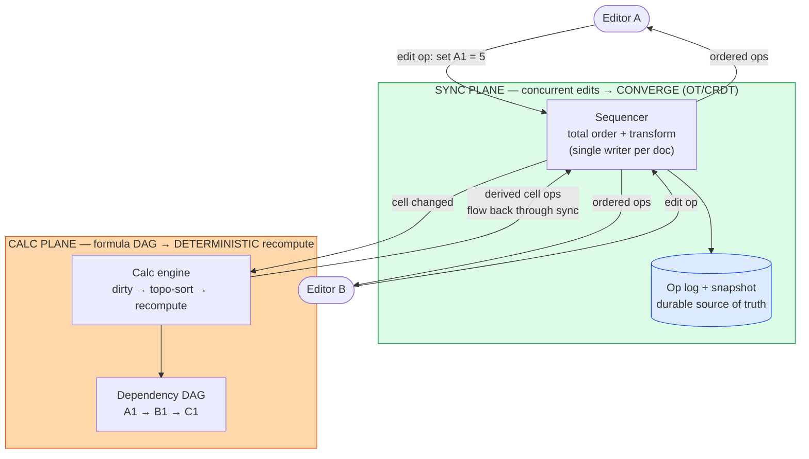

**What the interviewer is checking:**
- You see a spreadsheet as **two agreement problems**, not one — sync (conflict resolution) and calc (dependency propagation).
- Sync is server-ordered (single writer) so convergence is tractable; calc is a deterministic function of committed cells.
- The planes meet: a sync edit dirties calc, and calc's recomputed cells are *themselves* ordered ops flowing back through sync.
- A collaborative *text* editor has only the sync plane — naming the calc plane is the differentiator.

---

## Diagram 2 — Document Model & Persistence (Snapshot + Op Log)

> **When to use:** Q6, Q7, Q22, Q29. Show the sparse grid model and how "snapshot + ops since" gives durability, fast load, recovery, and version history for free.

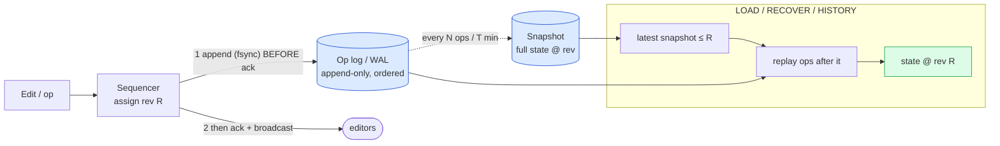

**What the interviewer is checking:**
- **Append-before-ACK** is the durability rule — no acknowledged edit can be lost on a crash.
- Load / recover / history are all "snapshot + replay ops since" — one mechanism, three uses.
- Snapshots bound replay time (compaction); old ops are archived/coarsened for retention control.
- Same WAL+checkpoint pattern as [storage-engines](../storage-engines/); same snapshot+delta as [file-storage](../file-storage/).

---

## Diagram 3 — OT: Optimistic Local Edit + Server Transform

> **When to use:** Q10, Q11, Q38. The core OT loop — local edit feels instant, server orders + transforms, client reconciles.

```mermaid
sequenceDiagram
    participant A as Client A
    participant S as Sequencer (server)
    participant B as Client B

    Note over A,B: both based on rev 40
    A->>A: edit → apply locally NOW (optimistic), add to PENDING
    A->>S: submit(op_A, base_rev=40)
    B->>S: submit(op_B, base_rev=40) (concurrent)
    S->>S: order A then B; assign rev 41 to A
    S-->>A: ACK(op_A → rev 41)
    S-->>B: OP(rev 41 = op_A)
    B->>B: transform op_A against pending op_B, apply
    S->>S: transform op_B against op_A → op_B'; assign rev 42
    S-->>B: ACK(op_B → rev 42)
    S-->>A: OP(rev 42 = op_B')
    A->>A: apply op_B' (pending already cleared)
    Note over A,B: both converge to identical state @ rev 42
```

**What the interviewer is checking:**
- Local edit is **optimistic** (instant), then reconciled — you don't wait a round-trip to see your own typing.
- The **transform function** is what makes different apply-orders converge; the server's total order keeps it linear.
- PENDING buffer on the client: remote ops are transformed against your not-yet-ACKed ops.
- Convergence is the invariant — both clients end at the same rev with identical state.

---

## Diagram 4 — The Signature Hard Problem: Concurrent Row Insert Shifts References

> **When to use:** Q13. This is what makes Sheets ≠ Docs. Show a structural op remapping addresses *and* formula references, and why stable identities save you.

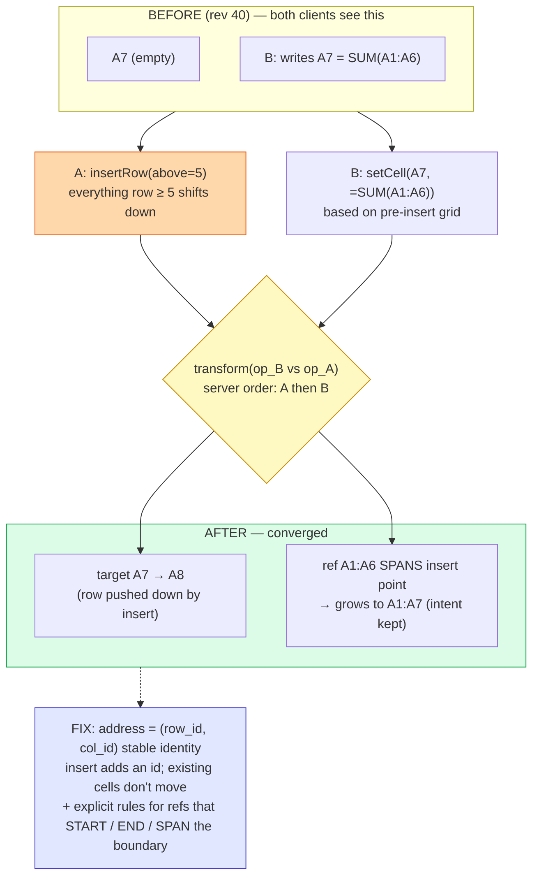

**What the interviewer is checking:**
- You recognize structural edits perturb **both planes at once** — addresses (sync) and references (calc).
- The transform must adjust references by their relation to the boundary (start/end/span), preserving intent.
- **Stable row/column identities** turn "rewrite a million addresses" into "add one id + a lookup."
- This is precisely where naive OT implementations produce silently-wrong formulas.

---

## Diagram 5 — Calc Engine: Dirty-Mark → Topo-Sort → Minimal Recompute

> **When to use:** Q15, Q16, Q18. The reactive recompute algorithm — touch only the affected subtree, in dependency order.

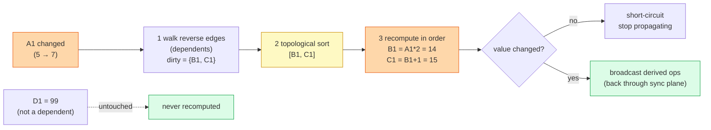

**What the interviewer is checking:**
- Recompute is **minimal**: only transitive dependents (reverse index), never the whole sheet.
- **Topological order** guarantees a cell recomputes after its precedents — correctness, not just speed.
- **Short-circuit** on unchanged values stops needless downstream propagation.
- Independent cells (`D1`) are provably untouched — the DAG tells you what *not* to do.

---

## Diagram 6 — Circular Reference Detection (on Edge Insert)

> **When to use:** Q17. Detect cycles when the dependency edge is added, not by looping forever at recompute.

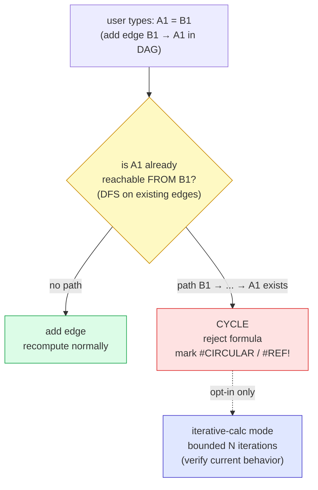

**What the interviewer is checking:**
- Cycles are caught **when the edge is inserted** (cheap DFS reachability), not at recompute time.
- A spreadsheet has **no fixed point** for a cycle → error, unless the user opts into bounded iterative calc.
- You show `#CIRCULAR`/`#REF!` rather than hanging the engine — a correctness + liveness answer.

---

## Diagram 7 — End-to-End System at Scale

> **When to use:** Q20, Q21, Q22, Q23. Stateless gateways + `doc_id`-sharded stateful doc-servers (single-writer) + durable storage.

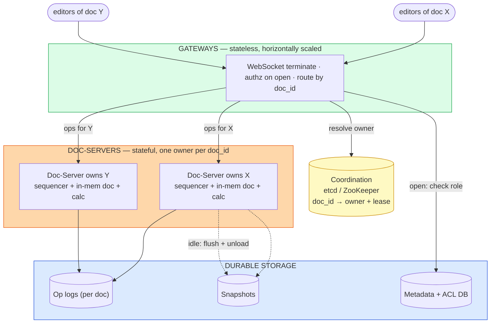

**What the interviewer is checking:**
- **Stateless gateways** (auth + route) vs **stateful doc-servers** (own live state) — a clean split.
- Ownership via consistent-hash + **lease** in a coordination service; one owner = trivial ordering.
- **Idle eviction** → live RAM scales with *active* docs, not total docs (the A4 insight).
- Durability is behind the doc-server (op log + snapshot); metadata/ACL is its own store.

---

## Diagram 8 — Ordered Broadcast, Gap Detection & Resync

> **When to use:** Q27, Q41. Revision numbers, in-order apply, gap detection, and snapshot-based resync.

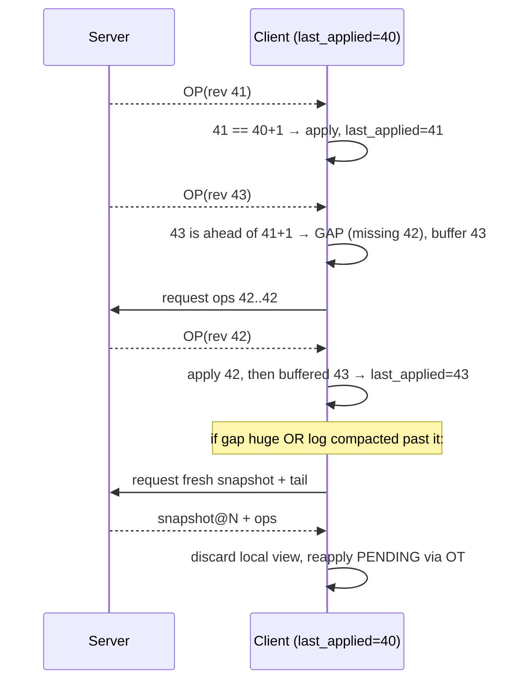

**What the interviewer is checking:**
- Every op carries a **monotonic revision**; clients apply strictly in sequence.
- **Gap detection** (`rev > last+1`) → request the missing range, buffer out-of-order ops.
- **Resync fallback**: too far behind / compacted → fetch a snapshot and reapply pending via OT.
- Duplicates (`rev ≤ last`) are ignored — idempotent application.

---

## Diagram 9 — Single-Writer Safety: Lease + Fencing Prevents Split-Brain

> **When to use:** Q24, Q32. How ownership survives a partition without two servers double-writing an unmergeable log.

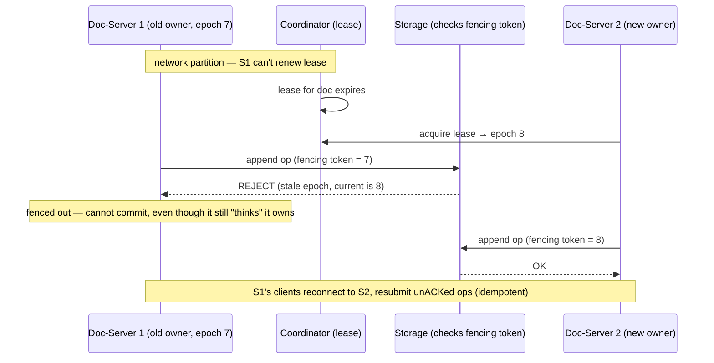

**What the interviewer is checking:**
- Ownership is a **lease** (TTL), not a belief — losing the network loses the right to write.
- A **fencing token** (monotonic epoch) on every durable append lets storage reject a stale owner — the physical guarantee.
- No double-write → no divergent logs → no corruption; recovery is a reconnect + idempotent resubmit.
- This is the [consensus](../consensus/) leader-lease pattern applied to document ownership.

---

## Diagram 10 — Client Editing State Machine (OT Client Model)

> **When to use:** Q38, Q41. The client's DOC + PENDING + base_rev loop, including offline.

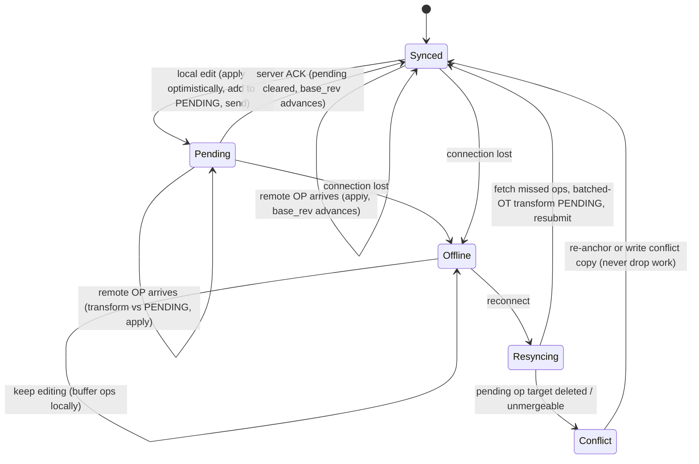

**What the interviewer is checking:**
- Optimistic apply + a **PENDING buffer**; the client is always usable, ACK or not.
- Remote ops are **transformed against pending** before applying (and pending against them).
- Offline is a first-class state — keep editing, buffer, then **batched-OT** merge on reconnect.
- The failure exit is **re-anchor or conflict copy**, never silent data loss.

---

## Diagram 11 — Two Channels: Durable Edits vs Ephemeral Presence

> **When to use:** Q26, Q42. Why presence rides a separate, lossy, throttled channel and never touches the edit path.

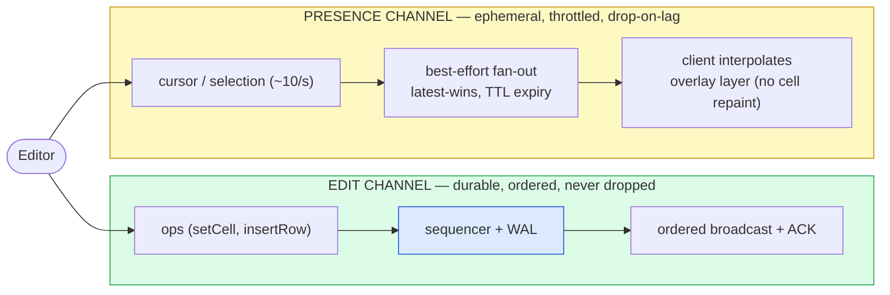

**What the interviewer is checking:**
- Presence and edits have **opposite requirements** (durable/ordered vs lossy/high-frequency).
- Presence is **throttled + TTL-expired** and rendered on an overlay (a cursor move never repaints cells).
- Presence must **never backpressure** the durable edit path — a cursor flood can't delay an edit.

---

## Quick Interview Reference

### Scale numbers (order-of-magnitude — verify)

| Metric | Value | Note |
|---|---|---|
| Ops/sec per active editor | ~1–5 (coalesced) | Per-doc throughput is tiny |
| Busy doc | ~10 editors → ~50 ops/s | Not a throughput problem |
| Remote-edit latency target | ~100–200ms | Local edit is instant (optimistic) |
| Live server RAM | 1M live docs × ~1–10MB = 1–10TB | Scale = many stateful sessions |
| Sheet cap | ~10^7 cells | Google's documented limit — verify current |

### Domain quick-ref

| Term | One-liner |
|---|---|
| **Sync plane** | Concurrent edits → converge (OT/CRDT) |
| **Calc plane** | Formula DAG → deterministic recompute |
| **OT** | Send ops, transform against server-ordered concurrent ops |
| **CRDT** | Order-free merge via unique IDs + tombstones, no coordinator |
| **Single-writer** | One owning server per `doc_id` = trivial total order |
| **Fencing token** | Monotonic epoch on appends; storage rejects a stale owner |
| **Dirty-mark → topo-sort** | Recompute only affected dependents, in dependency order |
| **Snapshot + op log** | Durability, fast load, recovery, and history from one mechanism |

### Canonical tradeoffs

- **OT vs CRDT** — transform-against-server-order (cheap ops, needs coordinator) vs merge-any-order (no coordinator, metadata cost).
- **Single-writer vs multi-writer** — trivial ordering + far-editor latency vs local latency + merge complexity.
- **Client calc vs server calc** — instant (divergence risk) vs authoritative (round-trip) → do both, deterministic, server wins.
- **Convergence vs intention preservation** — LWW gives the first, drops edits; OT/CRDT give both.

### Common mistakes

- Forgetting the **calc plane** (treating it like collaborative text).
- Ignoring **structural ops** shifting every address & reference.
- "LWW solves conflicts" — converges but **silently drops edits**.
- **Mixing presence with edits** — cursors are lossy and must not block the edit path.
- Recomputing the **whole sheet** instead of dirty-marking the subtree.
- ACKing an op **before** durable log → crash loses an accepted edit.
- No **fencing token** → split-brain double-write.

---

## 🎯 The One-Page Master Diagram — THE ONE TO DRAW IN THE INTERVIEW (final consolidated design)

> **When to use:** final revision, 10 minutes before the interview — and the single diagram to reproduce on the whiteboard. If you can narrate it end-to-end and name the tradeoff at each **red** box, you're ready.
> Spec: [`docs/instructions.md` §2.1](../../docs/instructions.md) · AWS names: [`docs/AWS_SERVICE_MAP.md`](../../docs/AWS_SERVICE_MAP.md).
> ⚠️ AWS services are **defensible defaults**; quotas are order-of-magnitude planning numbers to **verify**. OT/CRDT theory here is standard; claims about how Google/Figma implement it internally are hedged.

### The central split in one sentence

**A collaborative spreadsheet is *two* agreement problems bolted together — the **sync plane** agrees on the raw cells people typed (OT/CRDT convergence, never silently dropping an edit) and the **calc plane** agrees on the derived cells formulas produce (a dependency DAG, deterministically recomputed) — you merge *inputs* and recompute *outputs*, never merge computed values, and the two planes collide precisely at structural row/column operations.**

```mermaid
flowchart LR
    C1(["Editor A<br/>optimistic local apply"])
    C2(["Editor B"])

    GW["① stateless gateway<br/>route by doc_id · sticky<br/>WS on NLB"]

    subgraph DOC["② SINGLE-WRITER DOC-SERVER — one owner per doc"]
        direction TB
        LEASE{"lease + FENCING TOKEN<br/>storage rejects a stale epoch<br/>DynamoDB conditional write"}
        SYNC["③ SYNC PLANE — OT vs server order<br/>total order per doc = trivial append<br/>no per-op consensus"]
        STRUCT{"④ STRUCTURAL OPS<br/>insert/delete row+col<br/>stable (row_id, col_id) NOT coordinates<br/>+ rewrite every formula reference"}
        CALC["⑤ CALC PLANE — dirty-mark →<br/>topo-sort → recompute subtree only<br/>DETERMINISTIC (IEEE-754, locale, NOW/RAND)"]
        LEASE --> SYNC --> STRUCT --> CALC
    end

    LOG[("⑥ op log (WAL) — APPEND BEFORE ACK<br/>+ periodic snapshot<br/>DynamoDB/Aurora + S3")]
    PRES["⑦ presence — SEPARATE channel<br/>cursors throttled, lossy, ephemeral<br/>ElastiCache · never blocks an edit"]
    IDLE["⑧ idle doc → flush snapshot, unload<br/>live RAM tracks ACTIVE docs, not 10⁸"]

    C1 -->|"submit(op, base_rev)"| GW
    C2 --> GW
    GW --> LEASE
    CALC -->|"append"| LOG
    LOG -->|"then ACK + broadcast ordered ops"| C1
    LOG -.-> IDLE
    C1 -.->|"cursor"| PRES
    PRES -.-> C2

    style GW fill:#dcfce7,stroke:#16a34a
    style DOC fill:#dbeafe,stroke:#1d4ed8
    style LOG fill:#dbeafe,stroke:#1d4ed8
    style PRES fill:#fed7aa,stroke:#ea580c
    style IDLE fill:#e0e7ff,stroke:#4338ca
    style LEASE fill:#fee2e2,stroke:#dc2626
    style STRUCT fill:#fee2e2,stroke:#dc2626
    style CALC fill:#fef9c3,stroke:#ca8a04
```

### The 60-second narration

*(one line per numbered box ①–⑧)*

1. **Gateways are stateless and route by `doc_id`.** All the state lives one hop in, so the fleet that terminates WebSockets can scale and restart freely.
2. **Each document has exactly one in-memory owner, protected by a lease and a fencing token.** This is the move that makes everything else cheap: a single writer turns "agree on op order" into a plain append — no per-op consensus, no clock sync. The fencing token is what makes it *safe* under a partition: storage rejects appends carrying a stale ownership epoch, so a partitioned old owner physically cannot double-write.
3. **Sync plane:** each op is transformed against the server's order and assigned a revision. OT is the right pick here (server is present, cell counts are huge, so per-element CRDT identities would be expensive) — but say the alternative and why.
4. **The red box is the signature hard problem: structural operations.** Inserting a row shifts every cell address *and* rewrites every formula reference below it — both planes at once. That's why cells are addressed by **stable `(row_id, col_id)`**, not display coordinates, plus explicit transform rules for references that start before, end inside, or span the boundary. Naive implementations produce a *plausible wrong number* here, which is worse than a crash, so this deserves property-based convergence tests.
5. **Calc plane:** dirty-mark the changed cell, topologically sort its transitive dependents, recompute **only that subtree** — never the whole sheet. And it must be **deterministic** (identical function semantics, IEEE-754, locale-independent, with volatile inputs like `NOW()`/`RAND()`/`IMPORTRANGE` resolved on the server) or collaborators watch their numbers flicker and correct themselves.
6. **The durability rule is one sentence: append to the op log before you ACK.** A crash can then only lose edits that were never acknowledged, which clients resubmit idempotently. Periodic snapshots bound replay time.
7. **Presence is a separate, throttled, lossy channel.** Cursors are high-frequency and worthless a second later; putting them on the durable edit path would let a mouse movement block a keystroke.
8. **Idle documents flush a snapshot and unload**, so live memory tracks *active* documents rather than the ~10⁸ that exist.

### The five numbers that justify the design

| Number | Derivation | Therefore |
|---|---|---|
| **~50 ops/s on a busy doc** | ~10 editors × ~1–5 coalesced ops/s | This is **not** a throughput problem. Almost every instinct from chat/feed design is wrong here — don't shard within a document |
| **1M live docs × ~1–10 MB = 1–10 TB RAM** | live sessions × in-memory sheet | So you scale **across** documents (many stateful sessions), and idle-unload is mandatory, not an optimization |
| **~10⁸ documents total vs ~1M live** | catalogue vs concurrency | Confirms the same thing from the other side: memory is sized by *active*, storage by *total* |
| **~100–200 ms remote-edit visibility** (local: instant) | interactivity budget | Forces optimistic local apply + a PENDING buffer; the server round trip must never gate the keystroke |
| **~10⁷ cells per sheet** (documented Google limit — verify) | product cap | Rules out per-cell CRDT metadata as the default, and forces a virtualized canvas grid on the client |

### The patterns this assembles

| Pattern | Where | The move |
|---|---|---|
| [ZooKeeper & coordination](../../patterns/zookeeper.md) **●** | ② ownership | Lease + **fencing token**; the *resource* rejects the stale epoch — the lock alone is never the guarantee |
| [Dealing with Contention](../../patterns/dealing-with-contention.md) **●** | ②③ | Rung 4 — a lease per document, chosen precisely so per-op contention disappears entirely |
| [Real-Time Updates](../../patterns/realtime-updates.md) **●** | ①⑦ | WebSocket for ordered edits; a *separate* best-effort channel for presence |
| [Multi-Step Processes](../../patterns/multi-step-processes.md) ○ | ⑥ | WAL + snapshot + replay — the same durability shape as a storage engine ([storage-engines](../storage-engines/)) |
| [Scaling Reads](../../patterns/scaling-reads.md) ○ | ⑧ | Snapshot + delta so opening a doc is one snapshot read plus a short op tail |

### The three things that break (and the mitigation)

| Failure | Blast radius | Mitigation | How you detect it |
|---|---|---|---|
| **Doc-server crashes mid-session** | Everything in memory is gone; unACKed ops vanish | Append-before-ACK means only *unacknowledged* edits are lost, and clients resubmit them idempotently; recovery = load latest snapshot + replay the op tail | Time-to-recover per doc; count of client resubmissions after reconnect; snapshot age (bounds replay) |
| **Network partition → two owners** | Two servers append to one log → an unmergeable history, i.e. silent corruption | Lease expiry plus a **fencing token**: storage refuses appends from the old epoch, so the partitioned owner cannot write at all | Rejected-stale-epoch counter (should be rare but non-zero during failover); lease-renewal failure rate |
| **Non-deterministic recompute** | Two collaborators see different numbers for the same formula — the worst bug class, because nothing crashes | Identical function semantics + IEEE-754 + locale-independence; volatile/external functions resolved **server-side**; server value wins and corrects the optimistic client | Client-vs-server recompute mismatch rate (should be ~0); property-based convergence tests in CI |

### The AWS-specific traps to name unprompted

| Trap | Why it bites here | What you say |
|---|---|---|
| **There is no managed ZooKeeper/etcd for app use** | Ownership leases are load-bearing | *"So the lease is a DynamoDB row with a conditional write and a monotonic epoch, or I self-manage etcd on EKS — and either way the storage layer checks the fencing token."* |
| **API Gateway WebSocket is per-message priced** | Every keystroke is a message | *"Self-managed WebSocket on an NLB with sticky routing by `doc_id`; per-message pricing is the wrong shape for an editor."* |
| **S3 has no atomic rename** | Snapshot publication looks like a file move | *"Snapshots are versioned immutable keys and the pointer lives in DynamoDB — I never rely on rename semantics."* |
| **DynamoDB item size limit** (~400 KB **⚠️ verify**) | A sheet snapshot is far larger | *"Snapshot bytes go to S3; DynamoDB holds metadata, the head revision, and the op log entries."* |
| **Sticky routing is yours to build** | ALB stickiness is cookie-based, not `doc_id`-based | *"A connection/ownership registry maps `doc_id` → node; the gateway consults it rather than relying on LB affinity."* |

### If you only remember one thing

> **Merge inputs, recompute outputs: the sync plane converges the raw cells (OT against a single writer's total order) and the calc plane deterministically recomputes only the dirty subtree — with one owner per document held by a lease *and* a fencing token, and the op appended to the log before it is ever ACKed.**
