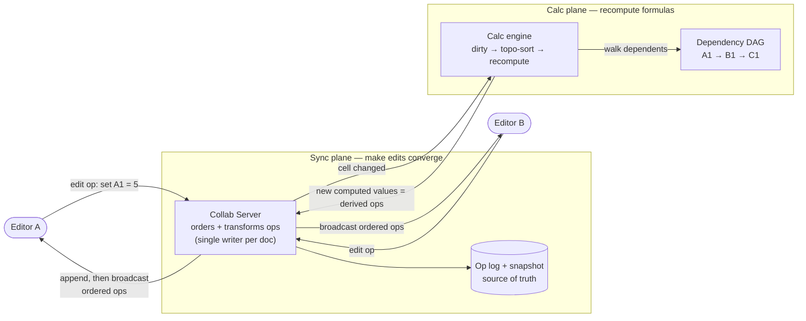
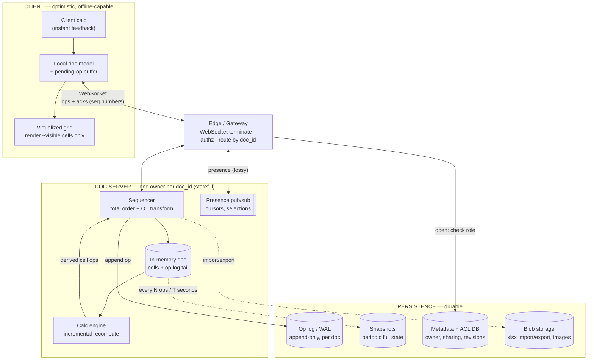

# Collaborative Editing (Google Sheets) — Simple Component Diagram

> The bare-minimum mental model. Two planes over one shared grid: **sync** (make concurrent edits converge) and **calc** (reactively recompute formulas).
> Everything else (presence, history, undo, huge sheets, offline) hangs off these boxes.

## The 6 components to remember

| Component | Job (one line) |
|---|---|
| **Editor (client)** | Applies your edit locally *now* (optimistic), sends the op to the server, renders what comes back. |
| **Collab Server** | The per-document sequencer: assigns each op an order, transforms it against concurrent ops, broadcasts the agreed order to everyone. |
| **Op log + snapshot** | The durable truth: a periodic snapshot plus every op since — replay = the document. |
| **Dependency DAG** | "Which cells depend on which" — a graph of formula precedents/dependents. |
| **Calc engine** | On a cell change, marks dependents dirty, topologically sorts them, recomputes the minimum set. |
| **Presence channel** *(not shown)* | A separate, lossy, high-frequency stream for cursors/selections — never mixed with edits. |

## The one idea that ties it together

**A spreadsheet is two agreement problems, not one.** The sync plane makes everyone agree on the *raw* cells you typed (concurrent edits → **convergence**, via OT or CRDT). The calc plane makes everyone agree on the *derived* cells the formulas produce (a dependency DAG → **deterministic recompute**). A collaborative text editor (Google Docs) only has the first plane. The calc plane — and the fact that inserting a row shifts every reference in both planes at once — is what makes Sheets genuinely harder. Keep the two planes distinct: sync decides *what the inputs are*, calc decides *what the outputs are*, and calc's outputs are just more ordered changes flowing back through sync.

---

# Detailed Diagram — with Services & Protocols

> Same two planes, now labeled with concrete service/technology picks and the protocols you'd name in a senior interview.
> Note: these are *defensible* picks, not the only valid ones (CRDT instead of OT for peer-first apps; a dedicated sequencer service instead of an in-process one). Pick and defend — don't memorize as gospel.

## Service cheat-sheet (what maps to what)

| Concept | Service / Technique | One-line why |
|---|---|---|
| Edit channel | **WebSocket** (bidirectional, ordered) | Both sides push; server must send others' ops, not just reply to yours — SSE/poll can't send edits up |
| Per-doc ownership | **Consistent hashing** `doc_id → doc-server` + a lease | One in-memory owner = one sequencer = a clean total order without cross-node consensus per op |
| Op ordering | **In-process sequencer + OT transform** | Assign a monotonically increasing revision; transform each incoming op against ops it didn't see |
| Durability | **Append-only op log (WAL) + periodic snapshot** | Same pattern as [storage-engines](../storage-engines/): fast append now, bounded replay on recovery |
| Recompute | **Incremental calc engine over a dependency DAG** | Dirty-mark → topo-sort → recompute only affected cells, not the whole sheet |
| Presence | **Redis Pub/Sub (or in-server fan-out)**, dropped on lag | Cursors are worthless when stale — best-effort, never blocks the edit path |
| Metadata / sharing | **SQL (Postgres/Spanner)** | Owner, ACL, revision index — low QPS, needs transactions and queries |
| Big/foreign assets | **Blob storage (S3/GCS)** | `.xlsx` uploads, embedded images — [file-storage](../file-storage/) / [video-streaming](../video-streaming/) pattern |
| Global routing | **GeoDNS / Anycast to nearest edge**, doc-server pinned to one region | Editors connect to a near edge; the single writer still lives in one region ([consensus](../consensus/) leader placement) |

## Protocols worth naming

- **WebSocket** — the edit channel: long-lived, bidirectional, ordered. The server pushes *other people's* ops to you; a request/response protocol can't. Compare [chat-system](../chat-system/) / [sse](../sse/) / [communication-protocols](../communication-protocols/).
- **Operation-based sync (OT or CRDT)** — you send *operations* (`insertRow(5)`, `setCell(A1, "=SUM(B:B)")`), not full document snapshots. Small, ordered, transformable.
- **Sequence / revision numbers** — every op carries the revision it was based on and gets an assigned revision; clients detect gaps ("I got rev 41 then 43") and request a resync.
- **JSON / Protobuf ops** — compact op payloads; Protobuf when op volume is high (drag-fill, paste).
- **HTTP range / lazy fetch** — load the viewport and snapshot on open, stream the rest — the same "don't ship the whole thing" idea as byte-range video.
