# Communication & Messaging Protocols — Mermaid Diagrams

> Interview-ready diagrams. Start with Diagram 1 — the sync-vs-async decision tree decides everything downstream. Then drill into the specific protocol the interviewer probes.
>
> Reference: [answers.md](./answers.md) | [conducive-sentences.md](./conducive-sentences.md)
>
> Cross-links: [api-design](../api-design/) · [message-queues](../message-queues/) · [chat-system](../chat-system/) · [sse](../sse/)

---

## Diagram 1 — The Sync-vs-Async Decision Tree (Start Here)

> **When to use:** The very first thing to draw when asked "which protocol would you pick?" Everything else hangs off the answer to one question: *does the caller need the answer now?* Use it for Q4 ("walk through your decision tree") and Q44.

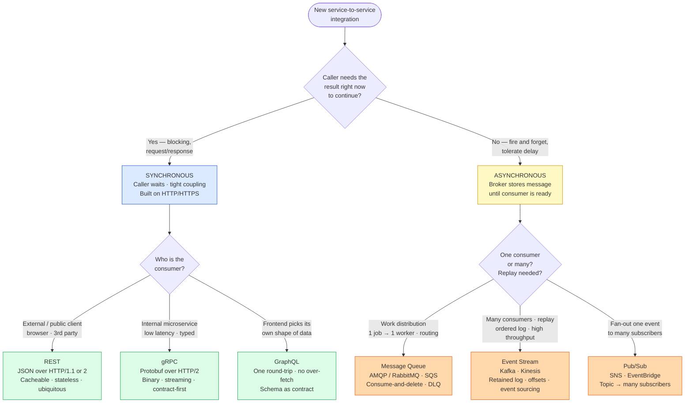

**What the interviewer is checking:**
- You lead with the *coupling* question (does the caller block?), not with a favourite technology.
- Sync = sender and receiver both active, caller waits → REST / gRPC / GraphQL. Async = broker buffers the message, no prompt response expected → queue / stream / pub-sub.
- You can justify the leaf you land on: public CRUD → REST; internal low-latency typed → gRPC; flexible frontend fetch → GraphQL; routed task queue → AMQP/SQS; replayable high-throughput → Kafka; fan-out → SNS/EventBridge.
- Bonus credit: "async is not *always* better" — sync request/response stays correct when the caller genuinely cannot proceed without the result (Q3).

---

## Diagram 2 — Anatomy of a URI + HTTP Request/Response

> **When to use:** Q5 ("break down a URI"), Q7 (path vs query params). Draw the URI as labelled segments, then the request and response envelopes side by side.

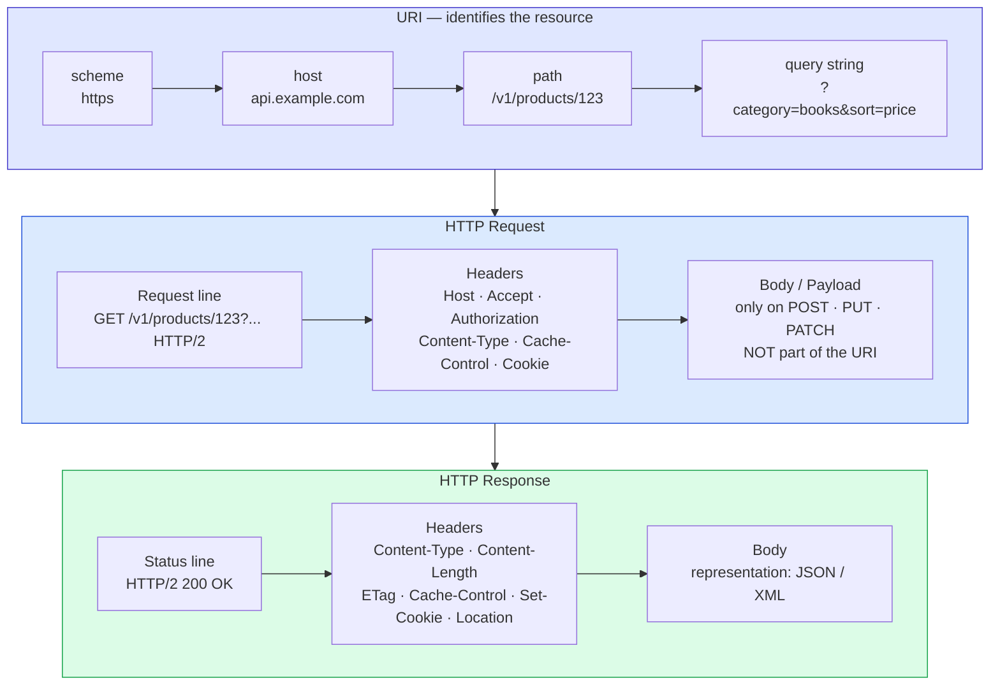

**What the interviewer is checking:**
- Scheme / host / path / query string each named correctly — path *identifies* the resource (`/products/123`), query string *filters or modifies* it (`?category=books`).
- The body/payload travels in `POST`/`PUT`/`PATCH` and is **not** part of the URI — that is why `GET` and `DELETE` carry their parameters in the path/query, not a body.
- Rule of thumb you can state: path params for "which resource," query params for "how to filter/sort/paginate the collection."
- You know which headers matter for caching (`ETag`, `Cache-Control`), auth (`Authorization`), and content negotiation (`Accept`, `Content-Type`).

---

## Diagram 3 — HTTP/1.1 vs HTTP/2 Multiplexing vs HTTP/3 QUIC

> **When to use:** Q8 and Q9 — the head-of-line-blocking story. Show that HTTP/2 fixes *application*-layer HOL blocking but TCP still has it, and HTTP/3 moves transport to QUIC over UDP to kill it.

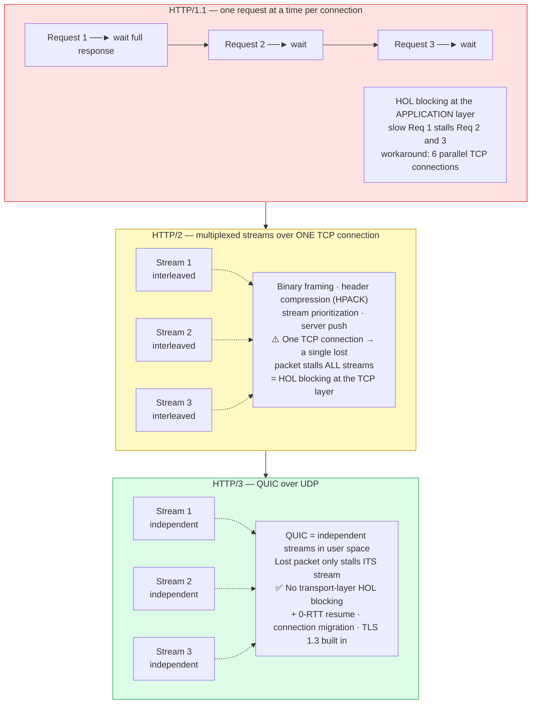

**What the interviewer is checking:**
- HTTP/2 wins: binary protocol (not text), multiplexing many requests over one connection, header compression, stream prioritization, server push.
- The precise gotcha: HTTP/2 removes *application*-layer HOL blocking but, because all streams share one TCP connection, a single dropped packet stalls every stream — TCP-layer HOL blocking remains.
- HTTP/3 sits on **QUIC over UDP**: streams are independent at the transport layer, so packet loss on one stream doesn't block the others. Bonus: 0-RTT reconnect and connection migration across network changes.
- gRPC's reliance on HTTP/2 (Diagram 5) is the reason this layering matters for internal APIs too.

---

## Diagram 4 — REST Conditional GET with ETag (304 Path)

> **When to use:** Q11 — walk a conditional GET. Show the first full response carrying the `ETag`, then the revalidation returning `304 Not Modified` with no body.

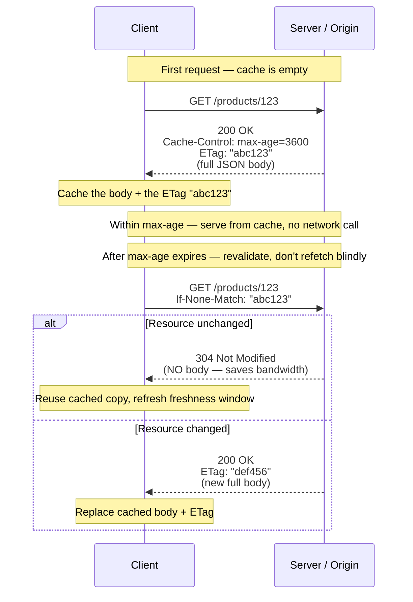

**What the interviewer is checking:**
- You separate the three caching headers: `Cache-Control`/`Expires` control *freshness* (when to even ask), `ETag` enables *validation* (ask cheaply once stale).
- The conditional request uses `If-None-Match: "<etag>"`; a match returns **304 with no body** — the bandwidth win is the whole point.
- This is what "REST is cacheable" actually means at the wire level, and it depends on REST being stateless (Q10) — any node can validate because the client carries the validator.
- Deeper dive lives in [api-design](../api-design/).

---

## Diagram 5 — gRPC Four Streaming Modes

> **When to use:** Q16 — name the four modes with a real use case each. One compact sequence diagram showing the message direction in each mode.

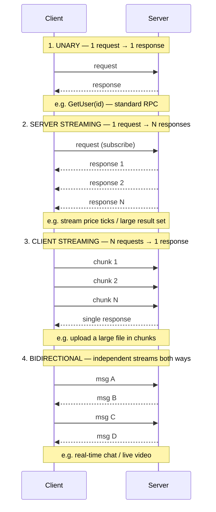

**What the interviewer is checking:**
- All four named with directionality correct: unary (1↔1), server-streaming (1→N), client-streaming (N→1), bidirectional (N↔N, independent).
- A concrete use case per mode — file upload = client streaming, live feed = server streaming, chat = bidirectional.
- *Why HTTP/2 specifically:* gRPC needs HTTP/2's multiplexed binary streams to carry these long-lived bidirectional flows over one connection (ties to Diagram 3 and Q15).
- Payloads are Protocol Buffers — compact binary, contract defined in a `.proto` file, with field numbers that are sacred (Q17).

---

## Diagram 6 — GraphQL Single Round-Trip vs REST + N+1 → DataLoader

> **When to use:** Q20 (over/under-fetching, round-trips) and Q22 (N+1 + DataLoader). Two contrasts in one figure: REST's many trips vs GraphQL's one, and the N+1 resolver trap with its batching fix.

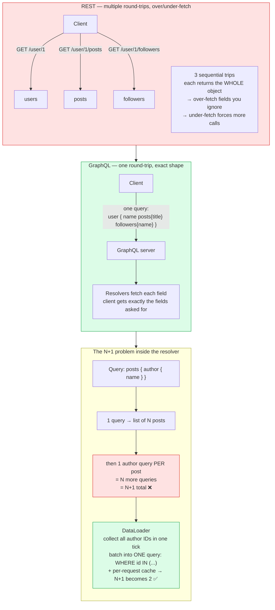

**What the interviewer is checking:**
- GraphQL collapses REST's multiple round-trips into one request and lets the client pick fields — killing over-fetching and under-fetching.
- The honest trade-off: GraphQL moves the cost server-side. A flexible query can fan out into the N+1 problem — one query for the list, then one per item.
- DataLoader fixes N+1 by *batching* the per-item lookups within a tick (`WHERE id IN (...)`) and caching per request, turning N+1 into 2 queries.
- Mention the new problems GraphQL introduces: caching is harder (no per-URL cache), query cost/complexity must be bounded. Deeper: [api-design](../api-design/).

---

## Diagram 7 — AMQP / RabbitMQ Routing (Exchange → Binding → Queue)

> **When to use:** Q24 (trace publisher → exchange → binding → queue → consumer) and Q25 (the four exchange types). Show that the publisher never names a queue — the exchange + bindings decide routing.

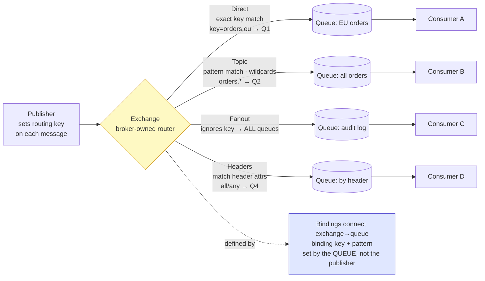

**What the interviewer is checking:**
- Correct path: publisher → exchange → binding → queue → consumer. The publisher publishes to an *exchange* with a *routing key*; it does not pick the queue.
- The **broker** owns the exchanges, queues, and the bindings between them, and does the routing — that decoupling is the point of AMQP.
- Routing key (set by the *publisher*, per message) vs binding key (set by the *queue's binding*) — Q26 hinges on getting this direction right.
- The four exchange types with a scenario each: direct = exact match, topic = wildcard patterns, fanout = broadcast to all, headers = match on header attributes. See [message-queues](../message-queues/) for quorum queues vs streams (Q28).

---

## Diagram 8 — Kafka Topic → Partitions → Consumer Group + Offsets

> **When to use:** Q29 (topics/partitions/consumer groups/offsets) and Q30 (rebalance, why more consumers than partitions wastes resources). The key visual: each partition is assigned to exactly one consumer in a group.

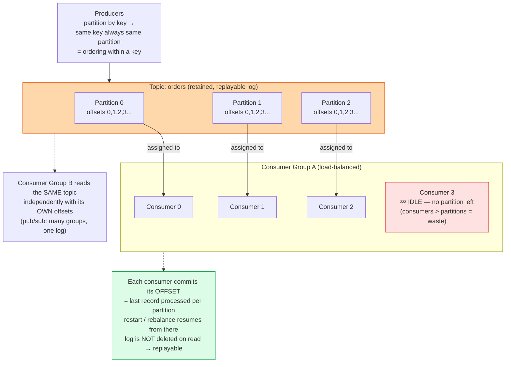

**What the interviewer is checking:**
- The core invariant: within a consumer group, **one partition → exactly one consumer**. That gives parallelism *across* partitions and ordering *within* a partition simultaneously.
- Why more consumers than partitions is wasteful — extras sit idle; partition count is the parallelism ceiling.
- Offsets are committed per consumer per partition; the log is retained (consume does not delete), which is what makes Kafka *replayable* and a fit for event sourcing (Q31, Q32).
- A rebalance reassigns partitions when consumers join/leave — briefly pausing consumption. Different consumer *groups* read the same topic independently (pub/sub). Deeper: [message-queues](../message-queues/).

---

## Diagram 9 — AWS SNS → SQS Fan-out (with DLQ)

> **When to use:** Q36 (why combine SNS + SQS instead of either alone) and Q35 (DLQ). One SNS topic publishes once; each subscribed SQS queue gets its own durable copy for an independent consumer.

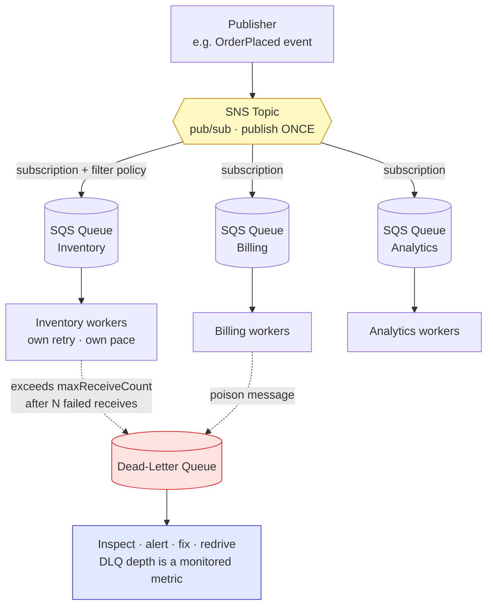

**What the interviewer is checking:**
- SNS alone is fire-and-forget pub/sub (no buffering for slow/offline consumers); SQS alone is point-to-point (one logical consumer). Combining them gives durable fan-out: publish once, each queue buffers its own copy, each consumer retries and scales independently.
- Filter policies on subscriptions let each queue receive only the events it cares about.
- A message lands in the DLQ after exceeding `maxReceiveCount` (repeated failed receives) — a poison message. The DLQ is for inspect / alert / fix / redrive, not a graveyard.
- Bonus: SNS FIFO + SQS FIFO pairs for ordered, deduplicated fan-out (Q37); EventBridge if you need rules-based routing instead of a queue (Q38).

---

## Diagram 10 — WebSocket Lifecycle (Upgrade → Frames → Close)

> **When to use:** Q39 — walk the lifecycle and explain full-duplex. Show the HTTP upgrade handshake, then the long-lived bidirectional frame exchange, then the close.

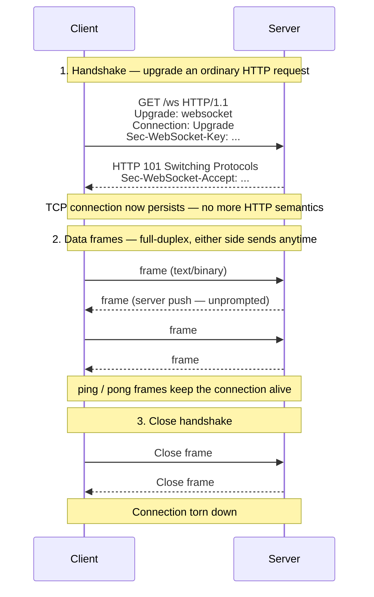

**What the interviewer is checking:**
- The lifecycle in order: HTTP handshake with `Upgrade: websocket` → server replies **101 Switching Protocols** → persistent TCP connection → bidirectional frames → close handshake.
- *Full-duplex* means either side can send at any time over the one connection — unlike HTTP request/response where the server only speaks when asked.
- It starts as HTTP (so it traverses proxies/firewalls on 80/443) but then sheds HTTP semantics; the connection is *stateful*, which limits horizontal scalability vs stateless REST.
- Auth happens on the handshake (the upgrade request carries the token/cookie). Deeper real-time design: [chat-system](../chat-system/).

---

## Diagram 11 — WebSocket vs SSE vs Long Polling vs Short Polling

> **When to use:** Q40 — compare the server-to-client push options and say when each wins. A timeline-style contrast of the four transports.

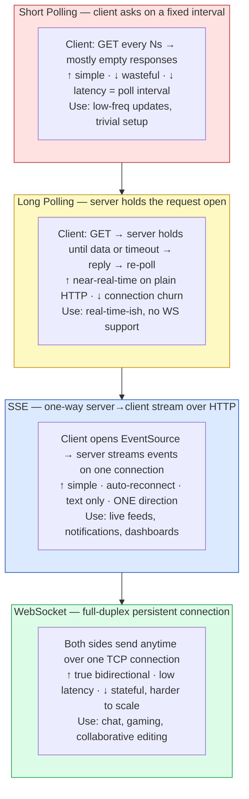

**What the interviewer is checking:**
- The axis that matters: **direction** (one-way vs bidirectional) and **persistence** (poll vs held-open vs streamed vs full-duplex).
- SSE is the underused right answer for *server → client only* push (notifications, live feeds): simpler than WebSocket, runs over plain HTTP, auto-reconnects. Reach for WebSocket only when the client must also push frequently (chat, gaming).
- Long polling is the fallback when neither SSE nor WS is available; short polling is the wasteful baseline (latency bounded by the interval).
- Deeper: [sse](../sse/) and [chat-system](../chat-system/).

---

## Diagram 12 — End-to-End: REST → Kafka → gRPC with a Trace ID

> **When to use:** QB4 (observability) and Q41 (WebSocket + Kafka, REST + Kafka together). Show one user action crossing a sync edge, an async hop, and an internal RPC — with a correlation/trace ID propagating the whole way.

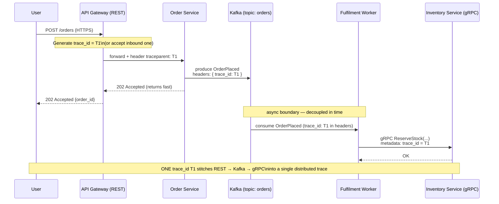

**What the interviewer is checking:**
- A trace/correlation ID (e.g. W3C `traceparent`) is generated at the edge and **propagated across every boundary** — HTTP headers on REST/gRPC, message headers on Kafka records.
- The sync edge returns `202 Accepted` immediately; the work continues asynchronously through Kafka — the caller is decoupled from fulfilment latency (the Diagram 1 sync/async split in action).
- The async hop is where naive tracing breaks: you must copy the ID into the Kafka message headers so the consumer can continue the same trace.
- This is the production-grade story tying every protocol in this guide together: pick the right transport per edge, and carry context across all of them. Related: [message-queues](../message-queues/), [chat-system](../chat-system/).

---

## Quick Interview Reference

### One-line "which technology" (Q44)

| Need | Pick | Why |
|---|---|---|
| Public CRUD API | REST | Cacheable, stateless, universal |
| Low-latency internal call | gRPC | Binary Protobuf over HTTP/2, typed contract |
| Flexible mobile data fetch | GraphQL | One round-trip, client picks fields |
| Task queue with routing | AMQP / RabbitMQ (or SQS) | Exchanges + bindings, DLQ, consume-and-delete |
| High-throughput event streaming | Kafka | Retained replayable log, partitions, offsets |
| Fan-out notifications | SNS → SQS (or EventBridge) | Publish once, durable per-subscriber copies |
| Real-time chat | WebSocket | Full-duplex persistent connection |
| Server→client push only | SSE | Simpler one-way stream over HTTP |

### The reliability spine (Level 10)

- **Exactly-once is effectively impossible across a network** → use *at-least-once delivery + idempotent consumers* (Q42).
- Duplicates come from **network loss + retries**; defend with idempotent operations, dedup on message ID, and exactly-once-style patterns (Q43).
- **Contract evolution** shares one principle across REST versioning, gRPC protobuf field numbers, and a Kafka Schema Registry: never break existing readers — add, don't reuse/remove (QB2).
- **The Kafka trap (QB5):** Kafka is the wrong tool for request/response, low-volume task routing, or when you need per-message ack/DLQ semantics — you lose simplicity and pay operational cost.
