# Consensus & Coordination (Raft / Paxos / ZAB) — Mermaid Diagrams

> **Reference:** [questions.md](./questions.md) · [answers.md](./answers.md) · [deep-dive.md](./deep-dive.md)
>
> **Note on this file:** the per-question diagram set (Diagrams 1–N per [`docs/instructions.md` §2.1](../../docs/instructions.md)) is still to be authored for this topic. The **one-page master diagram** below — the artifact you revise from and reproduce on the whiteboard — is complete.
>
> **Cross-links (depth lives there, not here):** [zookeeper pattern](../../patterns/zookeeper.md) (what to use on AWS instead) · [fundamentals/quorum.md](../../fundamentals/quorum.md) · [split-brain](../../fundamentals/split-brain.md) · [lease](../../fundamentals/lease.md) · [fencing](../../fundamentals/fencing.md) · [leader-and-follower](../../fundamentals/leader-and-follower.md) · [write-ahead-log](../../fundamentals/write-ahead-log.md) · [segmented-log](../../fundamentals/segmented-log.md) · [high-water-mark](../../fundamentals/high-water-mark.md) · [heartbeat](../../fundamentals/heartbeat.md) · consumers: [collaborative-editing](../collaborative-editing/) (doc ownership), [seat-reservation](../seat-reservation/) (fencing the confirm), [sharding-replication](../sharding-replication/) (failover)

---

## 🎯 The One-Page Master Diagram — THE ONE TO DRAW IN THE INTERVIEW (final consolidated design)

> **When to use:** final revision, 10 minutes before the interview — and the single diagram to reproduce on the whiteboard. If you can narrate it end-to-end and name the tradeoff at each **red** box, you're ready.
> Spec: [`docs/instructions.md` §2.1](../../docs/instructions.md) · AWS names: [`docs/AWS_SERVICE_MAP.md`](../../docs/AWS_SERVICE_MAP.md).
> ⚠️ AWS services are **defensible defaults**; every quota is an order-of-magnitude planning number to **verify against current docs**.

### The central split in one sentence

**Every coordination need — leader election, locks, config, membership — is the *same* problem: agree on an **ordered log of commands** so that identical replicas applying identical commands in identical order stay identical; a **majority quorum** is the whole safety argument (any two majorities share a node, so a decision can never be reversed), and the cost is a round-trip to that majority per commit — which is why consensus belongs on the small control plane and never on the bulk data path.**

```mermaid
flowchart LR
    NEED(["leader election · locks<br/>config · membership"])

    FRAME{"① SAME PROBLEM, ONE PRIMITIVE<br/>all of the above = agree on an ORDERED LOG<br/>replicated state machine:<br/>same start + same order = same state"}

    PREVENT{"② WHAT IT PREVENTS: SPLIT-BRAIN<br/>two leaders accept conflicting writes<br/>→ no safe automatic merge<br/>a boolean is_leader flag CANNOT prevent it"}

    subgraph CORE["③ THE LOG — Raft's three mechanisms"]
        direction TB
        TERM["term = monotonic logical clock<br/>≤ 1 leader per term<br/>higher term DEMOTES a stale leader"]
        MATCH["Log Matching: same index+term<br/>⇒ identical command AND prefix<br/>(prevLogIndex check enforces it)"]
        VOTE["election restriction: refuse a candidate<br/>whose log is less up-to-date<br/>⇒ new leader HAS every committed entry"]
        TERM --> MATCH --> VOTE
    end

    QUORUM{"④ MAJORITY INTERSECTION = SAFETY<br/>⌊N/2⌋+1; any two majorities share ≥1 node<br/>→ carries the chosen value forward<br/>use odd N (3,5,7); 2 nodes is WORSE than 1"}

    COMMIT["⑤ committed = on a majority<br/>ack the client only AFTER commit<br/>determinism rule: compute NOW()/rand<br/>on the leader, LOG THE VALUE"]

    LIMIT{"⑥ FLP (1985): no async algorithm guarantees<br/>both safety and termination<br/>→ keep SAFETY, relax liveness (timeouts)<br/>randomized timeouts stop election livelock"}

    FENCE["⑦ a lease is NOT enough<br/>the old leader can't reach a majority → never commits<br/>but a paused holder must be FENCED at the resource<br/>(monotonic token; resource rejects stale)"]

    COST["⑧ THE COST → the boundary<br/>1 majority round-trip per committed write<br/>→ consensus for small critical METADATA only<br/>eventual-consistency-tolerant data? CRDTs, no coordination"]

    NEED --> FRAME --> PREVENT --> TERM
    VOTE --> QUORUM --> COMMIT --> LIMIT --> FENCE --> COST

    style CORE fill:#dbeafe,stroke:#1d4ed8
    style COMMIT fill:#dcfce7,stroke:#16a34a
    style FENCE fill:#fed7aa,stroke:#ea580c
    style COST fill:#e0e7ff,stroke:#4338ca
    style PREVENT fill:#fee2e2,stroke:#dc2626
    style QUORUM fill:#fee2e2,stroke:#dc2626
    style LIMIT fill:#fee2e2,stroke:#dc2626
```

### The 60-second narration

*(one line per numbered box ①–⑧)*

1. **Collapse four requirements into one primitive.** Leader election, distributed locks, config storage and membership are not four problems — they are all "agree on the next entry in an ordered log." That's the replicated state machine model: identical initial state plus identical commands in identical order yields identical replicas. Agreeing on *log entries* is a clean consensus problem; agreeing on *state* is not.
2. **The first red box: name the failure this exists to prevent — split-brain.** Two nodes each believing they are leader accept conflicting writes, and for a control plane there is no safe automatic merge afterwards. Say why the obvious alternatives fail: a single coordinator is a SPOF *and* cannot distinguish a frozen node (GC pause) from a dead one; a boolean `is_leader` row in a database has no mechanism to stop two writers during a partition.
3. **Raft's three mechanisms, which is what you should actually explain rather than reciting Paxos phases.** The **term** is a monotonic logical clock with at most one leader per term, and a higher term demotes a stale leader on contact. **Log Matching** means the same index and term imply the same command *and* the same entire prefix — enforced by the `prevLogIndex` consistency check. The **election restriction** makes voters refuse a candidate whose log is behind, which guarantees a new leader already holds every committed entry.
4. **The second red box is the entire safety argument in one line: any two majorities intersect.** With ⌊N/2⌋+1, any two quorums share at least one node, so that node carries the previously chosen value forward and a decision can never be silently reversed. Use odd cluster sizes — and note that **2 nodes is strictly worse than 1** for writes, because you now need both alive to form a majority.
5. **An entry is committed once it's on a majority, and only then do you ack the client.** Plus the determinism rule people forget: never log an *instruction* like `NOW()` or `rand()` — compute it on the leader and log the concrete **value**, or replicas diverge while faithfully applying the same log.
6. **The third red box is the theoretical boundary: FLP (1985).** No deterministic asynchronous algorithm can guarantee both safety and termination with even one crash — so every real system keeps **safety** and relaxes liveness, using timeouts and accepting that progress depends on the network eventually behaving. Randomized election timeouts are what stop repeated split votes.
7. **A lease alone is not enough, and this is the practical bridge to the rest of the repo.** An old leader can't commit anything (it can't reach a majority), but a *paused* holder can still wake up and issue a write to some other resource. So the protected resource must reject a stale **fencing token** — see [fundamentals/fencing.md](../../fundamentals/fencing.md), and it's exactly what [seat-reservation](../seat-reservation/) and [collaborative-editing](../collaborative-editing/) do.
8. **Finally, the architectural boundary, which is the senior point:** every committed write costs a round-trip to a majority, so consensus belongs on the small, critical metadata — who is leader, where shard X lives, cluster config — while the bulk data plane runs on cheaper replication. And if the data tolerates eventual consistency, CRDTs or leaderless replication avoid the coordination tax entirely. Knowing when *not* to use consensus is the signal.

### The five numbers that justify the design

| Number | Derivation | Therefore |
|---|---|---|
| **Quorum = ⌊N/2⌋+1; failures tolerated = N − quorum** | majority arithmetic | N=3 tolerates 1, N=5 tolerates 2. This is the sizing conversation, and it's why you use odd N |
| **2 nodes tolerate **zero** failures** | ⌊2/2⌋+1 = 2 | Counter-intuitive and worth saying: adding a second node makes writes *less* available than a single node |
| **1 majority round-trip per committed write** | protocol cost | The reason consensus stays off the data path; it sets the ceiling on control-plane write throughput |
| **Multi-Paxos / stable leader: 2 round-trips → 1** | skip Phase 1 while the leader is stable | Why every production system runs a stable leader instead of textbook single-decree Paxos |
| **Election timeout ≫ heartbeat interval** (randomized) | liveness tuning | Too tight ⇒ spurious elections during a GC pause; too loose ⇒ slow failover. The knob that decides your RTO |

### The patterns this assembles

| Pattern | Where | The move |
|---|---|---|
| [ZooKeeper & coordination](../../patterns/zookeeper.md) **●** | ①⑦⑧ | What to actually use: a handful of coarse locks/leases with fencing — and on AWS, a DynamoDB conditional-write lease instead of a managed ZK |
| [Dealing with Contention](../../patterns/dealing-with-contention.md) **●** | ⑦ | Rung 4 — a lease plus a fencing token, with the *resource* doing the rejecting |
| [Multi-Step Processes](../../patterns/multi-step-processes.md) ○ | ③⑤ | The replicated log is the durable ordered history that makes re-drive and recovery possible |
| [Scaling Writes](../../patterns/scaling-writes.md) ○ | ⑧ | The boundary decision: keep the data plane off consensus so writes scale |
| [fundamentals/lease.md](../../fundamentals/lease.md) + [fencing.md](../../fundamentals/fencing.md) ○ | ⑦ | The two primitives every consumer of this topic actually imports |

### The three things that break (and the mitigation)

| Failure | Blast radius | Mitigation | How you detect it |
|---|---|---|---|
| **Minority partition keeps serving** | If the smaller side accepted writes you'd have two divergent histories with no safe merge — the exact thing consensus exists to prevent | A minority **refuses** writes by design (it cannot reach a quorum); reads that must be linearizable go through the leader or a read-index/lease check, not a local replica | Rate of "no quorum" write rejections; leader-less duration; per-node view of cluster membership diverging |
| **Leader freezes (long GC pause), a new one is elected, then it wakes** | The zombie believes it is still leader; it cannot commit, but it *can* still call out to external resources | Terms/epochs demote it on first contact — and every protected resource enforces a monotonic **fencing token** so a stale writer is rejected at the resource | Rejected-stale-epoch/token counter; leader-change events correlated with GC pause p99; time-since-last-successful-heartbeat |
| **Election livelock (repeated split votes)** | No leader is elected, so the whole control plane stalls — and everything that depends on it stalls with it | Randomized election timeouts, pre-vote to avoid disruptive candidates, and timeouts tuned well above normal heartbeat jitter | Elections per minute; terms advancing with no committed entries; leaderless interval duration |

### The AWS-specific traps to name unprompted

| Trap | Why it bites here | What you say |
|---|---|---|
| **There is no managed ZooKeeper/etcd for application use** | The single most common wrong answer | *"Saying 'I'd use ZooKeeper on AWS' invites 'which service?' — the honest answer is self-managed on EKS, or I redesign to a DynamoDB lease row with a conditional write and a fencing token."* |
| **DynamoDB conditional write is the AWS consensus substitute** | The practical answer | *"`ConditionExpression` on a lease item gives me compare-and-set plus a version I can use as a fencing token — and DynamoDB's own internals do the consensus for me."* |
| **Aurora/DynamoDB already do this internally** | Worth naming as a boundary | *"I don't need to build consensus to get a durable ordered log — managed storage already paid for it; I only build coordination for things no service offers."* |
| **EKS/ECS have native leader-election primitives** | Cheaper than a cluster | *"A Kubernetes Lease object is often enough for 'one active worker' — I wouldn't stand up a quorum for that."* |
| **MSK/Kafka's controller is consensus, not yours to run** | Don't conflate layers | *"Kafka's KRaft controller is consensus inside the broker; my application-level ordering still comes from partition keys."* |
| **Cross-region quorums are latency, not magic** | Multi-region control plane | *"A quorum spanning regions pays a WAN round-trip per commit — I'd keep the quorum in-region and fail over deliberately."* |

### If you only remember one thing

> **Everything reduces to agreeing on an ordered log, and majority intersection is the whole safety proof — any two quorums share a node, so a committed decision can never be reversed. Keep safety and relax liveness (FLP), fence every resource against a paused leader, and keep consensus on the small control plane because each commit costs a round-trip to a majority.**
