# Answers: Consistent Hashing

> Keyed to [questions.md](./questions.md). Read questions first — attempt each before coming here.
> Every answer contains code or a comparison table, plus named tradeoffs on decisions that matter.
> Mermaid diagrams accompany the worked examples — each one is drawable on a whiteboard in under a minute, so practise redrawing them rather than only reading them.

---

## Level 1 — The Core Problem

### A1. The problem consistent hashing solves

Consistent hashing solves the problem of distributing data across a cluster of nodes such that **adding or removing one node requires moving only a small, bounded fraction of data** — not a full reshuffle.

Without it: every topology change forces nearly all data to relocate, emptying a distributed cache and causing a thundering herd against the backend.

| Property | Modulo Hashing (`hash(key) % N`) | Consistent Hashing |
|---|---|---|
| Keys moved on node addition | ~(N-1)/N ≈ 80-99% | ~1/N ≈ 10-25% |
| Node addition complexity | Full reshuffle required | Only adjacent key range moves |
| Cluster stability | Brittle — any change causes cascade | Stable — changes are bounded |
| Typical use | Fixed-size deployments | Growing distributed systems |

---

### A2. Fraction of keys remapped with modulo hashing

With `hash(key) % N`:

```
N=4 → N=5:

Key K maps to hash(K) % 4 = bucket B4
After adding node: hash(K) % 5 = bucket B5
B4 and B5 are the same only when hash(K) % 4 == hash(K) % 5, which is rare.

Expected fraction remapped = (N-1) / N = 4/5 = 80%
```

| Transition | Keys that must move |
|---|---|
| 4 → 5 nodes | ~80% |
| 10 → 11 nodes | ~90% |
| 100 → 101 nodes | ~99% |

**Diagram — five concrete keys, one node added: four of five move.** A key stays put only when `hash % 4 == hash % 5`, which holds only for `hash mod 20 < 4`.

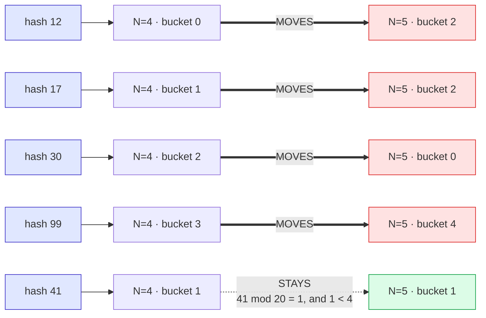
```mermaid
flowchart LR
    K12["hash 12"] --> A12["N=4 · bucket 0"] ==>|"MOVES"| B12["N=5 · bucket 2"]
    K17["hash 17"] --> A17["N=4 · bucket 1"] ==>|"MOVES"| B17["N=5 · bucket 2"]
    K30["hash 30"] --> A30["N=4 · bucket 2"] ==>|"MOVES"| B30["N=5 · bucket 0"]
    K99["hash 99"] --> A99["N=4 · bucket 3"] ==>|"MOVES"| B99["N=5 · bucket 4"]
    K41["hash 41"] --> A41["N=4 · bucket 1"] -.->|"STAYS<br/>41 mod 20 = 1, and 1 &lt; 4"| B41["N=5 · bucket 1"]

    classDef moved fill:#fee2e2,stroke:#dc2626
    classDef stayed fill:#dcfce7,stroke:#16a34a
    classDef key fill:#e0e7ff,stroke:#4338ca
    class B12,B17,B30,B99 moved
    class B41 stayed
    class K12,K17,K30,K99,K41 key
```

Four of five keys land on a different node for a single node addition — that ratio is `(N-1)/N`, and it gets worse as N grows.

As the cluster grows, even a single node addition forces nearly a complete reshuffle.

---

### A3. Downstream effect: cache miss flood

When keys remap, every cached key that moved to a new node is a cache miss on first access — the new node has no data yet.

```
Scenario: 10M cached keys, 80% remap on node addition
→ 8M simultaneous cache misses
→ All 8M requests fall through to the database
→ Database receives 8M unexpected queries in seconds
→ Database collapses → cascading outage
```

**Diagram — how a routing change turns the cache into a DB attack.** Note the feedback loop at the bottom: client retries on timeout amplify the very load that caused the timeout.

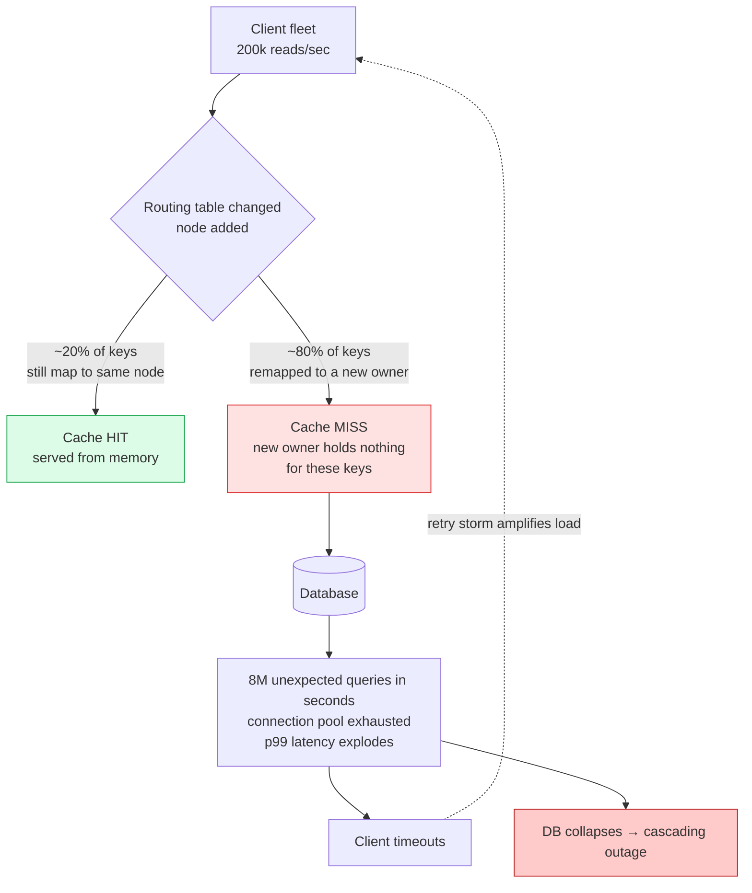
```mermaid
flowchart TD
    CL["Client fleet<br/>200k reads/sec"] --> RT{"Routing table changed<br/>node added"}

    RT -->|"~20% of keys<br/>still map to same node"| HIT["Cache HIT<br/>served from memory"]
    RT -->|"~80% of keys<br/>remapped to a new owner"| MISS["Cache MISS<br/>new owner holds nothing<br/>for these keys"]

    MISS --> DB[("Database")]
    DB --> OVER["8M unexpected queries in seconds<br/>connection pool exhausted<br/>p99 latency explodes"]
    OVER --> TO["Client timeouts"]
    TO -.->|"retry storm amplifies load"| CL
    OVER --> DOWN["DB collapses → cascading outage"]

    style HIT fill:#dcfce7,stroke:#16a34a
    style MISS fill:#fee2e2,stroke:#dc2626
    style DOWN fill:#fecaca,stroke:#b91c1c
```

This is the "thundering herd" pattern. The cache was designed to absorb load, but the remapping event converts cache capacity into a concentrated DB attack.

---

### A4. Replication factor and mass remapping

| Replication Factor | Impact of Mass Remapping |
|---|---|
| RF=1 | Every remapped key is an immediate cache miss; no fallback |
| RF=3 | Remapped keys may exist on replica nodes temporarily, reducing miss severity |

With RF=1, every key that moves is completely unavailable until the new node is populated. With RF=3, at least one replica likely still holds the data during the transition window — but the write path is still disrupted and background rebalancing adds load. RF does not eliminate the mass movement problem, it only softens the read impact.

---

## Level 2 — The Hash Ring Mechanics

### A5. What is a consistent hash ring

A hash ring maps both **nodes** and **keys** onto the same circular hash space (0 to 2³²-1 is common). Each entity is hashed to a position on this ring.

```
hash("NodeA") = 10   → placed at position 10
hash("NodeB") = 120  → placed at position 120
hash("NodeC") = 230  → placed at position 230

Ring (0 → 359, wrapping):
  0 ... [10:A] ... [120:B] ... [230:C] ... 359 → back to 0
```

To find which node owns a key: hash the key, then **walk clockwise** on the ring until you hit a node. That node is the owner.

**Diagram — the ring as a cycle.** Arrows point clockwise. The critical reading: each node owns the arc that *ends* at its own position, and the last arc wraps through 0.

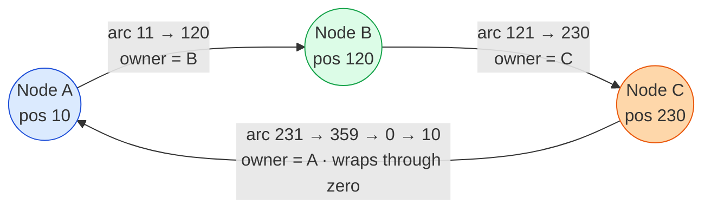
```mermaid
flowchart LR
    A(("Node A<br/>pos 10")) -->|"arc 11 → 120<br/>owner = B"| B(("Node B<br/>pos 120"))
    B -->|"arc 121 → 230<br/>owner = C"| C(("Node C<br/>pos 230"))
    C -->|"arc 231 → 359 → 0 → 10<br/>owner = A · wraps through zero"| A

    style A fill:#dbeafe,stroke:#1d4ed8
    style B fill:#dcfce7,stroke:#16a34a
    style C fill:#fed7aa,stroke:#ea580c
```

---

### A6. Clockwise routing on the ring

```
Nodes: A=10, B=120, C=230
Ring size: 0–359

hash(K) = 150 → walk clockwise from 150
  → next node clockwise: C at 230
  → Node C owns key K

hash(M) = 80  → walk clockwise from 80
  → next node clockwise: B at 120
  → Node B owns key M
```

| Key hash value | Walk clockwise finds | Owner |
|---|---|---|
| 5 | Node A at 10 | A |
| 80 | Node B at 120 | B |
| 150 | Node C at 230 | C |
| 240 | wraps around to Node A at 10 | A |

**Diagram — four key lookups on the same ring.** Dashed arrows are lookups, not data placement: the key never moves, only the resolution walk.

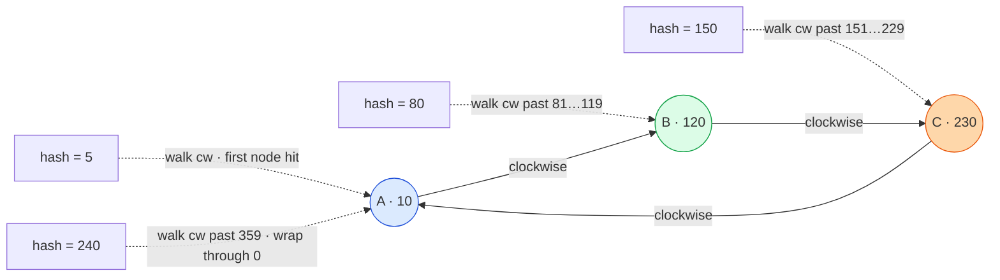
```mermaid
flowchart LR
    K1["hash = 5"] -.->|"walk cw · first node hit"| A
    K2["hash = 80"] -.->|"walk cw past 81…119"| B
    K3["hash = 150"] -.->|"walk cw past 151…229"| C
    K4["hash = 240"] -.->|"walk cw past 359 · wrap through 0"| A

    A(("A · 10")) -->|clockwise| B(("B · 120")) -->|clockwise| C(("C · 230")) -->|clockwise| A

    style A fill:#dbeafe,stroke:#1d4ed8
    style B fill:#dcfce7,stroke:#16a34a
    style C fill:#fed7aa,stroke:#ea580c
```

---

### A7. Impact of node D joining at position 180

```
Before: C at 230 owns keys 121–230 (from after B to C inclusive)
D joins at 180:

Keys 121–180 → moved from C to D
Keys 181–230 → remain with C

Fraction moved = (180 - 120) / 360 = 60/360 ≈ 16.7%
Expected disruption (1/N) = 1/4 = 25% → actual depends on node positions
```

**Diagram — before and after D joins.** Only one edge of the ring changes. C's arc is cut in two; A's and B's arcs are byte-for-byte identical, so no key they own is touched.

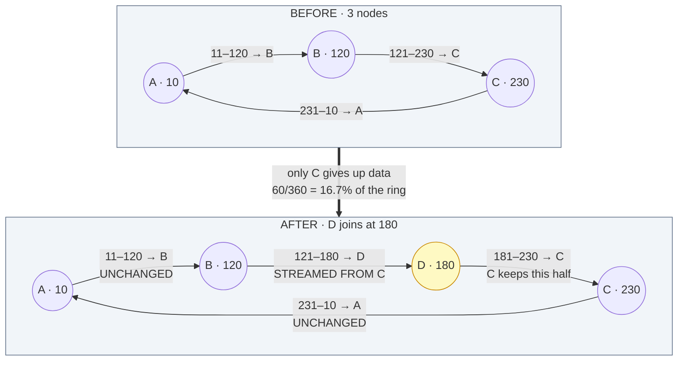
```mermaid
flowchart TD
    subgraph before["BEFORE · 3 nodes"]
        direction LR
        A1(("A · 10")) -->|"11–120 → B"| B1(("B · 120"))
        B1 -->|"121–230 → C"| C1(("C · 230"))
        C1 -->|"231–10 → A"| A1
    end

    subgraph after["AFTER · D joins at 180"]
        direction LR
        A2(("A · 10")) -->|"11–120 → B<br/>UNCHANGED"| B2(("B · 120"))
        B2 -->|"121–180 → D<br/>STREAMED FROM C"| D2(("D · 180"))
        D2 -->|"181–230 → C<br/>C keeps this half"| C2(("C · 230"))
        C2 -->|"231–10 → A<br/>UNCHANGED"| A2
    end

    before ==>|"only C gives up data<br/>60/360 = 16.7% of the ring"| after

    style D2 fill:#fef9c3,stroke:#ca8a04
    style before fill:#f1f5f9,stroke:#64748b
    style after fill:#f1f5f9,stroke:#64748b
```

Only Node C is affected — it surrenders part of its range to D. Nodes A and B are completely unaffected. This is the core advantage: disruption is bounded to adjacent neighbors, not the entire cluster.

---

### A8. Why circular (ring) rather than linear

A linear hash space from 0 to max has endpoints that create an edge problem: the node with the lowest position would "own" keys from 0 to its position, and the node at the highest position would own keys from max back to... nothing. The ring resolves this by wrapping — the last node's range wraps clockwise back to the first node, making the assignment uniform with no special cases.

```
Linear (broken): node at position max has no successor → key range undefined
Ring (correct):  node at position max → successor is the first node (position 0)
                 range wraps seamlessly
```

**Diagram — the endpoint hole the ring closes.** In the linear space the tail arc has no successor to resolve to, so it needs a special case in every lookup. Wrapping deletes the special case.

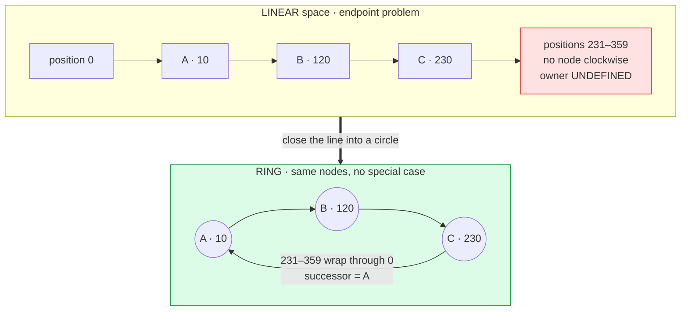
```mermaid
flowchart TD
    subgraph lin["LINEAR space · endpoint problem"]
        direction LR
        L0["position 0"] --> LA["A · 10"] --> LB["B · 120"] --> LC["C · 230"] --> LX["positions 231–359<br/>no node clockwise<br/>owner UNDEFINED"]
    end

    subgraph rng["RING · same nodes, no special case"]
        direction LR
        RA(("A · 10")) --> RB(("B · 120")) --> RC(("C · 230"))
        RC -->|"231–359 wrap through 0<br/>successor = A"| RA
    end

    lin ==>|"close the line into a circle"| rng

    style LX fill:#fee2e2,stroke:#dc2626
    style rng fill:#dcfce7,stroke:#16a34a
```

---

## Level 3 — Virtual Nodes

### A9. Distribution problem with 3 physical nodes

With 3 physical nodes hashed once each to random ring positions, the probability of even distribution is low:

```
Example (ring 0–359):
  NodeA = 5
  NodeB = 8
  NodeC = 190

Key ranges (each node owns the arc ending at its own position):
  NodeA: 191–5   (wrap-around) = 175 positions → 48.6% of ring
  NodeB: 6–8     = 3 positions  →  0.8% of ring
  NodeC: 9–190   = 182 positions → 50.6% of ring
                                   ----
                                   360 positions total

NodeB is handling under 1% of keys; NodeA and NodeC are handling ~50% each.
NodeB is massively underutilized. NodeA and NodeC are hot.
```

**Diagram — the same numbers as ring share.** A and B hashed 3 positions apart purely by accident, and that accident *is* B's entire allocation — its slice is too thin to even render as a wedge.

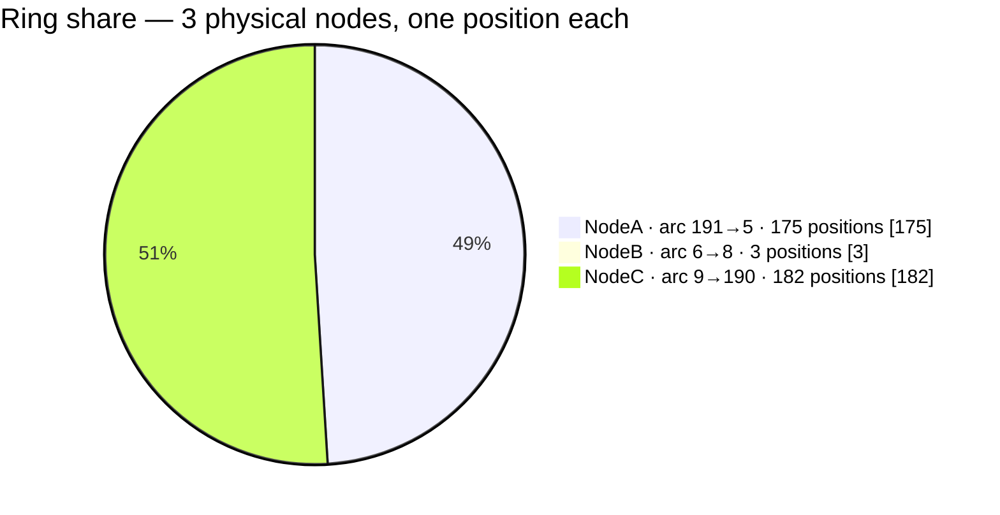
```mermaid
pie showData title Ring share — 3 physical nodes, one position each
    "NodeA · arc 191→5 · 175 positions" : 175
    "NodeB · arc 6→8 · 3 positions" : 3
    "NodeC · arc 9→190 · 182 positions" : 182
```

The smaller the cluster, the worse this statistical accident can be.

---

### A10. What virtual nodes are and how they fix it

Virtual nodes (vnodes) assign each physical node **multiple positions** on the ring instead of one.

```
Physical nodes: A, B, C
Virtual nodes per physical node: 4

Ring positions:
  A: hash("A-1")=10, hash("A-2")=95, hash("A-3")=200, hash("A-4")=310
  B: hash("B-1")=30, hash("B-2")=120, hash("B-3")=220, hash("B-4")=330
  C: hash("C-1")=60, hash("C-2")=150, hash("C-3")=245, hash("C-4")=350

Each physical node now owns multiple small, interleaved arcs instead of one large arc.
By the law of large numbers, with 150+ vnodes per node, the distribution approaches even.
```

**Diagram — the same 3 machines, now interleaved.** Colour = physical node. Walk the cycle and note that no machine ever holds two adjacent arcs, so no machine can accumulate one dominant slice.

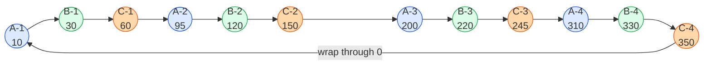
```mermaid
flowchart LR
    A1(("A-1<br/>10")) --> B1(("B-1<br/>30")) --> C1(("C-1<br/>60")) --> A2(("A-2<br/>95"))
    A2 --> B2(("B-2<br/>120")) --> C2(("C-2<br/>150")) --> A3(("A-3<br/>200")) --> B3(("B-3<br/>220"))
    B3 --> C3(("C-3<br/>245")) --> A4(("A-4<br/>310")) --> B4(("B-4<br/>330")) --> C4(("C-4<br/>350"))
    C4 -->|"wrap through 0"| A1

    classDef pa fill:#dbeafe,stroke:#1d4ed8
    classDef pb fill:#dcfce7,stroke:#16a34a
    classDef pc fill:#fed7aa,stroke:#ea580c
    class A1,A2,A3,A4 pa
    class B1,B2,B3,B4 pb
    class C1,C2,C3,C4 pc
```

If any one vnode arc is large, it's balanced by smaller arcs elsewhere on the same physical node.

---

### A11. 6 nodes × 256 vnodes: even distribution guarantee?

```
Total ring positions: 6 × 256 = 1,536
```

No, this does **not guarantee** perfectly even distribution. The 1,536 virtual positions are placed by hash function output — which is pseudo-random. With a good hash function and 256 vnodes, the distribution is statistically close to even (within ~10% variance), but not mathematically guaranteed.

The more vnodes per physical node, the tighter the statistical distribution. 256 is a pragmatic sweet spot between operational complexity and distribution quality. Cassandra moved from 1 token (original) → configurable vnodes → 256 default.

---

### A12. Tradeoff: high vnodes (500) vs low vnodes (10)

**Tradeoff: Distribution Accuracy vs Operational Overhead**

| Aspect | Low vnodes (10/node) | High vnodes (500/node) |
|---|---|---|
| Load distribution | Poor — high variance | Excellent — near-uniform |
| Memory per node | Low ring metadata overhead | Higher metadata (~500 token entries per node) |
| Rebalance on node join/leave | Fewer data transfers | Many small transfers — easier to parallelize but more coordination |
| Bootstrap time for new node | Faster (fewer ranges to stream) | Slower (500 range endpoints to populate) |
| Failure blast radius | Large (one node failure = large dead range) | Small (one node failure = many small ranges scattered) |

**Diagram — the same decision, both consequences.** Both branches lead to the same tradeoff node: whatever you gain in recovery blast radius you pay for in bootstrap and metadata cost.

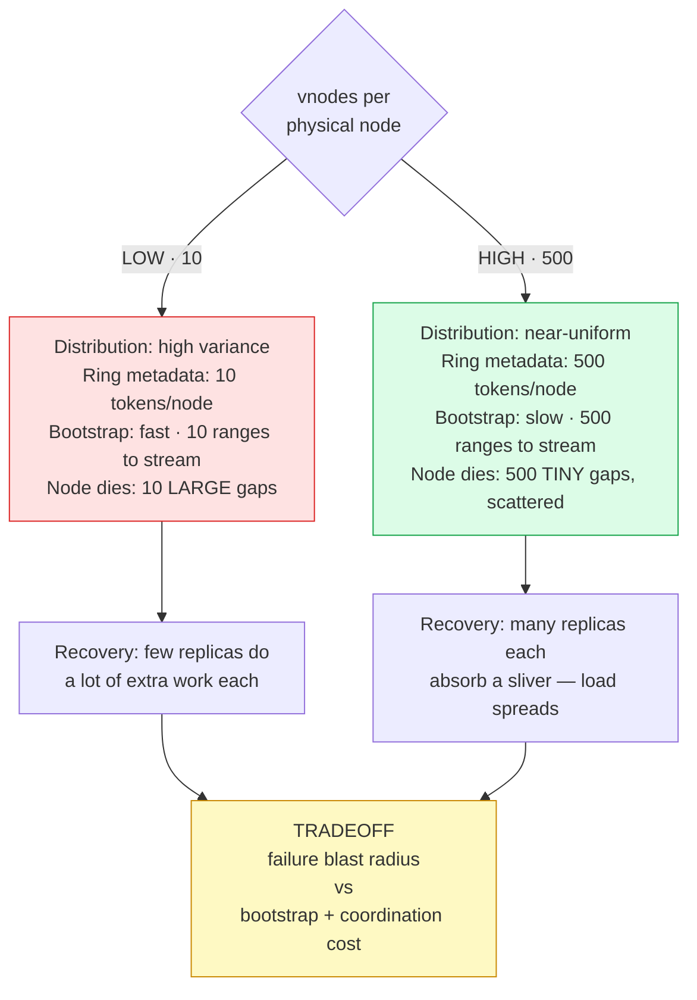
```mermaid
flowchart TD
    V{"vnodes per<br/>physical node"}

    V -->|"LOW · 10"| LOW["Distribution: high variance<br/>Ring metadata: 10 tokens/node<br/>Bootstrap: fast · 10 ranges to stream<br/>Node dies: 10 LARGE gaps"]
    V -->|"HIGH · 500"| HIGH["Distribution: near-uniform<br/>Ring metadata: 500 tokens/node<br/>Bootstrap: slow · 500 ranges to stream<br/>Node dies: 500 TINY gaps, scattered"]

    LOW --> LC["Recovery: few replicas do<br/>a lot of extra work each"]
    HIGH --> HC["Recovery: many replicas each<br/>absorb a sliver — load spreads"]

    LC --> T["TRADEOFF<br/>failure blast radius<br/>vs<br/>bootstrap + coordination cost"]
    HC --> T

    style LOW fill:#fee2e2,stroke:#dc2626
    style HIGH fill:#dcfce7,stroke:#16a34a
    style T fill:#fef9c3,stroke:#ca8a04
```

**Tradeoff: Failure Blast Radius vs Bootstrap Cost.** With 500 vnodes, a single node failure creates 500 small gaps distributed around the ring. Each gap is small and quickly covered by replicas. With 10 vnodes, a single node failure creates 10 larger gaps — each larger gap means more keys are served from a replica for longer.

---

## Level 4 — Ring Operations: Joins and Departures

### A13. Node join: step by step

```
Step 1 — Position selection:
  New node generates virtual node positions via: hash(node_id + "-" + vnode_index)
  Positions are announced to the cluster via gossip.

Step 2 — Identify key ranges to acquire:
  For each new vnode position P, find the current owner: the nearest existing clockwise node.
  New node will take over keys from [prev_clockwise_position + 1 ... P].

Step 3 — Data streaming (bootstrap):
  Current owner streams key-value data for the acquired range to the new node.
  This runs in the background; the old owner continues serving the range.

Step 4 — Traffic cutover:
  Once data transfer for a range is complete and verified (checksum match),
  the new node notifies the cluster: "I now own range [X, Y]."
  Ring state is updated via gossip propagation.
  New writes immediately route to the new node.
  Old owner stops serving that range.

Step 5 — Cleanup:
  Old owner deletes the transferred key range after a safety window
  (to allow stragglers and repair operations to complete).
```

**Diagram — the join as a message sequence.** The control-flow point interviewers probe: the ring is only updated at step 7, *after* the data is verified. Until then the old owner is still authoritative, which is why a join causes no unavailability.

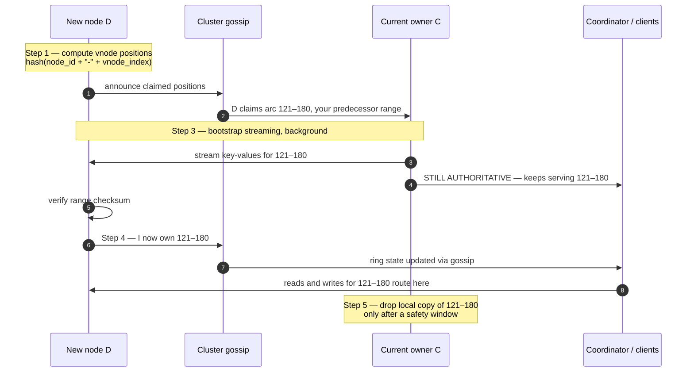
```mermaid
sequenceDiagram
    autonumber
    participant D as New node D
    participant G as Cluster gossip
    participant C as Current owner C
    participant CO as Coordinator / clients

    Note over D: Step 1 — compute vnode positions<br/>hash(node_id + "-" + vnode_index)
    D->>G: announce claimed positions
    G->>C: D claims arc 121–180, your predecessor range
    Note over D,C: Step 3 — bootstrap streaming, background
    C->>D: stream key-values for 121–180
    C->>CO: STILL AUTHORITATIVE — keeps serving 121–180
    D->>D: verify range checksum
    D->>G: Step 4 — I now own 121–180
    G->>CO: ring state updated via gossip
    CO->>D: reads and writes for 121–180 route here
    Note over C: Step 5 — drop local copy of 121–180<br/>only after a safety window
```

---

### A14. Graceful node departure vs crash

**Graceful departure (planned maintenance):**
```
1. Node signals intent to leave (decommission)
2. For each of its vnodes, identify successor nodes (next clockwise)
3. Stream all data to successors proactively
4. Once complete, remove node from ring state
5. Successors take ownership of the ranges
```

**Crash departure (ungraceful):**
```
1. Gossip detects heartbeat failure → marks node "suspected dead"
2. After phi-accrual threshold, declares node dead
3. Ring is updated to remove the crashed node's positions
4. Successor nodes are now primary for those ranges
5. If replication factor > 1: successors already hold replica copies → serve immediately
6. If RF=1: data is unavailable until recovery (read repair or restore from backup)
```

**Diagram — one departure, two control flows.** The whole difference is *who initiates*: in the graceful path the leaving node drives the transfer; in the crash path the cluster must first agree the node is gone, and survivability then depends entirely on replication factor.

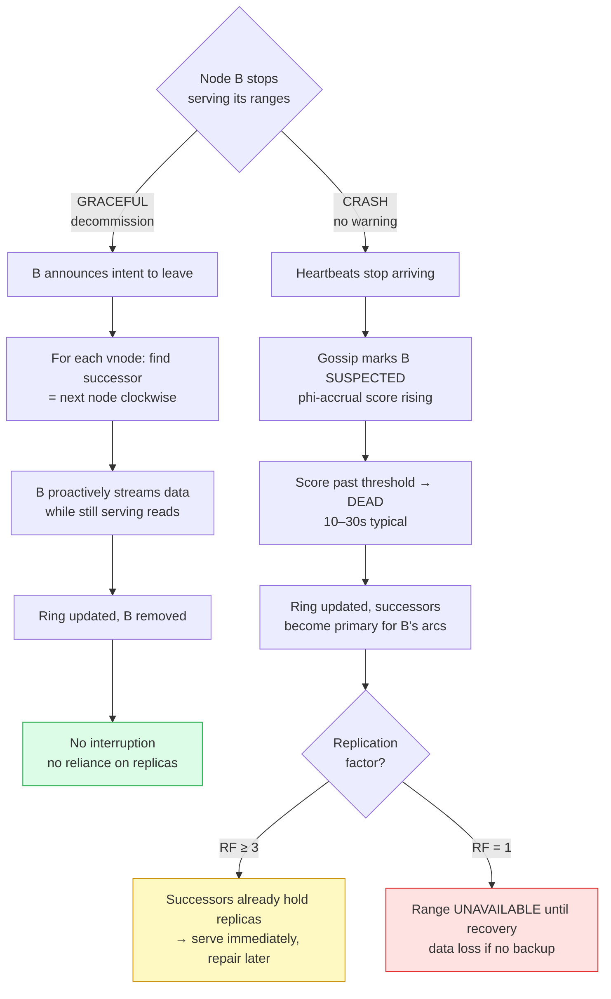
```mermaid
flowchart TD
    L{"Node B stops<br/>serving its ranges"}

    L -->|"GRACEFUL<br/>decommission"| G1["B announces intent to leave"]
    G1 --> G2["For each vnode: find successor<br/>= next node clockwise"]
    G2 --> G3["B proactively streams data<br/>while still serving reads"]
    G3 --> G4["Ring updated, B removed"]
    G4 --> G5["No interruption<br/>no reliance on replicas"]

    L -->|"CRASH<br/>no warning"| X1["Heartbeats stop arriving"]
    X1 --> X2["Gossip marks B SUSPECTED<br/>phi-accrual score rising"]
    X2 --> X3["Score past threshold → DEAD<br/>10–30s typical"]
    X3 --> X4["Ring updated, successors<br/>become primary for B's arcs"]
    X4 --> RF{"Replication<br/>factor?"}
    RF -->|"RF ≥ 3"| OK["Successors already hold replicas<br/>→ serve immediately, repair later"]
    RF -->|"RF = 1"| BAD["Range UNAVAILABLE until recovery<br/>data loss if no backup"]

    style G5 fill:#dcfce7,stroke:#16a34a
    style OK fill:#fef9c3,stroke:#ca8a04
    style BAD fill:#fee2e2,stroke:#dc2626
```

| Aspect | Graceful | Crash |
|---|---|---|
| Data transfer | Proactive, owner streams to successor | None — successor takes over from replicas |
| Data availability | No interruption (parallel serve + transfer) | Depends on replication factor |
| Ring update | Immediate, coordinated | After failure detection timeout (10-30s typical) |
| Data loss risk | None | Possible if RF=1 and no backup |

---

### A15. Reads and writes to a crashed node's range

```
Without replication (RF=1):
  - Read requests: return error or stale cached response
  - Write requests: blocked or queued until recovery
  - Data is unavailable for the failure duration

With replication (RF=3):
  - Replica nodes (next 2 clockwise) hold copies of the data
  - Read requests: routed to replica nodes → served normally
  - Write requests: coordinator routes to available replicas
  - If W=2: writes succeed even with one node down (2 of 3 replicas are available)
  - Once dead node recovers: read repair or anti-entropy reconciles missing writes
```

**Tradeoff: Availability vs Consistency During Failure.** With sloppy quorum (W+R < N), writes can succeed to substitute nodes during the failure, improving availability. But the recovered node may miss those writes until hinted handoff delivers them. This is the CAP tradeoff materialized: Cassandra/Dynamo choose availability over strict consistency during network partitions.

---

### A16. In-flight requests during ring rebalance

During data transfer, a key range is in transition. If a request arrives at the old owner after ownership has been transferred, and at the new owner before data is fully loaded, both can produce wrong results.

**Recommended approach — two-phase ownership:**
```
Phase 1 (transfer in progress):
  - Old owner: still authoritative, accepts reads and writes, streams data to new owner
  - New owner: shadow mode — receives writes but does not yet serve reads

Phase 2 (transfer complete):
  - Ring state updated: new owner is now authoritative
  - Old owner: forwards any requests it still receives to new owner for a grace window
  - New owner: starts serving reads

Writes during transfer are sent to BOTH nodes (dual-write window):
  - Ensures new owner has all writes even if transfer overlaps with incoming mutations
```

**Diagram — two-phase ownership with a dual-write window.** The invariant to state out loud: at every instant exactly one node is authoritative for reads, while writes are duplicated so the new owner can never miss a mutation that lands mid-stream.

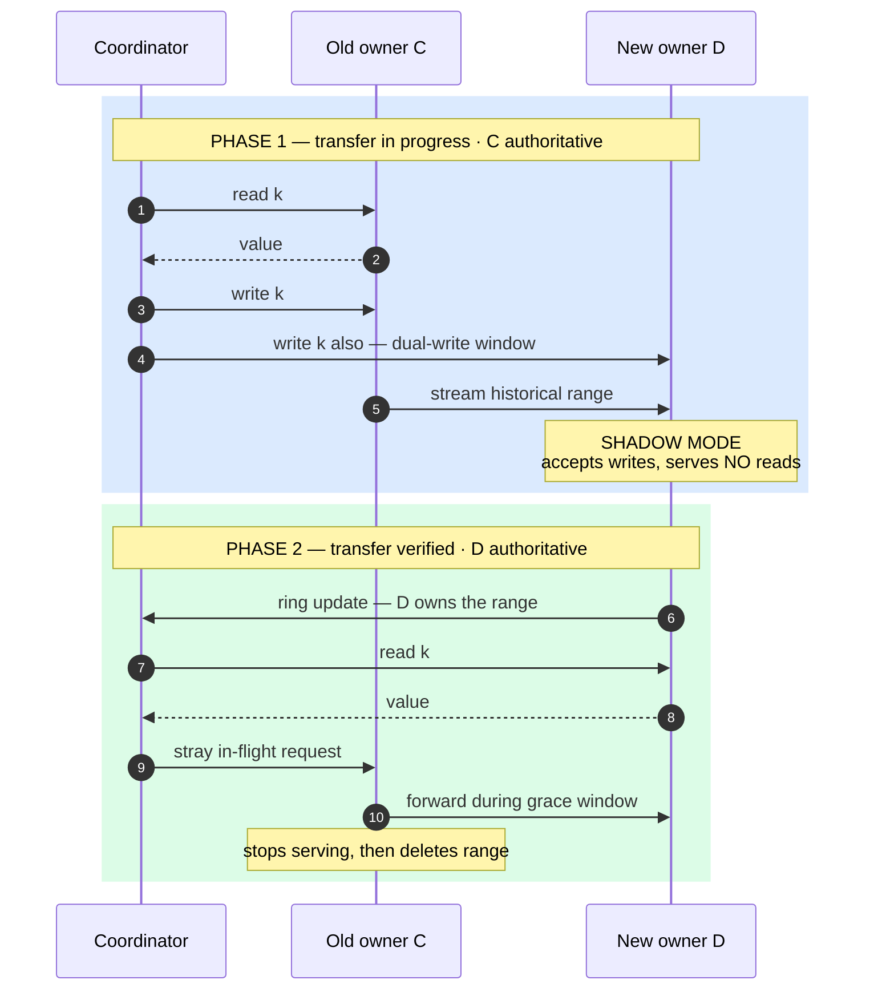
```mermaid
sequenceDiagram
    autonumber
    participant CO as Coordinator
    participant C as Old owner C
    participant D as New owner D

    rect rgb(219, 234, 254)
    Note over CO,D: PHASE 1 — transfer in progress · C authoritative
    CO->>C: read k
    C-->>CO: value
    CO->>C: write k
    CO->>D: write k also — dual-write window
    C->>D: stream historical range
    Note over D: SHADOW MODE<br/>accepts writes, serves NO reads
    end

    rect rgb(220, 252, 231)
    Note over CO,D: PHASE 2 — transfer verified · D authoritative
    D->>CO: ring update — D owns the range
    CO->>D: read k
    D-->>CO: value
    CO->>C: stray in-flight request
    C->>D: forward during grace window
    Note over C: stops serving, then deletes range
    end
```

---

## Level 5 — Replication on the Ring

### A17. Preference list and replication

To replicate data, each key is owned by a **preference list**: the primary node plus the next N-1 distinct physical nodes clockwise on the ring.

```
Ring positions: A=10, vA2=50, B=80, vB2=140, C=190, vC2=260
Key K → primary node B (at 80)
Replication factor N=3
Preference list for K: [B, vB2 (skip — same physical as B), C, A]
                     = [B, C, A] (3 distinct physical nodes)
```

**Diagram — building the preference list by walking clockwise and skipping duplicates.** Green = accepted into the list, red dashed = skipped because that vnode belongs to a machine already in the list.

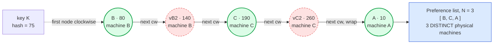
```mermaid
flowchart LR
    K["key K<br/>hash = 75"] -.->|"first node clockwise"| B

    B(("B · 80<br/>machine B")) -->|"next cw"| V1(("vB2 · 140<br/>machine B"))
    V1 -->|"next cw"| C(("C · 190<br/>machine C"))
    C -->|"next cw"| V2(("vC2 · 260<br/>machine C"))
    V2 -->|"next cw, wrap"| A(("A · 10<br/>machine A"))
    A --> R["Preference list, N = 3<br/>[ B, C, A ]<br/>3 DISTINCT physical machines"]

    classDef keep fill:#dcfce7,stroke:#16a34a,stroke-width:2px
    classDef skip fill:#fee2e2,stroke:#dc2626,stroke-dasharray: 5 3
    class B,C,A keep
    class V1,V2 skip
    style R fill:#dbeafe,stroke:#1d4ed8
```

Virtual node duplicates from the same physical machine are skipped to ensure the data is on 3 different physical servers, not 3 virtual tokens on the same machine.

Skipping matters because vnodes make same-machine collisions likely: with 256 tokens per node, the next clockwise token very often belongs to a machine you already hold. Without the skip, "RF=3" could mean three copies on one server — one power supply away from total loss for that key.

---

### A18. Quorum consistency condition

**Condition: W + R > N**

```
N = replication factor (total copies)
W = minimum replicas that must acknowledge a write before success is returned
R = minimum replicas that must respond to a read before result is returned

Strong consistency requires: W + R > N
  → At least one node overlaps between the write set and the read set
  → That overlapping node has the latest write → reads always see the latest value

Example with N=3:
  (W=2, R=2): W+R=4 > 3 ✅ Strong consistency
  (W=3, R=1): W+R=4 > 3 ✅ Strong consistency (but write latency is high)
  (W=1, R=2): W+R=3 = 3 ✗ NOT strong (no guaranteed overlap)
  (W=1, R=1): W+R=2 < 3 ✗ NOT strong (eventual consistency only)
```

**Diagram — why the inequality is really a pigeonhole argument.** Left: write set and read set must share at least one replica, so the read is guaranteed to *see* v2. Right: with W=1, R=2 the two sets can be disjoint and the read returns only stale copies.

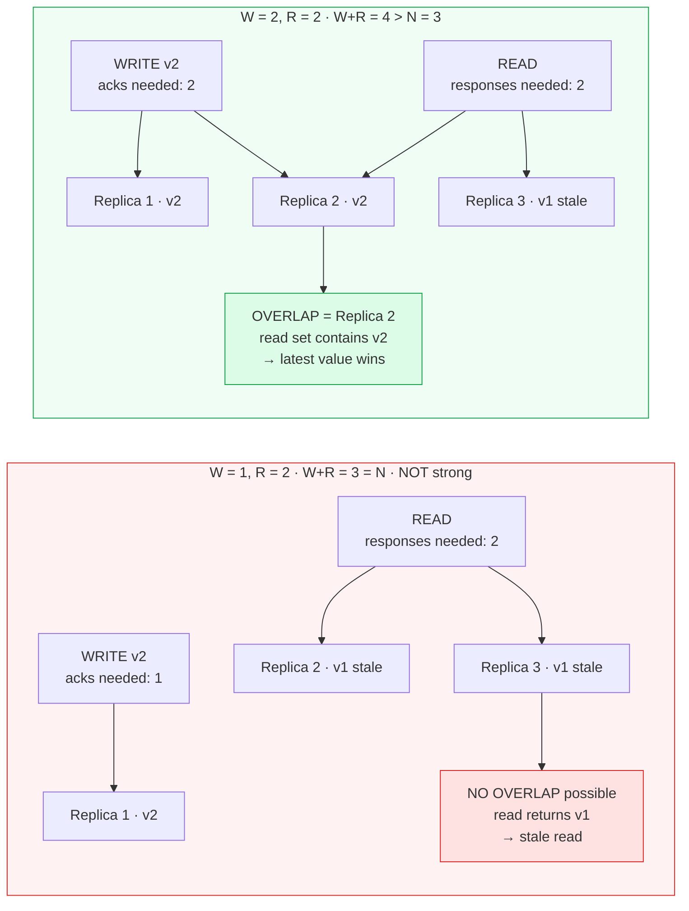
```mermaid
flowchart TD
    subgraph good["W = 2, R = 2 · W+R = 4 > N = 3"]
        direction TB
        W1["WRITE v2<br/>acks needed: 2"] --> G1["Replica 1 · v2"]
        W1 --> G2["Replica 2 · v2"]
        G3["Replica 3 · v1 stale"]
        RD1["READ<br/>responses needed: 2"] --> G2
        RD1 --> G3
        G2 --> OV["OVERLAP = Replica 2<br/>read set contains v2<br/>→ latest value wins"]
    end

    subgraph bad["W = 1, R = 2 · W+R = 3 = N · NOT strong"]
        direction TB
        W2["WRITE v2<br/>acks needed: 1"] --> B1["Replica 1 · v2"]
        B2["Replica 2 · v1 stale"]
        B3["Replica 3 · v1 stale"]
        RD2["READ<br/>responses needed: 2"] --> B2
        RD2 --> B3
        B3 --> NOV["NO OVERLAP possible<br/>read returns v1<br/>→ stale read"]
    end

    good ~~~ bad

    style good fill:#f0fdf4,stroke:#16a34a
    style bad fill:#fef2f2,stroke:#dc2626
    style OV fill:#dcfce7,stroke:#16a34a
    style NOV fill:#fee2e2,stroke:#dc2626
```

| W | R | W+R | Consistency | Use case |
|---|---|---|---|---|
| 2 | 2 | 4 | Strong | General purpose |
| 3 | 1 | 4 | Strong | Write-heavy, fast reads |
| 1 | 3 | 4 | Strong | Read-heavy, slow writes |
| 1 | 1 | 2 | Eventual | High throughput, tolerate stale reads |

---

### A19. Sloppy quorum

A **sloppy quorum** allows the coordinator to count writes to *substitute* nodes (not in the key's normal preference list) toward the write quorum when the normal nodes are unavailable.

```
Normal preference list for key K: [A, B, C]
Node B is down.

Strict quorum (W=2): must wait for B to recover. Write blocked.

Sloppy quorum (W=2): write to A and D (D is not in K's preference list but is available).
  → Write succeeds immediately.
  → D stores the write with a hint: "this belongs to B, deliver when B recovers."
```

**Diagram — the write path when a preference-list node is down.** D's ack is what makes W=2 achievable; the hint is what keeps the substitution temporary rather than permanent drift.

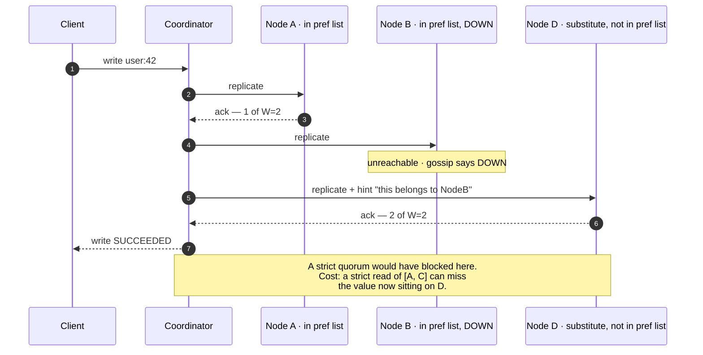
```mermaid
sequenceDiagram
    autonumber
    participant CL as Client
    participant CO as Coordinator
    participant A as Node A · in pref list
    participant B as Node B · in pref list, DOWN
    participant D as Node D · substitute, not in pref list

    CL->>CO: write user:42
    CO->>A: replicate
    A-->>CO: ack — 1 of W=2
    CO->>B: replicate
    Note over B: unreachable · gossip says DOWN
    CO->>D: replicate + hint "this belongs to NodeB"
    D-->>CO: ack — 2 of W=2
    CO-->>CL: write SUCCEEDED
    Note over CO,D: A strict quorum would have blocked here.<br/>Cost: a strict read of [A, C] can miss<br/>the value now sitting on D.
```

**Tradeoff: Availability vs Strict Consistency.** Sloppy quorum sacrifices the guarantee that the write is on the correct preference list nodes. During the window where B is down and D holds the hint, a strict quorum read to [A, C] might miss the value that was written to D. This is an explicit availability-over-consistency choice — the DynamoDB/Cassandra model.

---

### A20. Hinted handoff

When a coordinator writes to a substitute node D (due to sloppy quorum), D stores the value alongside a **hint** — metadata saying the data belongs to node B.

```json
{
  "key": "user:42",
  "value": "...",
  "hint": {
    "intended_node": "NodeB",
    "written_at": "2024-01-15T10:30:00Z"
  }
}
```

When NodeB recovers and rejoins the ring:
1. NodeD detects NodeB is alive (via gossip)
2. NodeD delivers the hinted writes to NodeB
3. NodeB integrates the data (last-write-wins or version vector merge)
4. NodeD deletes the local hint copies

**Diagram — hint delivery, and the fallback when it never happens.** The hint TTL is the reason anti-entropy repair still has to exist: hinted handoff is best-effort, repair is the backstop.

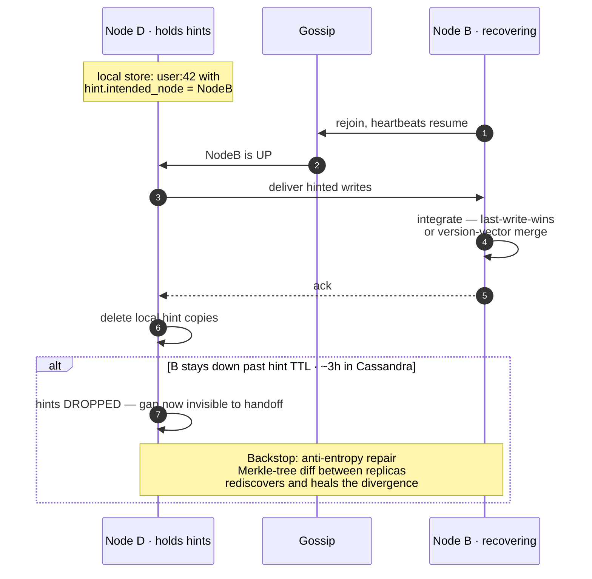
```mermaid
sequenceDiagram
    autonumber
    participant D as Node D · holds hints
    participant G as Gossip
    participant B as Node B · recovering

    Note over D: local store: user:42 with<br/>hint.intended_node = NodeB
    B->>G: rejoin, heartbeats resume
    G->>D: NodeB is UP
    D->>B: deliver hinted writes
    B->>B: integrate — last-write-wins<br/>or version-vector merge
    B-->>D: ack
    D->>D: delete local hint copies

    alt B stays down past hint TTL · ~3h in Cassandra
        D->>D: hints DROPPED — gap now invisible to handoff
        Note over D,B: Backstop: anti-entropy repair<br/>Merkle-tree diff between replicas<br/>rediscovers and heals the divergence
    end
```

If NodeB never recovers: the hints are held for a configurable window (e.g., 3 hours in Cassandra), then dropped. If durability requires it, anti-entropy (Merkle tree reconciliation) can catch the gap during repair.

---

## Level 6 — Real Systems

### A21. Cassandra tokens

In Cassandra, each virtual node is assigned a **token**: a 64-bit integer that represents its position on the hash ring (called the "token ring"). The default hash function is Murmur3.

```
cassandra.yaml:
  num_tokens: 256          # virtual nodes per physical node
  partitioner: Murmur3Partitioner

Example token assignment for a 3-node cluster with num_tokens=4:
  Node1: tokens [-9223372036854775808, -4611686018427387904, 0, 4611686018427387904]
  Node2: tokens [-6917529027641081856, -2305843009213693952, 2305843009213693952, 6917529027641081856]
  Node3: tokens [-3074457345618258602, 1537228672809129301, 3074457345618258602, 7686143364045646507]
```

Cassandra automatically assigns tokens evenly when `num_tokens > 1`. Historically (Cassandra 1.x), operators hand-calculated tokens — a painful process that vnodes eliminated.

**Company reference:** Cassandra was open-sourced by Facebook in 2008 and later became an Apache project. Instagram ran Cassandra at massive scale for their activity feeds. The token ring is how they scaled writes to billions of users without a master coordinator.

---

### A22. DynamoDB and the Dynamo paper

Amazon's 2007 Dynamo paper is the source document for many of these concepts. Key failure-handling mechanisms:

```
Challenge: A node fails. Its key range must remain available.

Dynamo's solution — combination of:

1. Sloppy quorum: writes redirect to alternate nodes during failure.
   → Availability maintained; data still written somewhere durable.

2. Hinted handoff: substitute node stores hints for the failed node.
   → Once failed node recovers, it receives the missed writes.

3. Anti-entropy via Merkle trees: background process compares
   data between replicas and repairs divergence.
   → Eventual consistency is achieved even after extended failures.

4. Vector clocks for conflict resolution: each version of a value
   carries a vector clock [nodeId: version] to detect and reconcile
   concurrent writes.
```

**Diagram — the four mechanisms are one pipeline, not four options.** Each handles a longer failure horizon than the one before it: seconds → hours → days → "we diverged and must merge".

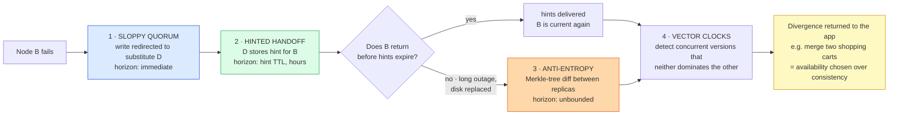
```mermaid
flowchart LR
    F["Node B fails"] --> SQ["1 · SLOPPY QUORUM<br/>write redirected to substitute D<br/>horizon: immediate"]
    SQ --> HH["2 · HINTED HANDOFF<br/>D stores hint for B<br/>horizon: hint TTL, hours"]
    HH --> Q{"Does B return<br/>before hints expire?"}

    Q -->|yes| DEL["hints delivered<br/>B is current again"]
    Q -->|"no · long outage,<br/>disk replaced"| AE["3 · ANTI-ENTROPY<br/>Merkle-tree diff between replicas<br/>horizon: unbounded"]

    DEL --> VC["4 · VECTOR CLOCKS<br/>detect concurrent versions that<br/>neither dominates the other"]
    AE --> VC
    VC --> APP["Divergence returned to the app<br/>e.g. merge two shopping carts<br/>= availability chosen over consistency"]

    style SQ fill:#dbeafe,stroke:#1d4ed8
    style HH fill:#dcfce7,stroke:#16a34a
    style AE fill:#fed7aa,stroke:#ea580c
    style APP fill:#fef9c3,stroke:#ca8a04
```

**Tradeoff: Availability vs Strict Consistency (the Dynamo Choice).** Amazon explicitly chose availability over consistency for Dynamo. The shopping cart must never fail to add an item even if a node is down. Occasional divergent versions (two users added items to the same cart in a partition) are resolved at read time by returning both versions and asking the application to reconcile. This is the CAP theorem made concrete.

---

### A23. Redis Cluster — hash slots, not a ring

Redis Cluster does not use a continuous hash ring. It uses **16,384 hash slots**:

```
key → CRC16(key) % 16384 → slot number (0–16383)

Each node owns a contiguous range of slots:
  Node1: slots 0–5460
  Node2: slots 5461–10922
  Node3: slots 10923–16383
```

**Diagram — slots are a fixed indirection layer between key and node.** The key→slot map never changes; only the slot→node map does. That is exactly what makes a migration an explicit, auditable operation.

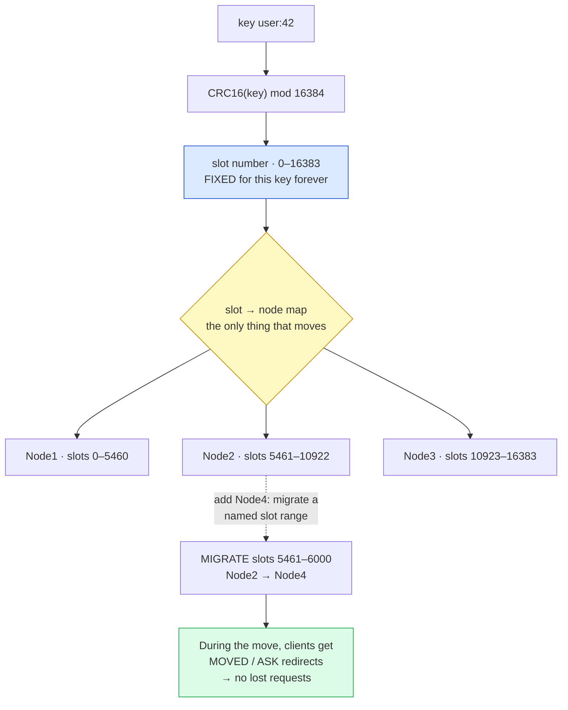
```mermaid
flowchart TD
    K["key user:42"] --> H["CRC16(key) mod 16384"]
    H --> S["slot number · 0–16383<br/>FIXED for this key forever"]
    S --> MAP{"slot → node map<br/>the only thing that moves"}

    MAP --> N1["Node1 · slots 0–5460"]
    MAP --> N2["Node2 · slots 5461–10922"]
    MAP --> N3["Node3 · slots 10923–16383"]

    N2 -.->|"add Node4: migrate a<br/>named slot range"| MIG["MIGRATE slots 5461–6000<br/>Node2 → Node4"]
    MIG --> RED["During the move, clients get<br/>MOVED / ASK redirects<br/>→ no lost requests"]

    style S fill:#dbeafe,stroke:#1d4ed8
    style MAP fill:#fef9c3,stroke:#ca8a04
    style RED fill:#dcfce7,stroke:#16a34a
```

**Why 16,384 and not a ring?**

| Feature | Traditional Ring | Redis Cluster Hash Slots |
|---|---|---|
| Slot assignment | Continuous, fraction-based | Discrete, fixed 16,384 slots |
| Node rebalancing | Move fraction of key range | Migrate specific slot sets |
| Configuration overhead | Low (automatic positions) | Explicit slot assignment |
| Cluster size | Scales to hundreds of nodes | Practical max ~1,000 nodes (gossip payload limit) |
| Cluster state size | Proportional to vnodes | Fixed ~8KB regardless of key count |

**Tradeoff: Operational Explicitness vs Automatic Rebalancing.** Redis Cluster's hash slots give operators explicit control over which data lives where. Moving slot 5000 from Node1 to Node2 is a concrete, auditable operation. In a Cassandra ring, token reassignment is implicit and harder to predict. Redis chose explicitness because its primary use case (cache + session store) demands operational predictability over fully automated rebalancing.

---

### A24. CDN routing with consistent hashing

Akamai and other CDN providers use consistent hashing to map incoming HTTP requests (by URL or cache key) to specific edge servers:

```
Incoming request URL: https://cdn.example.com/images/logo.png
Cache key: hash("/images/logo.png") → position 183 on ring
Ring contains: EdgeServer1=20, EdgeServer2=95, EdgeServer3=200, ...
→ Route request to EdgeServer3 (nearest clockwise from 183)
```

**Why consistent hashing is valuable here:**

```
Traditional round-robin or random: same URL may go to Edge1 one request, Edge4 the next.
→ No cache affinity → every edge server caches every URL separately → cache duplication

Consistent hashing: same URL always goes to the same edge server (unless topology changes).
→ Cache affinity → that server accumulates the cached file → cache hit rate much higher
→ When an edge server is added/removed: only its URL range is affected
```

**Diagram — the same object requested three times, under both routing schemes.** The metric that changes is origin egress: N copies cached means N origin fetches and N× the storage for one object.

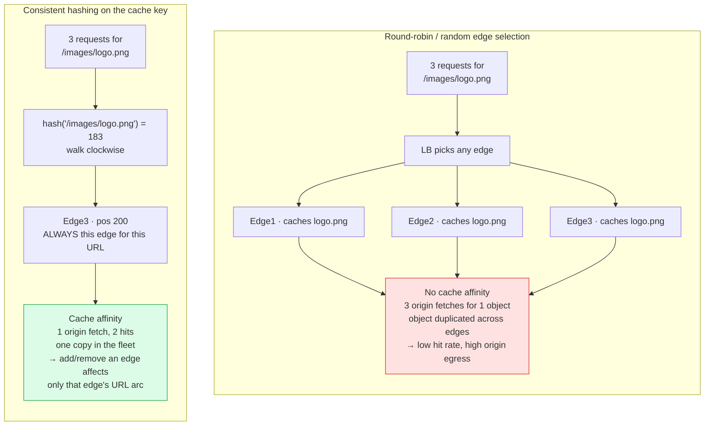
```mermaid
flowchart TD
    subgraph rr["Round-robin / random edge selection"]
        direction TB
        U1["3 requests for<br/>/images/logo.png"] --> LB["LB picks any edge"]
        LB --> E1["Edge1 · caches logo.png"]
        LB --> E2["Edge2 · caches logo.png"]
        LB --> E3["Edge3 · caches logo.png"]
        E1 --> DUP["No cache affinity<br/>3 origin fetches for 1 object<br/>object duplicated across edges<br/>→ low hit rate, high origin egress"]
        E2 --> DUP
        E3 --> DUP
    end

    subgraph ch["Consistent hashing on the cache key"]
        direction TB
        U2["3 requests for<br/>/images/logo.png"] --> HR["hash('/images/logo.png') = 183<br/>walk clockwise"]
        HR --> E33["Edge3 · pos 200<br/>ALWAYS this edge for this URL"]
        E33 --> AFF["Cache affinity<br/>1 origin fetch, 2 hits<br/>one copy in the fleet<br/>→ add/remove an edge affects<br/>only that edge's URL arc"]
    end

    style DUP fill:#fee2e2,stroke:#dc2626
    style AFF fill:#dcfce7,stroke:#16a34a
```

**CDN-specific concern:** Consistent hashing provides cache affinity for reads. For writes (cache invalidation), all edge servers holding the content must be invalidated — CDNs use a separate invalidation broadcast mechanism, not the ring.

---

## Level 7 — Failure Modes and Edge Cases

### A25. Why consistent hashing does not solve hot keys

Consistent hashing distributes **keys** evenly across nodes. But if one key receives 10,000 requests/sec while all others receive 10 requests/sec, that one key's node is still overwhelmed regardless of ring topology.

```
Example: celebrity user_id=1 is mentioned in 1M posts in 1 hour.
hash("user:1") → Node C handles all 1M cache lookups.
Consistent hashing has no mechanism to distribute load for a single key.
```

**Diagram — determinism is the feature and the problem.** Consistent hashing guarantees the same key always resolves to the same node; a hot key turns that guarantee into a funnel.

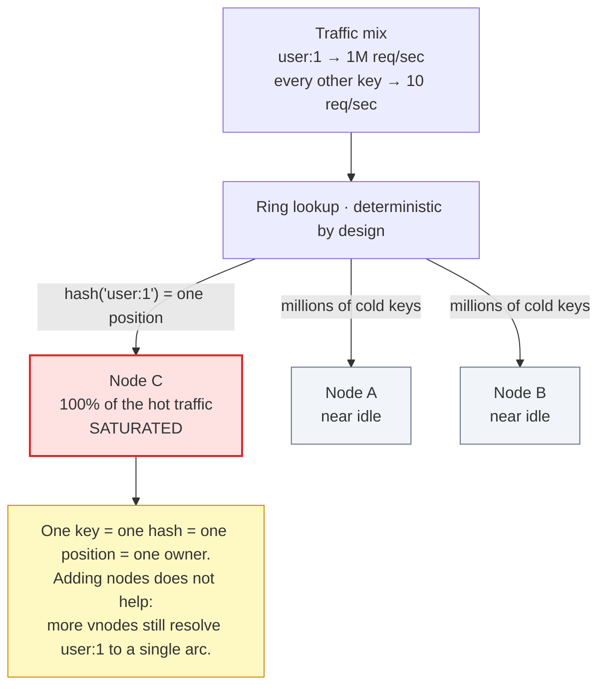
```mermaid
flowchart TD
    T["Traffic mix<br/>user:1 → 1M req/sec<br/>every other key → 10 req/sec"]
    T --> R["Ring lookup · deterministic by design"]

    R -->|"hash('user:1') = one position"| C["Node C<br/>100% of the hot traffic<br/>SATURATED"]
    R -->|"millions of cold keys"| A["Node A<br/>near idle"]
    R -->|"millions of cold keys"| B["Node B<br/>near idle"]

    C --> WHY["One key = one hash = one position = one owner.<br/>Adding nodes does not help:<br/>more vnodes still resolve user:1 to a single arc."]

    style C fill:#fee2e2,stroke:#dc2626,stroke-width:2px
    style A fill:#f1f5f9,stroke:#64748b
    style B fill:#f1f5f9,stroke:#64748b
    style WHY fill:#fef9c3,stroke:#ca8a04
```

| Problem | What Consistent Hashing Fixes | What It Does Not Fix |
|---|---|---|
| Key distribution | Spreads key space evenly | Uneven access frequency per key |
| Node imbalance | Vnodes ensure roughly equal key counts | One popular key can still overload a node |
| Hotspot from topology | Random positions avoid systematic hot spots | Access pattern hot spots are independent |

**Tradeoff: Key Distribution vs Access Pattern Distribution.** Consistent hashing solves structural distribution. Hot keys require a separate strategy: read replicas for that specific key, a local in-process cache layer, or key splitting (shard the hot key itself into K sub-keys with a suffix: `user:1:shard:3`).

---

### A26. Heterogeneous nodes and weighted virtual nodes

If a 32GB node and a 128GB node both have 256 vnodes, they serve equal fractions of the key space — but the 32GB node will be overloaded and the 128GB node will be underutilized.

```
Solution: assign virtual nodes proportional to capacity.

32GB node:  128 vnodes  (1x weight)
128GB node: 512 vnodes  (4x weight)

Resulting key distribution:
  32GB node:  128 / (128+512) = 20% of keys
  128GB node: 512 / (128+512) = 80% of keys
```

**Diagram — vnode count is the weight dial.** Equal vnodes on unequal hardware gives 50/50 key share, which overloads the small node at 32GB while the large node idles. Proportional vnodes align key share with capacity.

```mermaid
pie showData title Key share with weighted vnodes — matches the 1:4 capacity ratio
    "32GB node · 128 vnodes · 20% of keys" : 128
    "128GB node · 512 vnodes · 80% of keys" : 512
```

This matches the relative memory capacity (1:4 ratio). Cassandra supports this via the `cassandra.yaml` `initial_token` override or through the `allocate_tokens_for_keyspace` option.

Caveat worth naming in an interview: this balances *key share*, which tracks storage and memory well. It does not balance request rate — if the small node happens to own the hotter 20% of keys, weighting by capacity alone will not save it.

---

### A27. Ring oscillation

Ring oscillation occurs when a node repeatedly joins and leaves the ring in rapid succession, causing the cluster to continuously rebalance:

```
Timeline:
  T=0:  NodeB declared dead (gossip timeout)
  T=5s: Ring rebalances → NodeC takes NodeB's key ranges + streams data
  T=8s: NodeB comes back online (was temporarily partitioned)
  T=8s: NodeB rejoins → Ring rebalances again → NodeB reclaims its ranges
  T=9s: NodeB disappears again (flapping)
  ...
```

**Diagram — the cycle that never settles.** Every arrow out of `Dead` or back into `Up` costs a full data-streaming round. The loop is self-sustaining because the streaming load itself makes heartbeats more likely to be missed.

```mermaid
stateDiagram-v2
    [*] --> Up
    Up --> Suspected: heartbeats missed
    Suspected --> Up: heartbeat resumes in time
    Suspected --> Dead: phi score past threshold
    Dead --> Rebalancing: ring updated, successors take arcs
    Rebalancing --> Rejoining: NodeB returns, was only partitioned
    Rejoining --> Up: reclaims arcs, streams data AGAIN
    note right of Up
        back to Up closes the loop:
        the next missed heartbeat
        starts the whole lap again
    end note

    note right of Rebalancing
        each lap costs:
        data streaming both ways
        gossip storm
        coordinator churn
        streaming load makes the
        next missed heartbeat likelier
    end note
```

Each oscillation triggers data streaming, gossip propagation, and cluster state changes — burning CPU, network bandwidth, and coordinator capacity. Detection is hard because each individual event looks like a normal join/leave.

**Tradeoff: Fast Recovery vs Oscillation Stability.** Shorter gossip failure detection timeouts recover faster from genuine failures but trigger oscillation more easily with flapping nodes. Cassandra's phi accrual failure detector addresses this by using a continuous score rather than a binary up/down threshold — a node must be consistently unresponsive before being declared dead.

---

### A28. Biased hash function: symptoms and detection

```
Normal distribution: keys scattered uniformly 0–359 on ring
Biased distribution: 70% of keys hash to positions 0–110 (one arc)

Observable symptoms:
  1. One or two nodes consistently have 3–5x higher memory usage than others
     (those nodes own the dense arc of the ring)
  2. One or two nodes have 3–5x higher request rate than others
     (hot nodes receive disproportionate key count AND request count)

Detection methods:
  1. Plot token-to-token distribution: each node should own ~(1/N * 100)% of the ring.
     A biased hash shows one node owning 40–60% while others own <10%.
  2. Monitor per-node key count and request rate. Ratio > 2x between nodes
     with same vnode count signals a distribution problem.
```

**Fix:** Replace the hash function (Murmur3 and xxHash have excellent uniformity; MD5 and CRC32 are weaker). If changing the hash function, all keys must be remapped — treat it as a full migration.

---

## Level 8 — Architect-Level Tradeoffs

### A29. Consistent hashing vs range-based sharding

**Tradeoff: Random Distribution vs Ordered Access**

| Feature | Consistent Hashing | Range-Based Sharding |
|---|---|---|
| Data distribution | Random (uniform) | Ordered (by key range) |
| Range queries | Not efficient (keys scattered) | Efficient (keys in shard are adjacent) |
| Hotspot resistance | Strong (random placement avoids sequential hot spots) | Weak (sequential keys → one shard gets all writes) |
| Rebalance complexity | Automatic via vnodes | Manual or semi-automatic split/merge |
| Use case fit | Key-value, cache, session store | Time-series, sorted data, range scans |

**Diagram — one time-range query under both schemes.** The two failure modes are mirror images: hashing scatters the scan, range sharding concentrates the writes.

```mermaid
flowchart TD
    Q["Query: all events between<br/>09:00 and 09:04"]

    Q --> HS
    Q --> RS

    subgraph HS["Consistent hashing on the timestamp key"]
        direction TB
        H1["09:00 → Node C"]
        H2["09:01 → Node A"]
        H3["09:02 → Node B"]
        H4["09:03 → Node A"]
        H5["09:04 → Node C"]
        HV["Read: scatter-gather across ALL nodes<br/>slowest node sets latency<br/>Write: today's events spread evenly<br/>→ no write hotspot"]
        H1 --> HV
        H2 --> HV
        H3 --> HV
        H4 --> HV
        H5 --> HV
    end

    subgraph RS["Range sharding on the timestamp"]
        direction TB
        R1["09:00–09:59<br/>ALL rows adjacent on Shard 2"]
        RV["Read: one sequential scan, one shard<br/>Write: every current write lands<br/>on Shard 2 → HOTSPOT<br/>and Shards 0–1 sit idle"]
        R1 --> RV
    end

    style HV fill:#fef9c3,stroke:#ca8a04
    style RV fill:#fef9c3,stroke:#ca8a04
```

**Choose consistent hashing when:** you need to look up individual keys by ID with no range queries (user profile cache, session store, DynamoDB key-value access).

**Choose range-based sharding when:** you need to scan a range of keys (time-series queries, leaderboard scans, ordered message logs). HBase, Bigtable, CockroachDB, and Spanner use range-based sharding for exactly this reason.

---

### A30. Jump consistent hash

Jump consistent hash (Google, 2014) is a minimal perfect hash function that maps a key to a bucket (node index) in O(1) time and O(1) space:

```python
def jump_consistent_hash(key: int, num_buckets: int) -> int:
    b, j = -1, 0
    while j < num_buckets:
        b = j
        key = ((key * 2862933555777941757) + 1) & 0xFFFFFFFFFFFFFFFF
        j = int((b + 1) * (1 << 31) / ((key >> 33) + 1))
    return b
```

| Property | Ring-Based Consistent Hashing | Jump Consistent Hash |
|---|---|---|
| Time complexity | O(log n) for lookup (binary search on ring) | O(log n) iterations but O(1) in practice |
| Space complexity | O(n × vnodes) for ring structure | O(1) — no ring structure stored |
| Node removal | Supported (clockwise successor takes over) | **Not supported** — nodes must be removed from the end only |
| Arbitrary node weights | Supported via vnode count | Not supported |
| Best use case | General distributed storage with any join/leave | Stateless routing where nodes are added/removed by index only |

**Key limitation:** Jump consistent hash requires that buckets be numbered 0 to N-1 and that removals happen at the end (node N-1 is removed, not arbitrary nodes). This makes it unsuitable for systems where specific nodes fail (you can't control which index fails).

---

### A31. Zero-downtime migration from modulo to consistent hashing

```
Phase 1 — Dual-read setup (shadow mode):
  1. Deploy code that knows BOTH the old (modulo) and new (consistent hash) node addresses.
  2. All reads: try consistent hash node first. On miss, fall back to modulo node.
  3. All writes: write to BOTH systems simultaneously (dual-write).
  Duration: run for TTL + buffer to let old cache entries expire naturally.

Phase 2 — Consistent hash takes over:
  4. Disable modulo fallback reads (consistent hash is now fully populated).
  5. Disable dual-writes (write to consistent hash only).

Phase 3 — Cleanup:
  6. Decommission old modulo-based routing code.
  7. Old nodes can be repurposed or decommissioned.
```

**Diagram — the read and write paths during Phase 1.** The read fallback is what makes the migration invisible: a miss on the new ring is a miss, not an error, and serving it also warms the new ring.

```mermaid
flowchart TD
    subgraph P1["PHASE 1 — dual-write + read-through fallback"]
        direction TB
        RQ["READ k"] --> CH{"ring node has k?"}
        CH -->|HIT| SV["serve from ring node"]
        CH -->|MISS| MOD["read from modulo node"]
        MOD --> FILL["serve to client<br/>AND populate ring node<br/>→ ring warms as traffic flows"]

        WQ["WRITE k"] --> BOTH["write to BOTH:<br/>modulo node + ring node<br/>keeps both systems current"]
    end

    P1 ==>|"hold for at least cache TTL + buffer<br/>so cold keys either expire or get read once"| P2

    subgraph P2["PHASE 2 — cutover, one flag at a time"]
        direction TB
        S1["disable modulo fallback reads<br/>ring is now authoritative"] --> S2["disable dual-writes<br/>ring only"]
    end

    P2 --> P3["PHASE 3 — delete modulo routing code<br/>decommission or repurpose old nodes"]

    style FILL fill:#dcfce7,stroke:#16a34a
    style P3 fill:#dbeafe,stroke:#1d4ed8
```

**Key risk:** During Phase 1, a write goes to both systems but a read hits the consistent hash node (which may not have old data yet). The modulo fallback handles this. Any key that has been read at least once will be populated in the new system.

Rollback is the reason the flags are separated: while dual-writes are still on, reverting reads to the modulo path is a config change, not a data recovery exercise.

---

### A32. Three follow-up questions when "shard by user_id" is proposed

```
1. "What is the access pattern — read-heavy, write-heavy, or both?"
   → Determines if you need read replicas, quorum configuration, and consistency level.

2. "Do you need range queries or only point lookups by user_id?"
   → Point lookups: consistent hashing is a great fit.
   → Range queries (give me all users created between X and Y): use range-based sharding.

3. "What is your resharding strategy — will the cluster grow, and how?"
   → If adding nodes is infrequent and planned: consistent hashing handles it gracefully.
   → If the cluster is fixed-size and never changes: even modulo hashing is fine.
   → If the cluster grows non-uniformly (some nodes replaced by larger machines): 
     weighted virtual nodes need to be in the design.
```

---

## Bonus — Senior Questions

### AB1. 100x hot user_id

Consistent hashing cannot help here — all `user:1` requests are intentionally on one node. Options:

```
Option 1: In-process cache layer (L1 cache before Redis/Memcached)
  Each API server holds a local LRU cache for the hottest keys.
  user:1's data is served from memory on the API server itself.
  Cache invalidation: TTL-based (1-5 seconds acceptable for a hot user profile).

Option 2: Key splitting / sharding the hot key
  user:1 → split into user:1:shard:0, user:1:shard:1, ... user:1:shard:9
  Write fan-out: writes go to all shards.
  Read fan-out: reads pick a shard at random (or by request_id % 10).
  Distributes the read load across 10 nodes.

Option 3: Read replica for that specific key
  Dedicate 2–3 cache nodes as read replicas for identified hot keys.
  Coordinator routes hot key reads round-robin across replicas.
```

**Diagram — three ways to break the funnel, each paying with a different currency.** Read the leaf labels as the price tag: staleness, write amplification, or dedicated hardware.

```mermaid
flowchart LR
    HK["user:1 — 100x traffic<br/>ring cannot spread a single key"]

    HK --> O1["OPTION 1 · L1 in-process cache<br/>LRU on every API server<br/>hot key served from local RAM"]
    HK --> O2["OPTION 2 · key splitting<br/>user:1:shard:0 … :9<br/>write fan-out to all 10<br/>read picks one · request_id mod 10"]
    HK --> O3["OPTION 3 · dedicated read replicas<br/>2–3 nodes for identified hot keys<br/>coordinator round-robins reads"]

    O1 --> C1["PRICE: staleness up to TTL<br/>1–5s · fine for a profile blob<br/>no extra writes"]
    O2 --> C2["PRICE: 10x write amplification<br/>reads stay consistent<br/>needs hot-key detection logic"]
    O3 --> C3["PRICE: replication lag +<br/>dedicated capacity<br/>needs a hot-key registry"]

    style HK fill:#fee2e2,stroke:#dc2626
    style C1 fill:#fef9c3,stroke:#ca8a04
    style C2 fill:#fef9c3,stroke:#ca8a04
    style C3 fill:#fef9c3,stroke:#ca8a04
```

| Option | Write overhead | Read distribution | Staleness |
|---|---|---|---|
| L1 local cache | None | Per-server (good) | Up to TTL |
| Key splitting | Fan-out to N shards | Across N nodes | Consistent |
| Dedicated replicas | Replicate to N replicas | Across N nodes | Replication lag |

---

### AB2. Single key exceeds one node's capacity

No sharding technique can store a single key across multiple nodes in a standard key-value model. Options require changing the data model:

```
Option 1: Decompose the value
  Instead of one large value, split the value into chunks stored under separate keys.
  user:1:profile:page:0, user:1:profile:page:1, ...
  Read: fetch and assemble all pages.

Option 2: Use a DB natively designed for large values
  Redis supports string values up to 512MB; Cassandra supports blobs.
  But the hot key problem still applies to the node owning that key.

Option 3: Move large values to blob storage (S3/GCS)
  The cache key stores only a pointer (URL/metadata) to the blob.
  Large data is served from CDN/object storage, not the cache node.
  This is the standard pattern for large objects (images, documents).
```

---

### AB3. Increasing replication factor from 2 to 3

```
Step 1 — Update RF in cluster configuration:
  ALTER KEYSPACE mykeyspace WITH REPLICATION = {'class': 'NetworkTopologyStrategy', 'dc1': 3};

Step 2 — Run nodetool repair:
  This triggers Cassandra's anti-entropy mechanism to stream the missing 3rd replica.
  Run repair on each node: nodetool repair mykeyspace

Step 3 — Verify replication:
  Monitor streaming progress in nodetool tpstats and system logs.
  Confirm each node shows 3 replicas for a test key.

Risks:
  - Repair generates heavy streaming traffic → run during low-traffic window
  - If a node fails during repair: those key ranges temporarily have only 1 copy
  - Do not do this during a peak traffic period
```

---

### AB4. Cache vs database sharding with consistent hashing

| Aspect | Cache (Memcached, Redis) | Database (Cassandra, DynamoDB) |
|---|---|---|
| On node failure | Data loss acceptable (cache miss, DB fallback) | Data loss not acceptable → replication is mandatory |
| Replication factor | Often 1 (cache is ephemeral) | 3+ (data is durable) |
| On ring rebalance | Keys are simply missing until repopulated | Data must be streamed before new node serves traffic |
| Quorum | Not applicable (single copy, no quorum) | W + R > N required for consistency |
| Hot key impact | Cache miss → DB hit → refill | Hot key → node overload → cascading writes |

The fundamental difference: cache data loss is recoverable (fetch from the source and refill). Database data loss is potentially permanent. This makes replication factor, quorum, and repair essential for databases but optional for caches.

---

## Algorithm Decision Guide — Quick Reference

### Which Sharding Approach?

| Situation | Best Choice | Reason |
|---|---|---|
| Point lookups by key ID | Consistent hashing | Uniform distribution, O(log n) lookup |
| Range queries (time-series, sorted data) | Range-based sharding | Adjacent keys on same shard, efficient scans |
| Fixed cluster size | Modulo hashing | Simpler, zero overhead |
| Cluster grows frequently | Consistent hashing + vnodes | Minimal disruption on every topology change |
| Heterogeneous hardware | Consistent hashing with weighted vnodes | Match load to node capacity |
| Stateless routing, no arbitrary node removal | Jump consistent hash | O(1) space, no ring metadata |

### Which Quorum Configuration (N, W, R)?

| Use Case | Configuration | Tradeoff |
|---|---|---|
| Strong consistency, general | N=3, W=2, R=2 | Balanced latency and durability |
| Write-heavy, fast reads | N=3, W=2, R=1 | Fast reads, 2-node write ack |
| Read-heavy, slow writes tolerable | N=3, W=3, R=1 | Maximum read speed, slow writes |
| Maximum availability (eventual) | N=3, W=1, R=1 | Best availability, no consistency |
| Latency-critical, tolerate stale reads | N=3, W=1, R=2 | Fast writes, near-consistent reads |

### Quick Recall Cheat Sheet

| Concept | One-Line Recall |
|---|---|
| Modulo hashing failure | (N-1)/N keys remapped on every node change → thundering herd |
| Hash ring fix | hash both keys and nodes to same space; clockwise routing → only 1/N keys move |
| Virtual nodes purpose | Multiple ring positions per physical node → statistical load balance |
| Cassandra default vnodes | 256 per node; Murmur3 hash function |
| 1/N disruption guarantee | Only keys in the new node's clockwise predecessor range move |
| Preference list | Primary node + next N-1 distinct physical nodes clockwise |
| Quorum condition | W + R > N guarantees strong consistency |
| Sloppy quorum | Write to substitute node when preferred node is down → higher availability |
| Hinted handoff | Substitute node holds hint until original recovers and delivers it |
| Redis Cluster difference | 16,384 hash slots, not a ring; explicit slot assignment per node |
| Jump consistent hash | O(1) space; no arbitrary node removal |
| Range vs hash sharding | Hash = uniform distribution; Range = ordered access for scans |
| Hot key fix | L1 local cache + key splitting (user:1:shard:N) |
| Weighted vnodes | More vnodes on larger nodes to proportionally assign key range |
| Ring oscillation | Flapping node causes repeated rebalances; phi accrual detector mitigates it |
| Biased hash detection | Check per-node key count ratio; ratio > 2x with same vnode count = bias |
| Failure without RF | Dead node's keys are unavailable; cache miss → DB fallback; database = data loss |
| CF vs RF=3 crash behavior | Cache: miss and refill. DB: replicas take over, repair on recovery |
| Migration strategy | Dual-read + dual-write during transition window; disable fallback after TTL |
