# Deep Dive: Consistent Hashing

> Three reading depths per section:
> - 🟢 **Beginner** — intuitive analogies, no jargon
> - 🟡 **Senior** — implementation mechanics, code, tradeoff tables
> - 🔴 **Architect** — failure modes, capacity math, production decisions

---

## Table of Contents

1. [The Core Problem: Why Modulo Hashing Collapses](#1-the-core-problem-why-modulo-hashing-collapses)
2. [The Hash Ring: Consistent Hashing Fundamentals](#2-the-hash-ring-consistent-hashing-fundamentals)
3. [Virtual Nodes: Solving Hotspots at Scale](#3-virtual-nodes-solving-hotspots-at-scale)
4. [Node Join: Adding Capacity to a Live Ring](#4-node-join-adding-capacity-to-a-live-ring)
5. [Node Departure: Graceful and Ungraceful Exits](#5-node-departure-graceful-and-ungraceful-exits)
6. [Replication on the Ring: Preference Lists and Quorums](#6-replication-on-the-ring-preference-lists-and-quorums)
7. [Sloppy Quorum and Hinted Handoff](#7-sloppy-quorum-and-hinted-handoff)
8. [Data Migration During Ring Changes](#8-data-migration-during-ring-changes)
9. [Consistent Hashing as a Load Balancer](#9-consistent-hashing-as-a-load-balancer)
10. [Gossip Protocol: Ring Membership Without a Master](#10-gossip-protocol-ring-membership-without-a-master)
11. [Consistent Hashing vs Range-Based Sharding](#11-consistent-hashing-vs-range-based-sharding)
12. [Jump Consistent Hash: A Linear-Time Alternative](#12-jump-consistent-hash-a-linear-time-alternative)
13. [Hot Keys and Weighted Nodes](#13-hot-keys-and-weighted-nodes)
14. [Failure Modes: What Breaks at Scale](#14-failure-modes-what-breaks-at-scale)
15. [Observability: Monitoring a Hash Ring in Production](#15-observability-monitoring-a-hash-ring-in-production)
16. [Real-World Company Implementations](#16-real-world-company-implementations)
17. [Pattern Recognition — When and How to Use Consistent Hashing](#17-pattern-recognition--when-and-how-to-use-consistent-hashing)
18. [Quick Recall Cheat Sheet](#quick-recall-cheat-sheet)

---

## 1. The Core Problem: Why Modulo Hashing Collapses

### 🟢 Beginner — The Rotating Shift Rota Analogy

Imagine a call center with 4 agents. You assign each incoming call to `call_id % 4` to decide which agent handles it. Every caller knows which agent they'll get, and agents build context on their regular callers.

Now the company hires a 5th agent. Suddenly `call_id % 5` assigns almost every caller to a completely different agent. All built-up context is lost. The new agent has no idea who these callers are. The old agents are flooded with unfamiliar callers too. Everything resets.

Consistent hashing is the scheduling system where adding one agent only reassigns that agent's new callers — everyone else keeps their existing agent.

---

### 🟡 Senior — The Math of Mass Remapping

The root cause is that **the node count is inside the formula.** The key's hash never changes — but the divisor does, so the answer changes with it:

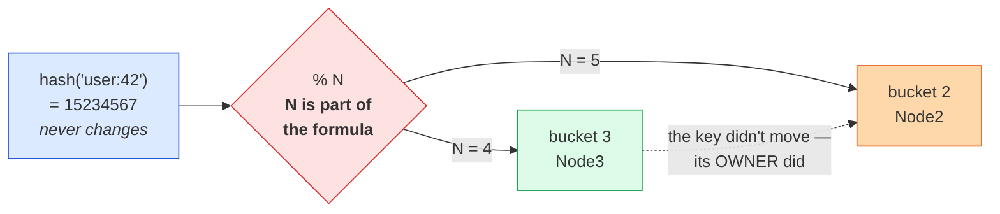

A key keeps its owner only in the rare case that `hash % N` and `hash % (N+1)` happen to agree — probability ≈ `1/(N+1)`. So the fraction that **must** move is ≈ `N/(N+1)`:

| Cluster Size Change | Keys That Must Move |
|---|---|
| 4 → 5 | ~80% |
| 9 → 10 | ~90% |
| 99 → 100 | ~99% |

When 80% of keys move to new nodes that have no data yet, every request is a cache miss. Those misses all fall through to the database simultaneously — a thundering herd attack on your own infrastructure.

---

### 🔴 Architect — Calculating the Blast Radius

Before adding a node to a modulo-hashed cluster, calculate what hits the database:

```
Cluster: 10 nodes, 50M cached keys, 200k reads/sec
Add 1 node: (10/11) = 90.9% of keys remap

Cache misses from remap = 50M × 0.909 = 45.5M keys instantly uncached
Assuming 50% hit rate in steady state: 100k req/sec to DB normally
After remap: all 200k reads/sec → DB for uncached keys

DB capacity: 30k queries/sec
→ 200k/30k = 6.7x overload → DB crashes

Recovery time: depends on DB query rate and cache TTL
  If TTL = 60s and DB serves 30k QPS: 200k keys repopulated per minute
  At 45.5M keys: 45.5M / 200k per min = ~227 minutes to refill
  → 3+ hour cascading outage from adding one cache node
```

This calculation is what you do in a design review before any topology change on a modulo-hashed system.

---

## 2. The Hash Ring: Consistent Hashing Fundamentals

### 🟢 Beginner — The Circular Seating Chart

Imagine a circular table at a restaurant. Each waiter is assigned a section — a range of seat numbers going clockwise around the table. When a customer sits down, they look clockwise for the nearest waiter's section boundary and that waiter serves them.

A new waiter joins and takes a section between seats 45 and 90. Only customers in that range change waiters. Everyone else keeps their existing waiter. The circular arrangement ensures there are no "edge" seats that don't belong to anyone.

---

### 🟡 Senior — Ring Mechanics

**The whole data structure is one sorted list of numbers.** Node positions are hashed onto the ring and kept in sorted order; a lookup is a binary search for the next position clockwise, wrapping at the top.

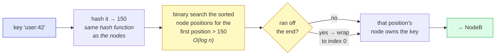

The wrap is the only special case, and it's why the space is a **ring**: without it, keys hashing above the highest node position would have no owner.

Three nodes on the ring, one position each, and the arcs they own:

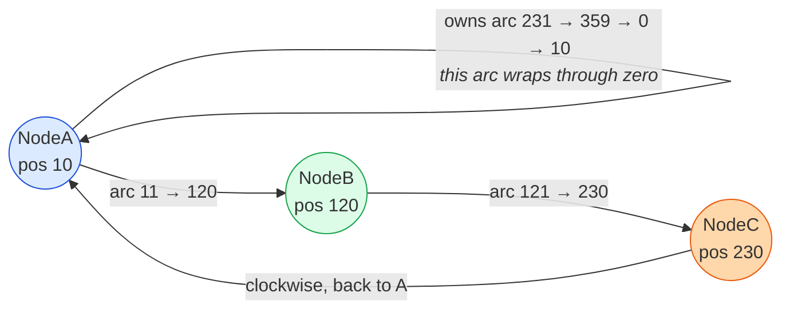

Each node owns the arc that **ends** at its own position. Note what that means with real hash values: measured over 30,000 keys on three nodes placed once each, the split came out **29,176 / 685 / 139** — one node holding 97% of the keyspace. That isn't a bug, it's three random points on a circle, and it's the entire motivation for virtual nodes below.

Adding a 4th node moves only the keys between the new position and its clockwise predecessor — roughly `1/4` of the total.

---

### 🔴 Architect — Hash Function Selection Matters

Not all hash functions are equal for ring placement:

| Hash Function | Uniformity | Speed | Collision Risk | Recommendation |
|---|---|---|---|---|
| MD5 | Good | Moderate | Very low | Acceptable, legacy use |
| SHA-1 | Good | Slow | Very low | Not recommended (speed) |
| Murmur3 | Excellent | Very fast | Very low | **Production standard** (Cassandra) |
| xxHash | Excellent | Fastest | Very low | **Production standard** (newer systems) |
| CRC32 | Poor uniformity | Fast | Low | Avoid — produces biased ring placement |
| Java hashCode() | Poor | Fast | Low | Never use — implementation-dependent, not portable |

**Why Murmur3?** It produces extremely uniform output across the 64-bit space. For a ring with 1,000 nodes × 256 vnodes = 256,000 ring positions, uniform distribution of hash outputs is critical. A biased function would cluster node positions and create structural hotspots.

---

## 3. Virtual Nodes: Solving Hotspots at Scale

### 🟢 Beginner — Multiple Sections per Waiter

Back to the circular restaurant table. With 3 waiters and one section each, pure luck determines if sections are equal size. One waiter might have 10 seats and another might have 150 seats.

Virtual nodes mean each waiter gets 50 small sections scattered around the table. No single section is large. Statistically, each waiter ends up with roughly the same number of seats total — the law of large numbers at work.

---

### 🟡 Senior — How Vnodes Change the Picture

**One physical node claims many ring positions.** You hash a *derived* name — `NodeA:vnode:0`, `NodeA:vnode:1`, … — but every one of those positions maps back to the same physical machine:

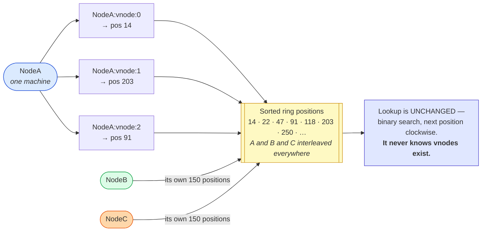

Two consequences fall straight out of that interleaving:

| | |
|---|---|
| **Balance** | Many small arcs per node average out, instead of three giant arcs decided by luck |
| **Failure spreading** | When a node dies, its ~150 arcs each hand off to a *different* neighbour — not all to one successor |

The second one matters more than the first and gets forgotten more often. With one position per node, a death dumps the entire share onto a single successor, which then falls over too.

Measured on the same 30,000 keys and 3 nodes, now with 150 vnodes each: **11,533 / 10,038 / 8,429**. Far better than 97/2/1 — but still ±15% off ideal, which is exactly why "does 256 vnodes *guarantee* even distribution?" is **no**. More vnodes tightens the spread; nothing flattens it.

Distribution quality vs vnode count (simulation over 1M keys, 6 nodes):

| Vnodes per Node | Std Dev of Key Distribution | Max Node Imbalance |
|---|---|---|
| 1 | ~40% | Up to 3x |
| 10 | ~15% | Up to 1.5x |
| 50 | ~7% | Up to 1.2x |
| 150 | ~3% | Up to 1.07x |
| 500 | ~1.5% | Up to 1.03x |

At 150 vnodes, imbalance is under 7% — acceptable for production. Beyond 500, gains are marginal and operational complexity rises.

---

### 🔴 Architect — Token Count and Bootstrap Time Tradeoff

Increasing vnodes per node improves distribution but has real operational costs:

```
Bootstrap cost when a new node joins:
  N = 10 nodes, each with V vnodes
  New node with V vnodes must acquire data from V different predecessor nodes
  Each data transfer is a separate streaming connection

  V=10:  new node opens 10 streaming connections (fast, low coordination)
  V=256: new node opens 256 streaming connections (slow, high coordination overhead)

In Cassandra production clusters:
  Adding a node with num_tokens=256 to a 20-node cluster:
  → 256 range transfers, each taking 10-60 seconds → bootstrap can take 30+ minutes

Mitigation: limit streaming parallelism:
  cassandra.yaml: concurrent_reads: 32, stream_throughput_outbound_megabits_per_sec: 200
```

**Tradeoff: Distribution Quality vs Bootstrap Duration.** Cassandra moved the default from 1 token (terrible distribution) to 256 vnodes (good distribution, slower bootstrap). The operational sweet spot depends on data volume per node and acceptable bootstrap window.

---

## 4. Node Join: Adding Capacity to a Live Ring

### 🟢 Beginner — The New Team Member

A new employee joins a customer service team. Before they can start taking calls, they spend their first week shadowing their predecessor — learning the accounts they'll inherit. Only after they're ready does the company update the routing table and start sending them calls. The predecessor keeps handling things until the handoff is complete.

---

### 🟡 Senior — Bootstrap Protocol Step by Step

```
Step 1: Position announcement
  New node generates vnode positions:
    for i in range(num_tokens):
        position = murmur3(f"{node_id}:{i}")
  Announces positions via gossip to all existing cluster members.

Step 2: Range identification
  For each new vnode at position P:
    predecessor = find_nearest_clockwise_existing_node(P)
    new_range = (predecessor.prev_token, P]
    data_source = predecessor.node_id

Step 3: Streaming data transfer
  For each identified range:
    source_node.stream_range(new_range, destination=new_node)
  Transfer uses backpressure (new node acks batches as it processes them).
  Old node continues serving reads and writes during transfer.

Step 4: Cutover
  Once a range transfer completes:
    - New node sends "range ready" notification
    - Gossip propagates updated ring state
    - Clients/coordinators update routing table
    - New writes route to new node
    - Old node stops serving that range after a grace window

Step 5: Cleanup
  Old node deletes the transferred data after grace period (default: 10 minutes in Cassandra)
```

---

### 🔴 Architect — Streaming Rate and Cluster Stability

```
Risk: if streaming is too fast, it starves normal read/write traffic.
Risk: if streaming is too slow, the window of inconsistency is too long.

Cassandra streaming configuration:
  stream_throughput_outbound_megabits_per_sec: 200  (limit stream bandwidth)
  inter_dc_stream_throughput_outbound_megabits_per_sec: 50  (lower for cross-DC)

Monitoring during bootstrap:
  nodetool netstats         → active streaming sessions, bytes remaining
  nodetool compactionstats  → post-stream compaction backlog
  READ latency spike        → indicator that streaming is starving reads

Operational runbook:
  1. Announce maintenance window
  2. Throttle streaming to 25% of normal node bandwidth
  3. Monitor read/write p99 latency during streaming (alert if >2x baseline)
  4. After bootstrap completes: run nodetool repair on new node
  5. After repair: verify key count balance (nodetool status)
```

---

## 5. Node Departure: Graceful and Ungraceful Exits

### 🟢 Beginner — Employee Resignation vs Emergency

A planned resignation: the employee trains their replacement, documents everything, and leaves on a known date. No disruption.

An emergency departure: the employee doesn't show up Monday morning. Their accounts are unassigned. The manager has to quickly figure out who covers what based on who's available and what notes exist.

---

### 🟡 Senior — Graceful vs Crash Protocol

**Graceful (decommission):**
```bash
# Cassandra graceful removal
nodetool decommission

# This triggers:
# 1. Node marks itself as "leaving" in gossip state
# 2. For each token range: stream data to successor node
# 3. Once all ranges are transferred: node removes itself from ring
# 4. Clients see updated ring state via gossip
```

**Crash (ungraceful):**
```bash
# Detecting a crashed node (Cassandra uses phi-accrual failure detector):
# phi threshold: if phi > 8 (default), declare node dead

# Manual removal after detection:
nodetool removenode <host_id>

# This triggers:
# 1. Ring is updated to remove the dead node's tokens
# 2. Successors are already holding replica data (if RF > 1)
# 3. Successors become primary for those ranges immediately
# 4. nodetool repair must be run to ensure all replicas are consistent
```

| Phase | Graceful | Crash |
|---|---|---|
| Data transfer | Proactive, owner → successor | Replica nodes take over immediately |
| Data availability | Continuous (no downtime) | Depends on RF; RF=1 = unavailable |
| Ring update timing | Controlled | After phi-accrual threshold (5–30s) |
| Repair required after | No (clean transfer) | Yes (replicas may have missed writes) |

---

### 🔴 Architect — Phi Accrual Failure Detection

Rather than a binary ping/timeout, Cassandra uses the **phi accrual failure detector** which models inter-arrival times of heartbeats and outputs a continuous suspicion score:

```
phi(t) = -log10(1 - F(t))
  where F(t) is the CDF of the heartbeat interval distribution

phi < 4:  node is probably alive
phi = 4:  ~1% false positive rate for declaring dead
phi = 8:  ~0.004% false positive rate (Cassandra default threshold)
phi > 8:  declare node dead
```

**Why this matters:** With a fixed timeout (e.g., "dead after 30 seconds of no heartbeat"), a briefly overloaded node under GC pause might be declared dead, causing unnecessary ring rebalancing. Phi accrual adapts to the node's historical heartbeat pattern — a node that normally sends heartbeats every 100ms is declared suspicious sooner than one that normally sends every 500ms.

This is the mitigation for ring oscillation: the adaptive threshold prevents flapping nodes from repeatedly triggering ring rebalances.

---

## 6. Replication on the Ring: Preference Lists and Quorums

### 🟢 Beginner — Three Copies in Three Cabinets

Important documents are never stored in one filing cabinet — they're in three separate ones in different rooms. If one room is locked, the document is still accessible from the other two. Consistent hashing determines which three cabinets each document goes into, based on the document's ID and the cabinet locations on the ring.

---

### 🟡 Senior — Preference List Construction

**Walk clockwise from the key and collect the next `N` distinct *physical* nodes.** The word "distinct" is the entire subtlety — consecutive ring positions often belong to the same machine:

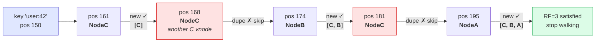

The result — `[NodeC, NodeB, NodeA]` — has **NodeC as the primary** (the coordinator writes there first); B and A are the replicas.

Skip the de-duplication and the bug is silent and severe: a key whose next three positions are all vnodes of one machine reports `RF=3` while sitting on **one** box with zero real redundancy. Two related guards worth naming in a review:

| Guard | Why |
|---|---|
| Skip repeat **physical** nodes | Otherwise RF is a lie (above) |
| Fail if `RF > distinct node count` | The clockwise walk can never satisfy itself — it spins forever instead of erroring |
| Prefer distinct **failure domains** | Three replicas in one rack/AZ satisfy RF=3 on paper and protect against nothing |

**Why skip vnodes from the same physical node?** If NodeA has 256 vnodes, the next 5 clockwise positions might all belong to NodeA. If we included them all, "replication factor 3" would mean 3 copies on 1 physical machine — useless for fault tolerance.

---

### 🔴 Architect — Tunable Consistency in Production

```
Cassandra consistency level options and their W+R guarantees:

QUORUM:        W=ceiling(N/2+1), R=ceiling(N/2+1) → W+R > N → strong
LOCAL_QUORUM:  Quorum within one DC only → fast for multi-DC, but no cross-DC guarantee
ONE:           W=1, R=1 → W+R=2 ≤ N → eventual consistency
ALL:           W=N, R=N → maximum durability, maximum latency, terrible availability
ANY:           W=1 including hints → weakest write, maximum availability

Production recommendation for most use cases:
  Writes: LOCAL_QUORUM  (fast intra-DC, durable)
  Reads:  LOCAL_QUORUM  (consistent reads, acceptable latency)

Latency impact (3-node, same DC):
  ONE:          ~1ms  (single replica responds)
  LOCAL_QUORUM: ~3ms  (2 of 3 must respond)
  ALL:          ~8ms  (slowest of all 3 replicas)
```

**Tradeoff: Consistency vs Latency vs Availability.** LOCAL_QUORUM is the sweet spot for most production workloads: it tolerates one replica failure without losing availability, provides strong consistency within a DC, and has low latency. ALL guarantees every replica has the data but one slow replica makes every read slow.

---

## 7. Sloppy Quorum and Hinted Handoff

### 🟢 Beginner — The Substitute Teacher

When a teacher is absent, a substitute takes their class. The substitute doesn't know everything about the students, but they keep the classroom running. When the original teacher returns, the substitute's notes (what happened while they were away) are handed back.

This is sloppy quorum: a substitute node handles writes while the original is down. Hinted handoff is the substitute's notes — given back when the original returns.

---

### 🟡 Senior — Hinted Handoff in Practice

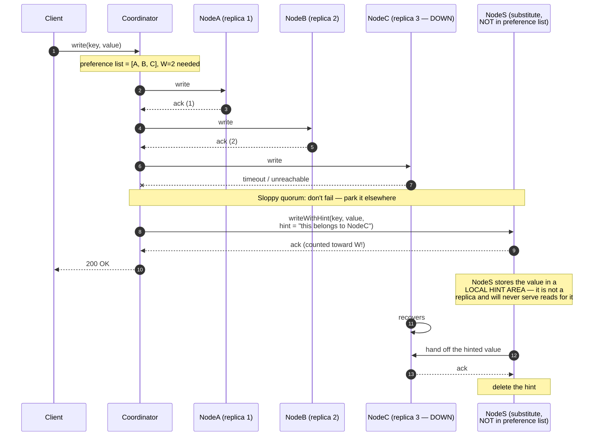

The consequential step is **9** — the substitute's ack counts toward `W`. That's what buys write availability while a replica is down, and it's also exactly why a sloppy quorum is **not** a real quorum: `W + R > N` no longer implies read/write overlap, because one of those `W` writes is sitting on a node no reader will ever consult.

| | Strict quorum | Sloppy quorum |
|---|---|---|
| Replica down | Write **fails** | Write **succeeds** (hinted elsewhere) |
| `W + R > N` guarantees overlap | Yes | **No** |
| Reader can see the hinted write | n/a | Not until handoff completes |
| Durability window | — | Hint lost if the substitute dies before handoff |

The last row is the one candidates miss: a hint is stored on **one** node. If NodeS dies before NodeC recovers, that write is simply gone, despite the client having received a `200 OK`.

When the original node recovers:
```
1. Gossip signals: "NodeB is alive at 10.0.0.5:9042"
2. Substitute node (NodeD) detects NodeB in ring state
3. NodeD streams all hints for NodeB:
   for hint in hints_for_node("NodeB"):
       NodeB.apply(hint.key, hint.value, hint.written_at)
4. NodeD deletes local hint copies after confirmation
5. NodeB is now consistent
```

---

### 🔴 Architect — When Hinted Handoff Fails

```
Scenario: NodeB is down for 6 hours. Hint window = 3 hours (default in Cassandra).

Timeline:
  T+0:   NodeB crashes. Hints start accumulating on NodeD.
  T+3h:  Hint window expires. NodeD deletes hints > 3h old.
  T+6h:  NodeB recovers. NodeD delivers remaining hints (T+3h to T+6h only).
          Writes from T=0 to T=3h are LOST.

Fix: nodetool repair after NodeB recovery
  repair compares Merkle tree hashes between NodeB and its neighbors
  repairs any divergent data ranges found

Production recommendation:
  - Set hint window longer than your typical failure recovery time
  - Always run nodetool repair after extended node downtime
  - Monitor: nodetool tpstats → HintsInProgress, TotalHintsInFlight
  - Alert if hints backlog grows (indicates a node that's been down too long)
```

**Tradeoff: Hint Window Duration vs Disk Overhead.** A longer hint window means more disk space consumed by hints on substitute nodes. If the original node stays down forever, hints grow unbounded. Production systems set hint_window_persistent_period = max expected MTTR, then schedule mandatory repair for any recovery.

---

## 8. Data Migration During Ring Changes

### 🟢 Beginner — Moving House While Still Living There

Imagine moving to a new apartment while still living in the old one. You move boxes gradually over several days. During the move, some items are in the old place, some are in the new. You have a list of which boxes are where so you always know where to find something.

Ring migration works the same way: data moves gradually, and the system knows which node to ask during the transition.

---

### 🟡 Senior — Dual-Read Migration Strategy

```
Migration from modulo hashing to consistent hashing (zero downtime):

Phase 1 — Shadow mode (run old and new in parallel):
  1. Deploy consistent hashing ring alongside existing modulo cluster
  2. All writes: dual-write to BOTH systems simultaneously
  3. All reads: try consistent hash cluster first → on miss, fall back to modulo cluster
  4. Run for at least 1 TTL cycle to allow all old keys to expire naturally

Phase 2 — Validation:
  5. Monitor: cache hit rate on consistent hash cluster should approach steady-state
  6. Monitor: fallback rate to modulo cluster should decrease over time
  7. Confirm: spot-check key distribution on new cluster

Phase 3 — Cutover:
  8. Disable fallback reads (remove modulo lookup code path)
  9. Disable dual-writes (write to consistent hash only)
  10. Drain and decommission old modulo cluster

Risk mitigation:
  - Keep rollback ability (re-enable dual-write + fallback) for 24-48h after cutover
  - Run during low-traffic period (lower blast radius if issues arise)
```

---

### 🔴 Architect — Anti-Entropy Repair

Even after migration completes, replicas can drift over time due to:
- Hinted handoff failures (hints dropped during extended outage)
- Coordinator failures mid-write (some replicas wrote, others didn't)
- Clock skew causing last-write-wins conflicts

**Merkle tree anti-entropy repair:**
```
Each node maintains a Merkle tree over its data:
  - Leaf nodes: hash of each key-value pair
  - Internal nodes: hash of children's hashes
  - Root hash: single fingerprint of entire dataset

Repair process:
  1. NodeA sends its Merkle root hash to NodeB
  2. If roots match: data is identical → no repair needed
  3. If roots differ: binary search down the tree to find divergent ranges
  4. Sync only the divergent ranges → minimal data transfer

Example:
  1M keys, only 1000 divergent: transfer ~1000 keys, not 1M
  Merkle tree reduces repair to O(k log n) where k = divergent keys
```

**Production:** Run `nodetool repair` on each Cassandra node weekly (major repair) and after any extended downtime.

---

## 9. Consistent Hashing as a Load Balancer

### 🟢 Beginner — The Restaurant Regular

A regular customer always sits in the same section and gets the same waiter who knows their preferences. The restaurant doesn't randomly assign waiters — it ensures the same waiter handles the same regular every time.

This is cache affinity via consistent hashing: the same URL always goes to the same cache server, so that server accumulates the cached content and serves it from memory.

---

### 🟡 Senior — Cache Affinity in L7 Load Balancing

```nginx
# Nginx consistent hash by URL path (cache key affinity):
upstream cache_cluster {
    consistent_hash $request_uri;
    server 10.0.0.1:6379;
    server 10.0.0.2:6379;
    server 10.0.0.3:6379;
}
```

Without consistent hashing, the same `/images/logo.png` request might go to any of 3 cache servers. Each server caches it separately — cache duplication and low hit rate. With consistent hashing: `/images/logo.png` always routes to Server 2. Server 2 caches it once and serves all subsequent requests from memory.

| Routing Strategy | Same-URL Cache Behavior | Hit Rate |
|---|---|---|
| Round-robin | Different server each request | Low (each server has its own copy or misses) |
| IP hash | Same IP → same server | Moderate (IP changes) |
| Consistent hash by URL | Same URL → same server always | High (single warm cache per URL) |

---

### 🔴 Architect — CDN Routing Considerations

Consistent hashing at CDN scale (Akamai, Cloudflare, Fastly):

```
Challenge: 300+ PoPs globally, each can serve any request.
           Same URL must consistently route to the same PoP for cache affinity.
           But PoPs fail and new ones are added frequently.

Consistent hashing solution:
  hash(url + client_region) → PoP selection
  Region binning: reduce all client IPs to 10-20 geographic regions
  Hash: (url, region) → specific PoP

On PoP failure:
  Only urls in the failed PoP's hash range need to refill cache on the next PoP
  All other urls continue hitting their regular PoP → high cache hit rate maintained

On PoP addition:
  Only 1/N of urls shift to the new PoP → predictable cache warm-up time
```

**Production concern: invalidation.** Consistent hashing routes reads to the correct PoP. But cache invalidation (when content changes) must broadcast to ALL PoPs, not just the consistent-hash-routed PoP. CDNs use a separate invalidation channel (push-based, not ring-based) for this. Consistent hashing only manages where reads are served from.

---

## 10. Gossip Protocol: Ring Membership Without a Master

### 🟢 Beginner — The Telephone Game (Done Right)

In a game of telephone, a message gets corrupted because it passes linearly. Fix it: instead of passing to just one person, each person tells three random others every 30 seconds. Within a few rounds, everyone has the message accurately, because multiple independent paths carry the same information.

Gossip protocol works the same way. Each node periodically sends its view of the cluster to a few random peers. Even without a central coordinator, all nodes converge on the same cluster state.

---

### 🟡 Senior — Gossip Mechanics

Every node keeps its own table of "what I believe about everyone." Once per second it bumps its own counter and swaps tables with ~3 random peers:

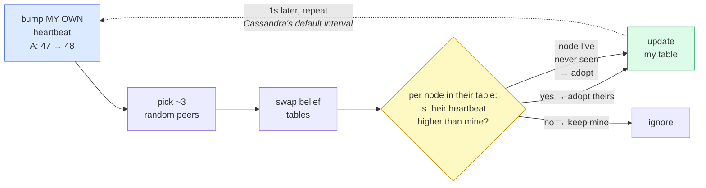

**The merge rule is the entire protocol: higher heartbeat wins, applied per node.** Because "take the max" is commutative and idempotent, the exchange converges no matter who talks to whom, in what order, or how many messages are lost or duplicated. No coordinator, no election, no consensus round.

Worked example of a node's belief table converging:

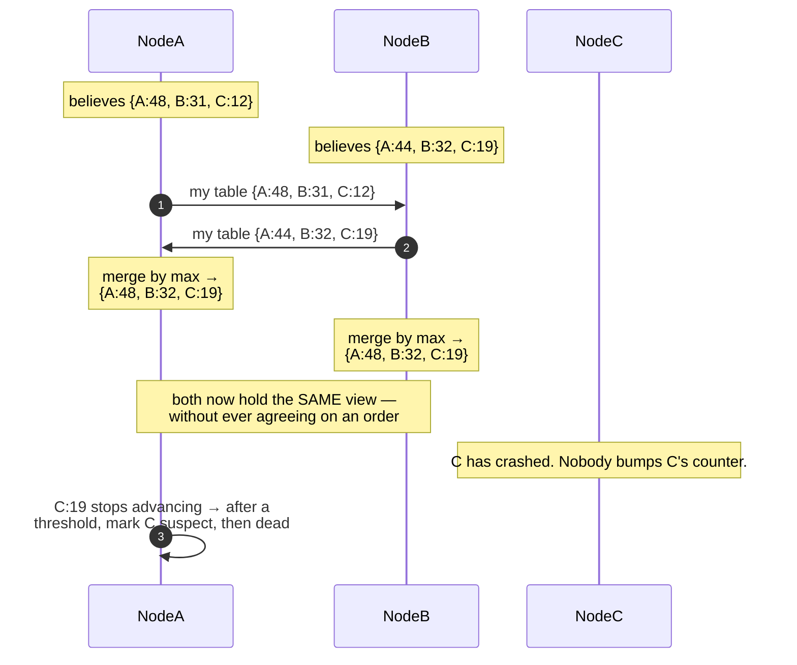

Note the failure detection falls out for free: nobody can bump C's counter except C, so a **stale** counter is the signal. That's why the mechanism is a heartbeat *number* rather than a boolean "alive" flag — a boolean would need someone authoritative to flip it.

Convergence properties:
```
Number of rounds to propagate a state change to all N nodes:
  With k peers per round: O(log_k(N)) rounds
  Cassandra (k=3, N=100 nodes): ~4 rounds = ~4 seconds to full propagation

Gossip message size:
  Each gossip message = cluster state for all known nodes
  N=100 nodes: ~100 × 100 bytes = 10KB per gossip message
  Cassandra limits: max 16,000 nodes before gossip bandwidth becomes a concern
```

---

### 🔴 Architect — Split Brain and Gossip Tuning

```
Split brain: cluster partitions into two halves, each believes the other is dead.
             Both halves continue accepting writes to the same key ranges.
             When partition heals: conflicting versions must be reconciled.

Cassandra's protection:
  - Last-Write-Wins (LWW) using client-supplied timestamps
  - Vector clocks for applications requiring version tracking
  - Allow filtering: both conflicting versions are presented; application resolves

Gossip failure detection tuning:
cassandra.yaml:
  phi_convict_threshold: 8     # lower = faster detection but more false positives
  endpoint_snitch: GossipingPropertyFileSnitch  # topology-aware gossip

Production advice:
  - phi=8 is the default sweet spot; only lower for very fast failure recovery requirements
  - Monitor: nodetool gossipinfo → verify all nodes have consistent ring view
  - Alert: if any two nodes disagree on ring state for > 30 seconds → investigate
  - Never use NetworkTopologyStrategy with RF < 3 in production
```

---

## 11. Consistent Hashing vs Range-Based Sharding

### 🟢 Beginner — Random Filing vs Alphabetical Filing

Random filing (consistent hashing): each document gets a random drawer based on its ID. Finding a specific document is instant — you hash the ID and know the drawer. But finding all documents from 2024 requires checking every drawer.

Alphabetical filing (range sharding): all documents from A-F go in drawer 1, G-M in drawer 2, etc. Finding all "A" documents is instant — they're all in drawer 1. But if everyone has a last name starting with "S", drawer 3 is overflowing.

---

### 🟡 Senior — Side-by-Side Comparison

| Feature | Consistent Hashing | Range-Based Sharding |
|---|---|---|
| Data distribution | Uniform (random) | Can be skewed (depends on key distribution) |
| Range queries | Not efficient | Excellent — O(1) shard identification for ranges |
| Sequential write patterns | Naturally distributed | Creates write hotspot on "latest" shard |
| Rebalancing | Automatic via vnodes | Manual or operator-assisted split/merge |
| Key lookup by ID | O(log n) ring lookup | O(1) range lookup |
| Examples | Cassandra, DynamoDB, Redis (hash) | HBase, Bigtable, CockroachDB, Spanner |
| Best for | Key-value stores, caches | Time-series, sorted logs, range-scanned data |

**The time-series hotspot problem with range sharding:**
```
Table: events (timestamp, event_type, payload)
Shard by timestamp range: shard1=Jan, shard2=Feb, shard3=Mar

All current writes go to the "current month" shard.
→ One shard (March) absorbs 100% of writes
→ Other shards are cold (read-only archives)

Fix: hash sharding on event_id (UUID), not timestamp.
     OR: add a random shard_id prefix: (shard_id % K, timestamp)
     Trade: range query now requires scanning all K shards.
```

---

### 🔴 Architect — Choosing a Sharding Strategy at System Design Time

```
Decision tree for interviews:

Q: Do you need range queries (scan between timestamp X and Y)?
  YES → Range sharding (HBase-style)
        Mitigation for write hotspot: add a shard key prefix (bucketed timestamp)
  NO  → Continue to Q2

Q: Will the cluster grow or shrink (nodes added/removed)?
  YES → Consistent hashing (graceful rebalancing)
  NO  → Fixed modulo sharding is fine (zero overhead)
  MAYBE → Consistent hashing (safe default)

Q: Are nodes heterogeneous (different capacities)?
  YES → Consistent hashing with weighted vnodes
  NO  → Any approach works

Q: Is low-latency lookup by ID the primary access pattern?
  YES → Consistent hashing or fixed modulo (both O(1) to O(log n))
  NO  → Reconsider — are you solving the right problem?
```

---

## 12. Jump Consistent Hash: A Linear-Time Alternative

### 🟢 Beginner — The Shortest Algorithm

Jump consistent hash is a 5-line function that assigns a key to one of N buckets (nodes), with the property that adding bucket N+1 only moves keys from their current bucket to bucket N+1. No other keys move.

It is essentially consistent hashing without the ring data structure — a mathematical trick that achieves the same minimal-disruption property.

---

### 🟡 Senior — Algorithm and Properties

Instead of storing a ring, jump hash **replays** the key's history of moves. Ask "as the cluster grew from 1 bucket to N, at which sizes would this key have jumped?" — the key's own hash seeds a deterministic random sequence, so every node computes the same answer from nothing but `(key, N)`:

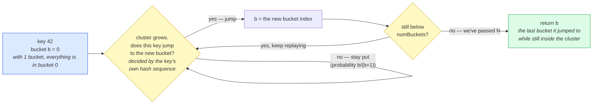

Two properties fall out of that shape, and they're the reason it exists:

- **O(1) space.** There is no ring, no vnode table, no membership list — just `(key, numBuckets)` in, bucket out. Nothing to replicate, nothing to keep in sync, nothing to go stale.
- **Minimal movement, by construction.** Growing the cluster only ever adds *new* jump opportunities. A key can move **onto** the new bucket, but two existing buckets can never swap keys.

Verified on 100K keys: 10 buckets each received ~10,000 keys; going 10 → 11 moved **9.04%** (ideal `1/11` = 9.09%), with **zero** keys shuffled between pre-existing buckets.

> **If you do implement it:** the real algorithm (Lamping & Veach, *"A Fast, Minimal Memory, Consistent Hash Algorithm"*, Google, 2014) drives those jump decisions with a 64-bit linear congruential generator and **depends on 64-bit integer overflow**. In a language whose default number type is a double — JavaScript, Lua — you must use an explicit 64-bit integer type (`BigInt`) or the multiplication silently loses precision above 2⁵³ and the distribution skews.

| Property | Ring Consistent Hashing | Jump Consistent Hash |
|---|---|---|
| Time complexity | O(log n) binary search | O(log n) iterations on average |
| Space complexity | O(n × vnodes) ring structure | O(1) — no data structure |
| Arbitrary node removal | ✅ Supported | ❌ Only remove the last bucket |
| Heterogeneous weights | ✅ Weighted vnodes | ❌ Not supported |
| Distribution quality | ~3% variance at 256 vnodes | Perfect (mathematical guarantee) |

**Key limitation:** Jump consistent hash requires buckets be numbered 0 to N-1. You can only add the next sequential bucket (N) or remove the last bucket (N-1). You cannot remove bucket 3 from a 10-bucket system and keep buckets 0-2 and 4-9. This makes it unsuitable for distributed storage where arbitrary nodes fail.

---

### 🔴 Architect — When Jump Hash Is the Right Choice

```
Good fit for jump consistent hash:
  1. Stateless routing where nodes are added/removed from the "end"
     Example: batch processing workers (always add/remove latest)
  2. CDN routing to a fixed set of edge servers (stable set, rare changes)
  3. Sharding a fixed-size database cluster (never removing mid-cluster nodes)
  4. Any system where nodes are identified by sequential index, not arbitrary ID

Bad fit:
  1. Distributed storage (nodes fail arbitrarily, not just the last one)
  2. Cache clusters (cache servers can fail in any order)
  3. Any system requiring weighted nodes

Google uses jump consistent hash internally for routing requests to storage backends
where the backend pool is managed sequentially — backends are drained before removal.
```

---

## 13. Hot Keys and Weighted Nodes

### 🟢 Beginner — The Popular Exhibit

A museum has 10 galleries. Consistent hashing assigns each exhibit to a gallery evenly. But if one exhibit (the Mona Lisa) gets 10,000 visitors per hour while others get 100, the gallery containing the Mona Lisa is overwhelmed — even though the number of exhibits per gallery is equal.

The key count (exhibits) is balanced. The access count (visitors) is not. These are two different dimensions.

---

### 🟡 Senior — Hot Key Mitigation Strategies

**Strategy 1 — key splitting.** One hot key becomes N differently-named keys, which the ring then scatters across N nodes. The asymmetry between the read and write path *is* the technique:

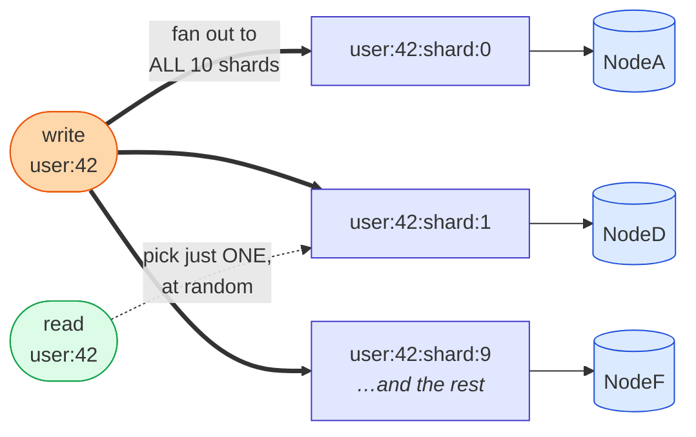

One key became ten keys, and because the ten names hash differently the ring scatters them onto **different nodes** — that's where the read spread comes from.

Get that backwards — write to *one random* shard — and you leave 9 stale copies while reads return whichever they happen to land on. The trade is **10× write amplification for a 10× read spread**, so it's only worth it for genuinely hot keys, and the copies are briefly inconsistent with each other for the duration of the fan-out.

**Strategy 2 — a tiny L1 cache in each API server's own memory.** The cheapest hot-key fix available, and it needs no ring change at all:

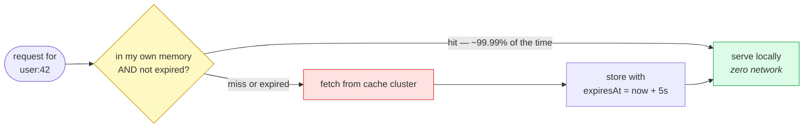

The arithmetic is what sells it: **100 API servers × one fetch per 5 s = 20 req/s** to the cluster for that key, no matter how hot it gets. Measured on the implementation, 100 rapid calls collapsed to exactly **1** cluster fetch, and 2 after the TTL elapsed.

The costs are worth stating plainly: **staleness bounded by the TTL**, and because the copy is per-server there is **no invalidation path** — you wait out the 5 seconds. Also cap the map, or a long tail of distinct keys turns your "small" L1 into a memory leak.

> ⚠️ If you've seen this idea written in Python: `functools.lru_cache` has **no** `ttl` parameter — `@lru_cache(maxsize=1000, ttl=5)` raises `TypeError`. You need `cachetools.TTLCache` (third-party) or a hand-rolled wrapper. Verify any cache decorator's real signature before citing it in an interview.

| Strategy | Write Cost | Read Distribution | Staleness |
|---|---|---|---|
| L1 local cache | None | Per-server (10 API servers = 10 local copies) | Up to TTL |
| Key splitting | Fan-out to N shards | Across N cache nodes | Consistent writes |
| Dedicated replicas | Replicate to N nodes | Round-robin across N | Replication lag |

---

### 🔴 Architect — Weighted Vnodes for Heterogeneous Hardware

```
Cluster: 4 nodes with 32GB RAM + 2 nodes with 128GB RAM (bought for expansion)

Naive (equal vnodes=256 for all):
  Each node owns 1/6 = 16.7% of key space
  32GB nodes: handling 16.7% of keys → overloaded
  128GB nodes: handling 16.7% of keys → massively underutilized

Weighted vnodes:
  32GB nodes: 64 vnodes each → total 64*4 = 256 positions
  128GB nodes: 256 vnodes each → total 256*2 = 512 positions
  
  32GB node share: 64/768 ≈ 8.3% each (×4 = 33.3% total)
  128GB node share: 256/768 ≈ 33.3% each (×2 = 66.7% total)
  
  Memory ratio: 32GB * 33.3% + 128GB * 66.7%
  32GB nodes serve: 33.3% of keys × 32GB capacity
  128GB nodes serve: 66.7% of keys × 128GB capacity
  
  Effective utilization: much more balanced

Cassandra implementation:
  # Set specific tokens per node based on capacity
  cassandra.yaml:
    initial_token: <calculated_tokens>
  
  # Or use: nodetool move to adjust token assignment
```

---

## 14. Failure Modes: What Breaks at Scale

### 🟢 Beginner — The Chain of Dominoes

In a distributed system, one failure causes a second failure which causes a third. The first domino is never the real problem — it's the chain that follows. Understanding consistent hashing failure modes means knowing which domino falls first and how to stop the chain.

---

### 🟡 Senior — Common Failure Scenarios

```
Failure 1: Ring oscillation
  Cause: node flaps (crashes and recovers repeatedly every 30-60 seconds)
  Effect: continuous rebalancing burns network + CPU
  Symptom: sustained elevated streaming traffic, inconsistent key ownership
  Detection: monitor rebalance events per hour (alert if > 3/hour)
  Fix: phi accrual failure detector with higher convict threshold

Failure 2: Biased hash function
  Cause: hash function with poor uniformity (CRC32, Java hashCode)
  Effect: one arc of ring has 3-5x more keys than others
  Symptom: one node has memory utilization 3x higher than peers
  Detection: plot per-node key count; alert if any node > 1.5x median
  Fix: replace hash function; requires full key remapping (migration event)

Failure 3: Bootstrap overload
  Cause: new node joining with 256 vnodes tries to stream from 256 predecessors simultaneously
  Effect: streaming traffic saturates network; existing nodes see read latency spike
  Symptom: read p99 spikes to 5-10x during bootstrap
  Detection: monitor concurrent_reads during bootstrap
  Fix: throttle stream throughput (cassandra.yaml: stream_throughput_outbound_megabits_per_sec)

Failure 4: Stale routing table
  Cause: gossip propagation lag; a gateway is routing to a node that has already left
  Effect: requests go to wrong node → cache misses or errors
  Symptom: intermittent 404s or stale data for affected key ranges
  Detection: compare gateway's ring view with nodetool status
  Fix: reduce gossip interval; ensure clients refresh ring view on connection errors
```

---

### 🔴 Architect — Chaos Engineering for Ring Failures

```
Chaos test 1: Sudden node kill
  Action: kill -9 on a random node mid-traffic
  Observe: 
    - With RF=3: p99 latency should stay under 2x for < 30 seconds (gossip detection)
    - After detection: read/write traffic recovers to replicas automatically
  Pass criteria: no sustained latency increase after 30s; zero data loss on RF>=3

Chaos test 2: Ring oscillation simulation
  Action: repeatedly partition and heal a node using iptables every 10 seconds
  Observe: ring should NOT rebalance on every oscillation
           phi accrual detector should absorb short outages
  Pass criteria: no rebalance events for outages < 10 seconds

Chaos test 3: Slow node (not dead, just slow)
  Action: inject latency on one node (tc netem delay 500ms)
  Observe: coordinator should respect read/write timeouts and not wait for slow node
  Pass criteria: p99 latency stays bounded; slow node's requests time out gracefully

Chaos test 4: Hash function collision test
  Action: generate keys that hash to the same ring position (birthday attack)
  Observe: system should handle hash collisions correctly (one node wins)
  Pass criteria: no data loss; deterministic ownership
```

---

## 15. Observability: Monitoring a Hash Ring in Production

### 🟢 Beginner — The Dashboard on the Ring

A well-monitored hash ring tells you four things: are all nodes healthy, is load distributed evenly, is replication keeping up, and are there any ring changes happening right now?

---

### 🟡 Senior — Key Metrics and Alerts

```promql
# Per-node key count balance:
cassandra_table_live_ss_table_count by (node)
# Alert: if max/min > 1.5x with same vnode count → distribution problem

# Streaming activity (rebalancing in progress):
cassandra_streaming_total_incoming_bytes_rate by (node)
# Alert: sustained streaming > 100MB/s for > 10 minutes → investigate

# Read repair rate (replicas are inconsistent):
cassandra_read_repair_attempts_rate by (node)
# Alert: > 1% of reads trigger repair → replicas diverging

# Gossip state discrepancy:
nodetool gossipinfo | grep STATUS
# Expected: all nodes agree on status UP/DOWN for all peers
# Alert: any node shows BOOTSTRAP/LEAVING/MOVING for > 5 minutes unexpectedly

# Hinted handoff backlog:
cassandra_hints_in_progress by (node)
# Alert: > 0 for more than 1 hour → a node has been down too long

# Coordinator latency by consistency level:
cassandra_coordinator_read_latency_percentile{quantile="0.99"} by (consistency_level)
# Baseline: QUORUM p99 < 5ms; LOCAL_ONE p99 < 2ms
```

| Dashboard Panel | What to Alert On |
|---|---|
| Per-node key count | Any node > 1.5x median key count |
| Streaming bandwidth | Sustained > 200MB/s for > 15 minutes |
| Hints in progress | Any node > 0 for > 60 minutes |
| Gossip state disagreement | Any node disagreeing with majority for > 2 minutes |
| Read repair rate | > 1% of reads triggering repair |
| Ring topology changes | > 3 join/leave events in 1 hour |

---

### 🔴 Architect — Capacity Planning for Ring Operations

```
Node capacity planning:
  Target utilization: 60% of node capacity for normal load
  → 40% headroom for:
    a) Ring rebalancing (streaming adds load to existing nodes)
    b) One node failure (remaining nodes absorb its traffic during recovery)
    c) Organic traffic growth

Sizing formula:
  data_per_node = total_data_size / (N × RF)
  Example: 10TB data, 10 nodes, RF=3
    data_per_node = 10TB / (10 × 3) = ~333GB per node
    At 60% target utilization: provision 550GB per node (SSD, not HDD for Cassandra)

Streaming capacity planning:
  New node joins: must stream from 256 predecessors × average_range_size
  Time estimate: streaming_rate = 200MB/s (throttled)
    data to stream = data_per_node = 333GB
    time = 333GB / 200MB/s = ~28 minutes
  Plan maintenance windows accordingly.

Growth planning:
  Add nodes when any node's utilization exceeds 70%
  Don't wait for 90%+ — ring rebalancing under high load causes latency spikes
```

---

## 16. Real-World Company Implementations

### 🟢 Beginner — Same Ring, Different Systems

Consistent hashing is used in almost every large-scale distributed system. The ring is the same; the policies around it (how many vnodes, what quorum, how to handle failures) differ based on the system's primary requirements.

---

### 🟡 Senior — Company-by-Company Breakdown

**Apache Cassandra — The Reference Implementation**

Cassandra is the textbook implementation of the Dynamo paper's consistent hashing approach. Key specifics:

```
Hash function: Murmur3Partitioner (default, best uniformity)
               RandomPartitioner (legacy MD5-based, deprecated)
               ByteOrderedPartitioner (range queries at cost of hotspots — avoid)

Default vnodes: 256 per node (since Cassandra 3.x; was 1 in early versions)

Replication strategy:
  SimpleStrategy: single DC, RF copies on next N nodes clockwise
  NetworkTopologyStrategy: multi-DC, RF copies distributed across DCs
                           (production standard)

Gossip interval: 1 second (configurable)
Failure detection: phi accrual, threshold=8

Real-world deployments:
  - Apple: 75,000+ Cassandra nodes (one of the largest deployments)
  - Netflix: petabytes of data on Cassandra for subscriber history, billing
  - Discord: switched away from Cassandra (to ScyllaDB) due to operational complexity,
    but used it for years to store 100B+ messages
```

---

**Amazon DynamoDB — Consistent Hashing as a Service**

DynamoDB hides consistent hashing completely behind its API. Internally (based on the 2007 Dynamo paper and public re:Invent talks):

```
Partition key → consistent hash → shard assignment
Each shard ("partition") holds max 10GB of data and 3,000 RCUs or 1,000 WCUs
When a partition exceeds limits: automatic partition split
  → DynamoDB's internal ring re-routes the split range to new partitions

Quorum: N=3, W=2, R=2 internally
Access pattern: single shard access for single-item Get/Put → O(1) latency

Key insight for interviews: DynamoDB is consistent hashing + quorum + hinted handoff
                            made invisible behind a managed API.
```

**Why DynamoDB chose consistent hashing over range sharding:** The original Amazon shopping cart required that writes never fail even during network partitions. Consistent hashing with sloppy quorum gives availability guarantees that range-based primary election (like traditional RDBMS) cannot provide during partitions.

---

**Redis Cluster — Hash Slots, Not a Ring**

Redis Cluster uses 16,384 hash slots instead of a continuous ring, but the goal is the same:

```
Key → CRC16(key) % 16384 → slot [0, 16383]
Each node owns a contiguous range of slots:
  Node1: 0–5460
  Node2: 5461–10922
  Node3: 10923–16383

Rebalancing: explicit slot migration commands
  CLUSTER SETSLOT 5461 MIGRATING node2
  CLUSTER SETSLOT 5461 IMPORTING node1
  MIGRATE host port key db timeout
```

**Why Redis chose slots over a ring:** Redis's primary use case (cache + session store) requires operator-controlled key distribution. Explicit slot ranges make it easy to move specific keys during hot key remediation — you move slot 5461 (containing the hot key) to a dedicated node. With a ring, you'd need to manipulate vnode counts, which is indirect.

**Production limit:** Redis Cluster's gossip message encodes the full slot map. With 16,384 slots and up to 1,000 nodes, the cluster state message is ~8KB. This caps practical cluster size at ~1,000 nodes before gossip overhead becomes significant.

---

**Memcached + ketama — The Original Production Implementation**

Before Cassandra and DynamoDB, the standard way to consistently hash a cache cluster was **ketama** (originally written at Last.fm in 2007):

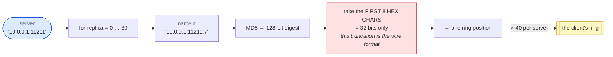

The red box is the part that matters operationally. Ketama uses only the **first 32 bits** of the MD5 digest, and every compatible client must reproduce that truncation exactly. Change the hash function, the number of digest bytes, the replica count, or even the string format of the vnode name, and **every key in the cluster relocates** — a full cache flush disguised as a client upgrade. That's why Memcached client libraries treat ketama as a frozen wire format rather than an implementation detail, and why mixing two client libraries with different ketama variants against one cluster quietly halves your hit rate.

Ketama became the de facto standard for Memcached client-side consistent hashing. Libraries in every language implement it. This is why you'll see "libketama" as a dependency in many older cache clients.

**Why 40 vnodes:** In 2007, 40 was chosen as the minimum to achieve acceptable distribution with small clusters (3-10 nodes). Modern systems use 150-256 because hardware is cheap and coordination overhead is manageable.

---

**Akamai — Consistent Hashing at Internet Scale**

Akamai's core routing problem: an HTTP request arrives at any of 300+ PoPs worldwide. For cache efficiency, the same URL should always go to the same PoP (cache affinity). But PoPs fail and new ones come online.

```
Akamai consistent hashing (conceptual):
  hash(url_path + client_region) → PoP ring position → nearest PoP

  Region bucketing: every client IP → one of 20 geographic regions
  This prevents the ring from having millions of unique positions
  
  Ring positions: 300 PoPs × 150 virtual positions = 45,000 ring positions

On PoP outage:
  Only URLs whose ring positions map to the failed PoP need to re-route.
  Expected disruption: 1/300 of all URLs refill their cache on the next PoP.
  At 1 billion cached objects: ~3.3M objects need cache refill → manageable.
```

**For interviews:** Akamai's use case is a perfect example of where consistent hashing's 1/N disruption property is the business value, not just a technical property. Without it, every PoP failure would cause a global cache flush.

---

### 🔴 Architect — Production Incidents From Consistent Hashing at Scale

**Incident 1 — Cassandra Birthday Problem (common in small clusters)**

A startup ran a 6-node Cassandra cluster with num_tokens=1 (one token per node, the old default). Due to random token assignment, two nodes ended up adjacent to each other with a tiny combined range (4% of the ring), while one node owned 28% of the ring.

```
Result:
  Node6: 4% of keys, almost idle
  Node1: 28% of keys, constantly at 95% CPU

Symptom: write timeouts on Node1, cascading reads to Node2, cluster degradation
Fix: nodetool move to redistribute tokens manually — 4 hours of planned downtime
Lesson: always use num_tokens >= 64 in production. Monitor per-node key count at cluster setup.
```

**Incident 2 — DynamoDB Hot Partition (AWS re:Invent documented)**

A customer used DynamoDB with a partition key of `date` (YYYY-MM-DD). All writes for "today" went to one partition. That partition hit 1,000 WCU/second limit and was throttled. Other partitions were completely idle.

```
Root cause: monotonically increasing partition key → consistent hash routes all
            current writes to the same shard (the "current date" shard)
Fix: composite partition key: shard_id (0-9) + date
     Writes fan-out across 10 shards, each at 100 WCU/s

Interview lesson: consistent hashing distributes by key hash,
                  not by access frequency. Sequential or monotonic keys
                  are a structural hotspot regardless of sharding algorithm.
```

**Incident 3 — Redis Cluster Slot Migration Under Load (common mistake)**

A team migrated Redis Cluster slots during peak traffic to resolve a hot key problem. Slot migration requires locking the slot briefly. Under high traffic, this caused 500-1000ms read latencies while the slot was MIGRATING state.

```
Root cause: slot migration is not zero-downtime under high load
Fix: perform slot migrations during off-peak hours
     Use MIGRATE with COPY flag to copy then delete, not atomic move
     Implement client-side retry for MOVED and ASK redirects
Lesson: plan all ring topology changes for maintenance windows
```

---

## 17. Pattern Recognition — When and How to Use Consistent Hashing

### 🟢 Beginner — Interview Signal Checklist

When you hear these in an interview, consistent hashing should appear in your design:

| Interview Signal | Consistent Hashing Response |
|---|---|
| "distributed cache" | Hash ring for key-to-node mapping with vnode balance |
| "shard by user_id" | Ask: range queries needed? If no → consistent hashing |
| "add nodes dynamically" | Consistent hashing — minimal disruption on scale-out |
| "global CDN routing" | Consistent hash by URL for cache affinity across edge servers |
| "Cassandra" or "DynamoDB" | Both use consistent hashing internally — cite the details |
| "hot shard / hot partition" | Identify whether it's a key distribution problem (fix: vnodes) or access frequency problem (fix: key splitting + L1 cache) |
| "node failure in distributed DB" | Replication factor + preference list + quorum: N, W, R |
| "zero downtime resharding" | Dual-read/dual-write migration; consistent hashing handles 1/N disruption |

---

### 🟡 Senior — Algorithm and Design Decision Map

**When to choose consistent hashing:**
```
✅ Key-value lookups by ID (no range queries)
✅ Cluster topology changes are expected (nodes added/removed)
✅ Heterogeneous nodes (weighted vnodes)
✅ Cache cluster (Memcached, Redis single-node, CDN edge routing)
✅ Distributed NoSQL DB (Cassandra, DynamoDB-style)
✅ Load balancing with session affinity (same client → same backend)

❌ Range queries required (HBase/Bigtable range sharding is better)
❌ Fixed cluster size forever (modulo hashing is simpler)
❌ Need to remove arbitrary middle nodes often (jump hash is better for sequential-only addition)
```

**Spotting the right quorum for the use case:**
```
Use case: shopping cart (must not fail to add item)
  → Sloppy quorum (W+R ≤ N), hinted handoff
  → Availability over strict consistency
  → DynamoDB/Dynamo model

Use case: financial ledger (must not lose a transaction)
  → Strict quorum (W+R > N), no sloppy quorum
  → Consistency over availability
  → Cassandra QUORUM consistency level

Use case: user session store (stale reads are fine for 5 seconds)
  → Low consistency level (W=1, R=1)
  → Speed over consistency
  → Redis single-node or Memcached (no quorum needed for cache)
```

**Follow-up questions that differentiate senior answers:**

```
1. "What hash function are you using?"
   → Named answer: Murmur3 (not MD5, not Java hashCode)
   → Reason: uniformity, speed

2. "How many vnodes per node?"
   → Named answer: 150-256 (Cassandra default is 256)
   → Reason: distribution quality vs bootstrap cost tradeoff

3. "What happens during a node failure before gossip detects it?"
   → Named answer: requests time out → returned to coordinator
     → coordinator reads from replicas (if RF > 1)
     → OR returns error (if RF=1)

4. "What is your replication strategy for multi-datacenter?"
   → Named answer: NetworkTopologyStrategy in Cassandra
     → RF per datacenter: RF=3 in each DC
     → LOCAL_QUORUM for both reads and writes
```

---

### 🔴 Architect — Anti-Patterns to Name and Avoid

| Anti-Pattern | Why It Fails | What Got Broken | Correct Alternative |
|---|---|---|---|
| num_tokens=1 (old Cassandra default) | Random single positions → high variance → hot nodes | Cassandra clusters pre-2.1 | num_tokens=256; monitor per-node key count at setup |
| Modulo hashing with growing cluster | N-1/N keys remapped on every node add → thundering herd | Any cache cluster that grew past initial size | Consistent hashing with vnodes from day 1 |
| Sequential partition key in DynamoDB | All current writes → same partition → throttled | Customer date-based DynamoDB tables (AWS documented) | Composite key: random_prefix + original_key |
| No replication (RF=1) in distributed DB | Node failure = data loss | Any naive single-replica deployment | RF=3 minimum for production data |
| Slot migration under peak traffic | MIGRATING state causes latency spikes | Redis Cluster rebalancing operations | Schedule migrations during maintenance windows |
| IP-only routing for consistent hash | Corporate NAT: thousands of users share one IP → hot node | Cache clusters serving enterprise clients | Hash on session ID or API key, not source IP |
| Missing nodetool repair after recovery | Hints expire → divergent replicas → stale reads | Any Cassandra cluster with extended node downtime | Always run nodetool repair after recovery |
| Wrong partitioner (ByteOrderedPartitioner) | Range scans work, but sequential writes → hot nodes | Cassandra clusters trying to support range queries | Use Murmur3 + application-level range indexing |

---

## Quick Recall Cheat Sheet

> Close this file. Try to answer these from memory. Open if stuck.

| Concept | One-Line Recall |
|---|---|
| Modulo failure | (N-1)/N keys remapped on node addition → cache empty → DB thundering herd |
| Ring solution | Hash nodes + keys to same space; clockwise routing; only 1/N keys move |
| Virtual nodes purpose | Multiple positions per node → statistical load balance (law of large numbers) |
| Cassandra default | 256 vnodes per node; Murmur3Partitioner; gossip every 1 second |
| Preference list | Primary + next N-1 distinct *physical* nodes clockwise (skip same-machine vnodes) |
| Quorum condition | W + R > N → at least one overlapping node → strong consistency |
| Common quorum | N=3, W=2, R=2 → balanced; N=3, W=1, R=1 → eventual |
| Sloppy quorum | Write to substitute node when preferred node is down → higher availability |
| Hinted handoff | Substitute stores hint; delivers to original node on recovery |
| Ring oscillation | Flapping node causes continuous rebalances; phi accrual mitigates |
| Gossip convergence | O(log N) rounds; Cassandra propagates ring state in ~4 seconds for 100-node cluster |
| Redis Cluster | 16,384 hash slots (not a ring); explicit slot assignment; max ~1,000 nodes |
| Jump consistent hash | O(1) space; no ring; only add/remove last bucket; no arbitrary removal |
| Range vs hash sharding | Hash = uniform, no range scans; Range = ordered, write hotspot risk |
| Hot key fix | L1 local cache + key splitting (key:shard:N) + dedicated replicas |
| Weighted vnodes | More vnodes for larger nodes to proportionally balance key space |
| Bootstrap time math | Data per node / stream bandwidth = bootstrap duration |
| Biased hash detection | Per-node key count ratio > 1.5x with same vnode count = bias |
| DynamoDB hot partition | Monotonic/sequential partition keys → one shard absorbs all writes |
| Akamai use case | Consistent hash URL → same edge PoP; 1/N cache refill on PoP failure |
| Cassandra repair | Run after every extended node downtime; Merkle tree reconciliation |
| Failure detection | Phi accrual: continuous suspicion score; threshold=8 in Cassandra |
| No-repair consequence | Hints expire → replicas diverge → stale reads for affected key ranges |
| Migration strategy | Dual-read + dual-write during transition window; disable old path after TTL |
| DynamoDB choice | Consistent hashing + sloppy quorum = write availability over strict consistency |
| Cassandra vs Redis Cluster | Cassandra: ring + vnodes + gossip; Redis: 16,384 explicit slots + manual migration |
| Interview: "shard by user_id" | Ask: range queries? If no → consistent hash. Then: vnodes, quorum, hot key plan |

---

## 🔁 Redundancy & Replication — how *this* system does it

> Expands this system's row in the [Redundancy & Replication use-case matrix](../../fundamentals/Use_Cases_for_Redundancy_and_Replication.md) (rows 15–16 mechanism, Uber/Ringpop) · concept depth: [key-technologies-notes.md §12](../../key-technologies-notes.md) + [sharding-replication](../sharding-replication/). ⚠️ Tech names are illustrative — verify against primary sources.

**In one line:** consistent hashing isn't a replication scheme — it's the **placement function** replication is built on. It answers the question every replication scheme must answer first: *which `N` nodes hold this key?*

| | |
|---|---|
| **Pattern** | Walk the ring clockwise from the key to the next `N` **distinct** nodes — that's the preference list (§6) |
| **Membership** | Gossip (§10), not a master |
| **Mode** | Whatever the quorum config says — this layer is mode-agnostic |

That mode-agnosticism is why §7's sloppy quorum and hinted handoff can trade consistency for write availability **without changing the ring at all**.

**Two details that decide a design review:**

1. **Virtual nodes exist for failure spreading, not just balance** (§3). Without them, a dead node's entire share lands on its single ring successor — which then falls over too. That's the textbook cascading failure. With vnodes, the load spreads across many peers.
2. **"Next `N` distinct nodes" must mean distinct *failure domains*.** Three replicas that happen to share a rack or an AZ satisfy RF=3 on paper and give you none of its protection. This is the most common way a correct-looking ring config fails in production.

---

## 🗄️ Caching Strategy — how *this* system does it

> Expands this system's row in the [Caching use-case matrix](../../fundamentals/Use_Cases_for_Caching.md) (§2b, ring/membership cache) · concept depth: [key-technologies-notes.md §22](../../key-technologies-notes.md) + [distributed-caching](../distributed-caching/). ⚠️ Tech names are illustrative — verify against primary sources.

**In one line:** the ring is what makes a distributed cache **resizable** — it turns adding capacity from an outage into a blip.

| | |
|---|---|
| **The problem** | `hash(key) % N`: change `N` and nearly every key remaps at once — a full-fleet miss storm landing on your database |
| **The fix** | Consistent hashing moves only ~`K/N` keys (§1–§2) |
| **Hot keys** | Replicate to the next `R` ring nodes, or weight the vnodes (§13) |
| **Its own cache** | The client-side **ring/membership cache** — maps key → node with no extra network hop |

**Invalidation is mostly free here.** A node's departure *implicitly* invalidates everything it held: no purge needed, the keys simply aren't found and get refilled. The membership cache is invalidated by gossip (§10) carrying a version epoch, so a stale ring is **detected** rather than silently misrouting.

**The failure mode worth naming:** a ring change during peak traffic produces a miss burst precisely when the origin has the least headroom. So drain migrations gradually (§8), and warm the new node before it takes full share.

**And the asymmetry to remember:** when the ring moves under a *cache*, you lose speed. When it moves under a *database*, you lose the data — unless it's re-replicated first.
