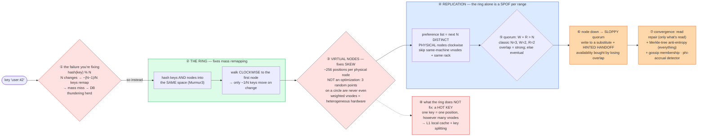

# Consistent Hashing — Mermaid Diagrams

> **Reference:** [questions.md](./questions.md) · [answers.md](./answers.md) · [deep-dive.md](./deep-dive.md) · concept primer: [fundamentals/consistent-hashing.md](../../fundamentals/consistent-hashing.md)
>
> **Note on this file:** `answers.md` already carries an extensive inline diagram set for this topic. The **one-page master diagram** below is the revision artifact — the whole mechanism on one screen.
>
> **Cross-links (depth lives there, not here):** [kv-store](../kv-store/) (preference lists, quorums, the Dynamo design that consumes this) · [distributed-caching](../distributed-caching/) (the cache cluster this shards) · [sharding-replication](../sharding-replication/) (choosing a shard key at all) · [fundamentals/quorum.md](../../fundamentals/quorum.md) · [fundamentals/hinted-handoff.md](../../fundamentals/hinted-handoff.md) · [fundamentals/phi-accrual-failure-detection.md](../../fundamentals/phi-accrual-failure-detection.md)

---

## 🎯 The One-Page Master Diagram — THE ONE TO DRAW IN THE INTERVIEW (final consolidated design)

> **When to use:** final revision, 10 minutes before the interview — and the single diagram to reproduce on the whiteboard. If you can narrate it end-to-end and name the tradeoff at each **red** box, you're ready.
> Spec: [`docs/instructions.md` §2.1](../../docs/instructions.md) · AWS names: [`docs/AWS_SERVICE_MAP.md`](../../docs/AWS_SERVICE_MAP.md).
> ⚠️ AWS services are **defensible defaults**; every quota is an order-of-magnitude planning number to **verify against current docs**.

### The central split in one sentence

**Two separate problems solved by two separate mechanisms, and conflating them is the classic error: the **ring** (hash keys and nodes into the same space, walk clockwise) fixes *mass remapping* — `hash % N` moves ~(N−1)/N of all keys when N changes and stampedes your database — while **virtual nodes** fix *uneven distribution*, because a handful of random points on a circle are never evenly spaced.**

### The 60-second narration

*(one line per numbered box ①–⑧)*

1. **Start with the failure, not the solution.** `hash(key) % N` looks fine until N changes: then roughly (N−1)/N of all keys map somewhere new. For a cache that means a near-total miss storm and a **thundering herd** onto the database behind it. Leading with this is what makes the rest obviously necessary rather than clever.
2. **The ring: hash keys *and* nodes into the same space and walk clockwise.** Now adding or removing one node only disturbs the arc between it and its predecessor — about **1/N** of keys, and nobody else's mapping changes.
3. **The first red box: virtual nodes are a correctness requirement, not a tuning knob.** Three physical nodes at three random ring positions will not split the circle evenly — one node can own half the keyspace. Giving each physical node ~256 positions (Cassandra's default) makes the distribution statistically even. It also gives you **weighted** placement for free: a bigger machine simply gets more vnodes.
4. **The ring alone is a single point of failure per key range**, so replication is the next mechanism: the preference list is the next N **distinct physical** nodes clockwise — and the word *distinct* is load-bearing, because naively walking vnodes can put all three "replicas" on one machine, or one rack.
5. **Quorum arithmetic: `W + R > N` forces the read and write sets to overlap**, which is what makes a read see the latest committed write. N=3, W=2, R=2 is the classic. Drop below the overlap and you have chosen eventual consistency — deliberately, hopefully.
6. **When a preferred replica is down, a sloppy quorum writes to a substitute** and hands it a **hint** to deliver later. Say the honest cost: you kept availability by *giving up* the overlap guarantee, so a read may miss that write until the hint is replayed.
7. **Convergence has two mechanisms with different coverage:** read repair fixes only the keys someone happens to read; Merkle-tree anti-entropy compares hash trees and syncs proportional to the *differences*, covering the cold keys nobody reads. Membership rides gossip, and failure detection should be phi-accrual so a GC pause isn't mistaken for death (which otherwise causes ring oscillation and repeated rebalances).
8. **The second red box is the honest limitation: consistent hashing does not fix a hot key.** One key hashes to one position no matter how many vnodes exist. That needs an L1 in-process cache or key splitting (`user:1:shard:N`) — a *replication* answer, not a partitioning one.

### The five numbers that justify the design

| Number | Derivation | Therefore |
|---|---|---|
| **~(N−1)/N keys remap with modulo** | 4 nodes → 5: ~80% of keys move | The number that motivates the entire topic; say it as a percentage of a real cluster |
| **~1/N keys move with the ring** | only the new node's predecessor arc | The guarantee you're buying — and the sentence to write on the whiteboard |
| **~256 vnodes per node** (Cassandra default) | variance shrinks as positions increase | Turns "statistically even" into a concrete config; also the knob for weighted/heterogeneous nodes |
| **`W + R > N` (3/2/2)** | quorum overlap | The one piece of arithmetic that decides whether reads see the latest write |
| **5M keys, 10 nodes, 200K reads/s** | stated constraints | Sizes the ring and shows the *cost of getting it wrong*: an 80% remap at 200K reads/s is a database outage |

### The patterns this assembles

| Pattern | Where | The move |
|---|---|---|
| [Scaling Writes](../../patterns/scaling-writes.md) **●** | ②③ | Partitioning is *the* write-scaling primitive; vnodes are how you keep partitions balanced |
| [Scaling Reads](../../patterns/scaling-reads.md) **●** | ④⑧ | Replicas serve reads; hot keys are solved by *more copies*, not more partitions |
| [Dealing with Contention](../../patterns/dealing-with-contention.md) ○ | ⑤ | Quorum overlap is the coordination you pay for consistency |
| [ZooKeeper & coordination](../../patterns/zookeeper.md) ○ | ⑦ | Membership can be gossip (no coordinator) or a consensus store — name which and why |
| Cross-topic | — | [kv-store](../kv-store/) consumes all of this; [distributed-caching](../distributed-caching/) uses the ring without the quorum machinery |

### The three things that break (and the mitigation)

| Failure | Blast radius | Mitigation | How you detect it |
|---|---|---|---|
| **Skewed ring (too few vnodes, or a biased hash)** | One node owns a disproportionate share — it saturates while peers idle, and "add a node" doesn't help | Enough vnodes (~256), a good hash (Murmur3), weighted vnodes for heterogeneous hardware; verify empirically rather than assuming | Per-node key-count and request ratio — **> ~2× at equal vnode counts means bias**, not bad luck |
| **Flapping node → ring oscillation** | Repeated membership changes trigger repeated rebalances; the cluster spends its capacity moving data instead of serving | Phi-accrual failure detection (suspicion scored against the node's own jitter), plus damping/hysteresis before a topology change | Membership-change rate; rebalance bytes/hour with no capacity change; suspicion-score churn |
| **Node loss with no replication (RF=1)** | For a cache: that key range misses and falls through to the DB. For a *database*: that is **data loss** | RF ≥ 3 across racks/AZs with a distinct-physical-node preference list; hinted handoff + anti-entropy to converge on recovery | Under-replicated partition count; hint queue depth and age; miss-rate spike localized to one range |

### The AWS-specific traps to name unprompted

| Trap | Why it bites here | What you say |
|---|---|---|
| **ElastiCache cluster mode uses 16,384 hash slots, not a ring** | Candidates describe Redis as a ring | *"Redis Cluster assigns explicit slots per node rather than a ring — same goal, different mechanism, and resharding migrates slots with `MOVED` redirects the client must handle."* |
| **DynamoDB hides partitioning — until it doesn't** | The abstraction leaks at hot keys | *"DynamoDB does this internally; what surfaces to me is the per-partition ceiling (~1,000 WCU **⚠️ verify**), so my job is choosing a high-cardinality partition key and write-sharding a hot one."* |
| **Keyspaces / Cassandra vnode defaults** | Config differs by version | *"Cassandra defaults around 256 vnodes historically — I'd verify the current default, since newer versions moved toward fewer vnodes with better allocation."* |
| **Pre-scale rather than reshard under load** | Rebalancing costs capacity | *"Resharding during a peak competes with serving traffic — I scale ahead of a known event."* |
| **Cross-AZ traffic is billed** | Replica placement | *"Rack/AZ-aware placement is a durability requirement *and* a cost line item — replicas spread across AZs, reads pinned locally where consistency allows."* |
| **Global Tables are LWW** | Multi-region convergence | *"Last-writer-wins can silently drop the causally-latest write under clock skew — vector clocks or CRDTs if that loss is unacceptable."* |

### If you only remember one thing

> **The ring solves mass remapping (~1/N moves instead of ~(N−1)/N) and virtual nodes solve skew — two different problems, two different mechanisms — and neither solves a hot key, which needs an extra copy rather than another partition.**
