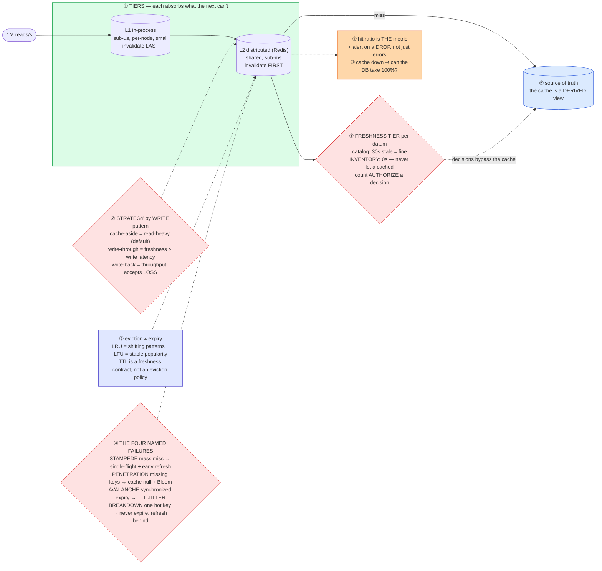

# Distributed Caching — Mermaid Diagrams

> **Reference:** [questions.md](./questions.md) · [answers.md](./answers.md) · [deep-dive.md](./deep-dive.md) · use-case survey: [fundamentals/Use_Cases_for_Caching.md](../../fundamentals/Use_Cases_for_Caching.md)
>
> **Note on this file:** the per-question diagram set (Diagrams 1–N per [`docs/instructions.md` §2.1](../../docs/instructions.md)) is still to be authored for this topic. The **one-page master diagram** below — the artifact you revise from and reproduce on the whiteboard — is complete.
>
> **Cross-links (depth lives there, not here):** [scaling-reads pattern](../../patterns/scaling-reads.md) (the full ladder) · [cdn-edge](../cdn-edge/) (the outermost tier) · [consistent-hashing](../consistent-hashing/) (how the cluster shards) · [bloom-filters](../../fundamentals/bloom-filters.md) (penetration defence) · [seat-reservation](../seat-reservation/) (when a cache must **not** be the guard) · [e-commerce](../e-commerce/) (the read path in a real system)

---

## 🎯 The One-Page Master Diagram — THE ONE TO DRAW IN THE INTERVIEW (final consolidated design)

> **When to use:** final revision, 10 minutes before the interview — and the single diagram to reproduce on the whiteboard. If you can narrate it end-to-end and name the tradeoff at each **red** box, you're ready.
> Spec: [`docs/instructions.md` §2.1](../../docs/instructions.md) · AWS names: [`docs/AWS_SERVICE_MAP.md`](../../docs/AWS_SERVICE_MAP.md).
> ⚠️ AWS services are **defensible defaults**; every quota is an order-of-magnitude planning number to **verify against current docs**.

### The central split in one sentence

**A cache is a *derived view* of the database, so the design question is never "how do I cache?" but "how stale may this data be, and who is allowed to act on it?" — reads are optimized by the write strategy you pick (cache-aside for read-heavy, write-through when freshness beats write latency, write-back only if you can lose data), and the four named failure modes (stampede, penetration, avalanche, breakdown) are what separate a real answer from "I'd put Redis in front of it."**

### The 60-second narration

*(one line per numbered box ①–⑧)*

1. **Two tiers, and the invalidation order matters.** L1 is in-process (sub-microsecond, per-node, small); L2 is the shared distributed cache. On a write you invalidate **L2 first, then L1** — the reverse order leaves a window where a node repopulates L1 from a stale L2 and pins the stale value for a full TTL.
2. **The first red box: pick the strategy from the write pattern.** Cache-aside is the default for read-heavy data (the app owns the cache; read → miss → DB → populate). Write-through when consistency matters more than write latency. Write-back only when write throughput is critical **and** you can genuinely tolerate losing recent writes — say that cost out loud, because most candidates propose write-back without acknowledging it.
3. **Eviction and expiry are different things** and interviewers probe it: eviction is what happens when memory is full (LRU for shifting access patterns, LFU for stable popularity), TTL is a *freshness contract* that fires regardless of memory pressure.
4. **The second red box is the set of four named failures — knowing the names is the signal.** **Stampede**: a mass miss floods the DB → single-flight (one loader per key) plus probabilistic early refresh. **Penetration**: repeated queries for keys that don't exist sail straight through → cache the null result, and a Bloom filter in front. **Avalanche**: many keys expire in the same second → add TTL jitter. **Breakdown**: one *hot* key expires and thousands of requests miss simultaneously → never let it expire; refresh it in the background.
5. **The third red box is the one that connects to correctness: assign a freshness tier per datum.** A catalog description can be 30 seconds stale; an inventory count cannot. State the rule as a rule: **a cached value may inform a display, but it must never *authorize* a decision** — the guard is the conditional write at the source of truth (see [seat-reservation](../seat-reservation/) and [e-commerce](../e-commerce/)).
6. **The database remains the source of truth; the cache is a derived view.** Everything above is about how fresh that view is, not about who is authoritative.
7. **Hit ratio is the metric that matters**, and the alert that catches real incidents is a *drop* in hit ratio — errors are the obvious signal, but silent misses are the expensive one.
8. **Then the question every interviewer eventually asks: if the cache disappears, can the database take 100% of traffic?** If the honest answer is no, the cache is load-bearing infrastructure — so it needs HA, request coalescing, and a circuit breaker that sheds load rather than melting the DB.

### The five numbers that justify the design

| Number | Derivation | Therefore |
|---|---|---|
| **1M reads/s at > 95% hit ratio ⇒ ~50K/s to the DB** | (1 − 0.95) × 1M | Hit ratio is a *capacity* decision, not a vanity metric: each 1% of miss rate is 10K/s more database load |
| **95% → 90% hit ratio doubles origin load** | 50K/s → 100K/s | Why you alert on hit-ratio *drops*; a 5-point dip can be an outage |
| **p99 < 5 ms cache hit vs ~800 ms uncached page** (60% of it DB time) | stated baseline | Justifies the whole tier, and tells you where the latency budget actually goes |
| **Freshness: 30 s catalog / 0 s inventory** | stated constraint | Two tiers of TTL policy in one system — and the 0 s case means "not cacheable for decisions at all" |
| **L1 hit costs ~sub-µs vs L2 ~sub-ms** | in-process vs network | Justifies the second tier for the hottest keys, and explains why L1 is what saves you during a hot-key event |

### The patterns this assembles

| Pattern | Where | The move |
|---|---|---|
| [Scaling Reads](../../patterns/scaling-reads.md) **●** | ①②④ | This topic *is* the middle of that ladder — index → cache → CDN → replicas → precompute |
| [Dealing with Contention](../../patterns/dealing-with-contention.md) **●** | ④ stampede | Single-flight is a lock on the *loader*, not on the data — the cheapest possible coordination |
| [Scaling Writes](../../patterns/scaling-writes.md) ○ | ② write-back | Batching writes through the cache is a write-scaling move that trades durability |
| [Bloom filters](../../fundamentals/bloom-filters.md) ○ | ④ penetration | "Definitely absent" lets you skip the DB entirely; false positives only cost a lookup |
| [Consistent hashing](../consistent-hashing/) ○ | cluster | How keys map to nodes, and how little moves when you resize |

### The three things that break (and the mitigation)

| Failure | Blast radius | Mitigation | How you detect it |
|---|---|---|---|
| **Cold start / mass invalidation** | Hit ratio collapses to ~0 and the full read rate lands on a database sized for the miss rate — a self-inflicted outage, usually right after a deploy or a flush | Warm the cache before taking traffic, invalidate narrowly (surrogate keys, not `FLUSHALL`), single-flight every loader, and shed load rather than queueing infinitely | Hit ratio (alert on the *derivative*), DB QPS vs provisioned, loader concurrency per key |
| **A hot key overloads one node** | One shard saturates while the rest idle; resharding does not help because the load is on a single key | L1 in-process cache absorbs most of it, key splitting (`k:shard:N`) spreads it, and never let a hot key expire synchronously | Per-key QPS distribution; single-node CPU vs fleet; latency divergence p99 vs p50 |
| **Stale cache is used as a decision input** | Overselling, double-booking, wrong prices — a *correctness* bug that caching created | Freshness tiers per datum, and the architectural rule that a cached value never authorizes a state transition — the conditional write at the source of truth is the guard | Oversell/conflict counters (should be ~0); age-of-data on decision paths; drift between cached and authoritative counts |

### The AWS-specific traps to name unprompted

| Trap | Why it bites here | What you say |
|---|---|---|
| **ElastiCache cluster-mode resharding** | Slot migration causes `MOVED` redirects and latency spikes | *"Cluster-aware client, and pre-scale before a known peak — never reshard during one."* |
| **DAX only fronts DynamoDB** | Often proposed generically | *"DAX is a DynamoDB-specific read accelerator with the same API; in front of anything else it's ElastiCache."* |
| **MemoryDB vs ElastiCache** | Durability confusion | *"If I need Redis semantics as a *database of record* that's MemoryDB (replicated log); ElastiCache is the cache — losing it must be survivable."* |
| **CloudFront is the outermost cache tier** | Treated as unrelated | *"Versioned immutable keys with long TTLs at the edge; invalidation is slow and rate-limited, so I design not to need it."* |
| **No managed circuit breaker** | Cache-down cascade | *"The breaker and the request-coalescing logic are mine — SDK retries actually make a cache outage worse."* |
| **Cross-AZ traffic is billed** | Cache reads are chatty | *"Keep the cache in the same AZ as the readers where consistency allows; cross-AZ chatter is a real line item at 1M reads/s."* |

### If you only remember one thing

> **The cache is a derived view, so the only real question is how stale each datum may be — and a cached value may inform a display but must never authorize a decision. Then name the four failure modes (stampede, penetration, avalanche, breakdown), because that's the difference between "put Redis in front of it" and a design.**
