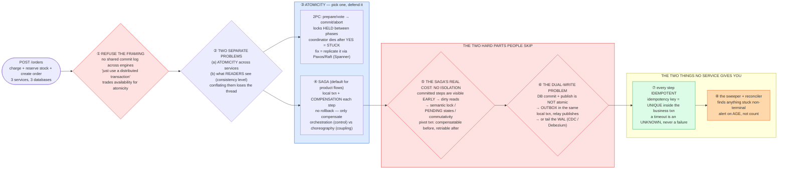

# Distributed Transactions & Consistency — Mermaid Diagrams

> **Reference:** [questions.md](./questions.md) · [answers.md](./answers.md) · [deep-dive.md](./deep-dive.md)
>
> **Note on this file:** the per-question diagram set (Diagrams 1–N per [`docs/instructions.md` §2.1](../../docs/instructions.md)) is still to be authored for this topic. The **one-page master diagram** below — the artifact you revise from and reproduce on the whiteboard — is complete.
>
> **Cross-links (depth lives there, not here):** [multi-step-processes pattern](../../patterns/multi-step-processes.md) (the canonical ladder) · [message-queues](../message-queues/) (the transport under the outbox) · [payment-system](../payment-system/) (money-grade application) · [e-commerce](../e-commerce/) / [seat-reservation](../seat-reservation/) (the saga in production) · [fundamentals/cap-theorem.md](../../fundamentals/cap-theorem.md) · [fundamentals/pacelc-theorem.md](../../fundamentals/pacelc-theorem.md)

---

## 🎯 The One-Page Master Diagram — THE ONE TO DRAW IN THE INTERVIEW (final consolidated design)

> **When to use:** final revision, 10 minutes before the interview — and the single diagram to reproduce on the whiteboard. If you can narrate it end-to-end and name the tradeoff at each **red** box, you're ready.
> Spec: [`docs/instructions.md` §2.1](../../docs/instructions.md) · AWS names: [`docs/AWS_SERVICE_MAP.md`](../../docs/AWS_SERVICE_MAP.md).
> ⚠️ AWS services are **defensible defaults**; every quota is an order-of-magnitude planning number to **verify against current docs**.

### The central split in one sentence

**Refuse the framing first — there is no cross-service `BEGIN…COMMIT`, local ACID stops at one database's boundary — then separate the two problems people conflate: **atomicity across services** (2PC blocks and is strong, a saga stays available and compensates) and **consistency of what readers see** (the CAP/PACELC and isolation axes) — and remember the best distributed transaction is the one you deleted by drawing the service boundary around a single consistency domain.**

### The 60-second narration

*(one line per numbered box ①–⑧)*

1. **The first red box is a *framing* move, and it is the highest-signal thing here: refuse the premise.** There is no cross-service `BEGIN…COMMIT` — local ACID guarantees stop at one database. So "we'll wrap it in a distributed transaction" is not a design, it's a trade of availability for atomicity that most product flows should decline.
2. **Then split the two problems people conflate:** *atomicity across services* (do all steps happen, or none?) and *what readers see* (linearizable, causal, eventual — the CAP/PACELC and isolation axes). Different tools, different failure modes.
3. **2PC exists and you should be able to explain it precisely**: prepare/vote, then commit/abort, with **locks held between the phases** — which is exactly why it blocks. Name the killer: if the coordinator dies after collecting YES votes, participants are stuck holding locks with no safe unilateral choice. 3PC's non-blocking claim assumes no partitions, which is why nobody uses it. The real fix is to make the coordinator fault-tolerant by replicating it through consensus — which is what Spanner does (2PC layered over Paxos groups, plus TrueTime).
4. **For product flows the answer is a saga**: a sequence of local transactions, each with a **compensating** action. Say the crucial distinction — there is no rollback, only compensation, and a compensation is a *new business fact* (a refund is not an un-charge). Prefer orchestration when you want one place that owns state and drives compensation; choreography buys loose coupling and costs you visibility.
5. **The second red box is the saga's genuine cost, and the thing weak answers skip: sagas have no isolation.** Step 1's commit is visible to everyone before step 3 runs, so other transactions can read a half-finished state. Mitigate with semantic locks (an explicit `PENDING` state that other readers respect), commutative operations, or re-reads at commit — and structure the flow around a **pivot transaction**: everything before it must be compensatable, everything after it must be retriable until it succeeds.
6. **The third red box is the dual-write problem**, and it's the one that bites in production: your database commit and your event publish cannot be made atomic by ordering them cleverly. Insert the event into an **outbox** table in the *same local transaction*, and let a relay publish it — or tail the write-ahead log with CDC and never dual-write at all.
7. **Every step must be idempotent**, because at-least-once retries are guaranteed. The idempotency key belongs as a `UNIQUE` constraint *inside* the business transaction, not as a check in application code. And the rule that saves you: **a timeout is an UNKNOWN, not a failure** — never blind-retry a charge; retry with the same key, or query by it.
8. **Finally, the sweeper — the component no cloud service provides.** Every async design accumulates things stuck in non-terminal states; something must find them and re-drive or compensate them. Alert on the **age** of the oldest stuck item, not the count, because a small number that never moves is the dangerous shape.

### The five numbers that justify the design

| Number | Derivation | Therefore |
|---|---|---|
| **10K order attempts/s** | stated peak | 2PC's lock-hold window at this rate would serialize the system — the throughput argument against it, before availability even comes up |
| **Payment p99 ≈ 800 ms** | stated | A remote call of this length *inside* a transaction holds locks for ~800 ms per order — quote this to kill "just put it in the transaction" |
| **Coordinator failure ⇒ participants blocked indefinitely** | 2PC semantics | The availability argument: one node's crash freezes unrelated orders until it recovers |
| **Cross-region service calls** | stated deployment | Adds a WAN round-trip per phase; 2PC across regions multiplies both latency and failure probability |
| **Exactly-once = at-least-once + idempotency** | delivery reality | There is no number for exactly-once because it doesn't exist — the design consequence is a UNIQUE key and a dedupe store |

### The patterns this assembles

| Pattern | Where | The move |
|---|---|---|
| [Multi-Step Processes](../../patterns/multi-step-processes.md) **●** | ③–⑧ | This topic *is* that pattern's theory: saga, compensation, outbox, sweeper |
| [Dealing with Contention](../../patterns/dealing-with-contention.md) **●** | ⑤⑦ | Semantic locks and `PENDING` states are contention control; the idempotency key is a rung-1 conditional write |
| [Long-Running Tasks](../../patterns/long-running-tasks.md) **●** | ⑥⑧ | Steps run as queued work with retries and DLQs; the sweeper is the reconciliation half |
| [ZooKeeper & coordination](../../patterns/zookeeper.md) ○ | ③ | If you *do* need 2PC, the coordinator must be consensus-replicated — that's where this touches [consensus](../consensus/) |
| [CAP](../../fundamentals/cap-theorem.md) / [PACELC](../../fundamentals/pacelc-theorem.md) ○ | ② | The reader-facing half; state CAP correctly (during a partition choose C or A — *not* "pick 2 of 3") |

### The three things that break (and the mitigation)

| Failure | Blast radius | Mitigation | How you detect it |
|---|---|---|---|
| **Coordinator dies mid-2PC** | Participants hold locks with no safe unilateral decision — unrelated traffic on those rows freezes until recovery | Don't use 2PC on the product hot path; if you must, replicate the coordinator through consensus and log the decision before acting | Count and **age** of in-doubt transactions; lock-wait time p99; participants in PREPARED state |
| **Saga fails after the pivot** | Some steps committed, one cannot be undone — money moved but the order can't be fulfilled | Structure around the pivot: compensatable steps before it, retriable-until-success steps after; every compensation idempotent and safe to run twice | Compensation execution rate; sagas ending in a non-terminal state; money-captured-without-fulfilment reconciler count |
| **Crash between DB commit and publish** | The order exists but nothing downstream knows — permanent silent divergence, usually found by a customer | Outbox in the same transaction + relay (or CDC); never dual-write; the relay retries until acked | Outbox backlog depth and age; events-published vs rows-committed drift; downstream-missing-order reports |

### The AWS-specific traps to name unprompted

| Trap | Why it bites here | What you say |
|---|---|---|
| **DynamoDB Streams *is* the outbox** | Strongest AWS-native answer | *"On DynamoDB I don't dual-write — Streams is a log-based outbox, so the event cannot diverge from the write."* |
| **Step Functions is the saga orchestrator** | Often hand-rolled | *"Standard for durable long-running sagas, Express for high-volume short flows — and the state machine is where compensation lives."* |
| **`TransactWriteItems` is single-table/single-region** | Assumed general-purpose | *"It's a local ACID transaction, not a distributed one — crossing services is still a saga."* |
| **AWS has no XA / cross-service transaction** | The premise of the naive answer | *"There is no managed 2PC across services; that's precisely why the saga is the default."* |
| **The sweeper is yours** | Nothing notices stuck states | *"No service will tell me an order has been PENDING for an hour — that's a scheduled reconciler I build, alerting on age."* |
| **Aurora replica lag vs read-your-writes** | Post-commit reads | *"After the saga commits, the customer's own read goes to the writer, or they'll refresh into a state that looks like failure."* |

### If you only remember one thing

> **There is no cross-service transaction: separate *atomicity* (2PC blocks — saga compensates) from *what readers see*, accept that a saga's real cost is lost isolation (so use semantic locks and a pivot transaction), fix the dual-write with an outbox in the same local transaction, make every step idempotent because a timeout is an unknown — and build the sweeper, because nothing else will notice what got stuck.**
