# E-Commerce Platform (Amazon / Shopify) — Mermaid Diagrams

> Interview-ready diagrams. Start with Diagram 1 — the **consistency gradient** (browse → cart → checkout → fulfill) is the mental model everything hangs off. Then drill into the stage the interviewer probes.
>
> Reference: [answers.md](./answers.md) | [simple-diagram.md](./simple-diagram.md)
>
> Cross-links: [kv-store](../kv-store/) (cart/Dynamo) · [seat-reservation](../seat-reservation/) (no-oversell/flash-sale) · [distributed-transactions](../distributed-transactions/) (saga/idempotency) · [message-queues](../message-queues/) (outbox) · [distributed-caching](../distributed-caching/) / [cdn-edge](../cdn-edge/) (reads) · [search-autocomplete](../search-autocomplete/) / [recommendation-system](../recommendation-system/) (discovery) · [sharding-replication](../sharding-replication/) · [rate-limiting](../rate-limiting/) · [observability](../observability/)

---

## Diagram 1 — The Consistency Gradient (Start Here)

> **When to use:** The first thing to draw. Everything hangs off the gradient: as the shopper moves browse → cart → checkout → fulfill, required consistency rises and tolerable staleness falls. Use for Q1, Q2, Q4.

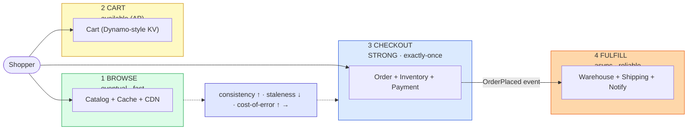

**What the interviewer is checking:**
- You split the platform by **guarantee**, not by feature — four stages, four points on the CAP spectrum.
- Browse tolerates staleness (cache/CDN); cart favors availability (AP); checkout demands strong consistency; fulfillment is async.
- You can name the cost of misapplying one stage's model to another (AP checkout oversells; CP cart loses sales).
- The `OrderPlaced` event is the seam between the synchronous buy and the async fulfillment.

---

## Diagram 2 — Catalog Read Path: Cache by Immutable Version + Availability Overlay

> **When to use:** Q6, Q7, Q9, Q29. ~90% of traffic; cache the heavy product body by version, overlay volatile price/stock, guard oversell only at checkout.

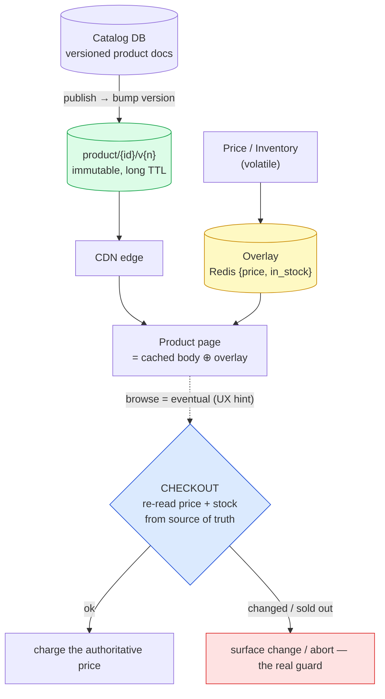

**What the interviewer is checking:**
- Cache the heavy product body by **immutable version key** (publish creates a new key, never mutate a cached object).
- Split volatile **price/availability** into a small overlay so the body stays cacheable.
- The stock badge is a **UX hint**; the oversell/price guard is the **authoritative re-read at checkout** — not the cache.
- CDC-driven purge (by surrogate key) keeps the edge fresh ([cdn-edge](../cdn-edge/)).

---

## Diagram 3 — Discovery: Search Index (via CDC) + Precomputed Recommendations

> **When to use:** Q8, Q10. Search is a separate CDC-fed index; recommendations are precomputed and looked up.

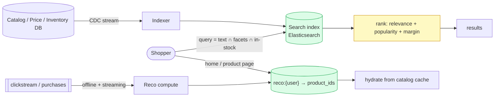

**What the interviewer is checking:**
- Search runs on a **separate inverted index fed by CDC** — never the catalog DB directly; freshness is async.
- Query combines full-text, facets, and an in-stock filter, ranked by relevance + business signals.
- Recommendations are **precomputed offline and read on the hot path** ([recommendation-system](../recommendation-system/)) — ranking never runs in the page request.

---

## Diagram 4 — Cart: Availability-First (AP) + Conflict Merge

> **When to use:** Q11, Q12, Q14. Never reject an add-to-cart; merge concurrent versions.

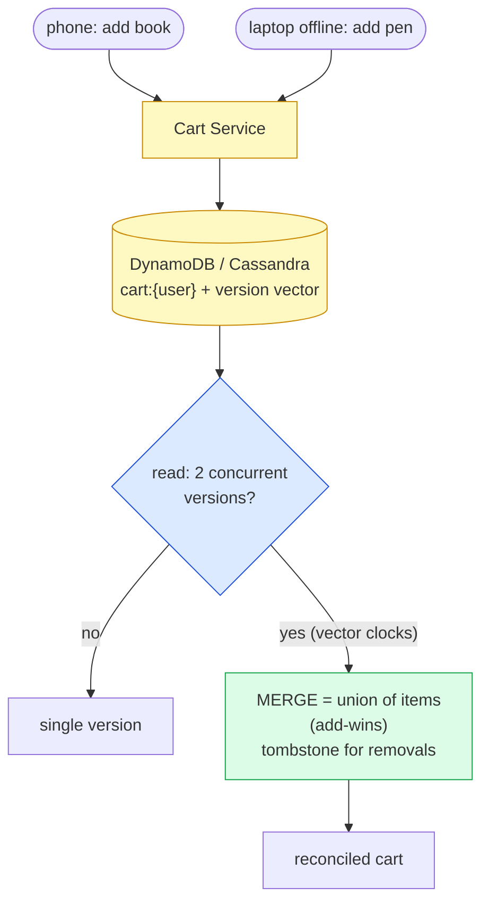

**What the interviewer is checking:**
- Cart = **AP**: always writable, because a rejected add is lost revenue (the canonical Amazon/Dynamo example, [kv-store](../kv-store/)).
- Concurrent versions detected via **vector clocks**, merged by **union (add-wins)**.
- **Removals need tombstones** or a stale add resurrects a deleted item — the subtle bit.

---

## Diagram 5 — Checkout: Revalidate → Reserve → Authorize → Commit + Outbox (Idempotent)

> **When to use:** Q15, Q16, Q17, Q18, Q22. The synchronous commit core and two-phase payment, with idempotency replay.

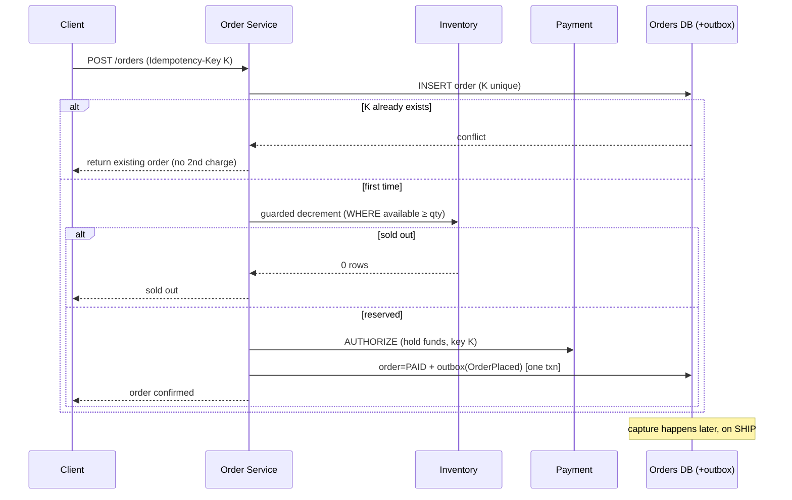

**What the interviewer is checking:**
- **Idempotency key** unique on the order row → a retry returns the same order, never a second charge.
- Oversell guarded by a **conditional decrement** (0 rows ⇒ sold out) — the single real guard.
- **Authorize now, capture on ship**; order + `OrderPlaced` written in **one txn via the outbox** (no dual-write loss).
- Only this core is synchronous; fulfillment is downstream.

---

## Diagram 6 — Inventory: Guarded Decrement + TTL Hold

> **When to use:** Q16, Q19. Reserve during checkout with a TTL so a slow payment can't oversell.

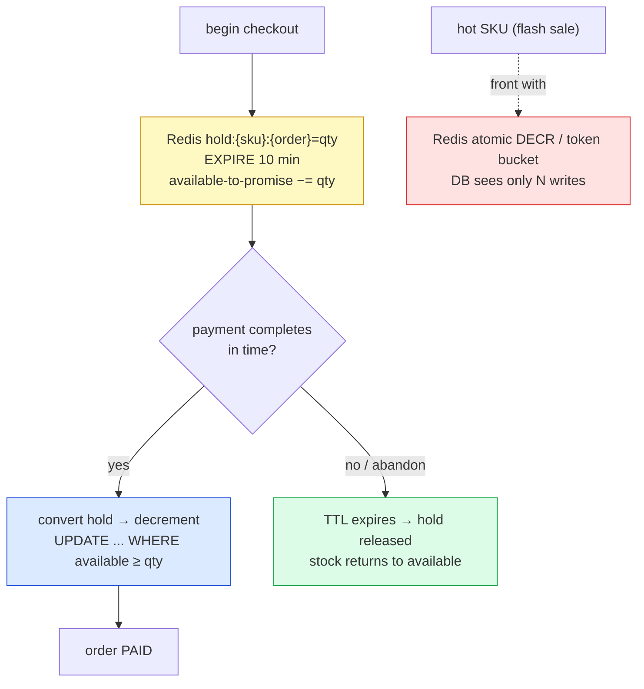

**What the interviewer is checking:**
- A **TTL hold** at checkout start prevents a slow payment from overselling and **auto-releases** on abandon.
- The authoritative decrement is a **guarded conditional update** (the [seat-reservation](../seat-reservation/) pattern).
- A hot SKU is fronted by a **Redis atomic counter/token bucket** so the DB row isn't the bottleneck.

---

## Diagram 7 — Order Saga (Orchestration + Compensations)

> **When to use:** Q20, Q21, Q23. Multi-service consistency without 2PC; compensations on failure.

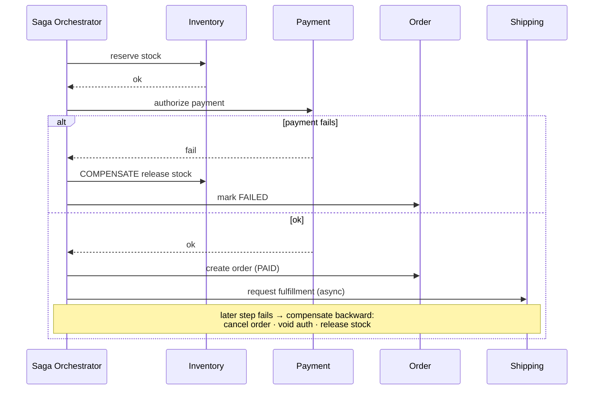

**What the interviewer is checking:**
- **Saga, not 2PC**: local txn per service + a compensating action each; backward recovery on failure.
- Compensations are concrete: release stock, void authorization, cancel order.
- **Orchestration** (a coordinator owns state) suits money-critical checkout; choreography suits loose fan-out ([distributed-transactions](../distributed-transactions/)).

---

## Diagram 8 — Transactional Outbox + Event Fan-out

> **When to use:** Q22, Q24, Q28. Atomic order+event, then async fulfillment that survives a downstream outage.

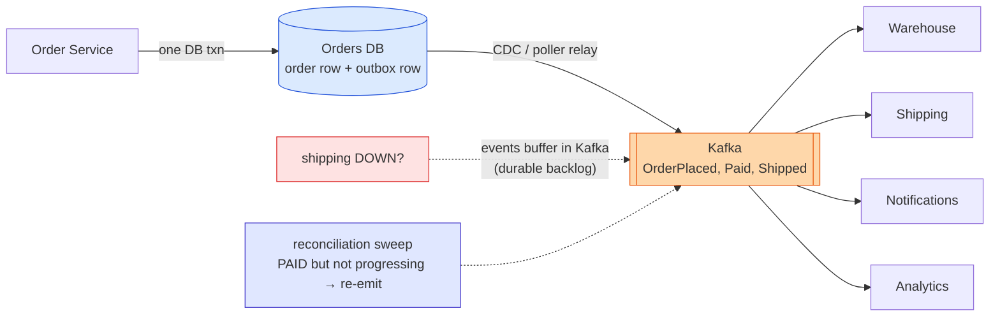

**What the interviewer is checking:**
- **Outbox**: order row + event row in one txn → the event is durable iff the order is (no lost/orphan event).
- A relay publishes at-least-once; consumers are idempotent.
- A downstream outage becomes a **durable Kafka backlog**, not a checkout failure; a **reconciliation sweep** re-emits stranded orders.

---

## Diagram 9 — Order State Machine

> **When to use:** Q23, Q32. The order lifecycle including cancel, failure, and returns.

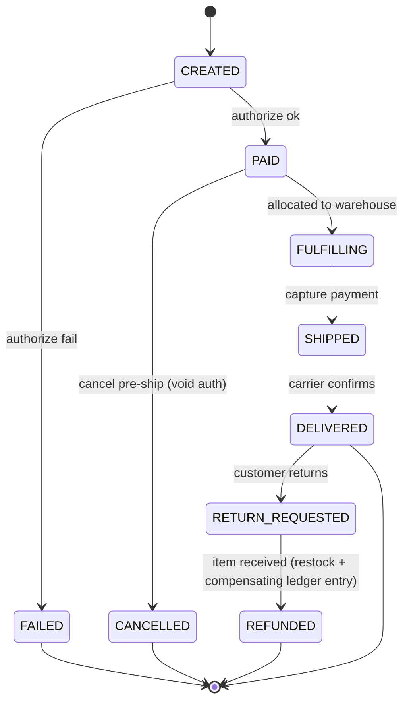

**What the interviewer is checking:**
- Explicit states + transitions, each **event-driven and idempotent**.
- **Capture on SHIPPED**, void on pre-ship cancel, refund as a **compensating ledger entry** on return.
- Failure/return branches are modeled, not hand-waved.

---

## Diagram 10 — Flash Sale: Gate the Herd Before the DB

> **When to use:** Q26, Q33. 100K buyers on one SKU at 10:00:00 without melting the inventory row.

**What the interviewer is checking:**
- Demand is **gated before the DB**: rate limit → waiting room → Redis token bucket of the actual stock.
- The SQL row sees only **as many writes as there is stock** — the herd never reaches it.
- **Fail fast + clearly** ("sold out") beats queueing everyone behind a lock ([seat-reservation](../seat-reservation/), [rate-limiting](../rate-limiting/)).

---

## Diagram 11 — Multi-Region: Global Catalog vs Regional Orders

> **When to use:** Q34, Q37. What replicates everywhere vs what pins to a region.

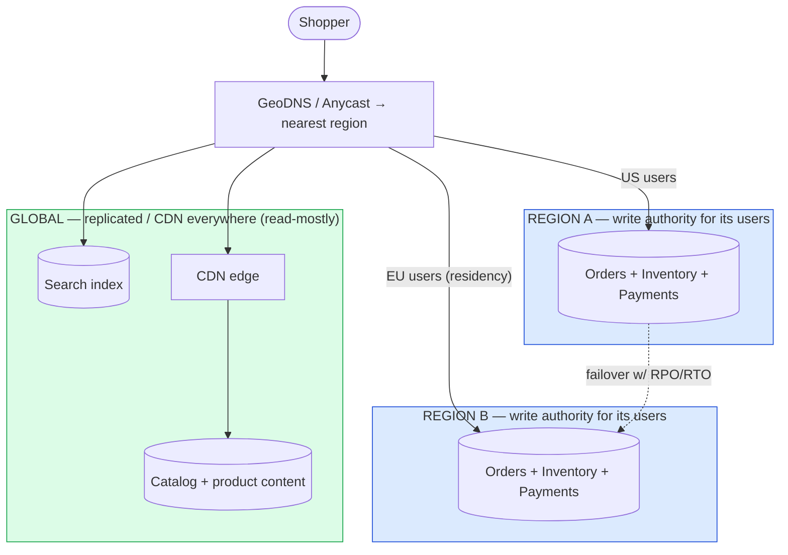

**What the interviewer is checking:**
- **Catalog global** (replicated/CDN, easy read failover); **orders/inventory/payments regional** (residency + single write authority).
- Users routed to their region; cross-region orders are the rare, explicitly-handled case.
- Order-write failover has a defined **RPO/RTO** ([cdn-edge](../cdn-edge/), [sharding-replication](../sharding-replication/)).

---

## Quick Interview Reference

### Scale numbers (order-of-magnitude — verify)

| Metric | Value | Note |
|---|---|---|
| Orders | ~230/s avg, ~10⁴/s Prime-Day peak | Low-volume, high-value |
| Product views | ~9K/s avg, ~10⁶/s peak | Reads dominate ~1000:1 |
| Catalog | ~10⁸–10⁹ SKUs | Marketplace scale |
| Conversion | ~2–3% | Most traffic is browsing |
| Correctness bar | oversell ≈ 0, double-charge ≈ 0 | Money/stock integrity |

### Domain quick-ref

| Stage | Guarantee | Store |
|---|---|---|
| Browse | Eventual, fast | CDN + Redis + DB replicas |
| Cart | Available (AP) | DynamoDB/Cassandra |
| Checkout | Strong, exactly-once | SQL + idempotency + outbox |
| Fulfillment | Async, reliable | Kafka + saga |

### Canonical tradeoffs

- **Consistency gradient** — browse eventual · cart AP · checkout strong · fulfill async.
- **Cart AP vs checkout CP** — never reject an add vs never oversell/double-charge.
- **Saga vs 2PC** — compensations + availability vs blocking atomicity.
- **Reserve-and-reconcile vs oversell-and-apologize** — correctness vs availability, per item.
- **Authorize vs capture** — confirm funds at checkout, move money on ship.

### Common mistakes

- One DB / one consistency model for all four stages.
- Stock **badge** treated as the oversell guard (it's the checkout **decrement**).
- Strongly-consistent cart that rejects writes (lost revenue).
- Capturing at checkout instead of **authorize → capture on ship**.
- Dual-write order+event without an **outbox**.
- Synchronous fulfillment chain that melts checkout on a spike.
- No **idempotency key** → double order/charge.

---

## 🎯 The One-Page Master Diagram — THE ONE TO DRAW IN THE INTERVIEW (final consolidated design)

> **When to use:** final revision, 10 minutes before the interview — and the single whiteboard diagram to reproduce from memory. It folds the **consistency gradient** — browse → cart → checkout → fulfillment — into one picture with every datastore **labeled by type**, plus the outbox + Kafka async backbone. Draw it top→down (consistency rising) and narrate each stage. Pairs with [radio-walkthrough.md](./radio-walkthrough.md).
> Spec: [`docs/instructions.md` §2.1](../../docs/instructions.md) · AWS names: [`docs/AWS_SERVICE_MAP.md`](../../docs/AWS_SERVICE_MAP.md).
> ⚠️ AWS services are **defensible defaults**; every quota is an order-of-magnitude planning number to **verify against current docs**.

### The central split in one sentence

**E-commerce is not one system but a *consistency gradient*: as the shopper moves toward the money, required consistency rises and tolerable staleness falls — browse is eventual (cache it hard), cart is availability-first (never reject a write), checkout is strongly consistent (never oversell, never double-charge), fulfillment is async (a spike becomes a backlog) — and each stage is a different CAP point demanding different infrastructure.**

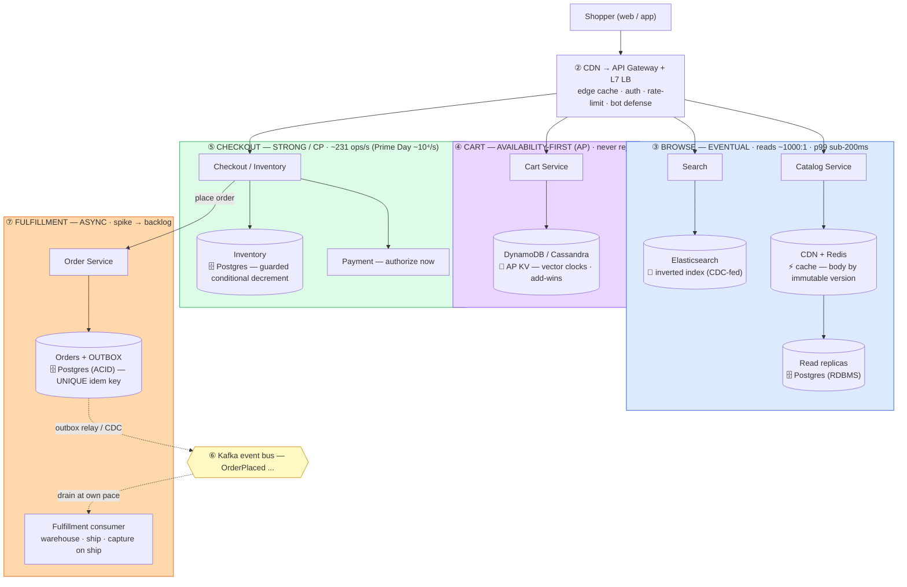

**Store-type legend (say the type, not the brand):**

| Component | Store **type** | Defensible pick | Why this type |
|---|---|---|---|
| Product body / price overlay | **Distributed cache + CDN** | Redis + CloudFront | Reads dominate ~1000:1; immutable version key → >99% hit ratio |
| Product / order / inventory truth | **RDBMS (ACID, B-tree)** | Postgres | Transactions + `UNIQUE` idempotency + guarded decrement |
| **Cart** | **AP key-value** | DynamoDB / Cassandra | Must never reject a write; merge concurrent versions |
| Product search | **Inverted index** | Elasticsearch | Faceted/fuzzy; CDC-fed, not the source of truth |
| Event backbone / outbox relay | **Log / stream** | Kafka | Replayable; turns a Prime-Day spike into a backlog |

### The 60-second narration

*(one line per numbered box — draw it in this order and say this)*

1. **Shopper + edge** — "CDN and gateway first; most traffic dies at the edge and never reaches an origin."
2. **Browse (blue)** — "eventual consistency. A stale price or stock badge is a UX blemish, not a correctness bug, so this is CDN + Redis + read replicas, with search in a CDC-fed inverted index. The product body is keyed by an **immutable version**, so a price change is a new key rather than an invalidation."
3. **Cart (purple)** — "availability-first, and this is the canonical AP subsystem — a rejected add-to-cart is *directly lost revenue*, so I take an always-writable KV store and merge concurrent versions later (add-wins union, tombstones for deletes)."
4. **Checkout (green)** — "strong consistency, and only two mechanisms matter: a **guarded conditional decrement** (`WHERE (on_hand - reserved) >= qty`; zero rows means sold out) is the *only* real oversell guard, and an **idempotency key** unique on the order row and passed to the PSP is the *only* exactly-once mechanism. The stock badge upstairs is a hint, never the guard. Authorize the card here — don't capture."
5. **Kafka via the outbox** — "the order row and its `OrderPlaced` event commit in **one local transaction**, then a relay publishes. That's why the event can never be lost or orphaned relative to the order — no dual write."
6. **Fulfillment (orange)** — "an async consumer allocates a warehouse and ships, and **captures the payment on ship**. Because it's a consumer, a Prime-Day spike becomes a durable backlog while checkout keeps committing — the spike does not melt the buy button."
7. **Arrow the gradient across the top: eventual → AP → strong → async.** That arrow *is* the answer to this question.

### The five numbers that justify the design

| Number | Derivation | Therefore |
|---|---|---|
| **Reads dominate ~1000:1** | ~30–50 product views per order at ~2–3% conversion | Spend the *scale* budget on the browse path (CDN → Redis → replicas) and the *correctness* budget on the tiny write path. This ratio is the whole architecture in one figure |
| **~230 orders/s avg, ~10⁴/s Prime-Day peak** | 20M orders/day ÷ 86,400, peaked ~50× | Order throughput is genuinely small — a single ACID writer handles the average. The peak is absorbed by queueing fulfillment, not by sharding checkout |
| **~9K product views/s avg → ~10⁶/s peak** | ~40 views/order × order rate | This is what actually needs horizontal scale, and it's all cacheable by immutable version |
| **~10⁸–10⁹ SKUs** | marketplace-scale catalog | Rules out any full-scan search; forces a CDC-fed inverted index as a *derived* store |
| **p99 < ~100–200 ms product page, globally** | stated guarantee | Edge-terminated reads; the origin is never on the critical path for a cache hit |

*(All figures order-of-magnitude — verify against primary sources.)*

### The patterns this assembles

| Pattern | Where | The move |
|---|---|---|
| [Scaling Reads](../../patterns/scaling-reads.md) **●** | ②③ browse | CDN → Redis → read replicas; immutable version keys; volatile price/stock overlaid separately from the cached body |
| [Dealing with Contention](../../patterns/dealing-with-contention.md) **●** | ⑤ checkout | Rung 1 — guarded conditional decrement; TTL hold for a hot SKU; the badge is never the guard |
| [Multi-Step Processes](../../patterns/multi-step-processes.md) **●** | ⑤⑥⑦ | Saga with compensations (release-stock ↔ reserve, void-auth ↔ authorize) + transactional outbox; orchestrated for the money path |
| [Scaling Writes](../../patterns/scaling-writes.md) ○ | ④ cart, ⑥ fulfillment | AP KV for always-writable carts; queue-absorbed fulfillment so peak ≠ peak load on the DB |
| [Long-Running Tasks](../../patterns/long-running-tasks.md) ○ | ⑥ | Async consumer + DLQ; capture-on-ship is a later step, not a blocking one |

### The three things that break (and the mitigation)

| Failure | Blast radius | Mitigation | How you detect it |
|---|---|---|---|
| **Two shoppers buy the last unit** | Oversell → cancel-and-apologize, or a physical shortfall. The badge said "2 left" for both of them | The **guarded decrement** is the only guard: zero rows updated = sold out. For a hot drop SKU, add a short TTL hold at checkout start and gate demand upstream (rate-limit + queue) | Oversell counter — this is a **correctness alarm and must sit at ≈ 0**; conditional-update conflict rate on hot SKUs |
| **Double-click / client retry on Place Order** | Two orders, two charges, one angry customer and a chargeback | Idempotency key `UNIQUE` on the order row **inside** the same transaction, and the same key passed to the PSP; the retry returns the *first* order | Duplicate-suppressed count; PSP-side duplicate rejections; orders-per-idempotency-key > 1 (must be zero) |
| **Prime-Day spike (10–50×)** | A synchronous fulfillment chain drags checkout down with it — you stop taking money at exactly the wrong moment | Fulfillment is a Kafka consumer, so the spike is a **backlog**; orders keep committing. Shed load at the edge, and never call warehouse/shipping synchronously from checkout | Consumer lag (backlog is fine, *growing unboundedly* is not); checkout success rate; add-to-cart success rate ≈ 100% |

### The AWS-specific traps to name unprompted

| Trap | Why it bites here | What you say |
|---|---|---|
| **DynamoDB Streams *is* the outbox** | Most candidates hand-roll a relay | *"On DynamoDB I don't dual-write — Streams is a log-based outbox for free. On Aurora it's an outbox table plus a relay."* |
| **Aurora replica lag breaks read-your-writes** | "My orders" page is empty right after checkout | *"Route the buyer's own post-purchase reads to the writer, or carry a session token — replicas for everyone else."* |
| **CloudFront invalidation is slow and rate-limited** | Price/stock changes constantly | *"Versioned immutable keys with long TTLs and a short-TTL overlay for price/availability — I invalidate almost never."* |
| **DynamoDB per-partition ceiling** (~1,000 WCU **⚠️ verify**) | A single viral SKU is one hot key | *"Write-shard the hot SKU key with a suffix and scatter-gather, or move that counter to a serialized path."* |
| **Provisioned vs on-demand capacity** | Prime Day blows through provisioned tables | *"On-demand for the spiky unknown, provisioned + autoscaling once the shape is known — and pre-scale before a known event rather than discovering it live."* |
| **No exactly-once, no cross-service transaction** | Both are assumed by naive designs | *"Exactly-once is at-least-once plus a UNIQUE idempotency key; across services it's a saga with compensations, never 2PC."* |

### If you only remember one thing

> **E-commerce is a consistency gradient: cache the browse path (eventual), keep the cart always-writable (AP), make checkout strongly consistent with a guarded decrement plus an idempotency key (CP), and run fulfillment as an async consumer so a spike becomes a backlog instead of a meltdown — four CAP points, four store types, one event bus.**
