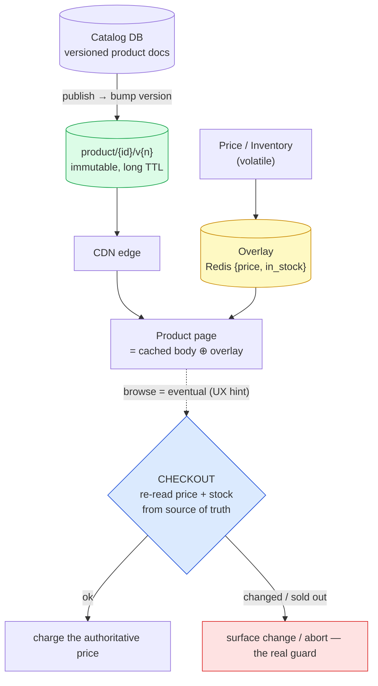
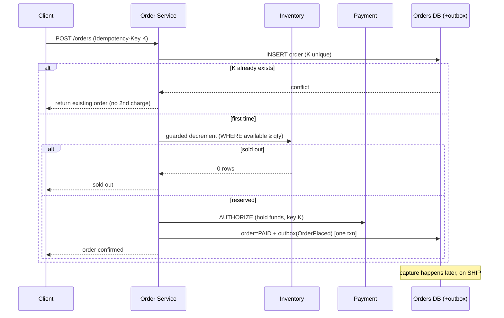
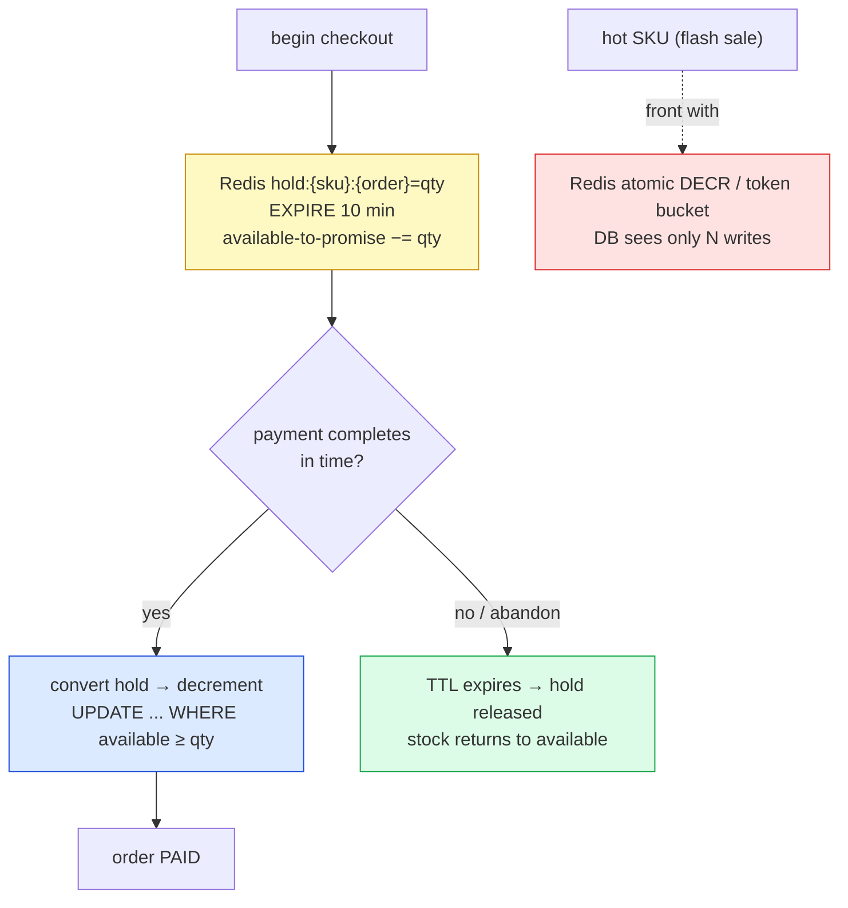
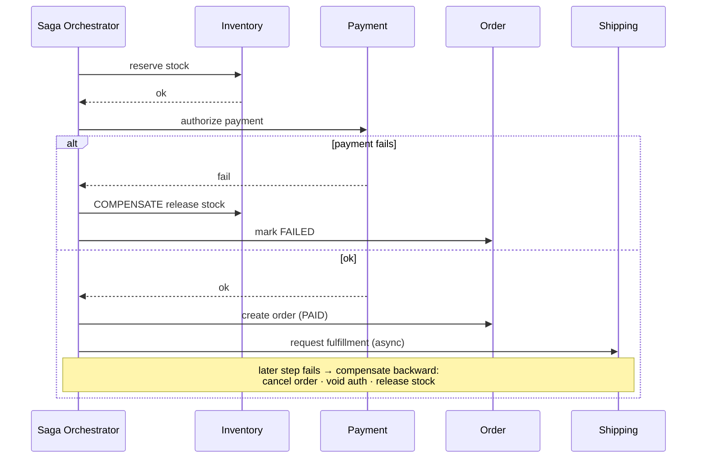
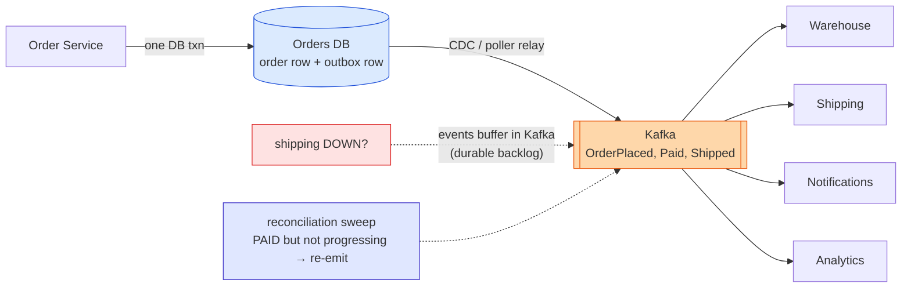
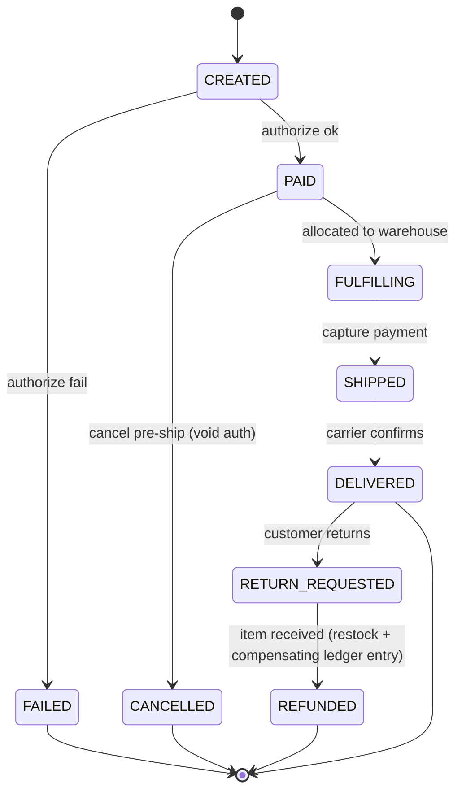
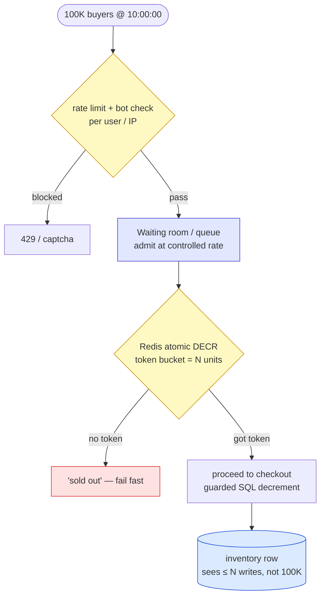
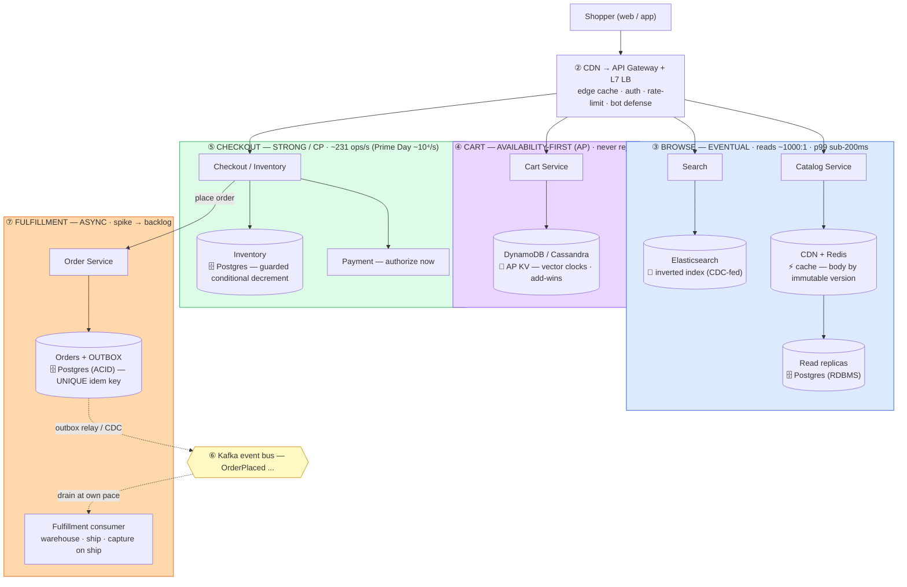

# E-Commerce Platform (Amazon / Shopify) — Mermaid Diagrams

> Interview-ready diagrams. Start with Diagram 1 — the **consistency gradient** (browse → cart → checkout → fulfill) is the mental model everything hangs off. Then drill into the stage the interviewer probes.
>
> Reference: [answers.md](./answers.md) | [simple-diagram.md](./simple-diagram.md)
>
> Cross-links: [kv-store](../kv-store/) (cart/Dynamo) · [seat-reservation](../seat-reservation/) (no-oversell/flash-sale) · [distributed-transactions](../distributed-transactions/) (saga/idempotency) · [message-queues](../message-queues/) (outbox) · [distributed-caching](../distributed-caching/) / [cdn-edge](../cdn-edge/) (reads) · [search-autocomplete](../search-autocomplete/) / [recommendation-system](../recommendation-system/) (discovery) · [sharding-replication](../sharding-replication/) · [rate-limiting](../rate-limiting/) · [observability](../observability/)

---

## Diagram 1 — The Consistency Gradient (Start Here)

> **When to use:** The first thing to draw. Everything hangs off the gradient: as the shopper moves browse → cart → checkout → fulfill, required consistency rises and tolerable staleness falls. Use for Q1, Q2, Q4.

**What the interviewer is checking:**
- You split the platform by **guarantee**, not by feature — four stages, four points on the CAP spectrum.
- Browse tolerates staleness (cache/CDN); cart favors availability (AP); checkout demands strong consistency; fulfillment is async.
- You can name the cost of misapplying one stage's model to another (AP checkout oversells; CP cart loses sales).
- The `OrderPlaced` event is the seam between the synchronous buy and the async fulfillment.

---

## Diagram 2 — Catalog Read Path: Cache by Immutable Version + Availability Overlay

> **When to use:** Q6, Q7, Q9, Q29. ~90% of traffic; cache the heavy product body by version, overlay volatile price/stock, guard oversell only at checkout.

**What the interviewer is checking:**
- Cache the heavy product body by **immutable version key** (publish creates a new key, never mutate a cached object).
- Split volatile **price/availability** into a small overlay so the body stays cacheable.
- The stock badge is a **UX hint**; the oversell/price guard is the **authoritative re-read at checkout** — not the cache.
- CDC-driven purge (by surrogate key) keeps the edge fresh ([cdn-edge](../cdn-edge/)).

---

## Diagram 3 — Discovery: Search Index (via CDC) + Precomputed Recommendations

> **When to use:** Q8, Q10. Search is a separate CDC-fed index; recommendations are precomputed and looked up.

**What the interviewer is checking:**
- Search runs on a **separate inverted index fed by CDC** — never the catalog DB directly; freshness is async.
- Query combines full-text, facets, and an in-stock filter, ranked by relevance + business signals.
- Recommendations are **precomputed offline and read on the hot path** ([recommendation-system](../recommendation-system/)) — ranking never runs in the page request.

---

## Diagram 4 — Cart: Availability-First (AP) + Conflict Merge

> **When to use:** Q11, Q12, Q14. Never reject an add-to-cart; merge concurrent versions.

**What the interviewer is checking:**
- Cart = **AP**: always writable, because a rejected add is lost revenue (the canonical Amazon/Dynamo example, [kv-store](../kv-store/)).
- Concurrent versions detected via **vector clocks**, merged by **union (add-wins)**.
- **Removals need tombstones** or a stale add resurrects a deleted item — the subtle bit.

---

## Diagram 5 — Checkout: Revalidate → Reserve → Authorize → Commit + Outbox (Idempotent)

> **When to use:** Q15, Q16, Q17, Q18, Q22. The synchronous commit core and two-phase payment, with idempotency replay.

**What the interviewer is checking:**
- **Idempotency key** unique on the order row → a retry returns the same order, never a second charge.
- Oversell guarded by a **conditional decrement** (0 rows ⇒ sold out) — the single real guard.
- **Authorize now, capture on ship**; order + `OrderPlaced` written in **one txn via the outbox** (no dual-write loss).
- Only this core is synchronous; fulfillment is downstream.

---

## Diagram 6 — Inventory: Guarded Decrement + TTL Hold

> **When to use:** Q16, Q19. Reserve during checkout with a TTL so a slow payment can't oversell.

**What the interviewer is checking:**
- A **TTL hold** at checkout start prevents a slow payment from overselling and **auto-releases** on abandon.
- The authoritative decrement is a **guarded conditional update** (the [seat-reservation](../seat-reservation/) pattern).
- A hot SKU is fronted by a **Redis atomic counter/token bucket** so the DB row isn't the bottleneck.

---

## Diagram 7 — Order Saga (Orchestration + Compensations)

> **When to use:** Q20, Q21, Q23. Multi-service consistency without 2PC; compensations on failure.

**What the interviewer is checking:**
- **Saga, not 2PC**: local txn per service + a compensating action each; backward recovery on failure.
- Compensations are concrete: release stock, void authorization, cancel order.
- **Orchestration** (a coordinator owns state) suits money-critical checkout; choreography suits loose fan-out ([distributed-transactions](../distributed-transactions/)).

---

## Diagram 8 — Transactional Outbox + Event Fan-out

> **When to use:** Q22, Q24, Q28. Atomic order+event, then async fulfillment that survives a downstream outage.

**What the interviewer is checking:**
- **Outbox**: order row + event row in one txn → the event is durable iff the order is (no lost/orphan event).
- A relay publishes at-least-once; consumers are idempotent.
- A downstream outage becomes a **durable Kafka backlog**, not a checkout failure; a **reconciliation sweep** re-emits stranded orders.

---

## Diagram 9 — Order State Machine

> **When to use:** Q23, Q32. The order lifecycle including cancel, failure, and returns.

**What the interviewer is checking:**
- Explicit states + transitions, each **event-driven and idempotent**.
- **Capture on SHIPPED**, void on pre-ship cancel, refund as a **compensating ledger entry** on return.
- Failure/return branches are modeled, not hand-waved.

---

## Diagram 10 — Flash Sale: Gate the Herd Before the DB

> **When to use:** Q26, Q33. 100K buyers on one SKU at 10:00:00 without melting the inventory row.

**What the interviewer is checking:**
- Demand is **gated before the DB**: rate limit → waiting room → Redis token bucket of the actual stock.
- The SQL row sees only **as many writes as there is stock** — the herd never reaches it.
- **Fail fast + clearly** ("sold out") beats queueing everyone behind a lock ([seat-reservation](../seat-reservation/), [rate-limiting](../rate-limiting/)).

---

## Diagram 11 — Multi-Region: Global Catalog vs Regional Orders

> **When to use:** Q34, Q37. What replicates everywhere vs what pins to a region.

**What the interviewer is checking:**
- **Catalog global** (replicated/CDN, easy read failover); **orders/inventory/payments regional** (residency + single write authority).
- Users routed to their region; cross-region orders are the rare, explicitly-handled case.
- Order-write failover has a defined **RPO/RTO** ([cdn-edge](../cdn-edge/), [sharding-replication](../sharding-replication/)).

---

## Quick Interview Reference

### Scale numbers (order-of-magnitude — verify)

| Metric | Value | Note |
|---|---|---|
| Orders | ~230/s avg, ~10⁴/s Prime-Day peak | Low-volume, high-value |
| Product views | ~9K/s avg, ~10⁶/s peak | Reads dominate ~1000:1 |
| Catalog | ~10⁸–10⁹ SKUs | Marketplace scale |
| Conversion | ~2–3% | Most traffic is browsing |
| Correctness bar | oversell ≈ 0, double-charge ≈ 0 | Money/stock integrity |

### Domain quick-ref

| Stage | Guarantee | Store |
|---|---|---|
| Browse | Eventual, fast | CDN + Redis + DB replicas |
| Cart | Available (AP) | DynamoDB/Cassandra |
| Checkout | Strong, exactly-once | SQL + idempotency + outbox |
| Fulfillment | Async, reliable | Kafka + saga |

### Canonical tradeoffs

- **Consistency gradient** — browse eventual · cart AP · checkout strong · fulfill async.
- **Cart AP vs checkout CP** — never reject an add vs never oversell/double-charge.
- **Saga vs 2PC** — compensations + availability vs blocking atomicity.
- **Reserve-and-reconcile vs oversell-and-apologize** — correctness vs availability, per item.
- **Authorize vs capture** — confirm funds at checkout, move money on ship.

### Common mistakes

- One DB / one consistency model for all four stages.
- Stock **badge** treated as the oversell guard (it's the checkout **decrement**).
- Strongly-consistent cart that rejects writes (lost revenue).
- Capturing at checkout instead of **authorize → capture on ship**.
- Dual-write order+event without an **outbox**.
- Synchronous fulfillment chain that melts checkout on a spike.
- No **idempotency key** → double order/charge.

---

## THE ONE TO DRAW IN THE INTERVIEW (final consolidated design)

> **When to use:** the single whiteboard diagram to reproduce from memory. It folds the **consistency gradient** — browse → cart → checkout → fulfillment — into one picture with every datastore **labeled by type**, plus the outbox + Kafka async backbone. Draw left→right (consistency rising) and narrate each stage. Pairs with [radio-walkthrough.md](./radio-walkthrough.md).

**Store-type legend (say the type, not the brand):**

| Component | Store **type** | Defensible pick | Why this type |
|---|---|---|---|
| Product body / price overlay | **Distributed cache + CDN** | Redis + CloudFront | Reads dominate ~1000:1; immutable version key → >99% hit ratio |
| Product / order / inventory truth | **RDBMS (ACID, B-tree)** | Postgres | Transactions + `UNIQUE` idempotency + guarded decrement |
| **Cart** | **AP key-value** | DynamoDB / Cassandra | Must never reject a write; merge concurrent versions |
| Product search | **Inverted index** | Elasticsearch | Faceted/fuzzy; CDC-fed, not the source of truth |
| Event backbone / outbox relay | **Log / stream** | Kafka | Replayable; turns a Prime-Day spike into a backlog |

**Draw it in this order (and what to say):**
1. **Shopper + edge** — "CDN and gateway first; most traffic dies at the edge."
2. **Browse (blue)** — "eventual consistency; a stale price is a UX blemish, so cache/CDN + replicas + search."
3. **Cart (purple)** — "availability-first: a rejected add-to-cart is lost money → AP KV, merge later."
4. **Checkout (green)** — "strong consistency: guarded decrement = no oversell, idempotency key = no double-charge; authorize the card here."
5. **Kafka** — "order + event committed in one txn via outbox; async from here."
6. **Fulfillment (orange)** — "consumer allocates warehouse and ships; capture on ship. A spike is a backlog, not a checkout meltdown."
7. Arrow the gradient across the top: **eventual → AP → strong → async**.

**One-line thesis to close:** *"E-commerce is a consistency gradient: cache the browse path, keep the cart always-writable, make checkout strongly consistent, and run fulfillment async — four CAP points, four store types, one event bus."*
