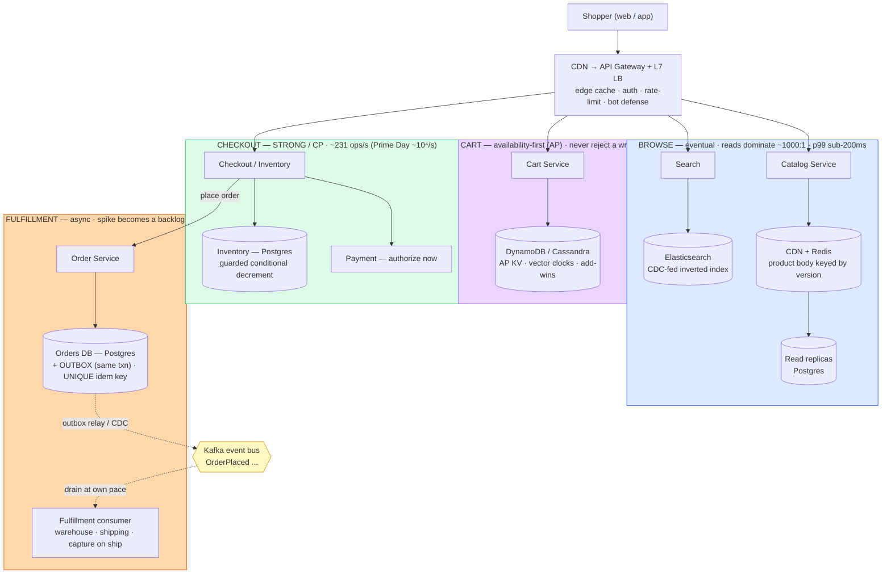
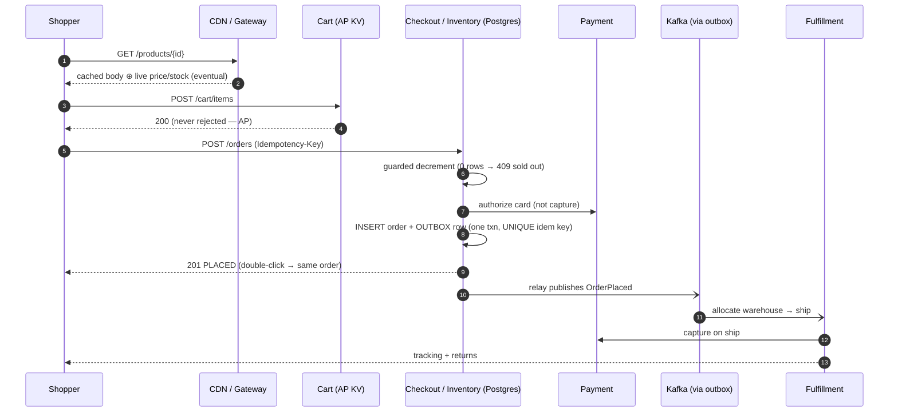
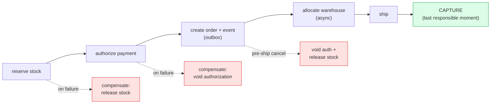

# RADIO Walkthrough — E-Commerce Platform (Amazon / Shopify)

> **What this is:** the e-commerce design performed the way you'd say it out loud in a **backend** interview, structured by the [RADIO framework](../../docs/RADIO_FRAMEWORK.md): **R**equirements → **A**rchitecture → **D**ata model → **I**nterface → **O**ptimizations.
> **How to use it:** read once for the flow, then practice saying each section from memory. Every number shows **how it was derived and what decision it drives**.
> **Depth lives elsewhere:** this is the *spine*. For the grill see [questions.md](./questions.md) / [answers.md](./answers.md); for internals [deep-dive.md](./deep-dive.md); for the money path [payment-system](../payment-system/).
> ⚠️ Numbers are order-of-magnitude teaching estimates — state them as assumptions to verify against telemetry.

---

## R — Requirements Exploration  *(~7 min)*

**Restate:** "Shoppers browse and search a huge catalog, add items to a cart across devices, check out and pay exactly once, then track an order to delivery and request returns. Sellers manage catalog/price/stock. I'll design the backend." *(Nod before drawing.)*

### Functional (in scope — the 4 stages that ARE the framing)
1. **Browse / search** — catalog listing, product detail (price + availability).
2. **Cart** — add/update items, persisted across devices.
3. **Checkout & order** — place an order atomically, pay exactly once, never oversell.
4. **Fulfillment** — order → warehouse allocation → ship → track → returns/refunds.

### Explicitly out of scope
Seller onboarding, reviews/Q&A, ads/sponsored ranking, recommendation model training, the payment *ledger internals* (delegated to [payment-system](../payment-system/)). I'll say where they attach.

### Non-functional / correctness bars
- Product-page p99 **< 100–200 ms globally**.
- **No oversell** · **no double-charge / exactly-once order** · **cart never lost** (a dropped add-to-cart is lost revenue).
- Placed+paid orders **durable**; survive **10–50× peak** (Prime Day / Black Friday) gracefully.
- Global users → edge caching + multi-region reads.

### Capacity estimate *(assumptions → arithmetic → decision)*

**Assume 20M orders/day, ~10⁸ users, ~10⁸–10⁹ SKUs** (marketplace scale).

| Quantity | Derivation | Result | **Decision it drives** |
|---|---|---|---|
| Avg order rate | 20M ÷ 86,400 s | **~231 orders/s** | Small write volume → orders are a *correctness*, not throughput, problem |
| Peak order rate | Prime-Day flash ≈ 40×+ avg | **~10⁴ orders/s** | Big *spike* on a small baseline → absorb with **async fulfillment + queue backlog**, not by over-provisioning the DB |
| Conversion | ~2–3% convert; ~30–50 product views per order | — | Establishes the read:write ratio below |
| **Product views** | ~231 orders/s × ~40 views ÷ conversion factor | **~9K/s avg, up to ~10⁶/s peak** | **Reads dominate ~1000:1** → the browse path must be served almost entirely from **CDN + cache**, never the DB |
| Catalog size | ~10⁸ SKUs × ~10 KB/product doc | **~1 TB** hot catalog | Fits in a distributed cache tier → cache the whole hot set; DB is the cold source of truth |
| Order storage / yr | 20M/day × ~2 KB × 365 | **~15 TB/yr** | Sharded Postgres handles it; shard orders by `user_id` |
| Cache hit ratio needed | to keep p99 <200 ms at 10⁶ views/s with a DB that does ~10⁴ reads/s | **> ~99%** | The design *requires* CDN + Redis; a cache miss storm is an existential failure mode → coalesce + jittered TTL |

**The headline the estimate buys you:** *"Reads outnumber order-writes ~1000:1, and the order baseline (~231/s) is tiny but spikes ~40× on Prime Day. So I spend the **scale budget on the read path** (CDN → Redis → replicas, >99% hit ratio) and the **correctness budget on the small write path** (idempotency, guarded decrement, saga). A mistake on the write path moves real money; a mistake on the read path is a stale badge."*

---

## A — Architecture / High-Level Design  *(~9 min)*

### Central split (say this FIRST)
> **"E-commerce isn't one system — it's a *consistency gradient*. As the shopper moves toward the money, required consistency rises and tolerable staleness falls: browse (eventual) → cart (availability-first / AP) → checkout (strong / CP) → fulfillment (async). Each stage is a different CAP point on different infrastructure. Putting them all on one consistency model is the classic mistake."**

### The boxes (and why each exists)



> **The gradient in one line:** left→right, required consistency **rises** (eventual → AP → strong → async) and tolerable staleness **falls**. Each subgraph is a different CAP point on different infrastructure.

**Browse (eventual):** CDN caches product bodies keyed by an **immutable version**; Redis + DB read-replicas behind it. Volatile **price/availability is overlaid separately** so the big cacheable body stays stable. ~99%+ of read traffic never touches the source of truth.

**Cart (AP — the canonical Dynamo example):** an **always-writable** store (DynamoDB/Cassandra). A rejected add-to-cart is lost money, so we choose availability over consistency; concurrent versions merge later with **vector clocks + add-wins union** (tombstones for deletes).

**Checkout (CP — the money path):** Postgres/ACID. Two guarantees, two mechanisms — the **guarded conditional inventory decrement** (no oversell) and the **idempotency key** (no double-charge). Payment is **authorized** here.

**Order + Fulfillment (async):** the order row and its `OrderPlaced` event commit in **one transaction via the outbox**; a relay publishes to Kafka. Fulfillment is an **async consumer**, so a Prime-Day spike is a **Kafka backlog, not a checkout meltdown**. Payment is **captured on ship**.

### Narrate one request end-to-end
*"Shopper opens a product → CDN serves the cached body, price/stock overlaid from Redis (eventual, fine). Add to cart → Cart service accepts unconditionally (AP). Checkout → Checkout service runs the guarded decrement (0 rows = sold out → 409), authorizes the card, and writes `order` + `OrderPlaced` in one txn with a `UNIQUE(idempotency_key)`; a double-click replays to the same order. Relay publishes `OrderPlaced` → fulfillment consumer allocates a warehouse and ships → capture on ship → tracking + returns follow."*



### Tech, framed as defensible
DynamoDB/Cassandra for cart (AP). Postgres for orders/inventory (ACID + unique idem key). Redis + CDN for the catalog read path. Elasticsearch (CDC-fed) for search. Kafka + outbox for async fulfillment. All swappable — the *properties* are the point.

---

## D — Data Model / Core Entities  *(~7 min)*

| Entity | Key fields | Owning store | Shard key ← dominant access | Why this store |
|---|---|---|---|---|
| **Product** | `product_id`, `version`, title, desc, images[], attrs | Postgres (truth) + Redis + CDN | `product_id` | Read-heavy; `version` = immutable cache key |
| **Price/Inventory** | `sku`, `warehouse_id`, price, `stock`, `reserved` | Postgres (ACID) | `sku` (+ warehouse) | Volatile, overlaid on the cached body; guarded writes |
| **Cart** | `user_id`, items[{sku,qty,version}], vector_clock | **DynamoDB / Cassandra (AP)** | `user_id` | Must never reject a write; merge concurrent versions |
| **Order** | `order_id`, `user_id`, lines[], total, `state`, **`idempotency_key`** | **Postgres (ACID)** | `user_id` | Money + state machine; `UNIQUE` idem key |
| **Payment** | `payment_id`, `order_id`, `auth_id`, `capture_id`, state | Payment service DB | `order_id` | authorize→capture; depth in [payment-system](../payment-system/) |
| **Shipment** | `shipment_id`, `order_id`, `warehouse_id`, carrier, tracking# | Fulfillment DB | `order_id` | Written by the async consumer |
| **Outbox** | `event_id`, `order_id`, type, payload | **Same DB as Order** | `order_id` | Atomic with the order → no lost/orphan event |
| **SearchDoc** | `product_id`, tokenized fields, facets | Elasticsearch (CDC-fed) | product/route | Inverted index; not the source of truth |

**The modeling decisions that carry signal:**
1. **Cart and Order live in *different* stores with *different* consistency** — cart in an AP KV (never reject), order in ACID Postgres (never oversell/double-charge). They are the two poles of the gradient; putting the cart in Postgres to "keep it simple" loses sales during a partition.
2. **Product body vs price/availability are separate** — the big body is immutable & cache-friendly (versioned); the volatile overlay is fetched separately and re-checked authoritatively at checkout. The "Only 2 left" badge is a **UX hint, not the oversell guard**.
3. **Shard by the dominant access pattern:** products by `product_id`, orders by `user_id`, inventory by `sku`. Cross-shard joins are scatter-gather → avoided by choosing keys to match reads.

---

## I — Interface / API Definition  *(~7 min)*

```http
# --- Browse (read, cacheable, eventual) ---
GET /products?q={}&filters={}&cursor={}
    → 200 {products:[...], next_cursor}          # cursor pagination; ES-backed
    # Cache-Control: public, max-age=60

GET /products/{id}
    → 200 {product, version, price, availability} # body from CDN (by version) + live overlay from Redis

# --- Cart (write, AP — must ALWAYS succeed) ---
POST /cart/items
    Body: {sku, qty}
    → 200 {cart}                                  # unconditional accept; never 5xx on a partition
    # concurrent device writes merge via vector clock + add-wins

# --- Checkout (write, strong, exactly-once) ---
POST /orders
    Headers: Idempotency-Key: {uuid}              # double-click / retry → SAME order, never a 2nd charge
    Body: {cart_id, address, payment_token}
    → 201 {order_id, state:"PLACED"}              # payment AUTHORIZED; inventory reserved
    → 409 {error:"OUT_OF_STOCK", sku}             # guarded decrement returned 0 rows
    → 402 {error:"PAYMENT_DECLINED"}
    → 200 {order_id}  (idempotent replay — original returned, no side effects)

# --- Fulfillment & returns (async) ---
GET  /orders/{id}      → 200 {state, shipment?, tracking?}
POST /orders/{id}/returns  Body:{lines[], reason} → 202 {return_id, state:"REQUESTED"}
```

**Contract decisions to say out loud:**
- **`Idempotency-Key` on `POST /orders`** — the key is a `UNIQUE` column in the order transaction *and* is passed to the PSP, so a retry returns the same order and never a second charge. The single highest-signal line in the whole API.
- **`POST /cart/items` must never return 5xx on a partition** — it's the AP contract in HTTP form; that's *why* the cart isn't on Postgres.
- **Checkout is synchronous** (shopper needs an answer) **but fulfillment is async** — `POST /orders` returns `201 PLACED` immediately; shipment appears later via the order-status read.
- **Returns are `202 Accepted`** — a workflow, not an instant mutation.
- **Cursor pagination** everywhere — offset scans don't survive a 10⁸–10⁹ SKU catalog.

---

## O — Optimizations & Deep Dive  *(~15 min — the scoring section)*

Two deep dives: (1) the read path at 10⁶ views/s (the *scale* problem) and (2) the checkout correctness trio (the *money* problem). **Bottleneck → options → pick → failure mode → detect/recover.**

### Deep dive 1 — Serving the catalog read path at ~10⁶ views/s, p99 <200 ms

**Bottleneck:** the DB does maybe ~10⁴ reads/s per node; peak demand is ~10⁶/s. You *cannot* serve this from the DB — you need a **>99% cache hit ratio**, which the design must guarantee, not hope for.

**Design (layered, cheapest first):**
- **CDN at the edge** — product bodies are keyed by an **immutable `version`**, so they're infinitely cacheable; a catalog edit **bumps the version → new key → old ages out**, purged by **surrogate key**. No in-place invalidation races.
- **Redis** in front of read-replicas for the volatile **price/availability overlay** (short TTL, e.g. 5–30 s — a slightly stale price is acceptable; oversell is caught at checkout anyway).
- **Read-replicas** as the last line before the primary; the primary is reserved for writes.

**Failure modes & recovery:**
- **Cache stampede / thundering herd** when a hot key expires (10⁶ clients miss at once) → **request coalescing** (single-flight: one miss fetches, the rest wait) + **jittered TTLs** so keys don't expire in lockstep + optional **stale-while-revalidate**.
- **Hot key** (a viral product) → the CDN absorbs most of it; for the overlay, replicate the hot key across cache nodes or add a tiny local in-process cache.
- **Detect:** cache hit ratio (alarm if it dips below ~99%), origin QPS (should be near-flat under a traffic spike), p99 product-page latency.

### Deep dive 2 — Checkout correctness: no-oversell + exactly-once + the saga

**Bottleneck:** money and stock change hands across service-owned DBs with no shared transaction; a double-click or a retry must be harmless; a partial failure must not corrupt the order.

**Mechanism 1 — No oversell = guarded conditional decrement** (the *only* real guard):
```sql
UPDATE inventory SET reserved = reserved + :qty
WHERE sku = :sku AND (stock - reserved) >= :qty;
-- 0 rows updated  →  sold out  →  return 409
```
The "Only 2 left" badge is an eventually-consistent **UX hint** served from cache — it is *not* the guard. Overselling is prevented solely by this atomic check at checkout. Conflating the two is the classic mistake (same lesson as [food-delivery](../food-delivery/radio-walkthrough.md) "sold out" propagation).

**Mechanism 2 — Exactly-once = idempotency key + transactional outbox:**
- `INSERT order (..., idempotency_key)` with a `UNIQUE` constraint → a duplicate throws → return the original order, and crucially the **same key is sent to the PSP** so the card is never charged twice.
- The `order` row + `OrderPlaced` outbox row commit in **one local transaction**; a relay/CDC publishes it. This kills the **dual-write problem** — "order committed but event lost" is structurally impossible.

**Mechanism 3 — Saga + compensation** (orchestrated for the money path):

- **Authorize at checkout, capture on ship** — last-responsible-moment: you don't take the money until the goods actually leave.
- **Belt-and-suspenders:** a reconciliation sweep re-emits `OrderPlaced` for any `PAID` order with no fulfillment progress after T minutes; idempotent consumers dedupe by `order_id` → no paid order is ever stranded.

**Failure modes & recovery:**
- **PSP timeout** → *never trust a timeout* — treat as UNKNOWN, retry with the same idempotency key or query by key before deciding ([payment-system](../payment-system/)).
- **Flash-sale on one hot SKU** → the guarded decrement serializes on one row → front it with a **Redis TTL hold** / queue at the SKU, and a virtual waiting room ([seat-reservation](../seat-reservation/) pattern).

### Peak & graceful degradation (Prime Day ~40×)
- **Async fulfillment turns the spike into a Kafka backlog** — orders keep committing and confirming while shipping catches up.
- **Load-shed by priority:** protect checkout; degrade browse to longer-TTL cached pages; defer non-critical writes (reviews, recos).
- **What to measure (funnel SLOs):** add-to-cart success rate, checkout success rate, **oversell count ≈ 0** (correctness alarm), **double-charge count ≈ 0**, p99 product-page latency, cache hit ratio.

---

## 30-second recap (say this to close)

> "Model it as a **consistency gradient**: browse is eventual so it lives on CDN → Redis → replicas at >99% hit ratio because reads dominate ~1000:1; the **cart is AP** on a Dynamo-style store because a rejected add-to-cart is lost money; **checkout is CP** on Postgres because ~231 orders/s is tiny but must be perfectly correct — a guarded conditional decrement for no-oversell and a unique idempotency key for no-double-charge; **fulfillment is async** via an outbox + Kafka, so a 40× Prime-Day spike becomes a backlog, not a meltdown. Authorize at checkout, capture on ship. Spend scale budget on the read path, correctness budget on the write path."

*See also: [food-delivery RADIO walkthrough](../food-delivery/radio-walkthrough.md) for the same read/write/async split on a different domain, and [`docs/RADIO_FRAMEWORK.md`](../../docs/RADIO_FRAMEWORK.md) for the estimation toolkit.*
