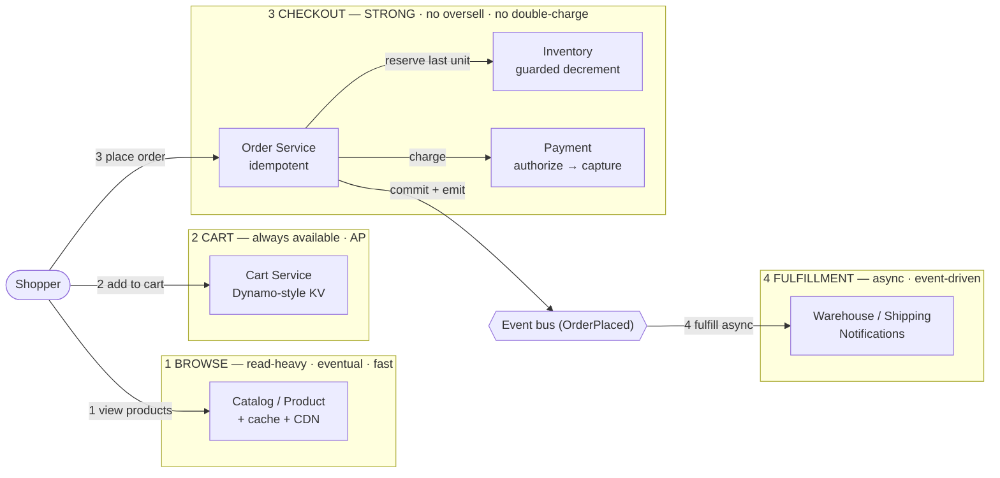
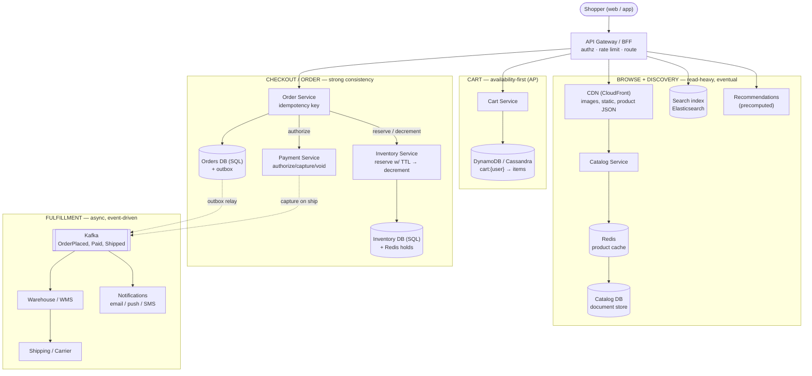

# E-Commerce Platform (Amazon) — Simple Component Diagram

> The bare-minimum mental model. Four stages, left to right, along **the consistency gradient**: **browse** → **cart** → **checkout** → **fulfillment**.
> Everything else (search, recommendations, returns, multi-region, fraud) hangs off these boxes.

## The 6 components to remember

| Component | Job (one line) |
|---|---|
| **Catalog / Product** | Serves product pages + search; read-heavy, cached hard, stale-tolerant. |
| **Cart Service** | Holds the shopper's items; must *never* reject an add-to-cart → an AP (Dynamo-style) store. |
| **Order Service** | Turns a cart into exactly one order and one charge; idempotent, transactional. |
| **Inventory** | The authoritative stock count; a guarded decrement at checkout is the *only* real oversell guard. |
| **Payment** | Authorizes at checkout, captures on fulfillment; idempotent so a retry never double-charges. |
| **Event bus + Fulfillment** | `OrderPlaced` fans out to warehouse, shipping, email, analytics — async, so a spike is a queue, not a meltdown. |

## The one idea that ties it together

**Consistency ratchets up as the shopper moves from browse to buy — so does the cost of getting it wrong, and so must the infrastructure.** *Browsing* is ~90% of traffic and tolerates stale data → cache, CDN, read replicas. The *cart* must never be unavailable (a failed "add to cart" is lost revenue) → an availability-first AP store that resolves conflicts by merging. *Checkout* must be exactly-once and never oversell or double-charge → the source of truth, transactions, idempotency keys, a guarded inventory decrement. *Fulfillment* must be reliable but not synchronous → an event-driven saga so a Prime-Day spike backs up as a Kafka backlog instead of collapsing the checkout. Applying one stage's guarantees to another is the classic mistake — a strongly-consistent cart that rejects writes during a partition loses sales; an eventually-consistent checkout oversells.

---

# Detailed Diagram — with Services & Protocols

> Same four stages, now labeled with concrete service/technology picks and the protocols you'd name in a senior interview.
> Note: these are *defensible* picks, not the only valid ones. Pick and defend — don't memorize as gospel.

## Service cheat-sheet (what maps to what)

| Concept | Service | One-line why |
|---|---|---|
| Product images + static + product JSON | **CDN (CloudFront)** | Bulk of bytes and requests; cache at edge near the shopper ([cdn-edge](../cdn-edge/)) |
| Product read cache | **Redis** in front of the catalog DB | ~90% of traffic is product reads; absorb it before the DB ([distributed-caching](../distributed-caching/)) |
| Catalog store | **Document store (DynamoDB / MongoDB)** | Products are document-shaped, read-mostly, keyed by product_id |
| Search & filter | **Elasticsearch**, fed by CDC | `keyword ∩ facets ∩ in-stock`; kept fresh async ([search-autocomplete](../search-autocomplete/)) |
| Recommendations | **Precomputed, looked up** | Heavy ranking offline; hot path just reads ([recommendation-system](../recommendation-system/)) |
| Cart | **DynamoDB / Cassandra (AP)** | Never reject add-to-cart; merge conflicting versions ([kv-store](../kv-store/)) |
| Orders | **SQL (Postgres/Spanner) + outbox** | Transactional, queryable, idempotent; the money record |
| Inventory | **SQL guarded decrement + Redis TTL holds** | `UPDATE … WHERE stock ≥ qty`; hold during checkout ([seat-reservation](../seat-reservation/)) |
| Payment | **Payment Service, idempotency key = order id** | Authorize at checkout, capture on ship; retry never double-charges (deep dive → [payment-system](../payment-system/)) |
| Order orchestration | **Kafka + saga + transactional outbox** | Commit order + emit `OrderPlaced` atomically; async fulfillment ([message-queues](../message-queues/), [distributed-transactions](../distributed-transactions/)) |
| Notifications | **Multi-channel service** | Order status via email/push/SMS ([notification-system](../notification-system/)) |

## Protocols worth naming

- **HTTP/2 + REST/GraphQL** — client ↔ gateway/BFF; GraphQL lets the product page fetch product + reviews + recommendations in one round trip.
- **Idempotency-Key header** — on `POST /orders` and payment calls; a retry returns the *same* order, never a second one ([api-design](../api-design/)).
- **gRPC + Protobuf** — east-west between internal services (Order ↔ Inventory ↔ Payment).
- **CDC (change data capture)** — catalog/price/inventory changes stream to the search index and caches, keeping derived data fresh without dual-writes.
- **Cache-Control / s-maxage + surrogate keys** — product pages cached at the CDN; a price change purges by surrogate key ([cdn-edge](../cdn-edge/)).
