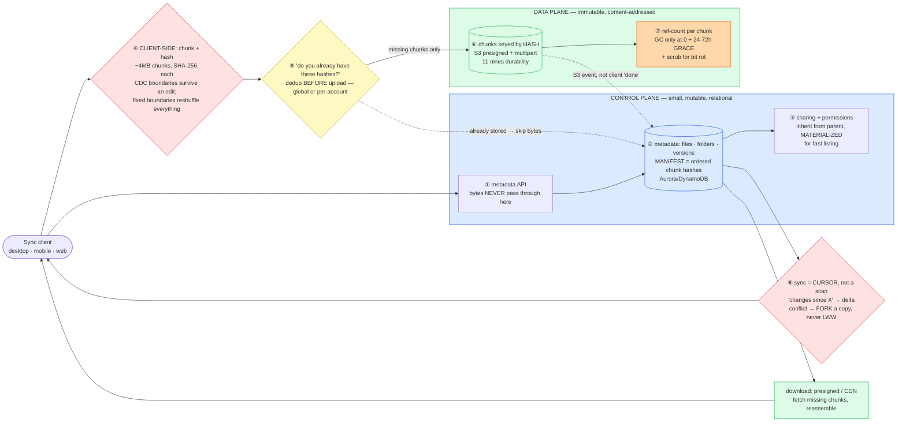

# File Storage & Sync (Dropbox / Google Drive) — Mermaid Diagrams

> **Reference:** [questions.md](./questions.md) · [answers.md](./answers.md) · [deep-dive.md](./deep-dive.md)
>
> **Note on this file:** the per-question diagram set (Diagrams 1–N per [`docs/instructions.md` §2.1](../../docs/instructions.md)) is still to be authored for this topic. The **one-page master diagram** below — the artifact you revise from and reproduce on the whiteboard — is complete.
>
> Cross-links: [large-blobs pattern](../../patterns/large-blobs.md) · [cdn-edge](../cdn-edge/) · [kv-store](../kv-store/) (metadata) · [collaborative-editing](../collaborative-editing/) (the real-time cousin) · [storage-engines](../storage-engines/) · [message-queues](../message-queues/)

---

## 🎯 The One-Page Master Diagram — THE ONE TO DRAW IN THE INTERVIEW (final consolidated design)

> **When to use:** final revision, 10 minutes before the interview — and the single diagram to reproduce on the whiteboard. If you can narrate it end-to-end and name the tradeoff at each **red** box, you're ready.
> Spec: [`docs/instructions.md` §2.1](../../docs/instructions.md) · AWS names: [`docs/AWS_SERVICE_MAP.md`](../../docs/AWS_SERVICE_MAP.md).
> ⚠️ AWS services are **defensible defaults**; every quota is an order-of-magnitude planning number to **verify against current docs**.

### The central split in one sentence

**Separate *metadata* from *content*: metadata (names, folders, versions, permissions, the chunk manifest) is small, mutable and relational; content is immutable, content-addressed bytes in object storage that the client uploads **directly** — and because files are chunked and addressed by hash, deduplication and "instant sync" of a one-paragraph edit fall out for free.**

### The 60-second narration

*(one line per numbered box ①–⑧)*

1. **The metadata API never touches file bytes.** Say this early — it's the difference between a design that scales to 500 PB and one where your app servers are a bandwidth bottleneck. Clients get a presigned URL and upload straight to object storage.
2. **Metadata is the mutable half**: names, folder tree, versions, and the **manifest** — an ordered list of chunk hashes. A file *is* its manifest; the bytes are interchangeable.
3. **Permissions inherit from the parent folder but are materialized** so a folder listing doesn't walk the tree on every request.
4. **The first red box is chunking, done on the client: ~4 MB chunks, each hashed.** And name the subtlety: with *fixed* boundaries, inserting a byte at the front reshuffles every subsequent chunk and you re-upload the whole file; with **content-defined boundaries** (CDC), the boundaries move with the content, so a one-paragraph edit touches one or two chunks. That is the entire secret of "instant sync."
5. **Before uploading, ask which hashes the server already has.** Two users uploading the same 4 GB movie store it once. Note the honest security caveat: *global* cross-user dedup can leak whether a file exists, so many systems scope dedup per account.
6. **Chunks are stored by hash — immutable, content-addressed.** You never update a file in place; a new version is a new manifest over mostly-existing chunks.
7. **Because chunks are shared, deletion is reference-counted**, and you only collect at zero *after a grace period* (24–72 h) — otherwise an upload racing a GC deletes a chunk someone just referenced. A background scrub re-hashes chunks to catch bit rot.
8. **The second red box is sync: a cursor, never a scan.** The client says "changes since cursor X" and gets a delta plus a new cursor. And on conflict, **fork** — write a conflicted copy — because last-write-wins silently destroys someone's work, which in a file sync product is unforgivable.

One more thing to say unprompted: trust the **storage event**, not the client's "I'm done" call, to mark an upload complete — plus a sweeper for orphans.

### The five numbers that justify the design

| Number | Derivation | Therefore |
|---|---|---|
| **500 PB total** (500M users × ~10 GB) | stated constraints | Object storage with tiering is the only economically viable content plane; dedup is a *cost* feature, not a nicety |
| **~4 MB chunk size** | balance of request overhead vs re-upload waste | Small enough that a one-paragraph edit re-uploads ~4–8 MB, large enough that a 50 GB file isn't millions of requests |
| **Files 1 KB → 50 GB** | stated range | Forces multipart upload with resumability — a single PUT cannot express a 50 GB upload over a flaky laptop connection |
| **11 nines durability, 99.99% availability** | stated constraints | Durability is delegated to the object store (plus scrub); *availability* is your metadata tier's problem, and they're different budgets |
| **< 10 s sync latency for small files** | stated SLA | Sync is event/cursor-driven, not polling-driven — a poll interval can't hit 10 s at 100M DAU without melting the metadata tier |

### The patterns this assembles

| Pattern | Where | The move |
|---|---|---|
| [Handling Large Blobs](../../patterns/large-blobs.md) **●** | ①④⑥ | Presigned + multipart, bytes bypass the API, trust the storage event over the client's completion call |
| [Scaling Reads](../../patterns/scaling-reads.md) **●** | download | Presigned/CDN delivery; metadata cached; the chunk store is effectively immutable so it caches perfectly |
| [Multi-Step Processes](../../patterns/multi-step-processes.md) **●** | ⑥⑦ | Upload → event → metadata commit → GC/scrub, each idempotent; a sweeper reconciles orphans |
| [Dealing with Contention](../../patterns/dealing-with-contention.md) ○ | ⑧ | Concurrent edits resolved by fork-on-conflict (never LWW); manifest updates are conditional writes |
| [Scaling Writes](../../patterns/scaling-writes.md) ○ | ⑦ | Ref-count updates are the hot metadata write — batch them, and never make GC synchronous |

### The three things that break (and the mitigation)

| Failure | Blast radius | Mitigation | How you detect it |
|---|---|---|---|
| **Metadata says `UPLOADED`, storage has nothing** (or the reverse) | A file that lists but cannot download — the most confusing possible user-facing bug | Mark complete from the **storage event**, never the client's claim; a sweeper reconciles both directions (orphan chunks, dangling manifests) | Orphan-chunk count and dangling-manifest count from the reconciler; download 404 rate on listed files |
| **GC deletes a chunk that an in-flight upload just referenced** | Silent data loss inside a file that appeared to upload fine | Reference counting plus a **grace period** (24–72 h) before physical deletion; re-check the count at delete time | Chunk-not-found on read (should be zero); GC deletion volume vs ref-count-zero volume |
| **Two devices edit the same file offline** | Last-write-wins would silently discard one person's work | **Fork**: keep both, name one a conflicted copy, and let the human decide. Version history makes it recoverable either way | Conflict-copy creation rate (a spike means a sync bug, not user behaviour); version-count distribution |

### The AWS-specific traps to name unprompted

| Trap | Why it bites here | What you say |
|---|---|---|
| **S3 request rate is per prefix** (~3,500 PUT / ~5,500 GET **⚠️ verify**) | Hash-keyed chunks help, date-keyed uploads don't | *"Content-hash keys spread naturally across prefixes — a single date prefix would be the hotspot."* |
| **S3 is not a filesystem** (no atomic rename) | A rename looks like a move | *"Renames are a metadata-only operation; the bytes never move, which is also why rename is instant."* |
| **Trust the S3 event, not the client** | The classic state-sync bug | *"S3 Event Notification → SQS marks the upload complete, plus a sweeper for orphans."* |
| **Multipart uploads leak storage if abandoned** | Big files, flaky clients | *"A lifecycle rule aborts incomplete multipart uploads — otherwise you pay for invisible bytes forever."* |
| **Glacier retrieval latency tiers** | Cold versions | *"Old versions tier to Glacier — Instant Retrieval if I need ms reads, Flexible/Deep only where minutes-to-hours is acceptable."* |
| **DynamoDB item size limit** (~400 KB **⚠️ verify**) | A 50 GB file's manifest is huge | *"The manifest for a very large file is chunk-list-in-S3 with metadata pointing at it, or split across items — I wouldn't assume one item holds it."* |

### If you only remember one thing

> **Metadata and content are two different systems: small mutable relational metadata (including the manifest of chunk hashes) versus immutable content-addressed chunks the client uploads directly to object storage — and content-defined chunking plus a sync cursor is what turns "re-upload the file" into "send the two chunks that changed."**
