# Food Delivery (DoorDash / Swiggy / Uber Eats) — Mermaid Diagrams

> Interview-ready diagrams. Start with Diagram 1 — the **three-path architecture** is the mental model everything hangs off. Then drill into the layer the interviewer probes.
>
> Reference: [answers.md](./answers.md) | [conducive-sentences.md](./conducive-sentences.md)
>
> Cross-links: [ride-sharing](../ride-sharing/) · [seat-reservation](../seat-reservation/) · [message-queues](../message-queues/) · [distributed-transactions](../distributed-transactions/) · [notification-system](../notification-system/)

---

## Diagram 1 — The Three-Path Architecture (Start Here)

> **When to use:** The first thing to draw. Everything hangs off separating the three traffic paths — browse (cache/eventual), order (strong), track (streaming) — across three actors. Use for Q1, Q2, Q4.

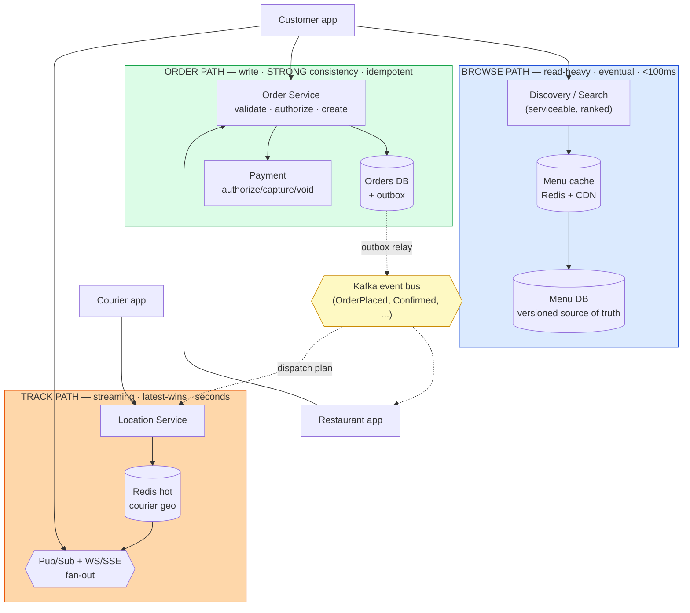

**What the interviewer is checking:**
- You separate the three paths and give each its own guarantees/infra — not one monolithic service or DB.
- Browse tolerates staleness (cache/CDN/replicas); order needs strong consistency + idempotency; track is an ephemeral firehose (pub-sub fan-out).
- The three actors (customer, restaurant, courier) are all first-class — the restaurant is not a passive resource.
- The order path commits synchronously then emits events (Kafka) — fulfillment is downstream and async (Diagram 6).

---

## Diagram 2 — Menu: Immutable Body + Volatile Availability Overlay

> **When to use:** Q6–Q9. The key insight: cache the heavy menu by immutable version; layer the small volatile availability on top; oversell is guarded only at checkout.

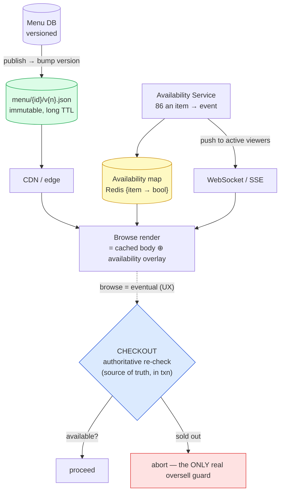

**What the interviewer is checking:**
- Cache by `menu_version` (immutable key) so a publish creates a new key rather than mutating a cached object — same as immutable video segments.
- Availability is split out as a small live overlay so the heavy body stays cacheable.
- Fast "sold out" propagation is UX only — it shrinks the window; **oversell is prevented only by the authoritative checkout re-check** (in the order txn).
- For counted inventory, that check is a guarded decrement (the [seat-reservation](../seat-reservation/) no-oversell pattern).

---

## Diagram 3 — Discovery: Serviceability Filter Pipeline

> **When to use:** Q11–Q14. Serviceability is a filter pipeline over geo candidates, not a radius sort.

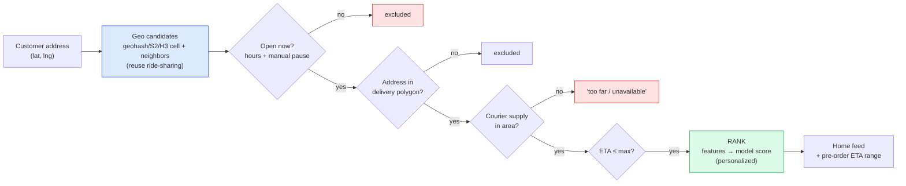

**What the interviewer is checking:**
- Geospatial "nearby" is reused from [ride-sharing](../ride-sharing/), but serviceability adds gates: open, delivery polygon (not a circle), courier supply, ETA cap.
- Ranking sits after the filter, before render; heavy personalization is precomputed and looked up ([recommendation-system](../recommendation-system/)).
- Pre-order ETA is a statistical prediction (prep + pickup + delivery), shown as a conservative range.
- Search is a separate inverted index fed by CDC ([search-autocomplete](../search-autocomplete/)).

---

## Diagram 4 — Order Placement + Authorize-then-Capture

> **When to use:** Q15–Q18. Walk the synchronous commit core and the two-phase payment. Show idempotency replay and the void-on-reject path.

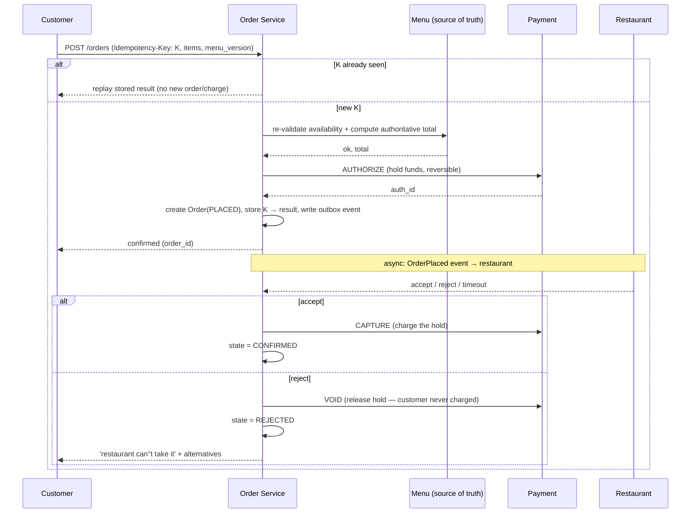

**What the interviewer is checking:**
- The synchronous core (validate → total → authorize → create) is the atomic commit; the customer gets a fast, definite answer.
- **Idempotency:** client-minted key, replayed on retry, passed to the payment provider so the charge dedupes ([api-design](../api-design/), [seat-reservation](../seat-reservation/)).
- **Authorize-then-capture:** hold at placement, capture at accept, void on reject — a post-payment rejection costs the customer nothing.
- The price is computed server-side from `menu_version`; the client never names the price (Diagram 12).

---

## Diagram 5 — Order State Machine

> **When to use:** Q20, Q23, Q24. Note dispatch runs *in parallel* with PREPARING, and the restaurant accept gate + prep phase are what make this richer than a rideshare trip.

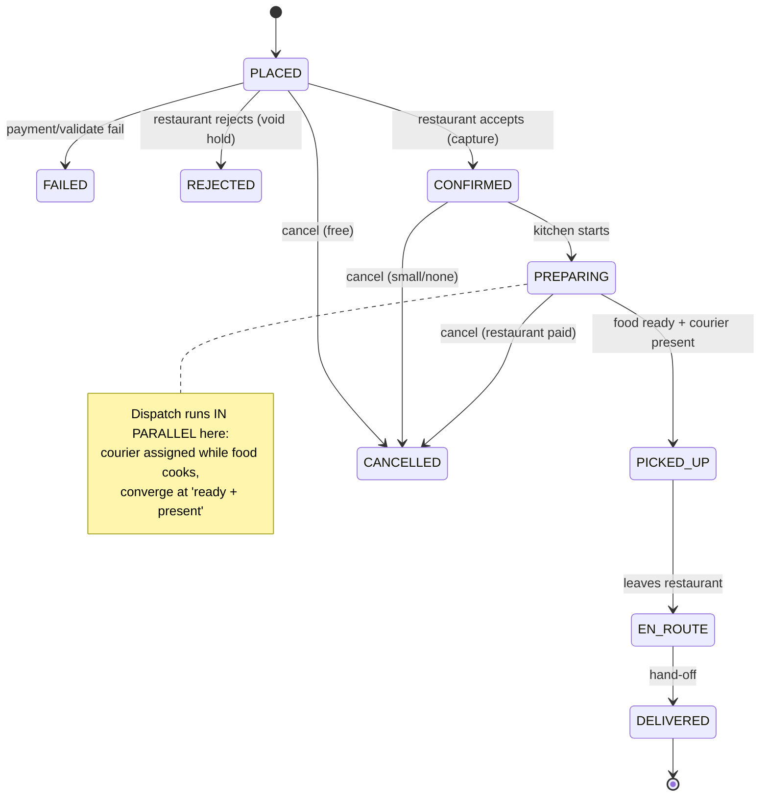

**What the interviewer is checking:**
- The restaurant accept gate (PLACED→CONFIRMED/REJECTED) and the PREPARING phase are the food-specific additions vs ride-sharing's trip.
- Dispatch is parallel to preparation (Diagram 7), not sequential.
- Cancellation cost rises with progress — whoever incurred cost gets compensated (Diagram 6 compensations).
- REJECTED voids the hold (free); later cancels refund/partial-charge.

---

## Diagram 6 — Event-Driven Saga + Transactional Outbox

> **When to use:** Q21, Q22, Q39. Why events over a call chain, how the saga compensates, and how the outbox guarantees the event exists iff the order committed.

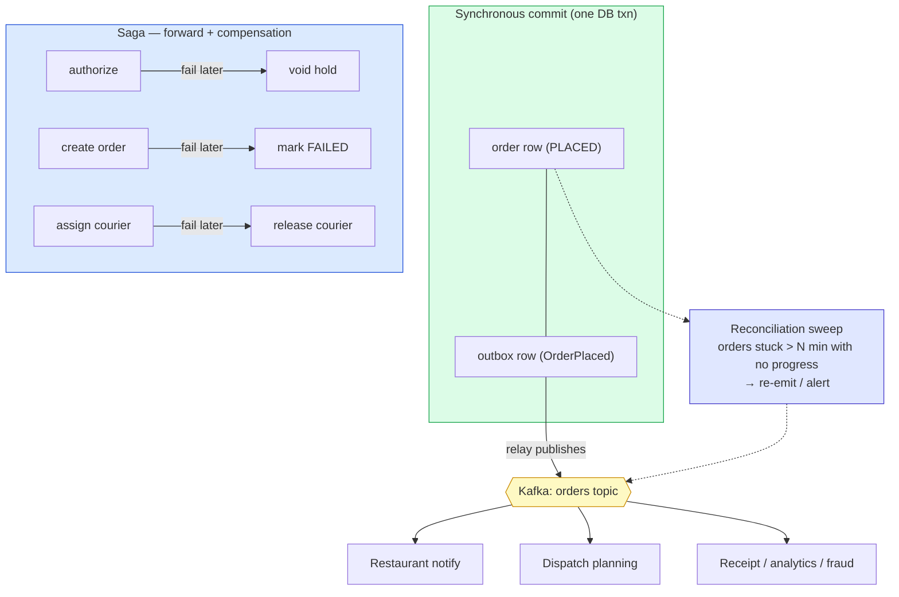

**What the interviewer is checking:**
- Order commits synchronously then emits an event; downstream reacts independently (decoupling, resilience, fast response) at the cost of eventual consistency.
- **Outbox:** event row committed in the *same txn* as the order → event exists iff order committed → no "order created but never dispatched" (Q39).
- **Saga:** compensating actions unwind earlier steps when a later step fails (no distributed txn across payment + DB + Kafka).
- Reconciliation sweep is the backstop; consumers are idempotent so re-emitted events are safe. Depth: [distributed-transactions](../distributed-transactions/), [message-queues](../message-queues/).

---

## Diagram 7 — Prep-Aware Just-in-Time Dispatch (When to Assign)

> **When to use:** Q25, Q29. The signature food-delivery problem — assign the courier to arrive when the food is ready, not ASAP.

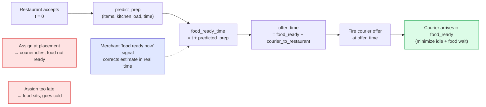

**What the interviewer is checking:**
- The core equation: `offer_time = food_ready − courier_to_restaurant`, recomputed continuously.
- Assigning ASAP (like ride-sharing) is *wrong* here — it wastes courier time or cools food.
- **Prep-time estimation is the linchpin** (ML + merchant "ready" signal); a wrong estimate defeats even a perfect matcher.
- Dispatch runs in parallel with PREPARING (Diagram 5).

---

## Diagram 8 — Courier Offer Loop + Batching

> **When to use:** Q26–Q28. Reuse ride-sharing's offer/timeout loop, but race the food-ready clock and consider stacking orders.

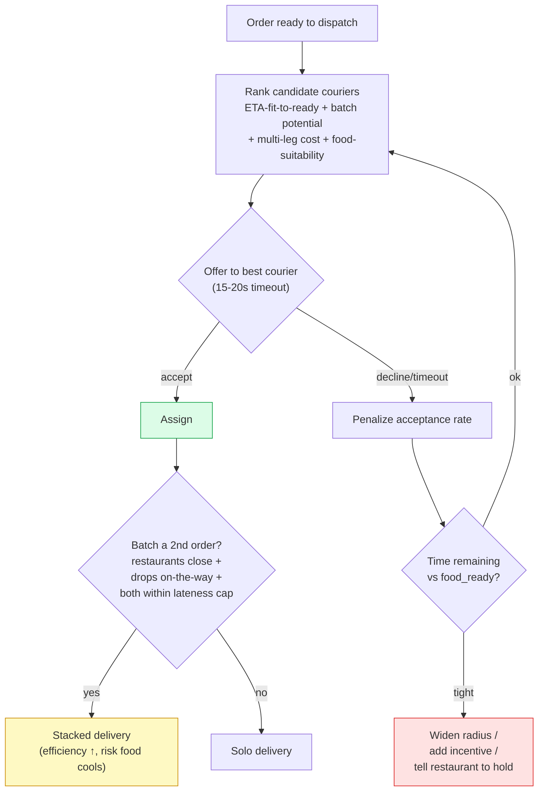

**What the interviewer is checking:**
- The offer-one-at-a-time-with-timeout machinery is reused from [ride-sharing](../ride-sharing/) A18–A24; the *objective* differs (fit-to-ready, not soonest pickup).
- On decline, re-evaluate against the **remaining clock**, not the original plan — the food is cooking.
- Batching raises efficiency but is bounded by a strict lateness cap (perishability) — UberPool constrained by cold food.

---

## Diagram 9 — Live Tracking End-to-End + Transport Asymmetry

> **When to use:** Q30, Q32, Q33. Reuse ride-sharing's tracking; note the customer receives (SSE) while the courier uploads (POST).

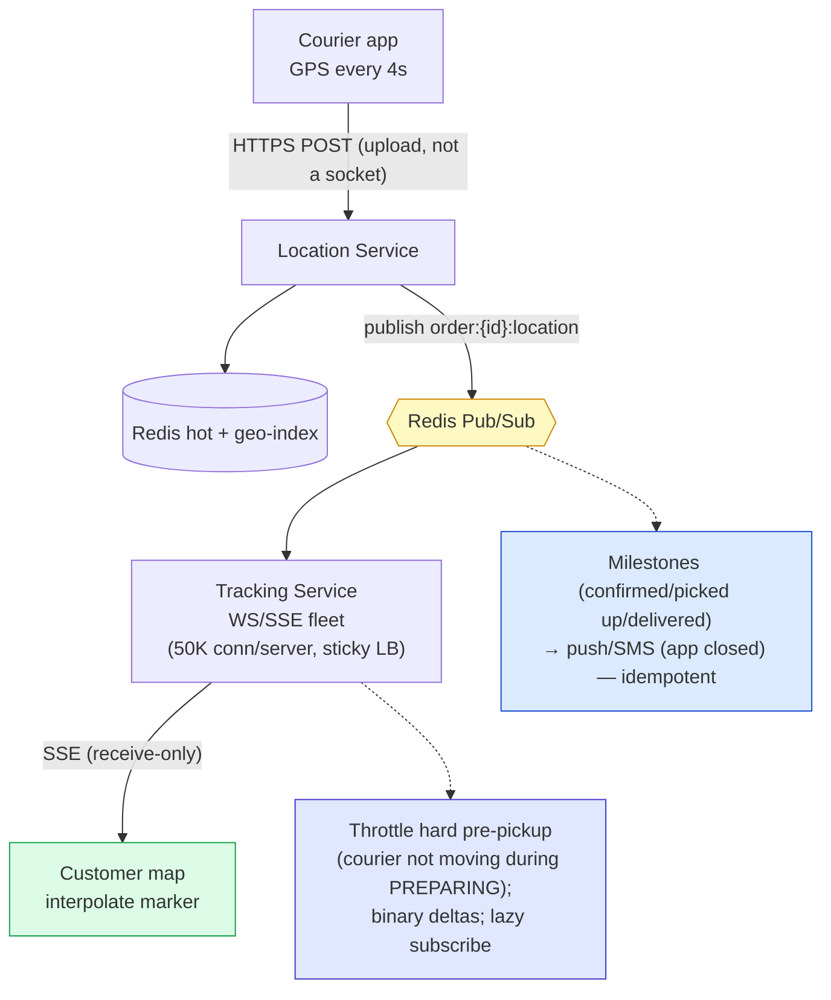

**What the interviewer is checking:**
- Architecture is reused wholesale from [ride-sharing](../ride-sharing/) A31–A35: GPS → hot store → per-order pub/sub → WS/SSE fan-out.
- **Transport asymmetry:** customer screen is receive-only → SSE; courier upload is periodic POST, not a socket.
- Scale knobs: 50K conn/server, sticky-by-order LB, lazy subscribe, throttle pre-pickup, binary deltas.
- Discrete milestones go via push/SMS ([notification-system](../notification-system/)) because sockets only work while the app is open.

---

## Diagram 10 — Composite ETA (Three Legs)

> **When to use:** Q31. ETA sums three legs and shifts live-vs-predicted as the order progresses.

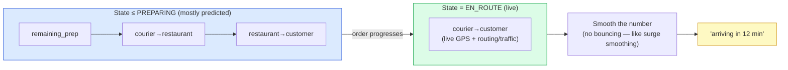

**What the interviewer is checking:**
- Unlike ride-sharing's single leg, delivery ETA sums three legs.
- Which legs are *live* vs *predicted* shifts as the order progresses (prep-dominated early, pure live routing when EN_ROUTE).
- Smooth the displayed number so it doesn't jump — same instinct as ride-sharing surge anti-oscillation.

---

## Diagram 11 — Fault Tolerance: Peak, Degradation & Lost Events

> **When to use:** Q37–Q39. What breaks under a 5× rush, how dispatch degrades without blocking orders, and how a lost order event is recovered.

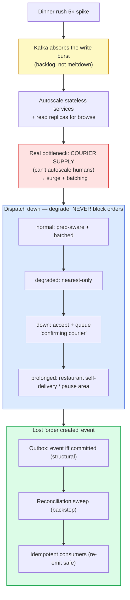

**What the interviewer is checking:**
- Event-driven backbone turns the spike into a Kafka backlog, not a DB meltdown (load-leveling).
- Courier *supply* is the true bottleneck — surge/batching, not autoscaling, is the lever.
- Dispatch is *after* the commit, so its outage degrades experience (later courier), never drops orders.
- Lost events: outbox (structural) + reconciliation (backstop) + idempotent consumers — same fix as [video-streaming](../video-streaming/) A31.

---

## Diagram 12 — Frontend: Price/Availability Consistency Handshake

> **When to use:** Q40, Q43, Q44. The client is optimistic for UX but never owns money — the `menu_version` handshake prevents "the price changed at checkout" surprises.

```mermaid
sequenceDiagram
    participant U as Client (mobile)
    participant S as Server

    Note over U: Browse — cache menu body by menu_version; subscribe to availability deltas
    U->>S: GET menu (has cached v5?)
    S-->>U: 304 or v6 (refetch if stale)

    Note over U: Add to cart — optimistic UI, reconcile with server cart
    U->>S: PUT cart item (optimistic locally)
    S-->>U: authoritative line price (show diff if changed)

    Note over U,S: Checkout — client sends IDs + version, server owns the price
    U->>S: POST /orders (Idempotency-Key, item_ids, modifier_ids, menu_version=v6)
    alt version current, price within tolerance
        S-->>U: confirmed (authoritative total shown BEFORE pay)
    else material change
        S-->>U: 409 Price Changed (show diff, require re-confirm)
    end

    Note over U,S: Flaky network: response lost after send → QUERY order status, don't resubmit
```

**What the interviewer is checking:**
- Client is optimistic for responsiveness (cached menu, optimistic cart) but **never finalizes price/availability** — server re-validates.
- The `menu_version` handshake lets the server detect staleness and force a re-confirm rather than silently charging a surprise.
- Every mutating action carries an idempotency key so retries can't double-order.
- Ambiguous send (response lost) → query order status, don't blindly resubmit — the at-least-once + idempotency spine applied client-side.

---

## Quick Interview Reference

### Scale numbers (back-of-envelope)

| Quantity | Math | Result |
|---|---|---|
| Orders | 20M/day ÷ 86,400 | ~230/s avg, ~1,200/s dinner-peak |
| Browse views | ~15 views/order × 20M | ~300M/day ≈ 3.5K/s avg, ~20K/s peak |
| Courier GPS writes | 500K couriers × 1/4s | ~125K writes/s (dominant write load) |
| Tracking connections | 2M concurrent ÷ 50K/server | ~40 tracking servers |

### Marketplace vs Gopuff dark-store (know the contrast)

| Aspect | Restaurant marketplace (this topic) | Gopuff dark-store (narrow) |
|---|---|---|
| Restaurant accept gate | Yes (2nd gate after payment) | No |
| Prep phase | Yes (variable, unobservable) | No (items on a shelf) |
| Dispatch | Prep-aware just-in-time | Standard nearby assignment |
| Core hard part | Prep-aware coordination + availability | Atomic no-oversell + <100ms availability |
| Closest existing topic | ride-sharing + seat-reservation | **seat-reservation** + geospatial "nearby DC" |

### Canonical tradeoffs to memorize

- **Assign courier ASAP vs prep-aware:** simple **vs** no idle courier / no cold food (prep-aware wins).
- **Authorize-then-capture vs charge-now:** free void on reject **vs** costly refund on every failure.
- **Cache menu body vs re-fetch:** fast browse **vs** freshness (solved by version-keying + availability overlay).
- **Batching vs solo delivery:** courier efficiency **vs** food quality / per-order latency.
- **Event-driven vs synchronous order flow:** resilience + fast response **vs** eventual consistency + harder tracing.
- **Client optimistic vs server-authoritative:** responsiveness **vs** correctness (do both — optimistic UI, server owns money).

### Common mistakes to avoid

- Treating it as "Uber for food" and dispatching couriers ASAP (ignores prep time).
- Charging immediately instead of authorize-then-capture (restaurant can still reject).
- Relying on fast "sold out" propagation to prevent overselling (only the checkout re-check does).
- Letting the client name the price (server computes from item IDs + `menu_version`).
- A synchronous call chain for the order flow (a slow dispatch/notify service stalls placement).
- Blocking order placement on dispatch (dispatch is downstream and event-driven — degrade, don't block).
- Forgetting the transactional outbox → "order committed but nobody dispatched."
