# Food Delivery (DoorDash / Swiggy / Uber Eats) — Mermaid Diagrams

> Interview-ready diagrams. Start with Diagram 1 — the **three-path architecture** is the mental model everything hangs off. Then drill into the layer the interviewer probes.
>
> Reference: [answers.md](./answers.md) | [conducive-sentences.md](./conducive-sentences.md)
>
> Cross-links: [ride-sharing](../ride-sharing/) · [seat-reservation](../seat-reservation/) · [message-queues](../message-queues/) · [distributed-transactions](../distributed-transactions/) · [notification-system](../notification-system/)

---

## Diagram 1 — The Three-Path Architecture (Start Here)

> **When to use:** The first thing to draw. Everything hangs off separating the three traffic paths — browse (cache/eventual), order (strong), track (streaming) — across three actors. Use for Q1, Q2, Q4.

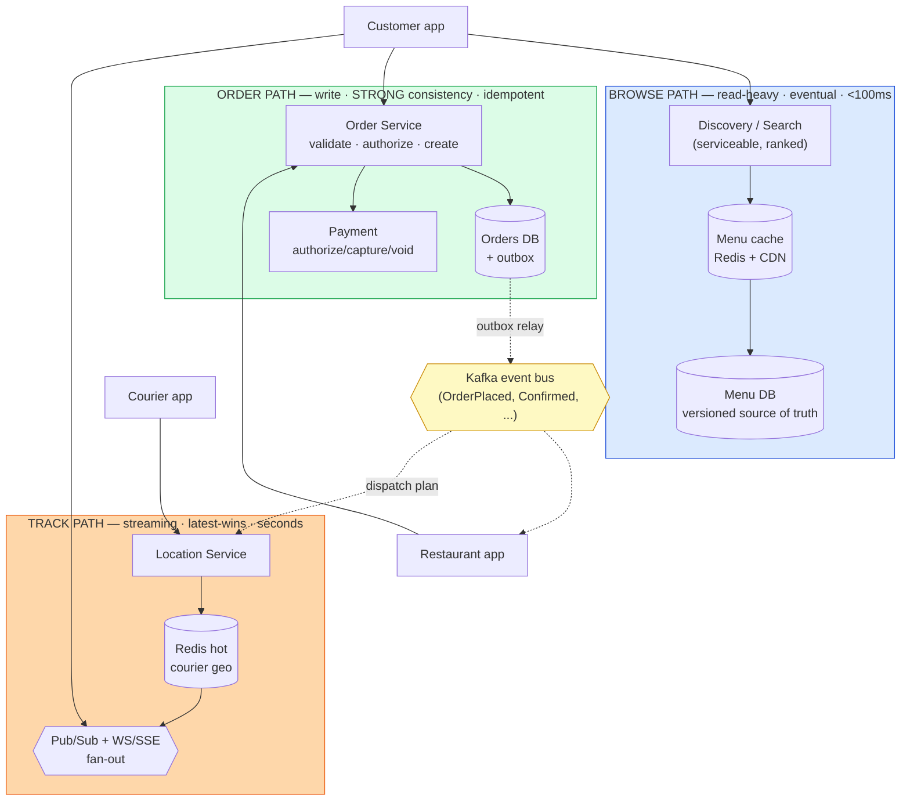
```mermaid
flowchart TD
    CUST["Customer app"]
    REST["Restaurant app"]
    COUR["Courier app"]

    subgraph BROWSE["BROWSE PATH — read-heavy · eventual · <100ms"]
        direction TB
        DISC["Discovery / Search\n(serviceable, ranked)"] --> MCACHE[("Menu cache\nRedis + CDN")]
        MCACHE --> MENUDB[("Menu DB\nversioned source of truth")]
    end

    subgraph ORDER["ORDER PATH — write · STRONG consistency · idempotent"]
        direction TB
        ORDSVC["Order Service\nvalidate · authorize · create"] --> ODB[("Orders DB\n+ outbox")]
        ORDSVC --> PAY["Payment\nauthorize/capture/void"]
    end

    subgraph TRACK["TRACK PATH — streaming · latest-wins · seconds"]
        direction TB
        LOC["Location Service"] --> RHOT[("Redis hot\ncourier geo")]
        RHOT --> PUBSUB{{"Pub/Sub + WS/SSE\nfan-out"}}
    end

    KAFKA{{"Kafka event bus\n(OrderPlaced, Confirmed, ...)"}}

    CUST --> DISC
    CUST --> ORDSVC
    CUST --> PUBSUB
    REST --> ORDSVC
    COUR --> LOC
    ODB -.->|outbox relay| KAFKA
    KAFKA -.-> REST
    KAFKA -.->|dispatch plan| LOC

    style BROWSE fill:#dbeafe,stroke:#1d4ed8
    style ORDER fill:#dcfce7,stroke:#16a34a
    style TRACK fill:#fed7aa,stroke:#ea580c
    style KAFKA fill:#fef9c3,stroke:#ca8a04
```

**What the interviewer is checking:**
- You separate the three paths and give each its own guarantees/infra — not one monolithic service or DB.
- Browser tolerates staleness (cache/CDN/replicas); order needs strong consistency + idempotency; track is an ephemeral firehose (pub-sub fan-out).
- The three actors (customer, restaurant, courier) are all first-class — the restaurant is not a passive resource.
- The order path commits synchronously then emits events (Kafka) — fulfillment is  downstream and async (Diagram 6).

---

## Diagram 2 — Menu: Immutable Body + Volatile Availability Overlay

> **When to use:** Q6–Q9. The key insight: cache the heavy menu by immutable version; layer the small volatile availability on top; oversell is guarded only at checkout.

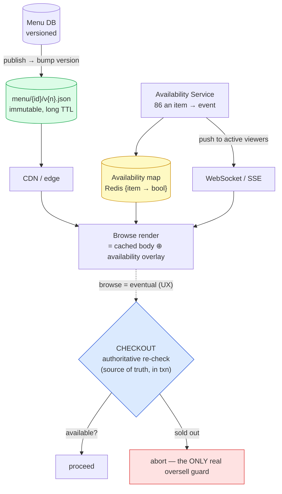
```mermaid
flowchart TD
    MENUDB[("Menu DB\nversioned")] -->|"publish → bump version"| MCACHE[("menu/{id}/v{n}.json\nimmutable, long TTL")]
    MCACHE --> CDN["CDN / edge"]
    CDN --> RENDER["Browse render\n= cached body ⊕ availability overlay"]

    AVAIL["Availability Service\n86 an item → event"] --> OVERLAY[("Availability map\nRedis {item → bool}")]
    OVERLAY --> RENDER
    AVAIL -->|"push to active viewers"| WS["WebSocket / SSE"]
    WS --> RENDER

    CHECKOUT{"CHECKOUT\nauthoritative re-check\n(source of truth, in txn)"}
    RENDER -.->|"browse = eventual (UX)"| CHECKOUT
    CHECKOUT -->|"available?"| OK["proceed"]
    CHECKOUT -->|"sold out"| ABORT["abort — the ONLY real oversell guard"]

    style MCACHE fill:#dcfce7,stroke:#16a34a
    style OVERLAY fill:#fef9c3,stroke:#ca8a04
    style CHECKOUT fill:#dbeafe,stroke:#1d4ed8
    style ABORT fill:#fee2e2,stroke:#dc2626
```

**What the interviewer is checking:**
- Cache by `menu_version` (immutable key) so a publish creates a new key rather than mutating a cached object — same as immutable video segments.
- Availability is split out as a small live overlay so the heavy body stays cacheable.
- Fast "sold out" propagation is UX only — it shrinks the window; **oversell is prevented only by the authoritative checkout re-check** (in the order txn).
- For counted inventory, that check is a guarded decrement (the [seat-reservation](../seat-reservation/) no-oversell pattern).

---

## Diagram 3 — Discovery: Serviceability Filter Pipeline

> **When to use:** Q11–Q14. Serviceability is a filter pipeline over geo candidates, not a radius sort.

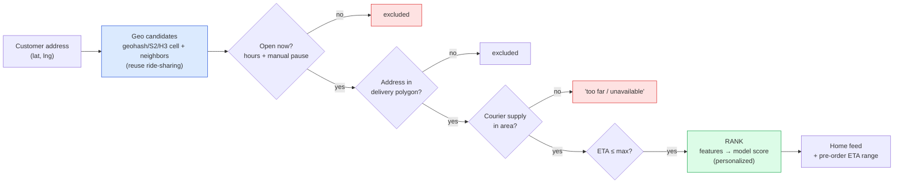
```mermaid
flowchart LR
    ADDR["Customer address\n(lat, lng)"] --> GEO["Geo candidates\ngeohash/S2/H3 cell + neighbors\n(reuse ride-sharing)"]
    GEO --> F1{"Open now?\nhours + manual pause"}
    F1 -->|no| DROP1["excluded"]
    F1 -->|yes| F2{"Address in\ndelivery polygon?"}
    F2 -->|no| DROP2["excluded"]
    F2 -->|yes| F3{"Courier supply\nin area?"}
    F3 -->|no| DROP3["'too far / unavailable'"]
    F3 -->|yes| F4{"ETA ≤ max?"}
    F4 -->|yes| RANK["RANK\nfeatures → model score\n(personalized)"]
    RANK --> FEED["Home feed\n+ pre-order ETA range"]

    style GEO fill:#dbeafe,stroke:#1d4ed8
    style RANK fill:#dcfce7,stroke:#16a34a
    style DROP1 fill:#fee2e2,stroke:#dc2626
    style DROP3 fill:#fee2e2,stroke:#dc2626
```

**What the interviewer is checking:**
- Geospatial "nearby" is reused from [ride-sharing](../ride-sharing/), but serviceability adds gates: open, delivery polygon (not a circle), courier supply, ETA cap.
- Ranking sits after the filter, before render; heavy personalization is precomputed and looked up ([recommendation-system](../recommendation-system/)).
- Pre-order ETA is a statistical prediction (prep + pickup + delivery), shown as a conservative range.
- Search is a separate inverted index fed by CDC ([search-autocomplete](../search-autocomplete/)).

---

## Diagram 4 — Order Placement + Authorize-then-Capture

> **When to use:** Q15–Q18. Walk the synchronous commit core and the two-phase payment. Show idempotency replay and the void-on-reject path.

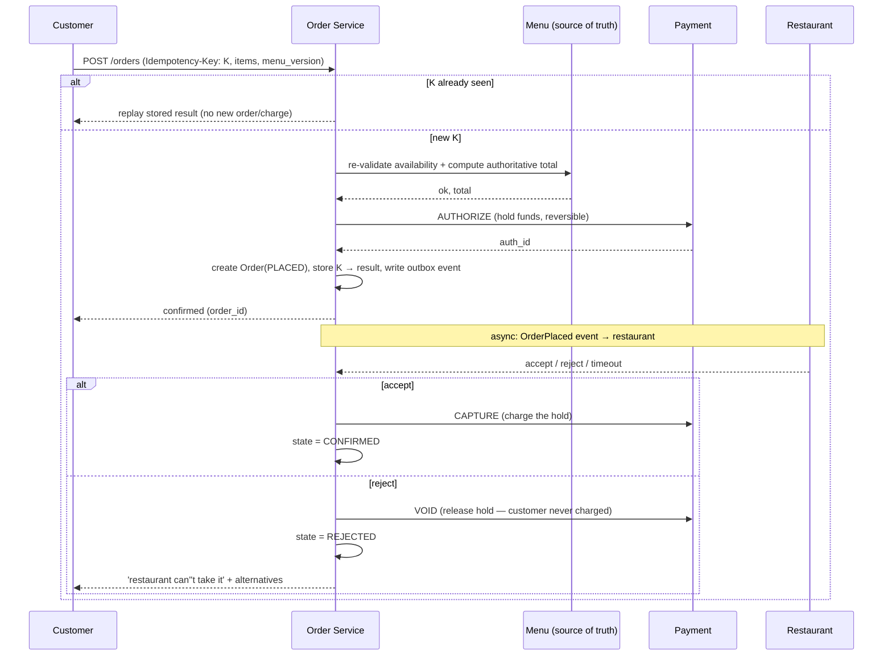
```mermaid
sequenceDiagram
    participant C as Customer
    participant O as Order Service
    participant M as Menu (source of truth)
    participant P as Payment
    participant R as Restaurant

    C->>O: POST /orders (Idempotency-Key: K, items, menu_version)
    alt K already seen
        O-->>C: replay stored result (no new order/charge)
    else new K
        O->>M: re-validate availability + compute authoritative total
        M-->>O: ok, total
        O->>P: AUTHORIZE (hold funds, reversible)
        P-->>O: auth_id
        O->>O: create Order(PLACED), store K → result, write outbox event
        O-->>C: confirmed (order_id)
        Note over O,R: async: OrderPlaced event → restaurant
        R-->>O: accept / reject / timeout
        alt accept
            O->>P: CAPTURE (charge the hold)
            O->>O: state = CONFIRMED
        else reject
            O->>P: VOID (release hold — customer never charged)
            O->>O: state = REJECTED
            O-->>C: 'restaurant can''t take it' + alternatives
        end
    end
```

**What the interviewer is checking:**
- The synchronous core (validate → total → authorize → create) is the atomic commit; the customer gets a fast, definite answer.
- **Idempotency:** client-minted key, replayed on retry, passed to the payment provider so the charge dedupes ([api-design](../api-design/), [seat-reservation](../seat-reservation/)).
- **Authorize-then-capture:** hold at placement, capture at accept, void on reject — a post-payment rejection costs the customer nothing.
- The price is computed server-side from `menu_version`; the client never names the price (Diagram 12).

---

## Diagram 5 — Order State Machine

> **When to use:** Q20, Q23, Q24. Note dispatch runs *in parallel* with PREPARING, and the restaurant accept gate + prep phase are what make this richer than a rideshare trip.

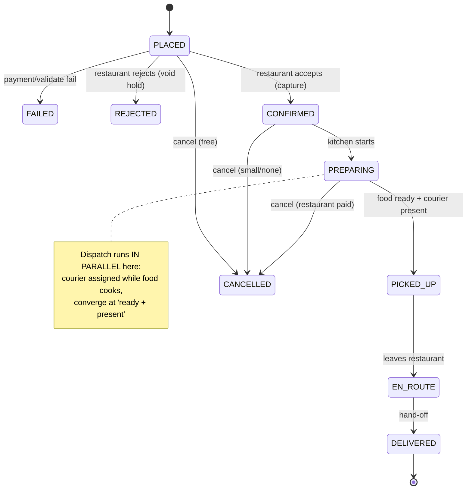
```mermaid
stateDiagram-v2
    [*] --> PLACED
    PLACED --> FAILED: payment/validate fail
    PLACED --> REJECTED: restaurant rejects (void hold)
    PLACED --> CONFIRMED: restaurant accepts (capture)
    CONFIRMED --> PREPARING: kitchen starts
    PREPARING --> PICKED_UP: food ready + courier present
    PICKED_UP --> EN_ROUTE: leaves restaurant
    EN_ROUTE --> DELIVERED: hand-off
    PLACED --> CANCELLED: cancel (free)
    CONFIRMED --> CANCELLED: cancel (small/none)
    PREPARING --> CANCELLED: cancel (restaurant paid)
    DELIVERED --> [*]

    note right of PREPARING
      Dispatch runs IN PARALLEL here:
      courier assigned while food cooks,
      converge at 'ready + present'
    end note
```

**What the interviewer is checking:**
- The restaurant accept gate (PLACED→CONFIRMED/REJECTED) and the PREPARING phase are the food-specific additions vs ride-sharing's trip.
- Dispatch is parallel to preparation (Diagram 7), not sequential.
- Cancellation cost rises with progress — whoever incurred cost gets compensated (Diagram 6 compensations).
- REJECTED voids the hold (free); later cancels refund/partial-charge.

---

## Diagram 6 — Event-Driven Saga + Transactional Outbox

> **When to use:** Q21, Q22, Q39. Why events over a call chain, how the saga compensates, and how the outbox guarantees the event exists iff the order committed.

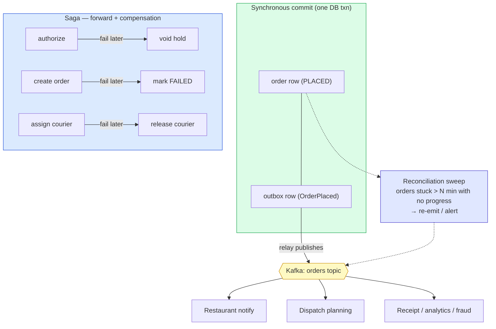
```mermaid
flowchart TD
    subgraph COMMIT["Synchronous commit (one DB txn)"]
        ORDROW["order row (PLACED)"]
        OUTBOX["outbox row (OrderPlaced)"]
        ORDROW --- OUTBOX
    end

    OUTBOX -->|"relay publishes"| K{{"Kafka: orders topic"}}
    K --> RN["Restaurant notify"]
    K --> DP["Dispatch planning"]
    K --> RC["Receipt / analytics / fraud"]

    subgraph SAGA["Saga — forward + compensation"]
        direction LR
        S1["authorize"] -->|fail later| C1["void hold"]
        S2["create order"] -->|fail later| C2["mark FAILED"]
        S3["assign courier"] -->|fail later| C3["release courier"]
    end

    RECON["Reconciliation sweep\norders stuck > N min with no progress\n→ re-emit / alert"]
    ORDROW -.-> RECON
    RECON -.-> K

    style COMMIT fill:#dcfce7,stroke:#16a34a
    style K fill:#fef9c3,stroke:#ca8a04
    style RECON fill:#e0e7ff,stroke:#4338ca
    style SAGA fill:#dbeafe,stroke:#1d4ed8
```

**What the interviewer is checking:**
- Order commits synchronously then emits an event; downstream reacts independently (decoupling, resilience, fast response) at the cost of eventual consistency.
- **Outbox:** event row committed in the *same txn* as the order → event exists iff order committed → no "order created but never dispatched" (Q39).
- **Saga:** compensating actions unwind earlier steps when a later step fails (no distributed txn across payment + DB + Kafka).
- Reconciliation sweep is the backstop; consumers are idempotent so re-emitted events are safe. Depth: [distributed-transactions](../distributed-transactions/), [message-queues](../message-queues/).

---

## Diagram 7 — Prep-Aware Just-in-Time Dispatch (When to Assign)

> **When to use:** Q25, Q29. The signature food-delivery problem — assign the courier to arrive when the food is ready, not ASAP.

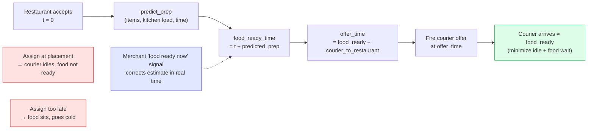
```mermaid
flowchart LR
    ACCEPT["Restaurant accepts\nt = 0"] --> PREP["predict_prep\n(items, kitchen load, time)"]
    PREP --> READY["food_ready_time\n= t + predicted_prep"]
    READY --> CALC["offer_time\n= food_ready − courier_to_restaurant"]
    CALC --> OFFER["Fire courier offer\nat offer_time"]
    OFFER --> ARRIVE["Courier arrives ≈ food_ready\n(minimize idle + food wait)"]

    BAD1["Assign at placement\n→ courier idles, food not ready"]
    BAD2["Assign too late\n→ food sits, goes cold"]
    MERCHANT["Merchant 'food ready now' signal\ncorrects estimate in real time"]
    MERCHANT -.-> READY

    style ARRIVE fill:#dcfce7,stroke:#16a34a
    style BAD1 fill:#fee2e2,stroke:#dc2626
    style BAD2 fill:#fee2e2,stroke:#dc2626
    style MERCHANT fill:#e0e7ff,stroke:#4338ca
```

**What the interviewer is checking:**
- The core equation: `offer_time = food_ready − courier_to_restaurant`, recomputed continuously.
- Assigning ASAP (like ride-sharing) is *wrong* here — it wastes courier time or cools food.
- **Prep-time estimation is the linchpin** (ML + merchant "ready" signal); a wrong estimate defeats even a perfect matcher.
- Dispatch runs in parallel with PREPARING (Diagram 5).

---

## Diagram 8 — Courier Offer Loop + Batching

> **When to use:** Q26–Q28. Reuse ride-sharing's offer/timeout loop, but race the food-ready clock and consider stacking orders.

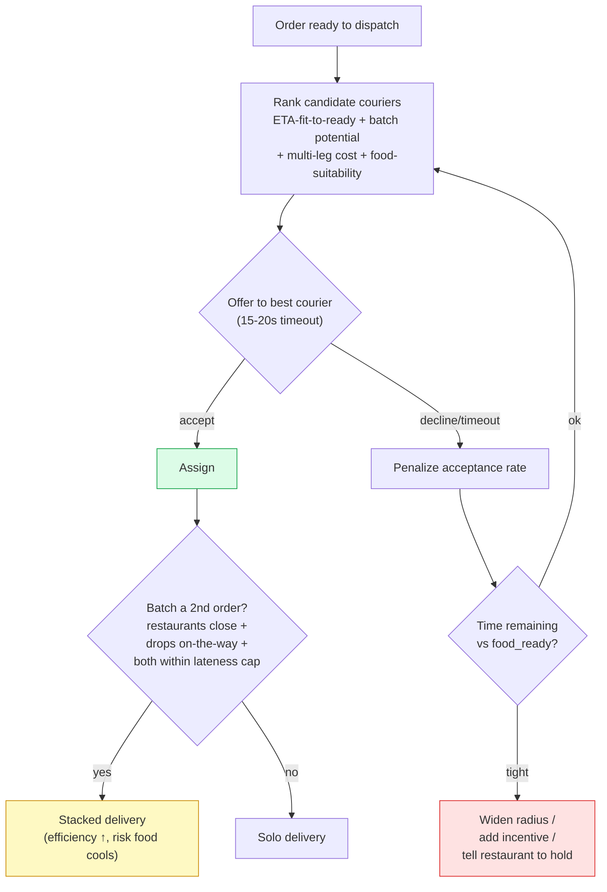
```mermaid
flowchart TD
    ORDER["Order ready to dispatch"] --> RANK["Rank candidate couriers\nETA-fit-to-ready + batch potential\n+ multi-leg cost + food-suitability"]
    RANK --> OFFER{"Offer to best courier\n(15-20s timeout)"}
    OFFER -->|accept| ASSIGN["Assign"]
    OFFER -->|decline/timeout| PEN["Penalize acceptance rate"]
    PEN --> CLOCK{"Time remaining\nvs food_ready?"}
    CLOCK -->|ok| RANK
    CLOCK -->|tight| ESC["Widen radius /\nadd incentive /\ntell restaurant to hold"]

    ASSIGN --> BATCH{"Batch a 2nd order?\nrestaurants close +\ndrops on-the-way +\nboth within lateness cap"}
    BATCH -->|yes| STACK["Stacked delivery\n(efficiency ↑, risk food cools)"]
    BATCH -->|no| SOLO["Solo delivery"]

    style ASSIGN fill:#dcfce7,stroke:#16a34a
    style ESC fill:#fee2e2,stroke:#dc2626
    style STACK fill:#fef9c3,stroke:#ca8a04
```

**What the interviewer is checking:**
- The offer-one-at-a-time-with-timeout machinery is reused from [ride-sharing](../ride-sharing/) A18–A24; the *objective* differs (fit-to-ready, not soonest pickup).
- On decline, re-evaluate against the **remaining clock**, not the original plan — the food is cooking.
- Batching raises efficiency but is bounded by a strict lateness cap (perishability) — UberPool constrained by cold food.

---

## Diagram 9 — Live Tracking End-to-End + Transport Asymmetry

> **When to use:** Q30, Q32, Q33. Reuse ride-sharing's tracking; note the customer receives (SSE) while the courier uploads (POST).

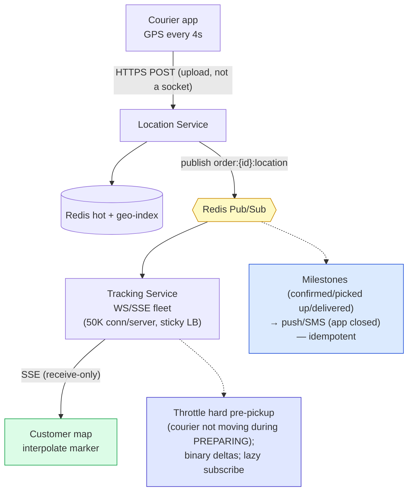
```mermaid
flowchart TD
    COUR["Courier app\nGPS every 4s"] -->|"HTTPS POST (upload, not a socket)"| LOC["Location Service"]
    LOC --> RHOT[("Redis hot + geo-index")]
    LOC -->|"publish order:{id}:location"| PS{{"Redis Pub/Sub"}}
    PS --> TRK["Tracking Service\nWS/SSE fleet\n(50K conn/server, sticky LB)"]
    TRK -->|"SSE (receive-only)"| CUST["Customer map\ninterpolate marker"]

    THROTTLE["Throttle hard pre-pickup\n(courier not moving during PREPARING);\nbinary deltas; lazy subscribe"]
    TRK -.-> THROTTLE

    MILE["Milestones (confirmed/picked up/delivered)\n→ push/SMS (app closed) — idempotent"]
    PS -.-> MILE

    style PS fill:#fef9c3,stroke:#ca8a04
    style CUST fill:#dcfce7,stroke:#16a34a
    style THROTTLE fill:#e0e7ff,stroke:#4338ca
    style MILE fill:#dbeafe,stroke:#1d4ed8
```

**What the interviewer is checking:**
- Architecture is reused wholesale from [ride-sharing](../ride-sharing/) A31–A35: GPS → hot store → per-order pub/sub → WS/SSE fan-out.
- **Transport asymmetry:** customer screen is receive-only → SSE; courier upload is periodic POST, not a socket.
- Scale knobs: 50K conn/server, sticky-by-order LB, lazy subscribe, throttle pre-pickup, binary deltas.
- Discrete milestones go via push/SMS ([notification-system](../notification-system/)) because sockets only work while the app is open.

---

## Diagram 10 — Composite ETA (Three Legs)

> **When to use:** Q31. ETA sums three legs and shifts live-vs-predicted as the order progresses.

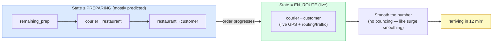
```mermaid
flowchart LR
    subgraph EARLY["State ≤ PREPARING (mostly predicted)"]
        direction LR
        L1["remaining_prep"] --> L2["courier→restaurant"] --> L3["restaurant→customer"]
    end
    subgraph LATE["State = EN_ROUTE (live)"]
        direction LR
        L4["courier→customer\n(live GPS + routing/traffic)"]
    end
    EARLY -->|"order progresses"| LATE
    LATE --> SMOOTH["Smooth the number\n(no bouncing — like surge smoothing)"]
    SMOOTH --> SHOW["'arriving in 12 min'"]

    style EARLY fill:#dbeafe,stroke:#1d4ed8
    style LATE fill:#dcfce7,stroke:#16a34a
    style SHOW fill:#fef9c3,stroke:#ca8a04
```

**What the interviewer is checking:**
- Unlike ride-sharing's single leg, delivery ETA sums three legs.
- Which legs are *live* vs *predicted* shifts as the order progresses (prep-dominated early, pure live routing when EN_ROUTE).
- Smooth the displayed number so it doesn't jump — same instinct as ride-sharing surge anti-oscillation.

---

## Diagram 11 — Fault Tolerance: Peak, Degradation & Lost Events

> **When to use:** Q37–Q39. What breaks under a 5× rush, how dispatch degrades without blocking orders, and how a lost order event is recovered.

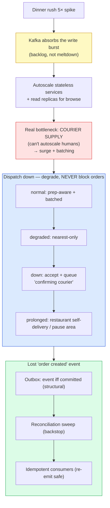
```mermaid
flowchart TD
    SPIKE["Dinner rush 5× spike"] --> KABSORB["Kafka absorbs the write burst\n(backlog, not meltdown)"]
    KABSORB --> AUTOSCALE["Autoscale stateless services\n+ read replicas for browse"]
    AUTOSCALE --> BOTTLE["Real bottleneck: COURIER SUPPLY\n(can't autoscale humans)\n→ surge + batching"]

    subgraph DEGRADE["Dispatch down — degrade, NEVER block orders"]
        direction TB
        D1["normal: prep-aware + batched"] --> D2["degraded: nearest-only"]
        D2 --> D3["down: accept + queue\n'confirming courier'"]
        D3 --> D4["prolonged: restaurant self-delivery / pause area"]
    end

    subgraph LOST["Lost 'order created' event"]
        direction TB
        O1["Outbox: event iff committed (structural)"] --> O2["Reconciliation sweep (backstop)"]
        O2 --> O3["Idempotent consumers (re-emit safe)"]
    end

    BOTTLE --> DEGRADE
    DEGRADE --> LOST

    style KABSORB fill:#fef9c3,stroke:#ca8a04
    style BOTTLE fill:#fee2e2,stroke:#dc2626
    style DEGRADE fill:#dbeafe,stroke:#1d4ed8
    style LOST fill:#dcfce7,stroke:#16a34a
```

**What the interviewer is checking:**
- Event-driven backbone turns the spike into a Kafka backlog, not a DB meltdown (load-leveling).
- Courier *supply* is the true bottleneck — surge/batching, not autoscaling, is the lever.
- Dispatch is *after* the commit, so its outage degrades experience (later courier), never drops orders.
- Lost events: outbox (structural) + reconciliation (backstop) + idempotent consumers — same fix as [video-streaming](../video-streaming/) A31.

---

## Diagram 12 — Frontend: Price/Availability Consistency Handshake

> **When to use:** Q40, Q43, Q44. The client is optimistic for UX but never owns money — the `menu_version` handshake prevents "the price changed at checkout" surprises.

```mermaid
sequenceDiagram
    participant U as Client (mobile)
    participant S as Server

    Note over U: Browse — cache menu body by menu_version; subscribe to availability deltas
    U->>S: GET menu (has cached v5?)
    S-->>U: 304 or v6 (refetch if stale)

    Note over U: Add to cart — optimistic UI, reconcile with server cart
    U->>S: PUT cart item (optimistic locally)
    S-->>U: authoritative line price (show diff if changed)

    Note over U,S: Checkout — client sends IDs + version, server owns the price
    U->>S: POST /orders (Idempotency-Key, item_ids, modifier_ids, menu_version=v6)
    alt version current, price within tolerance
        S-->>U: confirmed (authoritative total shown BEFORE pay)
    else material change
        S-->>U: 409 Price Changed (show diff, require re-confirm)
    end

    Note over U,S: Flaky network: response lost after send → QUERY order status, don't resubmit
```

**What the interviewer is checking:**
- Client is optimistic for responsiveness (cached menu, optimistic cart) but **never finalizes price/availability** — server re-validates.
- The `menu_version` handshake lets the server detect staleness and force a re-confirm rather than silently charging a surprise.
- Every mutating action carries an idempotency key so retries can't double-order.
- Ambiguous send (response lost) → query order status, don't blindly resubmit — the at-least-once + idempotency spine applied client-side.

---

## Quick Interview Reference

### Scale numbers (back-of-envelope)

| Quantity | Math | Result |
|---|---|---|
| Orders | 20M/day ÷ 86,400 | ~230/s avg, ~1,200/s dinner-peak |
| Browse views | ~15 views/order × 20M | ~300M/day ≈ 3.5K/s avg, ~20K/s peak |
| Courier GPS writes | 500K couriers × 1/4s | ~125K writes/s (dominant write load) |
| Tracking connections | 2M concurrent ÷ 50K/server | ~40 tracking servers |

### Marketplace vs Gopuff dark-store (know the contrast)

| Aspect | Restaurant marketplace (this topic) | Gopuff dark-store (narrow) |
|---|---|---|
| Restaurant accept gate | Yes (2nd gate after payment) | No |
| Prep phase | Yes (variable, unobservable) | No (items on a shelf) |
| Dispatch | Prep-aware just-in-time | Standard nearby assignment |
| Core hard part | Prep-aware coordination + availability | Atomic no-oversell + <100ms availability |
| Closest existing topic | ride-sharing + seat-reservation | **seat-reservation** + geospatial "nearby DC" |

### Canonical tradeoffs to memorize

- **Assign courier ASAP vs prep-aware:** simple **vs** no idle courier / no cold food (prep-aware wins).
- **Authorize-then-capture vs charge-now:** free void on reject **vs** costly refund on every failure.
- **Cache menu body vs re-fetch:** fast browse **vs** freshness (solved by version-keying + availability overlay).
- **Batching vs solo delivery:** courier efficiency **vs** food quality / per-order latency.
- **Event-driven vs synchronous order flow:** resilience + fast response **vs** eventual consistency + harder tracing.
- **Client optimistic vs server-authoritative:** responsiveness **vs** correctness (do both — optimistic UI, server owns money).

### Common mistakes to avoid

- Treating it as "Uber for food" and dispatching couriers ASAP (ignores prep time).
- Charging immediately instead of authorize-then-capture (restaurant can still reject).
- Relying on fast "sold out" propagation to prevent overselling (only the checkout re-check does).
- Letting the client name the price (server computes from item IDs + `menu_version`).
- A synchronous call chain for the order flow (a slow dispatch/notify service stalls placement).
- Blocking order placement on dispatch (dispatch is downstream and event-driven — degrade, don't block).
- Forgetting the transactional outbox → "order committed but nobody dispatched."

---

## 🎯 The One-Page Master Diagram — THE ONE TO DRAW IN THE INTERVIEW (final consolidated design)

> **When to use:** final revision, 10 minutes before the interview — and the single whiteboard diagram to reproduce from memory. It folds the three paths, all actors, every datastore **labeled with its type**, the async backbone, and the dispatch loop into one picture. Draw it in the numbered order below and narrate each stroke. Pairs with [radio-walkthrough.md](./radio-walkthrough.md).
> Spec: [`docs/instructions.md` §2.1](../../docs/instructions.md) · AWS names: [`docs/AWS_SERVICE_MAP.md`](../../docs/AWS_SERVICE_MAP.md).
> ⚠️ AWS services are **defensible defaults**; every quota is an order-of-magnitude planning number to **verify against current docs**.

### The central split in one sentence

**Three paths with three different physics — browse (~90% of traffic, cacheable, eventual), order (small volume but zero tolerance for oversell or double-charge), and track (125K location writes/s and millions of live connections, entirely ephemeral) — glued by an event bus, with dispatch that is *prep-aware* because assigning a courier too early is as wrong as too late.**

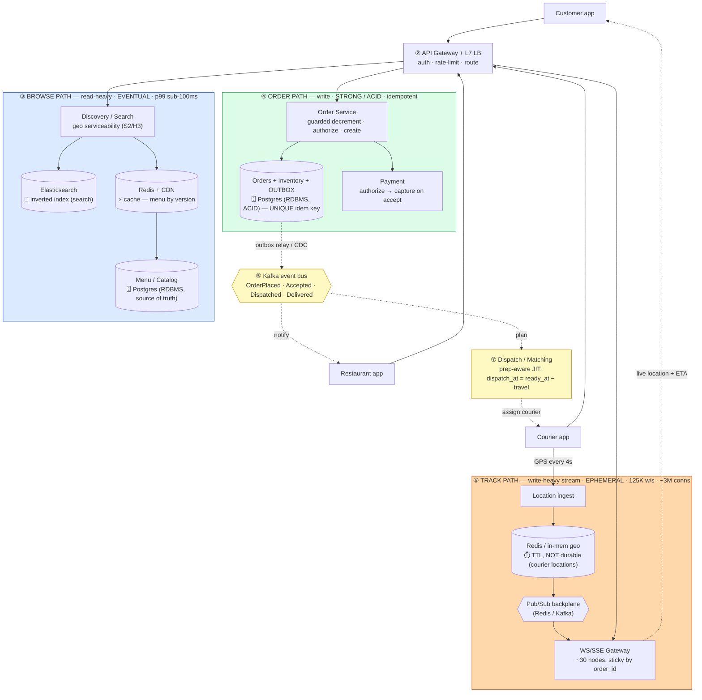
```mermaid
flowchart TD
    CUST["Customer app"]
    REST["Restaurant app"]
    COUR["Courier app"]

    GW["② API Gateway + L7 LB\nauth · rate-limit · route"]
    CUST --> GW
    REST --> GW
    COUR --> GW

    subgraph BROWSE["③ BROWSE PATH — read-heavy · EVENTUAL · p99 sub-100ms"]
        direction TB
        DISC["Discovery / Search\ngeo serviceability (S2/H3)"]
        ES[("Elasticsearch\n🔎 inverted index (search)")]
        MC[("Redis + CDN\n⚡ cache — menu by version")]
        MENU[("Menu / Catalog\n🗄️ Postgres (RDBMS, source of truth)")]
        DISC --> ES
        DISC --> MC --> MENU
    end

    subgraph ORDERP["④ ORDER PATH — write · STRONG / ACID · idempotent"]
        direction TB
        OSVC["Order Service\nguarded decrement · authorize · create"]
        ODB[("Orders + Inventory + OUTBOX\n🗄️ Postgres (RDBMS, ACID) — UNIQUE idem key")]
        PAY["Payment\nauthorize → capture on accept"]
        OSVC --> ODB
        OSVC --> PAY
    end

    subgraph TRACK["⑥ TRACK PATH — write-heavy stream · EPHEMERAL · 125K w/s · ~3M conns"]
        direction TB
        LOC["Location ingest"]
        GEO[("Redis / in-mem geo\n⏱️ TTL, NOT durable (courier locations)")]
        PS{{"Pub/Sub backplane\n(Redis / Kafka)"}}
        TGW["WS/SSE Gateway\n~30 nodes, sticky by order_id"]
        LOC --> GEO --> PS --> TGW
    end

    KAFKA{{"⑤ Kafka event bus\nOrderPlaced · Accepted · Dispatched · Delivered"}}
    DISP["⑦ Dispatch / Matching\nprep-aware JIT: dispatch_at = ready_at − travel"]

    GW --> DISC
    GW --> OSVC
    GW --> TGW
    COUR -->|"GPS every 4s"| LOC
    ODB -.->|"outbox relay / CDC"| KAFKA
    KAFKA -.->|notify| REST
    KAFKA -.->|plan| DISP
    DISP -.->|"assign courier"| COUR
    TGW -.->|"live location + ETA"| CUST

    style BROWSE fill:#dbeafe,stroke:#1d4ed8
    style ORDERP fill:#dcfce7,stroke:#16a34a
    style TRACK fill:#fed7aa,stroke:#ea580c
    style KAFKA fill:#fef9c3,stroke:#ca8a04
    style DISP fill:#fef9c3,stroke:#ca8a04
```

**Store-type legend (say the type, not the brand):**

| Component | Store **type** | Defensible pick | Why this type |
|---|---|---|---|
| Menu / Catalog, Orders, Inventory | **RDBMS (ACID, B-tree)** | Postgres | Transactions + `UNIQUE` idempotency + guarded decrement |
| Menu cache / product body | **Distributed cache + CDN** | Redis + CloudFront | Reads dominate; immutable version key → long TTL |
| Restaurant/dish search | **Inverted index** | Elasticsearch | Fuzzy/faceted search; CDC-fed, not the truth |
| Courier locations | **In-memory + TTL, geo-indexed** | Redis GEO / grid | 125K writes/s, ephemeral — never the order DB |
| Event backbone / outbox relay | **Log / stream** | Kafka | Replayable, many consumer groups, absorbs spikes |
| Serviceability / matching | **Geospatial index** | S2 / H3 | Cell lookup instead of full scan |

### The 60-second narration

*(one line per numbered box — draw it in this order and say this)*

1. **Three actors** (customer, restaurant, courier) — "3-sided marketplace; the restaurant is a first-class actor."
2. **Gateway** — "auth, rate-limit, routing — one front door."
3. **Browse path (blue)** — "~90% of traffic, eventual, served from cache/CDN + search; DB touched rarely."
4. **Order path (green)** — "small volume (~1,200/s peak) but must be perfectly correct: guarded decrement = no oversell, idempotency key = no double-charge, order+event in one txn (outbox)."
5. **Kafka** — "everything after commit is an event → a dinner-rush spike is a backlog, not a meltdown."
6. **Track path (orange)** — "the real scale problem: 125K GPS writes/s to an ephemeral TTL store, ~3M live connections fanned out via pub/sub — kept off the order DB."
7. **Dispatch loop** — "prep-aware JIT: assign the courier to arrive when the food is ready; the prep-time estimate is the linchpin."

### The five numbers that justify the design

| Number | Derivation | Therefore |
|---|---|---|
| **125K location writes/s** | 500K couriers ÷ one GPS ping per 4 s | The real scale problem. An ephemeral, geo-bucketed in-memory store with a short TTL — never the order database. A lost ping is replaced 4 s later, so there is nothing to recover |
| **~3M concurrent tracking connections** | Little's Law: arrival rate × duration (~40 min average delivery) | Sizes the WebSocket fleet (~30 nodes at ~100K each, illustrative) and makes "polling" structurally impossible |
| **~1,200 orders/s peak** (~230/s avg) | 20M orders/day ÷ 86,400, dinner-rush peak ~5× | Order volume is *small* for a database — so orders are a **correctness** problem, not a scale problem. Spend the budget on the guarded decrement and idempotency |
| **~90% of traffic is browse** | views per order at typical conversion | Cache and CDN the menu path hard, keyed by menu **version**; the source of truth is touched rarely |
| **dispatch_at = ready_at − travel_time** | prep-time estimate + ETA | The linchpin equation. Dispatch too early and the courier waits; too late and the food goes cold — so prep-time accuracy is the single most valuable number in the system |

*(All figures order-of-magnitude — verify against your own load tests.)*

### The patterns this assembles

| Pattern | Where | The move |
|---|---|---|
| [Scaling Writes](../../patterns/scaling-writes.md) **●** | ⑥ track | 125K w/s absorbed by an ephemeral TTL store, geo-bucketed by cell, sharded by metro |
| [Real-Time Updates](../../patterns/realtime-updates.md) **●** | ⑥ tracking | Hop 1 WebSocket; hop 2 (reach the node holding the socket) via a pub/sub backplane + registry; throttle to one update per 2–4 s |
| [Dealing with Contention](../../patterns/dealing-with-contention.md) **●** | ④ order | Rung 1 — guarded conditional decrement on the item row; zero rows = sold out |
| [Multi-Step Processes](../../patterns/multi-step-processes.md) **●** | ④⑤⑦ | Saga: reserve → authorize → create → notify; compensations on restaurant rejection; outbox so order + event are atomic |
| [Scaling Reads](../../patterns/scaling-reads.md) ○ | ③ browse | CDN + Redis by menu version, search in a CDC-fed index |
| Gap: proximity/geospatial search | ②③ serviceability | S2/H3 cell lookup instead of a radius scan — cell size *is* the design decision |

### The three things that break (and the mitigation)

| Failure | Blast radius | Mitigation | How you detect it |
|---|---|---|---|
| **A tracking gateway dies** | ~100K clients reconnect at once — a thundering herd against the remaining fleet | Jittered exponential backoff on the client, sticky routing by `order_id`, resume from last known position rather than replaying | Reconnect-rate spike; connection-count cliff; position-age p99 on the customer's map |
| **Restaurant rejects (or never accepts) a paid order** | The customer has already entered a card for food nobody will make | **Authorize, don't capture**, at checkout; on rejection or timeout, void the authorization and release the stock — capture only on accept | Accept-rate and time-to-accept per restaurant; count of voided authorizations; orders stuck in `PENDING_ACCEPT` past a threshold (alert on **age**) |
| **Prep-time estimate is wrong** | Couriers idle in lobbies (cost) or food sits going cold (quality) — the core product failure | Per-restaurant, per-hour learned prep model with a safety buffer; re-dispatch if `ready_at` moves; keep a manual override for the restaurant | Courier wait-at-restaurant distribution; food-ready-to-pickup gap; prediction error vs actual, tracked per restaurant |

### The AWS-specific traps to name unprompted

| Trap | Why it bites here | What you say |
|---|---|---|
| **DynamoDB per-partition ceiling** (~1,000 WCU **⚠️ verify**) | A dense downtown geo-cell at dinner time is one hot key | *"Finer cell resolution there, or a write-sharded key suffix with scatter-gather on read."* |
| **API Gateway WebSocket is per-message priced** | ~3M sockets each getting a position every few seconds | *"Self-managed WebSocket on an NLB plus a connection registry — at this message volume it's materially cheaper."* |
| **Kinesis per-shard head-of-line blocking** | One poison location record stalls a whole metro's positions | *"Per-shard retry + side-channel DLQ; partition by city so the blast radius is one metro."* |
| **DynamoDB TTL is not a timer** (~48 h best-effort **⚠️ verify**) | The restaurant-accept timeout is product logic | *"TTL expires stale locations; the accept timeout needs a real scheduler or a sweeper."* |
| **SQS visibility timeout vs job duration** | A slow dispatch job runs twice | *"Visibility above p99, heartbeat-extend for long jobs, and the handler is idempotent anyway."* |

### If you only remember one thing

> **Three paths, three store types — cache for browse, ACID for order, ephemeral geo for track — glued by an event bus so failures compensate and spikes buffer; and dispatch is prep-aware, because `dispatch_at = ready_at − travel_time` is the equation the whole courier economy runs on.**

---

### 🎤 30-Minute Interview Transcript — What to Actually Say

> Practice reading this **out loud** while drawing Diagram 13 live, until it feels like your own words, not a script. Timestamps are a **budget, not a stopwatch** — an interviewer's questions will shift them, but the order (Requirements → Architecture → Data → API → Deep-dive → Close) should not. Full reasoning behind every number: [radio-walkthrough.md](./radio-walkthrough.md).

#### [00:00–02:30] Open — restate the problem and scope it
> *Say this before drawing anything.*
- "I'll design the backend for a food-delivery platform like DoorDash or Swiggy."
- "Customers browse nearby restaurants, place an order, pay, and track delivery live. Restaurants accept and prepare the food. Couriers pick up and deliver."
- "I'll focus on three flows — browsing, ordering, and live tracking. I'll leave out reviews, promotions, and courier payouts unless you'd like me to cover those too."
- "Two things must never happen: we can't sell an item that's out of stock, and we can't charge a customer twice for the same order."
- "I'll assume 20 million orders a day as a working number — let me know if you'd like a different scale."

#### [02:30–05:00] Size the problem in your head
> *Say this before you draw — it tells the interviewer where you'll spend your effort.*
- "20 million orders a day works out to about 230 orders per second on average."
- "Dinner rush concentrates demand, so peak is roughly 5 times that — about 1,200 orders per second. That's still small for a database to handle."
- "The real scale problem is location tracking: if 500,000 couriers each send a GPS update every 4 seconds, that's 125,000 location writes per second."
- "And if the average delivery takes about 40 minutes, then by Little's Law — concurrent connections equal arrival rate times how long each one lasts — that's roughly 3 million live tracking connections open at once."
- "So here's my takeaway before I draw anything: orders are a **correctness** problem, not a scale problem. Tracking is the opposite — it's a pure **scale** problem. I'll design each one differently."

#### [05:00–15:00] Draw the architecture live, narrating each piece
> *This is where Diagram 13 gets drawn, box by box, in the order below. Say the sentence, then draw the box.*

1. **"First, the three actors."** Draw customer, restaurant, courier apps. *"This is a three-sided marketplace — the restaurant is a first-class actor, not just a passive resource, because it can reject an order after the customer has already paid."*
2. **"Everything goes through one gateway first."** Draw the API Gateway box. *"It handles authentication, rate limiting, and routing — one front door for all three apps."*
3. **"Now the browse path."** Draw the blue Browse subgraph. *"This is about 90% of all traffic. It's read-heavy, and a slightly stale price or 'sold out' badge is totally fine here. So I serve it from a cache and CDN in front of Postgres, plus a search index for restaurant/dish discovery. The real database is touched rarely."*
4. **"Now the order path."** Draw the green Order subgraph. *"This is small in volume — about 1,200 orders a second at peak — but it must be perfectly correct. Two guarantees here: a guarded conditional decrement on the inventory row means we never oversell — if zero rows update, it's sold out. And an idempotency key means a retry or double-tap never charges twice. The order row and its event get written in one database transaction — that's called the transactional outbox — so the event can never be lost or duplicated."*
5. **"That event goes onto Kafka."** Draw the Kafka box. *"Everything that happens after the order is committed — notifying the restaurant, planning dispatch, sending a receipt — is just an event on this bus. That means a dinner-rush spike turns into a backlog in Kafka, not a meltdown in the checkout flow."*
6. **"Now the track path — this is the real scale problem."** Draw the orange Track subgraph. *"125,000 GPS writes a second go into an in-memory store with a short expiry — never the order database, because this data is disposable. About 3 million live connections are held by a dedicated WebSocket gateway, and positions are pushed out through a publish-subscribe layer so we're not polling."*
7. **"Last piece — the dispatch loop."** Draw Dispatch. *"Unlike ride-sharing, where you dispatch a driver immediately, here dispatching too early means the courier waits around for food that isn't ready yet. So dispatch is prep-aware: we assign a courier to arrive right when the food is ready. The accuracy of that prep-time estimate is the single most important number in the whole system."*

#### [15:00–18:00] Data model — say this fast, don't over-model
- "The core entities are User, Restaurant, MenuItem, Order, Courier, CourierLocation, Payment, and an Outbox table."
- "Two modeling decisions matter here. First, courier location is a **separate entity in a separate store** from the courier's profile — it's hot, ephemeral data, and mixing it with the transactional database would drown the order path."
- "Second, the menu has a **version number**. A menu edit bumps the version and creates a new cache key, instead of mutating data in place — that's how 'sold out' propagates without invalidation bugs."
- "I'd shard orders by user ID, restaurants and menus by restaurant ID, and courier location by metro area, since fulfillment is always local to one city."

#### [18:00–21:00] API — the handful of endpoints that matter
- "On the read side: `GET /restaurants` for discovery, and `GET /restaurants/{id}/menu` for the menu — both cacheable, both fine to be slightly stale."
- "On the write side: `POST /orders`, and this is the one endpoint I'll call out specifically — it carries an **Idempotency-Key header**. If the client retries because of a network blip, the same key returns the exact same order instead of creating a second one or charging twice."
- "Order placement is synchronous because the customer needs an answer in under two seconds, but everything after that — restaurant acceptance, dispatch, notifications — happens asynchronously over that same Kafka event bus."
- "For live tracking, I'd use a WebSocket, because the server needs to push updates to the client — polling three million clients every few seconds just doesn't scale."

#### [21:00–29:00] Deep dive — pick the two hardest parts and go deep
> *If the interviewer doesn't redirect you, offer this yourself: "Where would you like me to go deeper — the tracking scale problem, or the order correctness problem? I can do both."*

**Deep dive 1 — the location firehose and live tracking (~4 min)**
- "125,000 writes a second and 3 million open connections would fall over instantly if I wrote every ping to the transactional database and had clients poll for updates."
- "So GPS pings land in an in-memory store, geo-bucketed by cell, with a short expiry — a lost ping just gets replaced by the next one four seconds later, so there's nothing to recover."
- "For reads, I don't push every position to every client — I publish once per courier update, and only the handful of clients actually watching that order receive it, through a publish-subscribe layer."
- "I'd also throttle updates to about once every two to four seconds — a human eye doesn't need ten updates a second, and it cuts network traffic by an order of magnitude."
- "The failure mode to call out: if a gateway server dies, all its connected clients try to reconnect at once — a thundering herd. The fix is a jittered backoff on the client so reconnects spread out instead of hitting all at once."

**Deep dive 2 — the order saga and prep-aware dispatch (~4 min)**
- "An order touches four different services — payment, inventory, the restaurant, and dispatch — each with its own database. There's no single transaction across all of them, so I use a **saga**: a sequence of steps, each with a compensating action if something later fails."
- "The flow is: reserve stock, authorize the payment — not charge it yet — create the order, and notify the restaurant. If the restaurant rejects or times out, I void the authorization and release the stock. If they accept, I capture the payment and start dispatch."
- "That authorize-then-capture split matters because the restaurant can still say no after the customer has already entered their card — I never want to have taken money for food that won't be made."
- "For dispatch, the key idea is **prep-aware, just-in-time assignment** — I work backward from when the food will be ready, and assign a courier to arrive at exactly that moment. Assigning too early means a courier stands around; too late means cold food."
- "As a safety net, I'd run a periodic reconciliation job that checks for any paid order with no dispatch progress after a few minutes and re-fires the event — so a lost message can never strand a paid order."

#### [29:00–30:00] Close with the one-line thesis
> *End on this — it's the single sentence that shows you understood the whole system.*
- "So to summarize: three traffic paths, three different stores. Browse lives on a cache because reads dominate. Order lives on a strongly-consistent database because correctness matters more than speed there. Tracking lives on an ephemeral in-memory store because it's a pure scale problem. An event bus glues them together, so a spike becomes a backlog instead of an outage, and a failure gets undone by a compensating action instead of corrupting the order."

> 💡 **Practice tip:** say this transcript aloud, timing yourself, twice a week before an interview. The goal isn't to memorize the words — it's to internalize the **structure** (scope → architecture → data → API → two deep dives → close) so you can rebuild it under pressure even when the interviewer interrupts and reorders you.
