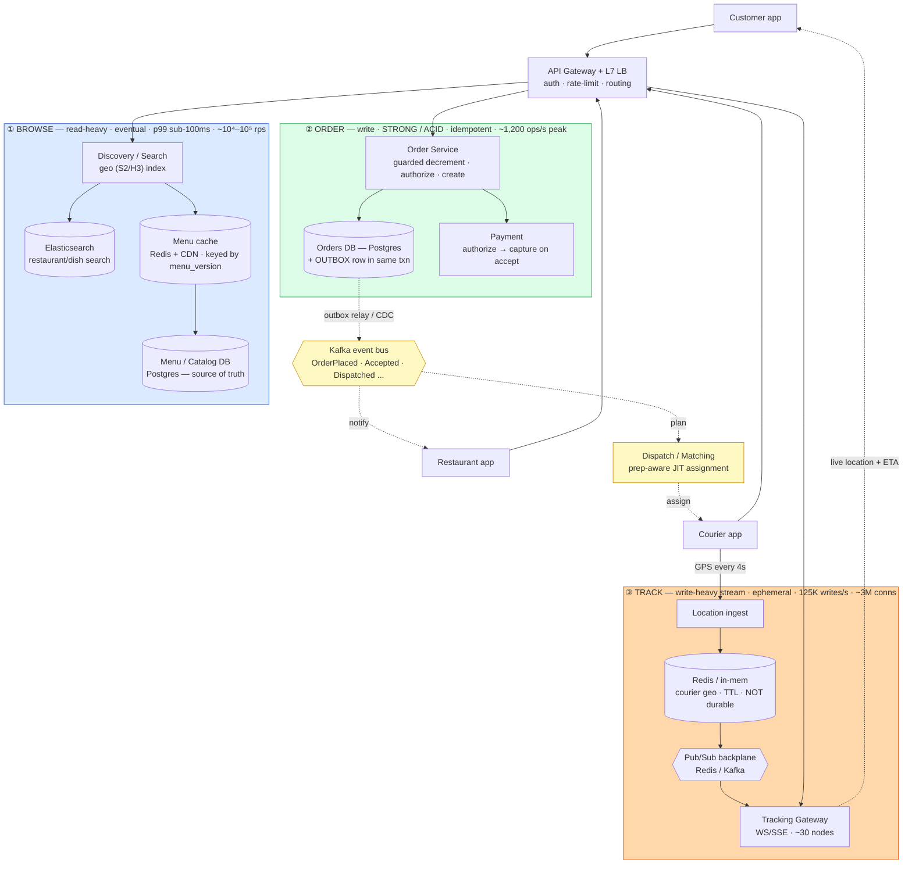
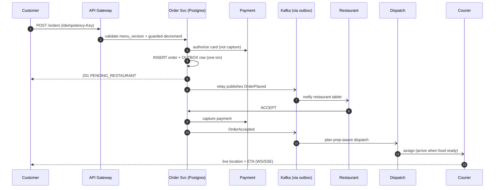
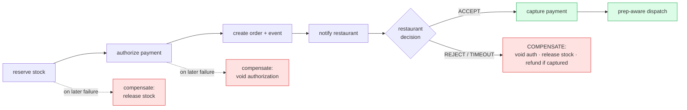

# RADIO Walkthrough — Food Delivery (DoorDash / Swiggy / Uber Eats)

> **What this is:** the food-delivery design performed the way you'd say it out loud in a **backend** interview, structured by the [RADIO framework](../../docs/RADIO_FRAMEWORK.md): **R**equirements → **A**rchitecture → **D**ata model → **I**nterface → **O**ptimizations.
> **How to use it:** read once for the flow, then practice saying each section from memory. Every number below shows **how it was derived and what decision it drives** — that derivation is the point, not the digit.
> **Depth lives elsewhere:** this is the *spine*. For the grill, see [questions.md](./questions.md) / [answers.md](./answers.md); for internals, [deep-dive.md](./deep-dive.md).
> ⚠️ Numbers are order-of-magnitude teaching estimates. In a real interview, state them as assumptions to verify against telemetry.

---

## R — Requirements Exploration  *(~7 min)*

**Restate:** "Customers browse nearby restaurants, place a multi-item order, pay, and track it live to their door; restaurants accept and prepare; couriers pick up and deliver. I'll design the backend for that." *(Get a nod before drawing anything.)*

### Functional (in scope — the 3 journeys that carry signal)
1. **Browse & discover** — serviceable restaurants for my address, menus with live availability, search/ranking.
2. **Order & pay** — cart → place order atomically → pay → restaurant accepts.
3. **Fulfill & track** — assign a courier, drive the order state machine, stream live location + ETA.

### Explicitly out of scope (say this — scoping *down* is signal)
Reviews/ratings pipeline, promotions/coupon engine, courier payout/settlement, restaurant onboarding, fraud ML. I'll mention where they hook in, not design them.

### Non-functional / correctness bars
- **Browse** latency p99 < 100 ms; **order placement** < 2 s end-to-end.
- **Zero oversell** (can't sell a sold-out item) · **zero double-charge** (retry-safe).
- **ETA accuracy matters** — output is perishable; cold food = failed delivery. This is a *product* SLO, not just a system one.
- Availability: browse/track can degrade gracefully; the **order commit** path is the one that must stay correct.
- Geography: many metros; **fulfillment data is local per metro** (a courier in Bangalore is irrelevant to a Delhi order) → natural geo-sharding.

### Capacity estimate *(state assumptions → arithmetic → decision)*

**Assume 20M orders/day** (large single-country market; tell me to change it).

| Quantity | Derivation | Result | **Decision it drives** |
|---|---|---|---|
| Avg order rate | 20M ÷ 86,400 s | **~231 orders/s** | Tiny. A single well-indexed Postgres does low-thousands of writes/s → **orders are NOT the scaling problem** |
| Peak order rate | dinner rush concentrates ~30% of the day into ~3–4 h and peaks ~5× avg | **~1,200 orders/s** | Still modest → scale the order DB by **metro sharding**, not exotic tech |
| Reads (browse) | ~90% of traffic; ~10–20 restaurant/menu views per order | **~10⁴–10⁵ reads/s peak** | Reads dominate ~50:1 → **cache/CDN the browse path hard**; it must never hit the source of truth |
| Active couriers at peak | ~500K online | — | — |
| **Courier GPS firehose** | 500K couriers × 1 ping / 4 s | **~125K location writes/s** | **This is the real write-scaling problem**, not orders. → ephemeral, in-memory/TTL store, NOT the transactional DB |
| Live tracking connections | Little's Law: 1,200 orders/s × ~40 min (2,400 s) delivery lifetime | **~2.9M concurrent** | ~3M WebSocket/SSE connections → **dedicated stateful gateway fleet + pub/sub**, kept off the order services |
| Order storage / yr | 20M/day × ~1.5 KB/order × 365 | **~11 TB/yr** | Fits comfortably in sharded Postgres; **location pings (~10 TB/*day* if stored) must NOT be durable** — keep hot, expire fast |

**The headline the estimate buys you:** *"Orders are ~1,200/s peak — small. The firehose is 125K location-writes/s and ~3M live connections — large. So I spend my correctness budget on the small order path and my scale budget on the tracking path. They must not share infrastructure."* That one sentence is the whole design.

---

## A — Architecture / High-Level Design  *(~9 min)*

### Central split (say this FIRST)
> **"Food delivery is three traffic paths with nothing in common: browse (read-heavy, eventually consistent), order (low-volume, strongly consistent, atomic), and track (write-heavy ephemeral stream). Each goes on entirely different infrastructure. Conflating them is the classic mistake."**

Add the domain twist: it's a **3-sided marketplace** — the **restaurant is a first-class actor** with its own accept/reject/timeout gate, which is *why* payment is **authorize-then-capture** (don't take money until the restaurant commits).

### The boxes (and why each exists)



**Path 1 — Browse (read, eventual):** Gateway → Discovery (Elasticsearch + geospatial index like S2/H3 for "restaurants serviceable to this lat/lng") and Menu service (Redis + CDN in front of Postgres). Served from cache; source of truth touched rarely.

**Path 2 — Order (strong, atomic):** Gateway → Order service → **Postgres with ACID**. The order row + its `OrderPlaced` event are written in **one local transaction via the transactional outbox**; a relay publishes to Kafka. Payment is **authorized** here, **captured** only after the restaurant accepts.

**Path 3 — Track (write-heavy stream):** Courier GPS → Location ingest → **in-memory/TTL store** (never the order DB). Tracking gateway holds ~3M WS/SSE connections and fans out positions via a **pub/sub backplane** (Redis/Kafka), decoupled from ingest.

**Async backbone (Kafka):** everything after the order commit — notify restaurant, plan dispatch, send receipt, feed analytics — is an event. A dinner-rush spike becomes a **Kafka backlog, not a DB meltdown**; a downstream failure is unwound by **saga compensating actions**, not by corrupting the order.

### Narrate one request end-to-end (do this out loud)
*"Customer taps Place Order → gateway authenticates and rate-limits → order service validates the cart against the current `menu_version`, does a guarded inventory check, authorizes the card, and writes `order` + `OrderPlaced` in one transaction (outbox) → returns 201. The relay publishes `OrderPlaced` → restaurant service pushes it to the restaurant tablet; when they accept, `OrderAccepted` fires → payment is captured and the dispatcher begins prep-aware assignment → courier app + customer tracking screen subscribe to the order channel."*



### Tech, framed as defensible
Postgres for orders (ACID + a `UNIQUE(idempotency_key)` constraint). Redis for menu cache + location + locks. Elasticsearch for search; S2/H3 for geo. Kafka for the event backbone. Every one is swappable — the *properties* are the point.

---

## D — Data Model / Core Entities  *(~7 min)*

The nouns, their key fields, owning store, and **the access pattern that picks the shard key**.

| Entity | Key fields | Owning store | Shard/partition key ← dominant access | Why this store |
|---|---|---|---|---|
| **User** | `user_id`, name, addresses[], payment_tokens[] | Postgres | `user_id` | Small, relational, read by id |
| **Restaurant** | `restaurant_id`, geo(lat,lng), `metro_id`, hours, status | Postgres + Redis cache | `metro_id` (fulfillment is local) | Read-heavy; cache-fronted |
| **MenuItem** | `item_id`, `restaurant_id`, name, price, `menu_version`, `available` | Postgres + Redis; search copy in ES | `restaurant_id` | Menu read as a unit; **`menu_version` = immutable cache key** |
| **Order** | `order_id`, `user_id`, `restaurant_id`, items[], total, `state`, **`idempotency_key`** | **Postgres (ACID)** | `user_id` (or `metro_id`) | Money + state machine → strong consistency; unique idem key |
| **Courier** | `courier_id`, `metro_id`, status, current_location | Postgres (profile) + **Redis/in-mem (location)** | `metro_id` | Hot location split out from cold profile |
| **CourierLocation** | `courier_id`, lat, lng, ts | **In-memory / TTL, geo-indexed** — *not durable* | `courier_id`, bucketed by geo cell | 125K writes/s, ephemeral → never touches the order DB |
| **Payment** | `payment_id`, `order_id`, `auth_id`, `capture_id`, amount, state | Payment service DB | `order_id` | authorize-then-capture; depth → [payment-system](../payment-system/) |
| **Outbox** | `event_id`, `order_id`, type, payload, published_at | **Same DB as Order** | `order_id` | Atomic with the order write → no lost/orphan events |

**The two modeling decisions that carry signal:**
1. **Split hot from cold on the courier** — the location firehose (`CourierLocation`) is a *different entity in a different store* from the courier profile. Putting 125K writes/s into your transactional DB would drown the order path.
2. **`menu_version` is an immutable version stamp**, not a mutable "is available" boolean edited in place — a menu edit bumps the version → new cache key → old one ages out (same content-addressing pattern as CDN objects). "Sold out" is propagated as a *new version*, and the order path re-checks the authoritative flag anyway.

---

## I — Interface / API Definition  *(~7 min)*

The ~6 endpoints that cover the scoped journeys. Note the **status codes, idempotency, and sync-vs-async** choices — that's where the signal is.

```http
# --- Browse (read, cacheable, eventual) ---
GET /restaurants?lat={}&lng={}&cursor={}&filters={}
    → 200 {restaurants:[...], next_cursor}      # cursor pagination, not offset (stable at scale)
    # Cache-Control: max-age=30  (a slightly stale list is fine)

GET /restaurants/{id}/menu
    → 200 {menu_version, items:[{item_id, price, available}]}
    # served from Redis/CDN keyed by menu_version; availability is a UX hint, re-checked at order time

# --- Order (write, strong, atomic, retry-safe) ---
POST /orders
    Headers: Idempotency-Key: {uuid}            # double-tap / network retry → SAME order, never a 2nd charge
    Body: {restaurant_id, menu_version, items:[{item_id, qty}], address, payment_token}
    → 201 {order_id, state:"PENDING_RESTAURANT"} # payment AUTHORIZED, not captured
    → 409 {error:"ITEM_UNAVAILABLE", item_id}    # guarded check failed (sold out / stale menu_version)
    → 402 {error:"PAYMENT_DECLINED"}
    → 200 {order_id}  (idempotent replay — same key seen before → returns the original, no side effects)

# --- Fulfill & track (async + streaming) ---
GET /orders/{id}
    → 200 {state, eta, courier_location?}        # poll fallback for clients without a socket

WS  /orders/{id}/track                           # long-lived; server PUSHES:
    ← {type:"STATE", state:"PREPARING"}
    ← {type:"LOCATION", lat, lng, eta}           # throttled to ~1 update/2–4s per client
    ← {type:"ETA", eta}

POST /orders/{id}/review   (out of scope — stub)
```

**Contract decisions to say out loud:**
- **Idempotency-Key on `POST /orders`** — the single most important line. The key is a `UNIQUE` column in the order transaction; a replay returns the stored response and *never* re-authorizes the card. (Same pattern as [e-commerce](../e-commerce/radio-walkthrough.md) checkout and [payment-system](../payment-system/).)
- **Order placement is *synchronous* (customer needs an answer in <2 s) but everything after is *async* events** — restaurant accept, dispatch, receipt. The API returns `201 PENDING_RESTAURANT` immediately; the state machine advances over the WS channel.
- **Protocol per interaction:** REST for CRUD; **WebSocket/SSE for tracking** (server-push, long-lived); internal service-to-service can be gRPC. WS for tracking because the client can't poll 3M-strong at 1 Hz without melting the gateway.
- **Cursor pagination** on the restaurant list — offset pagination drifts and does full scans at catalog scale.

---

## O — Optimizations & Deep Dive  *(~15 min — the scoring section)*

Pick the **two hardest parts** and go deep: (1) the courier GPS firehose + live tracking, and (2) the order-lifecycle saga with prep-aware dispatch. For each: **bottleneck → options → pick → failure mode → detect/recover.**

### Deep dive 1 — The location firehose & live tracking (the *scale* problem)

**Bottleneck:** 125K location writes/s + ~3M live read-connections. Naïvely writing each ping to the order DB and letting clients poll would fall over instantly.

**Design:**
- **Ingest → ephemeral store.** GPS pings go to an in-memory/TTL store (Redis, or a purpose-built in-memory grid), geo-bucketed by S2/H3 cell. Pings are **not durable** — a lost ping is re-sent in 4 s; there's nothing to recover. This is the "keep the firehose off the transactional DB" decision from R.
- **Read fan-out via pub/sub.** The tracking gateway (a *separate* stateful fleet) holds the ~3M WS connections. Each courier's position is published once to a channel; only the handful of clients watching that order receive it. **Throttle server→client to ~1 update / 2–4 s** — the human eye doesn't need 10 Hz, and it cuts egress ~10×.
- **Sizing the gateway:** ~3M connections ÷ ~100K connections/node ≈ **~30 nodes** (plus headroom + redundancy). Sticky routing by `order_id`; a connection registry (Redis) maps order → node so publishes reach the right box.

**Failure modes & recovery:**
- **Thundering herd on reconnect** (a gateway node dies, 100K clients reconnect at once) → **jittered reconnect backoff** on the client + connection-draining on deploy.
- **Hot geo-cell** (dense downtown at dinner) → cells are independently shardable; split the hot cell.
- **Detect:** golden signals on the gateway — connection count, publish→deliver latency, dropped-message rate.

### Deep dive 2 — Order lifecycle: saga + outbox + prep-aware dispatch (the *correctness* problem)

**Bottleneck:** an order touches payment, inventory, the restaurant, and dispatch — services that each own their DB. There's no shared transaction, yet a retry must not double-charge and a failure must not strand the order.

**Design — three interlocking mechanisms:**

1. **No-oversell = guarded conditional write** (not the availability badge):
   ```sql
   UPDATE menu_item SET reserved = reserved + :qty
   WHERE item_id = :id AND menu_version = :v AND (stock - reserved) >= :qty;
   -- 0 rows updated  →  sold out / stale menu  →  return 409
   ```
   The "sold out" flag on the browse path is an **eventually-consistent UX hint**; overselling is prevented *only* by this authoritative check at order time. Conflating them is the classic mistake.

2. **Exactly-once = idempotency key + transactional outbox:**
   - `INSERT order (..., idempotency_key)` with a `UNIQUE` constraint — a duplicate key throws → return the original order, no second charge.
   - The `order` row and the `OrderPlaced` outbox row commit in **one local transaction**. A relay (or CDC) publishes the outbox row to Kafka. This kills the **dual-write problem**: you can never have "order committed but event lost" or "event sent but order rolled back."

3. **Prep-aware just-in-time dispatch** (the domain's signature hard problem):
   - Unlike ride-sharing (dispatch ASAP), here dispatching ASAP is *wrong* — the courier waits 20 min or the food goes cold. The dispatcher assigns a courier to arrive **the moment the food is ready**, so the **prep-time estimate is the linchpin the whole system hangs on**.
   - Work backward: `dispatch_at = ready_at − courier_travel_time_to_restaurant`. Feed by a prep-time model per restaurant/item/time-of-day.
   - **Batching / stacked deliveries:** assign one courier two nearby orders when the detour cost < the freshness/late risk.

**Saga & compensation** (orchestrated for the money path so one place owns state):

- **Authorize-then-capture** is *because* the restaurant can still reject after payment — you never capture money for food that won't be made.
- **Belt-and-suspenders:** a reconciliation sweep re-emits `OrderPlaced` for any `PAID` order with no dispatch progress after T minutes; idempotent consumers dedupe by `order_id` → no paid order is ever stranded.

**Failure modes & recovery:**
- **Restaurant never accepts** → timeout → auto-cancel saga (void auth, notify customer, suggest alternatives).
- **Courier no-response after assignment** → reassign *without* re-triggering prep (food's already cooking).
- **Payment PSP timeout** → *never trust a timeout* — it's an UNKNOWN; retry with the same idempotency key or query by key before deciding (depth: [payment-system](../payment-system/)).

### Peak & graceful degradation (dinner rush ~5×)
- **Load-shed by priority:** protect the order-commit path; degrade browse to longer-TTL cached lists; drop tracking update frequency (4 s → 8 s) before dropping orders.
- **Backpressure:** the async backbone absorbs the spike as a Kafka backlog; consumers drain at their own pace.
- **What to measure (SLOs):** order-placement success rate, oversell count (a correctness alarm ≈ 0), double-charge count (≈ 0), p99 browse latency, dispatch time-to-assign, ETA error distribution.

---

## 30-second recap (say this to close)

> "Three paths, three infrastructures: **browse** on cache/CDN because reads dominate ~50:1; **order** on ACID Postgres because ~1,200/s peak is small but must be perfectly correct — guarded decrement for no-oversell, idempotency key for no-double-charge, outbox so the event can't be lost; **track** on an ephemeral in-memory store + a pub/sub gateway because 125K writes/s and ~3M connections is the real scale problem. The domain twist is the restaurant as a third actor — hence authorize-then-capture — and prep-aware dispatch, where the prep-time estimate is the linchpin. Everything after commit is an event, so a spike is a backlog, not an outage."

*See also: [e-commerce RADIO walkthrough](../e-commerce/radio-walkthrough.md) for the same read/write/async split on a different domain, and [`docs/RADIO_FRAMEWORK.md`](../../docs/RADIO_FRAMEWORK.md) for the estimation toolkit.*
