# Distributed Key-Value Store (DynamoDB / Cassandra) — Mermaid Diagrams

> **Reference:** [questions.md](./questions.md) · [answers.md](./answers.md) · [deep-dive.md](./deep-dive.md)
>
> **Note on this file:** the per-question diagram set (Diagrams 1–N per [`docs/instructions.md` §2.1](../../docs/instructions.md)) is still to be authored for this topic. The **one-page master diagram** below — the artifact you revise from and reproduce on the whiteboard — is complete.
>
> **Cross-links — this topic is an *assembly* of three others, so their depth stays there:** [consistent-hashing](../consistent-hashing/) (partitioning, vnodes, preference list) · [storage-engines](../storage-engines/) (the LSM engine on one node) · [sharding-replication](../sharding-replication/) · [fundamentals/quorum.md](../../fundamentals/quorum.md) · [vector-clocks](../../fundamentals/vector-clocks.md) · [hinted-handoff](../../fundamentals/hinted-handoff.md) · [read-repair](../../fundamentals/read-repair.md) · [merkle-trees](../../fundamentals/merkle-trees.md) · [gossip-protocol](../../fundamentals/gossip-protocol.md) · [phi-accrual](../../fundamentals/phi-accrual-failure-detection.md) · [cap-theorem](../../fundamentals/cap-theorem.md)

---

## 🎯 The One-Page Master Diagram — THE ONE TO DRAW IN THE INTERVIEW (final consolidated design)

> **When to use:** final revision, 10 minutes before the interview — and the single diagram to reproduce on the whiteboard. If you can narrate it end-to-end and name the tradeoff at each **red** box, you're ready.
> Spec: [`docs/instructions.md` §2.1](../../docs/instructions.md) · AWS names: [`docs/AWS_SERVICE_MAP.md`](../../docs/AWS_SERVICE_MAP.md).
> ⚠️ AWS services are **defensible defaults**; every quota is an order-of-magnitude planning number to **verify against current docs**.

### The central split in one sentence

**Three orthogonal layers, each decided independently: **partitioning** (consistent hashing + vnodes) decides *where* a key lives, **replication and consistency** (preference list, N/W/R quorums, sloppy quorum, conflict resolution) decides *how many copies and how fresh*, and **local storage** (an LSM engine) decides *how one node persists its share* — and the whole thing is deliberately **AP**: it stays writable during a partition and reconciles divergence later, which is only the right answer if the access pattern is genuinely key-at-a-time.**

```mermaid
flowchart LR
    CLIENT(["put/get — any node<br/>~1M ops/s, billions of keys"])

    FIT{"① IS THIS THE RIGHT TOOL?<br/>you give up joins, secondary indexes,<br/>multi-key transactions<br/>need range scans or ACID? say so OUT LOUD"}

    COORD["② any node COORDINATES<br/>routes to the preference list<br/>waits for W or R responses"]

    subgraph L1["③ PARTITIONING — where a key lives"]
        direction TB
        RING["consistent hashing + ~256 vnodes<br/>preference list = next N DISTINCT<br/>physical nodes (skip same rack)"]
    end

    subgraph L2["REPLICATION + CONSISTENCY — how many, how fresh"]
        direction TB
        QUOR{"④ W + R &gt; N → overlap → strong<br/>classic N=3 W=2 R=2<br/>tune per workload, not globally"}
        SLOPPY["⑤ node down → SLOPPY quorum<br/>substitute + HINTED HANDOFF<br/>keeps writes alive, LOSES the overlap"]
        CONFLICT{"⑥ CONCURRENT WRITES → siblings<br/>vector clocks: concurrent = real conflict<br/>LWW silently drops the causally-latest write<br/>CRDT = conflict-free by construction"}
        QUOR --> SLOPPY --> CONFLICT
    end

    subgraph L3["⑦ LOCAL STORAGE — one node's share"]
        direction TB
        LSM["WAL append + memtable → ack<br/>flush to immutable SSTable<br/>Bloom filter skips · compaction merges"]
    end

    CONV["⑧ CONVERGENCE + MEMBERSHIP<br/>read repair (only what's read)<br/>+ Merkle anti-entropy (everything)<br/>gossip + phi-accrual (GC pause ≠ death)"]

    CLIENT --> FIT --> COORD --> RING --> QUOR
    CONFLICT --> LSM
    LSM --> CONV

    style L1 fill:#dcfce7,stroke:#16a34a
    style L2 fill:#dbeafe,stroke:#1d4ed8
    style L3 fill:#e0e7ff,stroke:#4338ca
    style CONV fill:#fed7aa,stroke:#ea580c
    style FIT fill:#fee2e2,stroke:#dc2626
    style QUOR fill:#fee2e2,stroke:#dc2626
    style CONFLICT fill:#fee2e2,stroke:#dc2626
```

### The 60-second narration

*(one line per numbered box ①–⑧)*

1. **The first red box comes before any architecture: justify the data model.** A KV store buys horizontal scale and predictable single-key latency by giving up joins, secondary indexes and multi-key transactions. So ask whether the access pattern is truly key-at-a-time — and if the interviewer needs range scans or cross-key ACID, **say the tool is wrong** rather than designing around it. That sentence is worth more than three extra boxes.
2. **Any node can coordinate a request** — there is no leader on the data path. It routes to the key's preference list and waits for W or R responses.
3. **Layer one, partitioning:** consistent hashing with virtual nodes, and a preference list of the next N **distinct physical** nodes (skipping same-machine vnodes and, ideally, same rack). Depth lives in [consistent-hashing](../consistent-hashing/) — reference it rather than re-deriving the ring.
4. **The second red box, layer two: `W + R > N` makes the read and write sets overlap**, which is the entire mechanism behind "strong" reads here. N=3/W=2/R=2 is the classic. The important senior point: this is tunable **per workload**, not once globally — a cart write picks availability, a config read picks overlap.
5. **When a replica is down, a sloppy quorum writes to a substitute** and hands it a hint to replay later. Say the honest cost: you preserved availability by *giving up* the overlap guarantee, so a read may legitimately miss that write until the hint lands.
6. **The third red box: concurrent writes produce siblings, and how you resolve them is a correctness decision.** `get` may return a *list* of versions, and the client passes context back to collapse them. **Last-writer-wins is the trap** — clock skew can silently discard the causally-latest write. Vector clocks distinguish genuine concurrency (both counters ahead ⇒ real conflict ⇒ siblings) from causal succession (safe to overwrite). CRDTs sidestep the whole question by making merge commutative, associative and idempotent.
7. **Layer three, local storage:** an LSM engine — WAL append plus memtable insert, then ack; flush to immutable SSTables later; Bloom filters skip files that cannot contain the key; compaction merges and reclaims. Depth lives in [storage-engines](../storage-engines/).
8. **Convergence has two mechanisms with different coverage** — read repair fixes only keys that get read, Merkle-tree anti-entropy syncs proportional to the *differences* and therefore covers cold keys — and membership rides gossip with **phi-accrual** failure detection so a GC pause isn't mistaken for a dead node.

Close by naming the CAP position: this is **AP** by design (Amazon's cart must never reject a write), in contrast to CP stores like Bigtable/HBase (leader per tablet) or Spanner (TrueTime + Paxos) that prefer rejecting writes to keep one linearizable history.

### The five numbers that justify the design

| Number | Derivation | Therefore |
|---|---|---|
| **`W + R > N` (3/2/2)** | quorum overlap | The one piece of arithmetic that decides whether a read sees the latest write — and the knob you tune per workload |
| **~1M ops/s, billions of keys** | stated scale | No single coordinator on the data path; every node is a coordinator, and partitioning must be automatic |
| **p99 low single-digit ms intra-DC** | stated SLA | Rules out cross-region quorums on the hot path; multi-region means local quorums plus async replication |
| **~256 vnodes/node** | balance requirement | Even distribution *and* the mechanism that keeps rebalancing to ~1/N on topology change |
| **RF=3 spanning racks/AZs; survive one DC loss** | stated availability target | Preference list must skip same-rack replicas, or "3 replicas" is really one failure domain |

### The patterns this assembles

| Pattern | Where | The move |
|---|---|---|
| [Scaling Writes](../../patterns/scaling-writes.md) **●** | ③⑦ | Partition + LSM: random writes become sequential appends, spread across nodes |
| [Scaling Reads](../../patterns/scaling-reads.md) **●** | ④ | Replicas serve reads; R is a *dial* between latency and freshness |
| [Dealing with Contention](../../patterns/dealing-with-contention.md) **●** | ⑥ | Detect (vector clocks) rather than lock; or eliminate the conflict (CRDT). Conditional writes where you *do* need a guard |
| [Consistent hashing](../consistent-hashing/) **●** | ③ | Delegated wholesale — this topic consumes it |
| [Storage engines](../storage-engines/) **●** | ⑦ | Delegated wholesale — LSM write/read/compaction path |

### The three things that break (and the mitigation)

| Failure | Blast radius | Mitigation | How you detect it |
|---|---|---|---|
| **Node down + sloppy quorum, then the hint is dropped** | The write was acked but never reaches its real replica, so it can be silently lost after the hint window expires | Hinted handoff **plus** scheduled Merkle-tree anti-entropy — hints are best-effort, repair is the guarantee; alert if repair hasn't completed in a window | Hint queue depth and age; time since last successful repair per range; under-replicated key count |
| **Clock skew with last-writer-wins** | The older write wins and the newer one vanishes — no error, no log line, just missing data | Vector clocks (or CRDTs) for anything where loss is unacceptable; if you keep LWW, tightly bound skew with NTP and *say* that you've accepted the risk | Clock-skew metric across nodes; sibling/conflict rate; application-level "my write disappeared" reports |
| **Coordinator/GC pause mistaken for death** | A false failure detection triggers rebalancing and ring oscillation — the cluster spends its capacity moving data | Phi-accrual detection (suspicion scored against the node's own jitter) plus damping before any topology change | Suspicion-score churn; membership-change rate with no capacity change; GC pause p99 per node |

### The AWS-specific traps to name unprompted

| Trap | Why it bites here | What you say |
|---|---|---|
| **DynamoDB per-partition ceiling** (~1,000 WCU / ~3,000 RCU **⚠️ verify**) | "DynamoDB scales infinitely" is the classic wrong answer | *"Table capacity is not per-key capacity — a hot key needs a write-sharded suffix (`key#0..N`) and scatter-gather on read; adaptive capacity helps but doesn't remove the ceiling."* |
| **Global Tables are last-writer-wins** | Assumed strongly consistent | *"Multi-region active-active converges by LWW, so concurrent writes silently lose one — if that's unacceptable I partition write ownership by region or model as a CRDT."* |
| **DynamoDB Streams as a free outbox** | Best-in-class AWS answer | *"Streams gives me log-based change capture with no dual write — that's how I'd fan out to search/analytics."* |
| **DynamoDB TTL is not a scheduler** (~48 h **⚠️ verify**) | Expiry semantics | *"TTL is eventual cleanup; anything time-critical is checked at read time or scheduled explicitly."* |
| **`TransactWriteItems` is single-table/region** | Assumed general | *"Cross-service atomicity is a saga; DynamoDB transactions don't cross regions and are not a substitute."* |
| **Keyspaces vs self-managed Cassandra** | API compatibility ≠ behaviour | *"Keyspaces gives Cassandra's API managed; tunable-consistency and compaction behaviour differ, so I'd verify which knobs are exposed before promising quorum semantics."* |

### If you only remember one thing

> **Three independent layers — partitioning (ring + vnodes), replication/consistency (`W + R > N`, sloppy quorum, vector clocks over LWW), and local LSM storage — deliberately assembled as an **AP** store that stays writable during a partition and reconciles later; and the strongest thing you can say is when a KV store is the *wrong* tool.**
