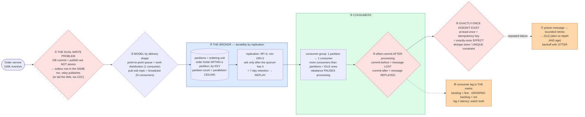

# Message Queues & Event Streaming — Mermaid Diagrams

> **Reference:** [questions.md](./questions.md) · [answers.md](./answers.md) · [deep-dive.md](./deep-dive.md)
>
> **Note on this file:** the per-question diagram set (Diagrams 1–N per [`docs/instructions.md` §2.1](../../docs/instructions.md)) is still to be authored for this topic. The **one-page master diagram** below — the artifact you revise from and reproduce on the whiteboard — is complete.
>
> **Cross-links (depth lives there, not here):** [communication-protocols](../communication-protocols/) (the sync-vs-async decision that precedes this) · [distributed-transactions](../distributed-transactions/) (outbox + saga) · [long-running-tasks](../../patterns/long-running-tasks.md) · [e-commerce](../e-commerce/) / [notification-system](../notification-system/) (this topic in production) · `docs/AWS_SERVICE_MAP.md` §1.4 (the four AWS async choices)

---

## 🎯 The One-Page Master Diagram — THE ONE TO DRAW IN THE INTERVIEW (final consolidated design)

> **When to use:** final revision, 10 minutes before the interview — and the single diagram to reproduce on the whiteboard. If you can narrate it end-to-end and name the tradeoff at each **red** box, you're ready.
> Spec: [`docs/instructions.md` §2.1](../../docs/instructions.md) · AWS names: [`docs/AWS_SERVICE_MAP.md`](../../docs/AWS_SERVICE_MAP.md).
> ⚠️ AWS services are **defensible defaults**; every quota is an order-of-magnitude planning number to **verify against current docs**.

### The central split in one sentence

**Async messaging is not about speed, it's about **decoupling** — a synchronous chain fails cascadingly while a queued system degrades into a backlog — and the two decisions that follow are your **failure unit** (per-message retry ⇒ a queue; per-entity ordering with replay ⇒ a log) and the fact that **exactly-once delivery does not exist**, so you build at-least-once delivery plus an idempotent consumer, with the transactional outbox solving the dual-write problem at the producer.**

### The 60-second narration

*(one line per numbered box ①–⑧)*

1. **The first red box is the producer-side trap: the dual-write problem.** Writing the order to your database and publishing the event are two separate systems, and no ordering of the two is atomic — crash in between and they diverge permanently. The fix is a **transactional outbox**: insert the event into an outbox table *in the same local transaction* as the business write, and let a relay publish it. Or tail the write-ahead log with CDC and never dual-write at all.
2. **Choose the delivery model by shape:** a point-to-point queue distributes work (each message to exactly one consumer), a pub-sub topic broadcasts (each message to every subscriber). Kafka is a *commit log* — replay and per-key ordering; RabbitMQ is a traditional broker — rich routing and per-message acks. Say which property you need.
3. **The broker's durability story is replication:** RF=3 with a minimum in-sync-replica count of 2 means a producer ack implies the data is on a quorum, so losing one broker loses nothing. Retention (7 days here) is what makes **replay** possible — the thing a queue cannot do.
4. **Partitions are the ordering unit *and* the parallelism ceiling.** Order is preserved within a partition, keyed by the entity whose order matters; one partition maps to exactly one consumer in a group, so more consumers than partitions leaves some idle. Say the operational cost too: a rebalance *pauses* processing.
5. **The second red box: when you commit the offset decides your failure mode.** Commit *before* processing and a crash loses the message. Commit *after* and a crash reprocesses it. There is no third option — which is precisely why the next box is mandatory.
6. **The third red box, and the sentence to say out loud: exactly-once *delivery* is impossible across a network.** You build at-least-once delivery plus an **idempotent consumer** — an idempotency key with a dedupe store or a `UNIQUE` constraint — which gives an exactly-once *effect*. Kafka's transactions give exactly-once *processing* within Kafka; the moment you touch an external system, idempotency is back to being your job.
7. **A poison message must not retry forever:** bounded retries with exponential backoff **and jitter** (unjittered retries resynchronize into a thundering herd on recovery), then a dead-letter queue. And a DLQ is only useful if it's monitored — alert on depth *and age*.
8. **Consumer lag is the metric.** Distinguish a backlog (normal, that's the buffer doing its job) from a *growing* backlog (your consumers can't keep up and will never catch up). Watch lag and end-to-end latency separately — low lag with high latency means slow processing, not a queueing problem.

### The five numbers that justify the design

| Number | Derivation | Therefore |
|---|---|---|
| **100K events/s** | stated peak | Forces a partitioned log; partition count = 100K ÷ per-partition throughput, plus headroom |
| **1 partition → 1 consumer per group** | consumer-group semantics | Partition count is your **parallelism ceiling**, so size it for future concurrency — repartitioning later reshuffles key ordering |
| **RF=3, min ISR=2** | quorum durability | An acked write survives one broker loss with zero data loss; ISR=1 silently trades that away |
| **7-day retention** | stated requirement | This is what buys replay — reprocessing a bug's blast radius is a *retention* decision made in advance |
| **< 100 ms critical-path latency** | stated SLA | Bounds batching/linger settings: throughput tuning and latency tuning pull in opposite directions here |

### The patterns this assembles

| Pattern | Where | The move |
|---|---|---|
| [Multi-Step Processes](../../patterns/multi-step-processes.md) **●** | ①⑥ | Outbox for atomic publish; sagas ride these queues; compensations are just more messages |
| [Long-Running Tasks](../../patterns/long-running-tasks.md) **●** | ④⑤⑦ | Accept → queue → worker → retry → DLQ; visibility timeout must exceed p99 processing |
| [Scaling Writes](../../patterns/scaling-writes.md) **●** | ③ | The queue *is* the write buffer — a spike becomes a backlog instead of dropped requests |
| [Dealing with Contention](../../patterns/dealing-with-contention.md) ○ | ⑥ | The idempotency key is a conditional/unique write — rung 1 |
| [Real-Time Updates](../../patterns/realtime-updates.md) ○ | fan-out | The log is the internal backbone; the last mile to a browser is WS/SSE, not a broker |

### The three things that break (and the mitigation)

| Failure | Blast radius | Mitigation | How you detect it |
|---|---|---|---|
| **Consumer crashes mid-processing** | Depending on offset-commit order: the message is silently lost, or reprocessed and its side effects duplicated (double charge, double email) | Commit *after* processing and make the handler idempotent; a dedupe store keyed by message/business id makes the replay harmless | Duplicate-suppressed counter; more than one effect per idempotency key (must be zero); rebalance frequency |
| **Poison message** | With per-partition ordering, one bad record stalls the whole partition — every entity on that key range stops moving, not just the broken one | Bounded retries with jittered backoff, then DLQ so the partition advances; monitor the DLQ as a first-class queue | Lag on **one** partition diverging from the rest; DLQ depth and age; retry-count histogram |
| **Consumer lag grows without bound** | The backlog stops being a buffer and becomes an outage with a delay — often discovered downstream, hours later | Scale consumers up to the partition count (and pre-provision partitions so you *can*), shed or prioritize by topic, and alert on lag **derivative** not absolute value | Lag trend per group; time-to-drain estimate; end-to-end latency separately from lag |

### The AWS-specific traps to name unprompted

| Trap | Why it bites here | What you say |
|---|---|---|
| **SQS vs Kinesis vs SNS vs EventBridge** | Chosen by habit; they differ in *failure unit* | *"Per-message retry with DLQ isolation → SQS. Per-entity ordering with replay → Kinesis/MSK. One event to N consumers → SNS. Content-based routing, schema registry, replay → EventBridge."* |
| **SQS FIFO throughput is per message-group** **⚠️ verify** | Coarse grouping serializes a tenant | *"Group by `order_id` — many small groups; grouping by tenant would serialize the whole tenant."* |
| **SQS visibility timeout vs job duration** | Timeout < p99 ⇒ concurrent double-processing | *"Visibility above p99, heartbeat-extend for long jobs, and the handler is idempotent regardless."* |
| **Kinesis per-shard head-of-line blocking** | One slow record stalls a shard | *"Per-shard retry plus a side-channel DLQ — or SQS if per-message isolation matters more than ordering."* |
| **DynamoDB Streams *is* an outbox** | Best AWS-native answer | *"On DynamoDB I don't dual-write at all — Streams is a log-based outbox for free."* |
| **`SQS DelaySeconds` ≤ 15 min; DynamoDB TTL is not a scheduler** **⚠️ verify** | Delayed work | *"Longer delays are EventBridge Scheduler or a timer table with a sweeper — never TTL."* |

### If you only remember one thing

> **Decouple to degrade gracefully, then make two decisions: your **failure unit** (per-message retry ⇒ queue; per-entity ordering + replay ⇒ log) and the fact that **exactly-once delivery doesn't exist** — so it's at-least-once plus an idempotent consumer, with a transactional outbox so the database write and the published event can never diverge.**
