# Notification System — Mermaid Diagrams

> Interview-ready diagrams. Start with Diagram 1 for the whiteboard overview, then drill into the specific area the interviewer probes.
>
> Reference: [answers.md](./answers.md) | [conducive-sentences.md](./conducive-sentences.md)

---

## Diagram 1 — High-Level Architecture (Start Here)

> **When to use:** Opening diagram. Draw this first on any whiteboard. Covers every major component and the two distinct paths (write vs dispatch).

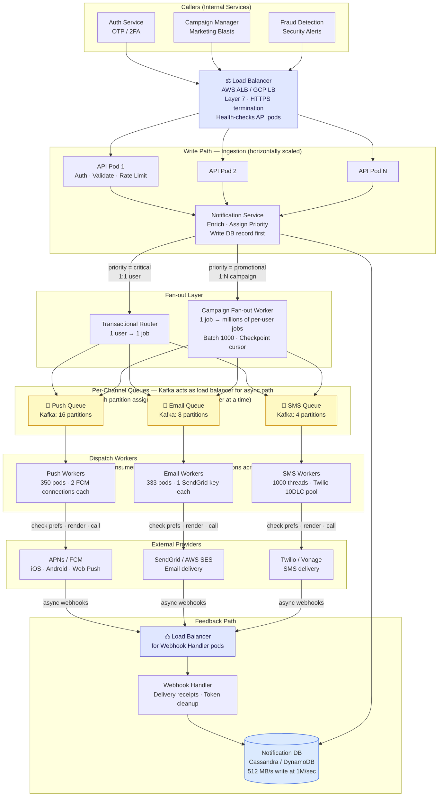

**Key talking points:**
- **Two places where load balancing happens, but they work differently:**
  - **HTTP (sync path):** A real load balancer (ALB/GCP LB) in front of API pods and Webhook Handler pods. Distributes HTTP requests by round-robin or least-connections.
  - **Async dispatch path:** Kafka's consumer group protocol acts as the load balancer — each partition is assigned to exactly one worker pod at a time. No separate LB needed. Workers don't need a LB because they *pull* from Kafka rather than receive pushed requests.
- API pods are stateless → easy horizontal scale behind the LB
- Webhook Handler also needs a LB because providers call back via HTTP (same pattern as the API layer)
- Fan-out workers and dispatch workers are Kafka consumers — they self-organize via consumer group rebalancing when pods are added or removed

---

## Diagram 2 — Transactional vs Campaign Flow (Two Paths)

> **When to use:** When asked "how does an OTP vs a marketing blast differ?"

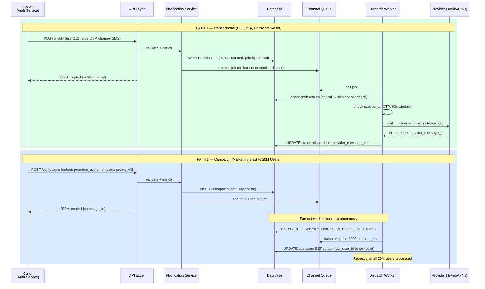

**Key talking points:**
- Transactional: 1 DB row → 1 queue job → 1 provider call
- Campaign: 1 DB row → 1 fan-out job → 20M queue jobs → 20M provider calls
- Both return `202 Accepted` immediately — caller never waits for delivery

---

## Diagram 3 — Fan-out State Machine with Checkpointing

> **When to use:** When asked "how do you handle crashes during fan-out?" or "how do you send to 20M users without duplicates?"

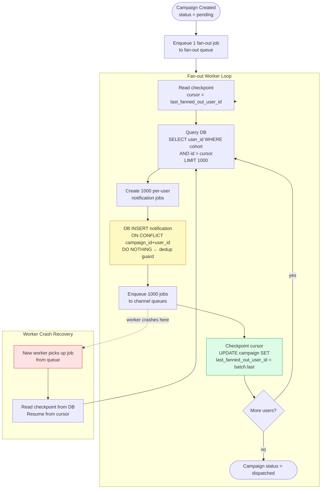

**Key talking points:**
- Checkpoint after every 1000-user batch → at most 999 users re-processed on crash
- `UNIQUE(campaign_id, user_id)` constraint blocks duplicate notification rows even if re-processed
- Two-part idempotency: checkpoint (skip already-processed users) + DB constraint (prevent duplicate rows)

---

## Diagram 4 — Notification Status State Machine

> **When to use:** When asked "how do you model notification state?" or "how do you detect stuck workers?"

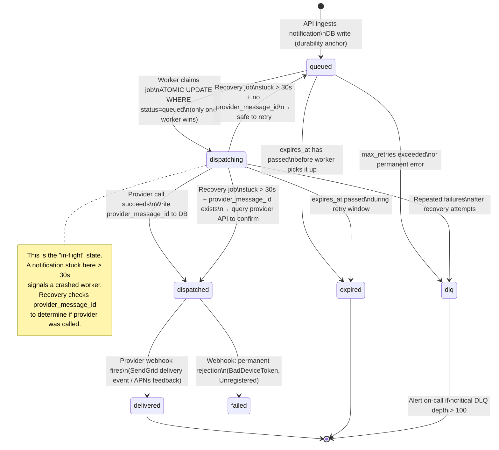

**Key talking points:**
- `dispatching` is the "in-flight" flag — prevents two workers from claiming the same job
- `provider_message_id` is the recovery key: lets you query the provider to confirm delivery after a crash
- Critical DLQ alert fires at depth > 100 (should be near-zero in healthy system)

---

## Diagram 5 — Priority Queue System (Critical vs Promotional)

> **When to use:** When asked "how do you guarantee OTPs are never delayed by a marketing blast?"

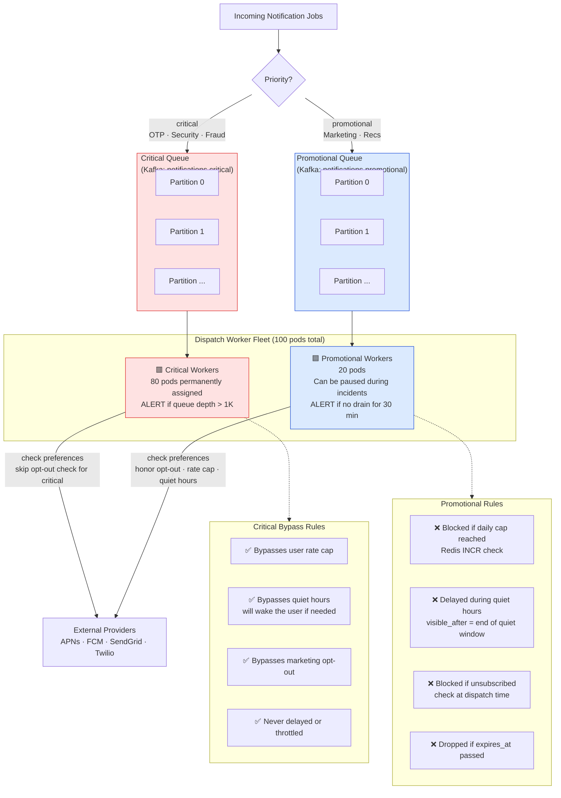

**Key talking points:**
- Separate Kafka topics = physical isolation, not just logical priority
- 80/20 worker split: can temporarily reassign promotional workers to critical during an incident
- Critical notifications skip ALL gating: no opt-out, no quiet hours, no rate cap

---

## Diagram 6 — Dispatch Worker Internal Flow

> **When to use:** When asked "what does a dispatch worker actually do?" or "where do you check user preferences?"

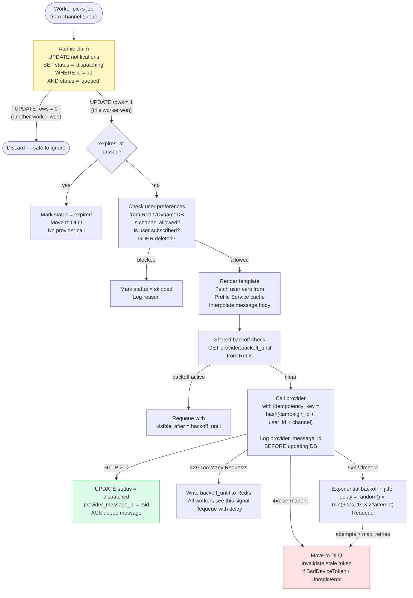

**Key talking points:**
- Atomic claim (`UPDATE WHERE status='queued'`) prevents two workers processing the same job
- Preference check at dispatch time — not at ingestion — catches late unsubscribes
- `provider_message_id` logged before DB update: recovery key if worker crashes after provider call
- Shared Redis backoff signal: first worker to see 429 signals all others

---

## Diagram 7 — Failure Handling: Circuit Breaker + DLQ

> **When to use:** When asked "what happens when Twilio goes down?" or "how do you handle provider outages?"

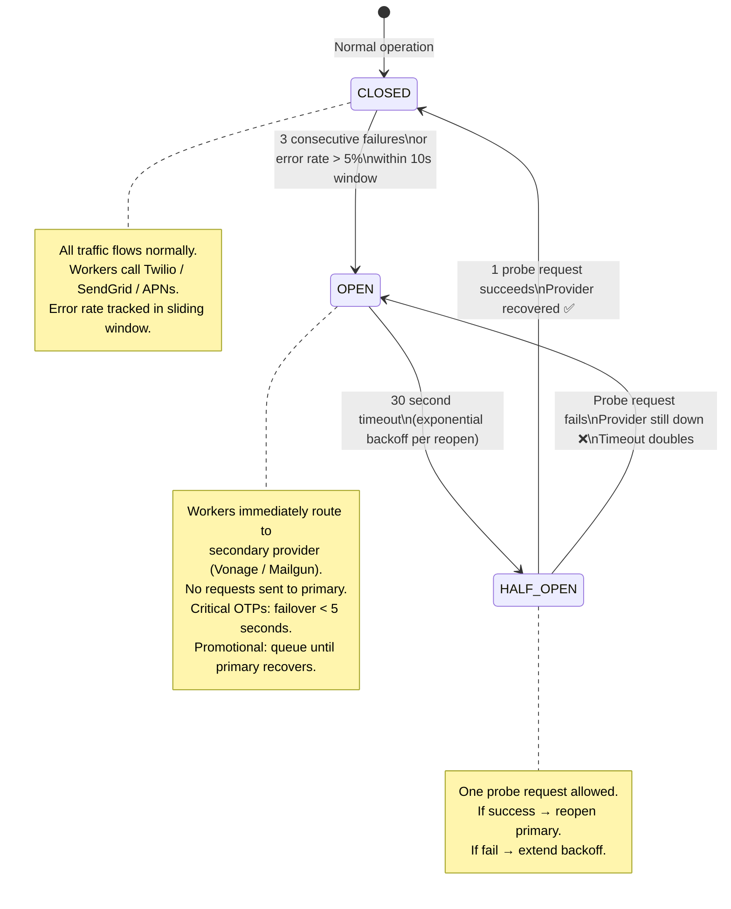

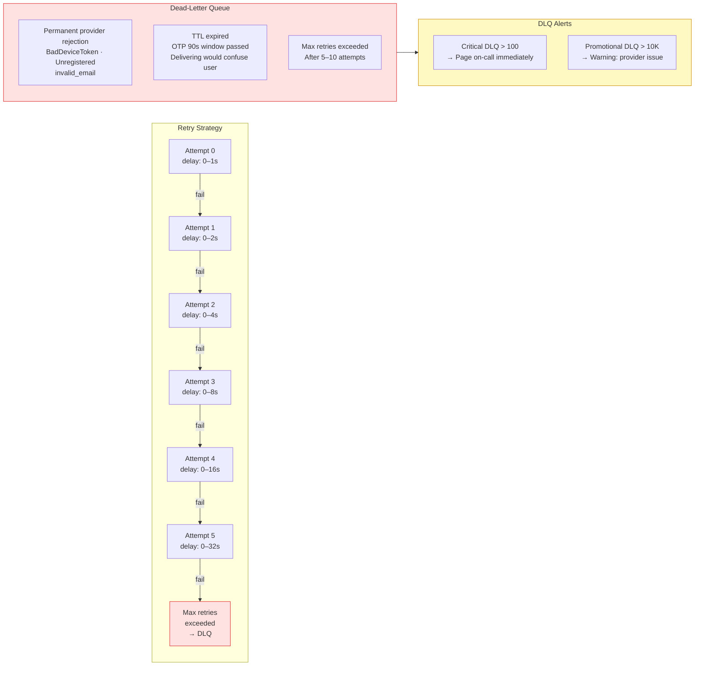

**Key talking points:**
- Circuit breaker prevents hammering a downed provider (separate per channel — Twilio outage doesn't affect APNs)
- Full jitter formula: `delay = random() × min(cap=300s, 1s × 2^attempt)` — prevents thundering herd on recovery
- DLQ is not just a graveyard — it's observable (depth metric drives alerts)

---

## Diagram 8 — Multi-Region Architecture (GDPR Compliance)

> **When to use:** When asked "how do you handle EU users?" or "how do you scale globally?"

```mermaid
flowchart TD
    subgraph Global["Global Layer (Replicated Everywhere)"]
        GM[(Global Metadata DB\nCampaign records\nUser → home_region mapping)]
    end

    subgraph US["US-East Region"]
        USAPI[API Gateway]
        USNS[Notification Service]
        USQ[Channel Queues]
        USW[Dispatch Workers\nUS provider credentials]
        USDB[(US User Data\nTokens · Preferences\nDelivery status)]
    end

    subgraph EU["EU-West Region (Frankfurt)"]
        EUAPI[API Gateway]
        EUNS[Notification Service]
        EUQ[Channel Queues]
        EUW[Dispatch Workers\nEU provider credentials]
        EUDB[(EU User Data\nTokens · Preferences\nDelivery status\n🔒 GDPR: never leaves EU)]
    end

    subgraph Routing["Routing Logic for Campaign Fan-out"]
        R1["For each user in campaign cohort:\n1. Look up home_region from Global DB\n2. Route job to that region's queue\n3. Dispatch worker in that region calls provider"]
    end

    Campaign[Campaign Created\n(any region)] --> GM
    GM --> Routing
    Routing -->|user.home_region = US| USQ
    Routing -->|user.home_region = EU| EUQ

    USAPI --> USNS --> USQ --> USW --> USDB
    EUAPI --> EUNS --> EUQ --> EUW --> EUDB

    USW -->|APNs US endpoint\nFCM US\nSendGrid US| USProviders[US Providers]
    EUW -->|APNs EU endpoint\nFCM EU\nSendGrid EU| EUProviders[EU Providers]

    style EUDB fill:#dcfce7,stroke:#16a34a
    style EUW fill:#dcfce7,stroke:#16a34a
    style EUQ fill:#dcfce7,stroke:#16a34a
```

**Key talking points:**
- EU user data (tokens, preferences, delivery records) never leaves EU infrastructure — GDPR requirement
- Campaign metadata is global (who to send, what template); user data is region-local
- Fan-out job routes per-user jobs to the correct regional queue
- Lower APNs/FCM latency as a bonus: regional provider endpoints

---

## Diagram 9 — Per-User Preference and Rate Control

> **When to use:** When asked "how do you implement quiet hours?" or "how do you prevent notification fatigue?"

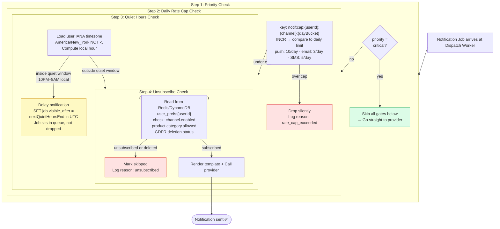

**Key talking points:**
- Critical notifications skip all 4 gates — OTPs must always get through
- Quiet hours = **delay**, not drop — the notification is rescheduled to 8 AM local time
- Unsubscribe checked at dispatch (not ingestion) — catches users who opt out during a 4-hour campaign fan-out
- Rate cap uses Redis sliding window: `INCR` + 24h TTL = O(1) check

---

## Diagram 10 — Capacity at 1M Notifications/sec

> **When to use:** When asked "how would you scale this to 1M/sec?" Show the math, not just "scale horizontally."

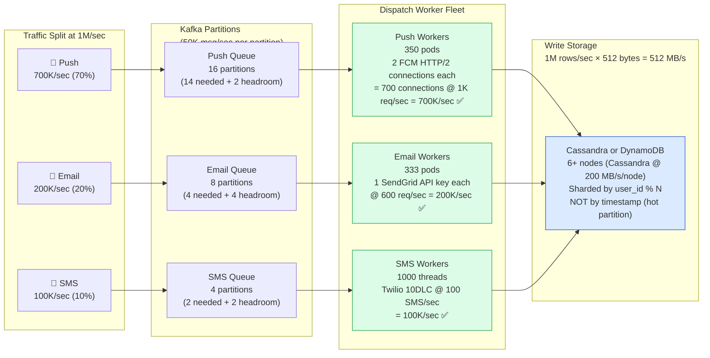

**Key numbers to memorize:**
| Resource | Number | Why |
|---|---|---|
| Kafka partitions (push) | 16 | 700K/sec ÷ 50K per partition |
| Push worker pods | 350 | 700 FCM connections ÷ 2 per pod |
| Email worker pods | 333 | 200K/sec ÷ 600 req/sec per API key |
| SMS worker threads | 1000 | 100K/sec ÷ 100 SMS/sec per 10DLC |
| DB write I/O | 512 MB/s | 1M rows × 512 bytes |
| DB technology | Cassandra/DynamoDB | Relational DB maxes out at ~50 MB/s writes |

---

## Quick Interview Reference

### The 5 most important design decisions (and why)

| Decision | Why it matters | Alternative (wrong) |
|---|---|---|
| Queue between ingestion and dispatch | Decouples provider latency from API latency; enables retries without blocking callers | Synchronous dispatch — provider slowdown stalls your API |
| Separate queues per channel | Independent scaling, failure isolation, rate limiting | Shared queue — email backlog starves OTP pushes |
| Check preferences at dispatch, not ingestion | Catches late opt-outs; correct for DLQ replays | Check at ingestion — user who unsubscribes during fan-out still gets notified |
| Write DB record before enqueuing | Notification is durable even if enqueue crashes | Enqueue first — crash between enqueue and DB write → invisible loss |
| `UNIQUE(campaign_id, user_id)` constraint | Prevents fan-out duplicates even if worker re-processes a batch | No constraint — crashed + restarted fan-out sends duplicate notifications |

### The 4 SLOs

| SLO | Target | What it catches |
|---|---|---|
| Critical P95 end-to-end latency | < 5 seconds | Queue buildup, worker slowdown, provider degradation |
| Dispatch error rate | < 0.1% | Systematic provider issues, config errors |
| Critical DLQ depth | < 100 messages | Users not receiving OTPs / security alerts |
| Fan-out lag (10M recipients) | < 10 minutes | Fan-out bottleneck, slow DB queries |

---

## Diagram 11 — Redundancy at Every Layer + Channel Fallback Chain

> **When to use:** When asked "what are your SPOFs?" or "how does this system survive failures?" Two sub-diagrams: infrastructure redundancy by layer, then the application-level channel fallback chain.

### Part A — Infrastructure Redundancy by Layer

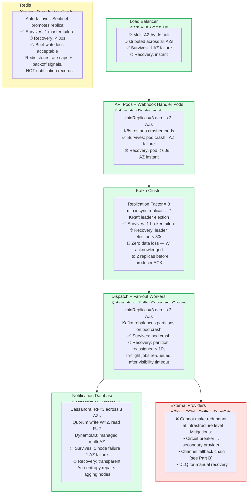

### Part B — Channel Fallback Chain (Application-level Redundancy)

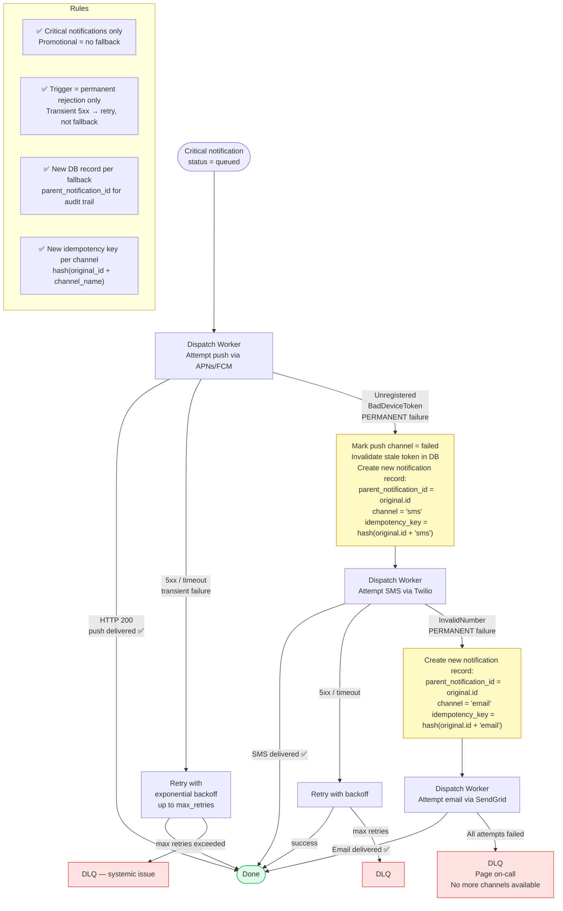

**Key talking points:**
- Every green layer in Part A is self-healing — no human intervention required on failure
- The only red layer is external providers — this is the irreducible risk; circuit breaker (Diagram 7) + fallback chain (Part B) are the mitigations
- Redis is yellow: the brief write-loss window on failover is acceptable because Redis stores soft state (rate caps, backoff signals), not notification records
- Part B fallback fires on **permanent** rejection only — transient 5xx goes through the normal retry loop first
- `parent_notification_id` is the audit field that lets you reconstruct "we tried push, it failed permanently, then sent SMS" from the notification table
