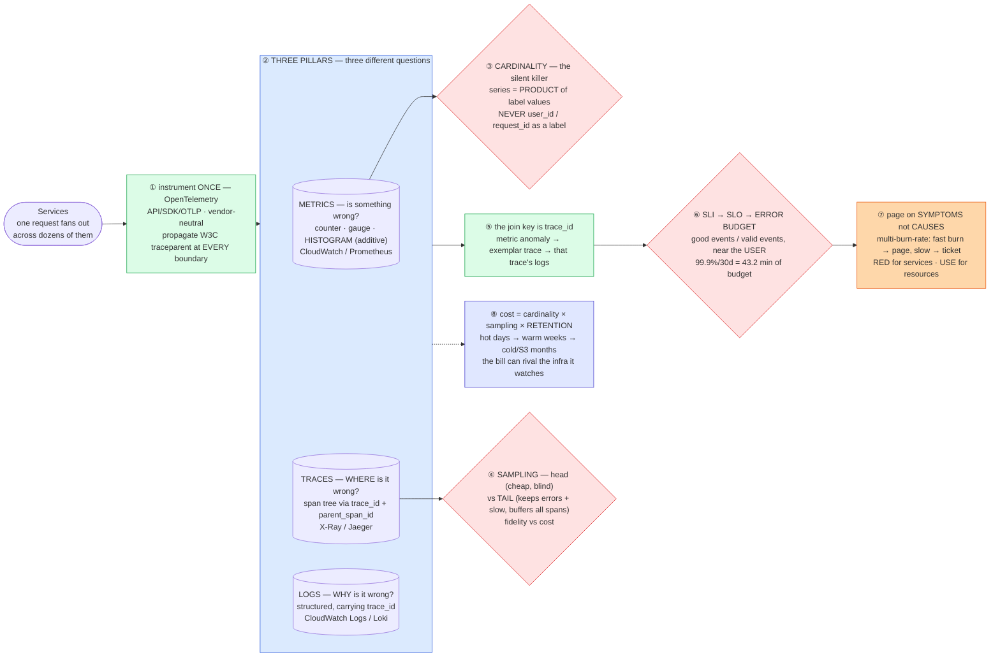

# Observability (Metrics · Logs · Traces · SLOs) — Mermaid Diagrams

> **Reference:** [questions.md](./questions.md) · [answers.md](./answers.md) · [deep-dive.md](./deep-dive.md)
>
> **Note on this file:** the per-question diagram set (Diagrams 1–N per [`docs/instructions.md` §2.1](../../docs/instructions.md)) is still to be authored for this topic. The **one-page master diagram** below — the artifact you revise from and reproduce on the whiteboard — is complete.
>
> Cross-links: [communication-protocols](../communication-protocols/) (trace context propagation) · [message-queues](../message-queues/) · [api-design](../api-design/) · [circuit-breaker](../../fundamentals/circuit-breaker.md) · [chaos-monkey](../../fundamentals/chaos-monkey.md)

---

## 🎯 The One-Page Master Diagram — THE ONE TO DRAW IN THE INTERVIEW (final consolidated design)

> **When to use:** final revision, 10 minutes before the interview — and the single diagram to reproduce on the whiteboard. If you can narrate it end-to-end and name the tradeoff at each **red** box, you're ready.
> Spec: [`docs/instructions.md` §2.1](../../docs/instructions.md) · AWS names: [`docs/AWS_SERVICE_MAP.md`](../../docs/AWS_SERVICE_MAP.md).
> ⚠️ AWS services are **defensible defaults**; every quota is an order-of-magnitude planning number to **verify against current docs**.

### The central split in one sentence

**Monitoring answers questions you thought of in advance (known-unknowns); observability lets you ask *new* questions of a running system (unknown-unknowns) — so you instrument once with a vendor-neutral SDK, let the three pillars answer three different questions (metrics = *something* is wrong, traces = *where*, logs = *why*), page only on **symptoms** measured as SLO burn rather than on causes, and control cost with the three levers that actually move it: cardinality, sampling, and retention tiering.**

### The 60-second narration

*(one line per numbered box ①–⑧)*

1. **Instrument once, vendor-neutrally.** OpenTelemetry (the OpenTracing + OpenCensus merger) gives an API, SDK and OTLP wire format, so the backend choice stays reversible. The load-bearing detail is **propagating `traceparent` at every process boundary** — HTTP header, Kafka record header, gRPC metadata — because a trace that stops at a queue is not a trace.
2. **State what each pillar is *bad* at, not just good at:** metrics are cheap and aggregatable but can't tell you *which* request; traces show causality but are expensive to keep in full; logs explain but don't aggregate. Prefer **histograms over summaries** when you need a cross-instance p99 — buckets are additive, per-instance quantiles are not.
3. **The first red box is cardinality, and it is the thing that silently destroys metric systems.** Series count is the *product* of label values, so putting `user_id` or `request_id` in a label doesn't make a big metric — it makes an unbounded one, and it OOMs the backend. High-cardinality identity belongs in traces and logs.
4. **The second red box is sampling — a genuine fidelity/cost trade.** Head sampling is cheap but decides before it knows the outcome, so it throws away errors. Tail sampling keeps the interesting traces (errors, slow requests) but must buffer all spans of a request to decide. Say which you'd pick and why.
5. **The three pillars are only useful because they share a join key: `trace_id`.** The workflow you should narrate is: an SLO burn alert fires → jump from the metric to an **exemplar** trace → from that trace to the logs of the exact span that failed. Three pillars without a join key is three silos.
6. **The third red box reframes everything: SLIs and SLOs, not resource metrics.** The question is never "is CPU high?" but "are users getting fast, correct responses?" — so an SLI is good events ÷ valid events, measured as close to the user as possible, as a ratio or percentile rather than an average. The error budget (1 − SLO) turns reliability into currency: 99.9% over 30 days is **43.2 minutes**; spend it on release velocity, and freeze risky deploys when it's gone.
7. **Therefore page on symptoms, never causes.** Multi-burn-rate alerting — a fast burn pages, a slow burn opens a ticket, with long and short windows to suppress false positives. RED (rate, errors, duration) for request-driven services; USE (utilization, saturation, errors) for resources; and every page carries a runbook or it's alert fatigue by construction.
8. **Cost is a design constraint here, not an afterthought:** cardinality × sampling rate × retention. Tier it — hot for days, warm for weeks, cold object storage for months — because an observability bill can genuinely rival the infrastructure it observes.

### The five numbers that justify the design

| Number | Derivation | Therefore |
|---|---|---|
| **99.9% over 30 days = 43.2 min error budget** | (1 − 0.999) × 43,200 min | The whole release-velocity conversation in one figure; know how to compute it live for any SLO/window |
| **Series = product of label values** | cardinality arithmetic | One 10-value label × one 1,000-value label = 10,000 series *per metric name* — this is why a `user_id` label is fatal |
| **Metrics ≪ logs ≪ traces in cost per request** | payload sizes and volumes | Decides what you sample and what you keep in full; it's why metrics are always-on and traces are sampled |
| **Multi-window burn rate (e.g. fast vs slow)** | budget consumption rate | Distinguishes "we'll exhaust the budget in an hour → page now" from "in two weeks → ticket" |
| **Retention tiers: days → weeks → months** | access-pattern decay | Nobody queries raw traces from 60 days ago interactively; tiering is the single biggest cost lever after cardinality |

### The patterns this assembles

| Pattern | Where | The move |
|---|---|---|
| [Scaling Writes](../../patterns/scaling-writes.md) **●** | ②④ | Telemetry is a firehose: aggregate at the edge/collector, sample, and batch before storage |
| [Long-Running Tasks](../../patterns/long-running-tasks.md) ○ | ② pipeline | Collector → queue → storage, with backpressure so telemetry loss never takes down the app |
| [Scaling Reads](../../patterns/scaling-reads.md) ○ | ⑧ | Pre-aggregated rollups for dashboards; raw data only for investigation |
| [Circuit breaker](../../fundamentals/circuit-breaker.md) ○ | ⑦ | The alerting signals are the same ones that drive breakers and admission control |
| [Chaos engineering](../../fundamentals/chaos-monkey.md) ○ | ⑥⑦ | You cannot claim an SLO you have never tested — inject failure in business hours |

### The three things that break (and the mitigation)

| Failure | Blast radius | Mitigation | How you detect it |
|---|---|---|---|
| **Cardinality explosion** | The metrics backend OOMs or the bill explodes — and it happens from a one-line code change adding a label | Enforce a label allowlist in the SDK/collector, cap series per metric, and reject unbounded labels in code review; identity goes to logs/traces | Series-count growth per metric name (alert on the *derivative*); ingestion rejections; per-metric cost attribution |
| **Alert fatigue** | On-call stops trusting pages, so the one real incident is missed — a *human* failure mode with a technical cause | Page only on actionable symptoms (SLO burn, golden signals), tier severities, add `for:` durations, attach runbooks, and delete alerts nobody acts on | Pages per on-call shift; percentage of pages that are actioned vs silenced; MTTA trend |
| **Telemetry outage during an incident** | You are blind exactly when you need sight most, and observability failure often *correlates* with the outage | Keep the telemetry path independent of the serving path (separate collectors, separate failure domain), buffer at the collector, and alert on **absence of data** as its own condition | Dead-man's-switch alert (fires when the pipeline goes quiet); collector queue depth and drop rate |

### The AWS-specific traps to name unprompted

| Trap | Why it bites here | What you say |
|---|---|---|
| **CloudWatch custom-metric cost climbs fast** | Per-metric, per-dimension pricing | *"Bounded dimensions on CloudWatch for alarms; high-cardinality exploration goes to Prometheus/Mimir or a columnar store — cardinality is a cost decision, not just a technical one."* |
| **X-Ray vs OTel/ADOT** | Lock-in on instrumentation | *"Emit OpenTelemetry via ADOT and choose the backend later — instrumentation is the expensive, sticky part."* |
| **CloudWatch Logs Insights is not a log analytics platform at scale** | Heavy queries | *"Fine for targeted queries; heavy analytics goes to OpenSearch or Loki, with S3 as the cold tier and Athena over it."* |
| **Tail sampling needs a stateful collector** | Buffering all spans | *"Tail sampling lives in a collector tier that has to hold a request's spans — that's a real capacity and failure-domain decision, not a config flag."* |
| **CloudTrail is an audit trail, not observability** | Often conflated | *"CloudTrail answers 'who called what' for audit; it's not where I debug latency."* |
| **AWS provides no circuit breaker and no SLO engine** | Assumed to be managed | *"Burn-rate alerting and breakers are mine to build — SDK adaptive retry is not a breaker, and an alarm is not an error budget."* |

### If you only remember one thing

> **Instrument once with OpenTelemetry and make `trace_id` the join key across all three pillars; then page on user-visible symptoms via SLO burn rate rather than on causes — and remember the two things that silently destroy observability platforms are cardinality and retention, not query performance.**
