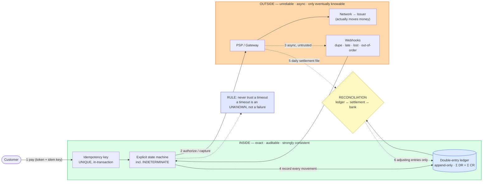
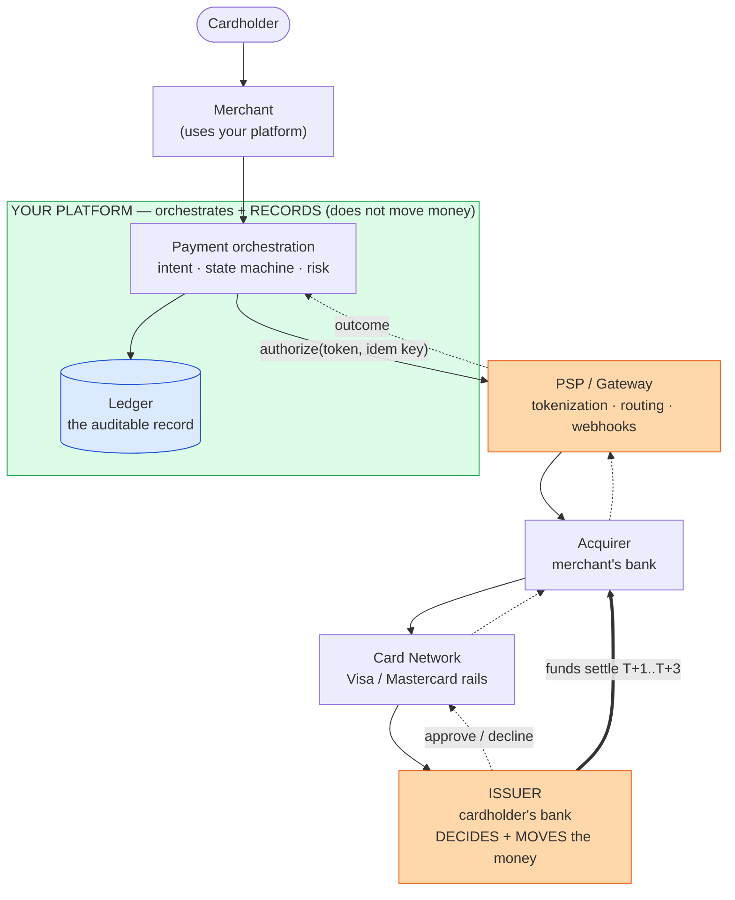
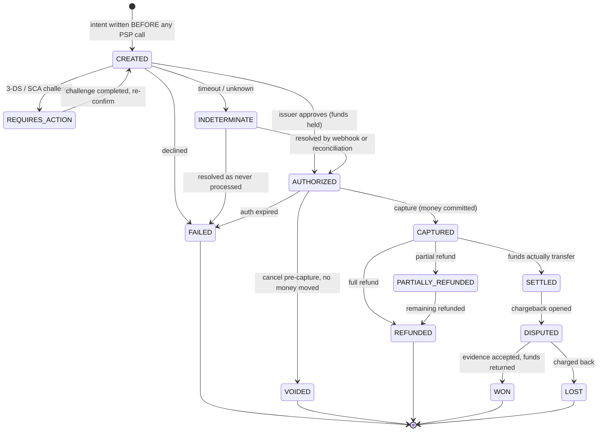
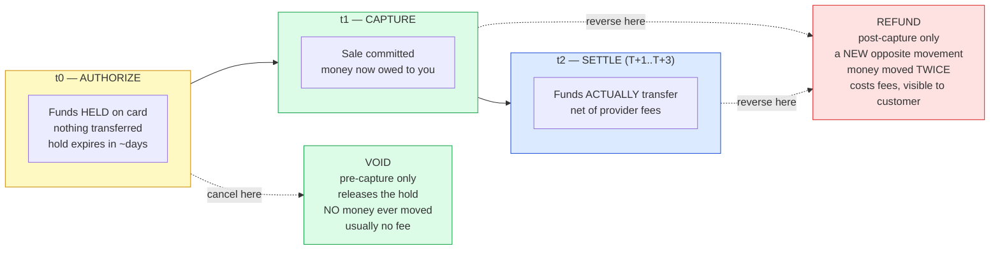
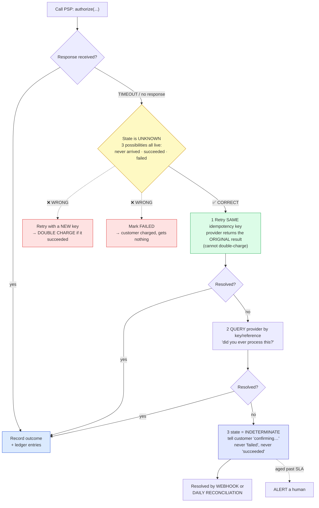
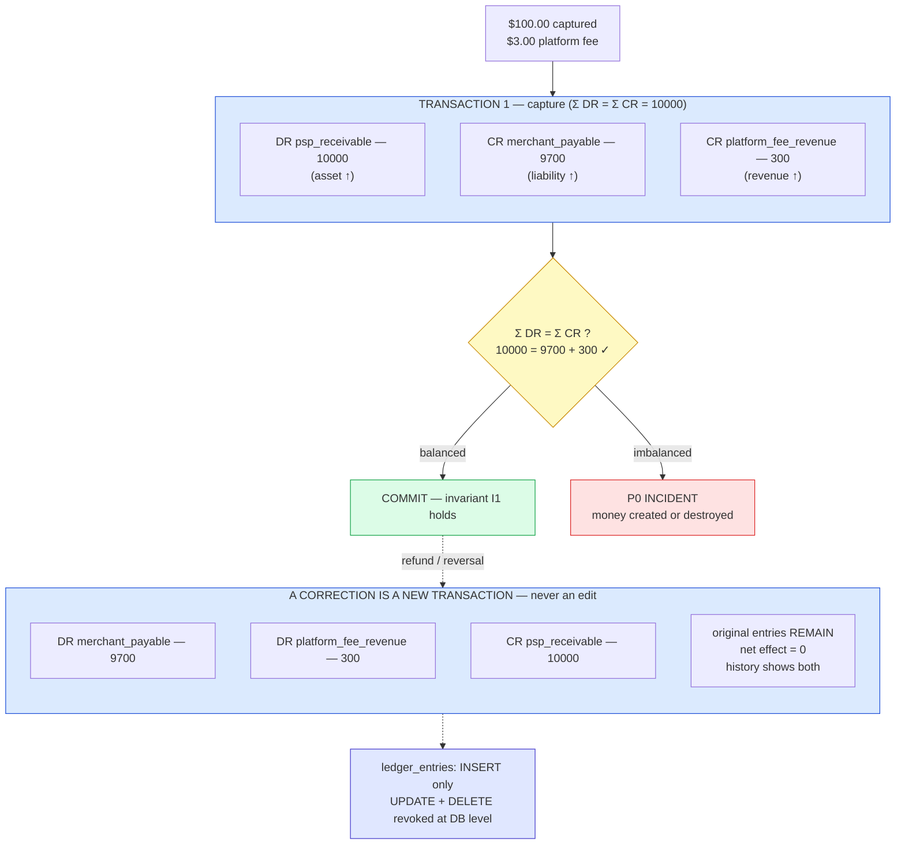
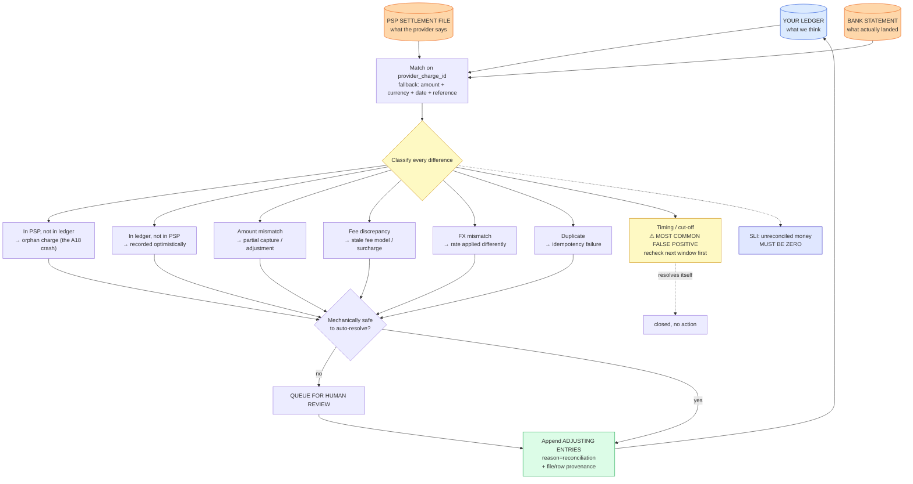
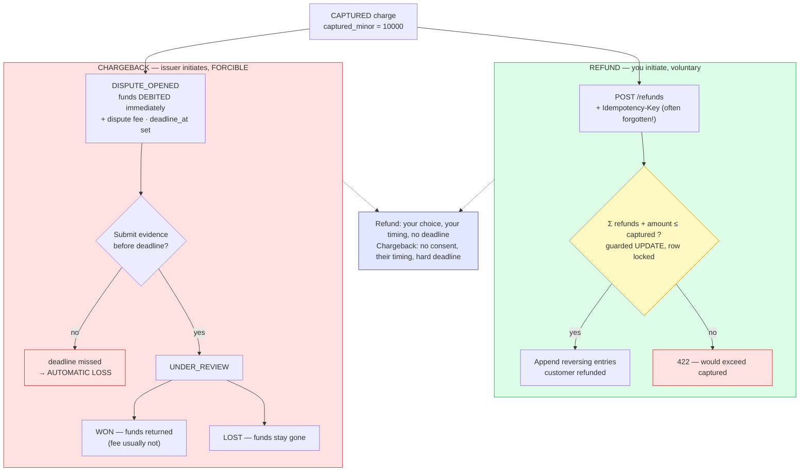
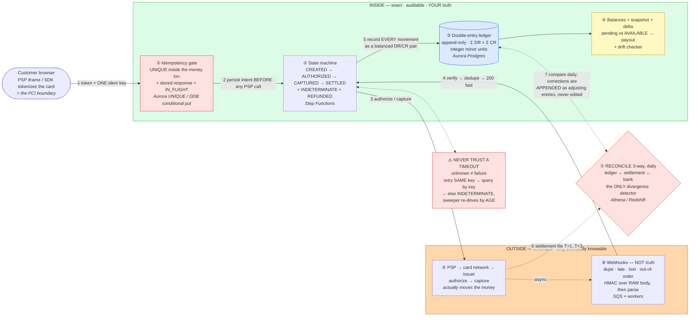

# Payment System (Stripe / PayPal / Google Pay) — Mermaid Diagrams

> Interview-ready diagrams. Start with Diagram 1 — the **internal-exactness vs external-unreliability** split is the mental model everything hangs off. Then drill into whichever layer the interviewer probes.
>
> Reference: [answers.md](./answers.md) | [simple-diagram.md](./simple-diagram.md)
>
> Cross-links: [distributed-transactions](../distributed-transactions/) (saga · outbox · compensations) · [message-queues](../message-queues/) (at-least-once · DLQ) · [e-commerce](../e-commerce/) (the checkout leg that calls this) · [seat-reservation](../seat-reservation/) (payment inside a booking saga) · [api-design](../api-design/) (idempotency as a contract) · [observability](../observability/) (the SLI that must be zero) · [sharding-replication](../sharding-replication/) · [storage-engines](../storage-engines/) (append-only + snapshot)

---

## Diagram 1 — The Central Split (Start Here)

> **When to use:** The first thing to draw. Everything hangs off the two halves — exact and auditable inside your boundary, unreliable and only eventually knowable outside it, joined by reconciliation. Use for Q1–Q6.



**What the interviewer is checking:**
- You split by **who controls the truth**, not by service boundaries — and give each half its own failure model.
- Inside gets strict transactions and invariants; outside gets defensive handling and dedupe.
- **Reconciliation is load-bearing**, not back-office cleanup — it's the only mechanism that detects divergence.
- You state the timeout rule unprompted; it's the corollary that separates a real design from an API-call sketch.

---

## Diagram 2 — Actors: Who Actually Moves the Money

> **When to use:** Q3, Q7. Shows that your platform orchestrates and records while the issuer and networks move funds — naming this early signals domain fluency.



**What the interviewer is checking:**
- You know the **issuer** approves and moves funds — you are not "the thing that charges cards."
- Your real job is **orchestration + bookkeeping**, which is why the ledger is central rather than incidental.
- Settlement is a **separate, later, batch** event from authorization.
- You can name the actors without treating the PSP as an undifferentiated black box.

---

## Diagram 3 — Payment State Machine (with an explicit INDETERMINATE)

> **When to use:** Q11, Q12, Q17. The states must be persisted and queryable — including the one for "we genuinely don't know."



**What the interviewer is checking:**
- `INDETERMINATE` exists as a **first-class state** — ambiguity has somewhere to live instead of being coerced into success/failure.
- Void and refund are **different transitions** from different states.
- Illegal transitions are structurally impossible (you can't capture a voided auth).
- Dispute is modeled as reachable from settled, with both outcomes — not hand-waved.

---

## Diagram 4 — Authorize · Capture · Settle · Void · Refund on a Timeline

> **When to use:** Q8. Shows what happens to the money at each step and why void ≠ refund.



**What the interviewer is checking:**
- **Void is free and invisible; refund costs money and is visible** — the practical distinction.
- A refund is a *new payment in reverse*, not an undo of the original.
- Authorize-then-capture exists so you don't hold money for undelivered goods ([e-commerce](../e-commerce/) captures on ship).
- You know holds expire, which is why capture can't be deferred indefinitely.

---

## Diagram 5 — Idempotency: The Exactly-Once Charge

> **When to use:** Q13–Q16. The concurrent-duplicate race and why the loser must never call the provider.

```mermaid
sequenceDiagram
    participant C1 as Request 1
    participant C2 as Request 2 (duplicate, concurrent)
    participant DB as Database
    participant PSP as PSP

    Note over C1,C2: both carry Idempotency-Key = K
    C1->>DB: BEGIN; INSERT (K, IN_FLIGHT) ON CONFLICT DO NOTHING
    DB-->>C1: 1 row → WINNER
    C1->>DB: INSERT intent (CREATED), linked to K; COMMIT
    C2->>DB: BEGIN; INSERT (K, IN_FLIGHT) ON CONFLICT DO NOTHING
    DB-->>C2: 0 rows → LOSER
    C2->>DB: SELECT record WHERE idem_key = K
    DB-->>C2: state = IN_FLIGHT
    Note over C2: DOES NOT CALL THE PSP<br/>returns 409 "in progress, retry shortly"
    C1->>PSP: authorize(token, amount, idem_key=K)
    PSP-->>C1: approved
    C1->>DB: BEGIN; outcome + ledger entries; state=COMPLETED + stored response; COMMIT
    C2->>DB: retry: SELECT record WHERE idem_key = K
    DB-->>C2: state = COMPLETED + stored response
    Note over C2: replays the STORED response<br/>byte-identical, no second charge
```

**What the interviewer is checking:**
- The **database arbitrates** the race via `UNIQUE`, not application logic.
- The `IN_FLIGHT` state is what stops the loser from making a **second provider call** — that's the actual double-charge guard.
- The **response is stored** so a replay is identical, not merely "also successful."
- Returning `409` while in-flight is honest; inventing an outcome is the bug this whole mechanism prevents.

---

## Diagram 6 — NEVER TRUST A TIMEOUT

> **When to use:** Q17, Q18, Q49. The single most important decision tree in the topic — both wrong branches lose money.



**What the interviewer is checking:**
- You name **both** wrong branches and why each loses money or trust.
- You know **retrying with the same key is safe** because providers honor idempotency keys — this is the key insight.
- You represent the unknown as a **state** rather than resolving it by assumption.
- You have a human escalation for anything that stays unresolved past an SLA.

---

## Diagram 7 — Double-Entry Ledger for One Payment

> **When to use:** Q19–Q21. Show balanced pairs and that a correction is a new appended entry, never an edit.



**What the interviewer is checking:**
- The entries **actually balance** and you state the debit/credit convention so it's checkable.
- Fees get their **own account** rather than being netted invisibly.
- A correction/refund is an **appended reversing transaction**; the original stays.
- Append-only is enforced by **database permissions**, not by convention.

---

## Diagram 8 — Webhook Ingestion Pipeline

> **When to use:** Q25, Q26, Q38. Verify before parsing, dedupe transactionally, `200` fast, process async.

```mermaid
sequenceDiagram
    participant PSP as PSP
    participant EP as Webhook Endpoint
    participant DB as Database
    participant Q as Queue
    participant W as Worker

    PSP->>EP: POST /webhooks/psp (signed)
    EP->>EP: read RAW BODY (bytes, unparsed)
    EP->>EP: verify HMAC(timestamp + raw body), constant-time
    Note over EP: verify BEFORE parsing —<br/>never deserialize untrusted input first
    EP->>EP: check timestamp freshness (~5 min) → blocks replay
    EP->>DB: INSERT provider_event_id ON CONFLICT DO NOTHING
    alt already seen (0 rows)
        DB-->>EP: duplicate
        EP-->>PSP: 200 (no-op)
    else new event
        DB-->>EP: inserted
        EP->>Q: enqueue for async processing
        EP-->>PSP: 200 FAST
        Note over PSP: slow handlers cause<br/>provider retries → more duplicates
        Q->>W: deliver (at-least-once)
        W->>DB: BEGIN; dedupe marker (event_id, consumer); apply effect; COMMIT
        Note over W: state driven by the EVENT'S own version,<br/>not arrival order
    end
```

**What the interviewer is checking:**
- Signature verified over the **raw body before parsing**, plus timestamp freshness for replay.
- Dedupe is a **`UNIQUE` constraint**, not a cache, and the consumer's marker commits with its effect.
- `200` returned fast, work done async — slow handlers *cause* duplicate deliveries.
- Out-of-order handled by the event's own state/version; an unknown object triggers reconciliation rather than a silent drop.

---

## Diagram 9 — Reconciliation: Three-Way

> **When to use:** Q27, Q28. The only mechanism that detects divergence — plus the mismatch taxonomy.



**What the interviewer is checking:**
- **Three-way**, because two records can agree and still both be wrong about cash.
- You have an explicit **mismatch taxonomy** rather than "compare and see."
- **Cut-off timing** is modeled as a false positive — the practical detail that stops nightly false pages.
- Remediation is an **adjusting entry with provenance**, and real discrepancies get human review, not an automated guess.

---

## Diagram 10 — Refund vs Chargeback

> **When to use:** Q31, Q32, Q35. Voluntary vs forcible, and the invariant that prevents over-refund.



**What the interviewer is checking:**
- Refunds need **their own idempotency key** — the most commonly forgotten guard.
- The `Σ refunds ≤ captured` invariant is enforced **atomically**, so concurrent partials can't over-refund.
- A chargeback debits you **immediately on open**, so the ledger must reflect it before resolution.
- **Missing the evidence deadline is an automatic loss** — so `deadline_at` needs alerting.

---

## Diagram 11 — Frontend: PCI-Safe Checkout + 3-DS Resume

> **When to use:** Q46–Q48. The card bypasses you entirely, and the redirect is resumed by idempotency key.

```mermaid
sequenceDiagram
    participant U as Customer
    participant APP as Your JS (your origin)
    participant IF as PSP iframe (PSP origin)
    participant PSP as PSP
    participant API as Your API
    participant DB as Your DB

    U->>IF: types card into PSP-owned hosted field
    Note over APP,IF: cross-origin — your JS CANNOT read the field.<br/>Same-origin policy is the security boundary,<br/>not developer discipline.
    IF->>PSP: card PAN direct (browser → PSP)
    PSP-->>IF: token
    IF-->>APP: token ONLY (never the PAN)
    APP->>APP: mint/reuse Idempotency-Key in sessionStorage
    APP->>API: POST /payment_intents (token, Idempotency-Key)
    API->>DB: persist intent + key BEFORE any PSP call
    API->>PSP: authorize
    PSP-->>API: requires_action (3-DS)
    API->>DB: state = REQUIRES_ACTION; persist resume context SERVER-SIDE
    Note over DB: server-side, not just sessionStorage —<br/>customer may return in another tab/device
    API-->>APP: redirect to challenge
    APP->>U: full-page redirect (your JS state dies)
    U->>PSP: completes issuer challenge
    PSP->>U: redirect to return_url
    U->>APP: returns
    APP->>API: GET intent by id/key (NOT a new payment)
    API->>DB: look up current state
    Note over API: webhook may have ALREADY resolved it —<br/>"already done" is the NORMAL case
    API-->>APP: AUTHORIZED → show confirmation
```

**What the interviewer is checking:**
- The PAN goes **browser → PSP directly**; the cross-origin iframe is the structural guard.
- The intent and key are persisted **before** the provider call and **server-side** before the redirect.
- On return you **look up**, never re-charge — and "already resolved by webhook" is expected, not an error.
- You'd also mask payment fields in session-replay/error-reporting tools — the leak your own code can't cause.

---

## Quick Interview Reference

### Scale numbers (order-of-magnitude — verify)

| Metric | Value | Note |
|---|---|---|
| Payments | ~10M/day ≈ 115/s avg, ~1K/s peak | Throughput is the *easy* part |
| Ledger writes | ~4–8 entries/payment → ~4–8K/s peak | A multiple of payment volume |
| Ledger storage | ~12 GB/day → ~4–5 TB/yr | Append-only, retained for years |
| Auth latency | ~1–3s incl. sync risk check (~tens–low-hundreds ms) | Checkout conversion depends on it |
| Settlement | T+1..T+3 cards; **days and reversible** for ACH/SEPA | Two meanings of "final" |
| Binding constraint | **Correctness + external agreement** | Not QPS |

### Domain quick-ref

| Term | One-liner |
|---|---|
| **Authorize** | Funds held on the card; nothing transferred |
| **Capture** | Sale committed; money now owed to you |
| **Settle** | Funds actually transfer, batch, net of fees |
| **Void** | Cancel a pre-capture hold; no money ever moved |
| **Refund** | A new opposite movement after capture (not an undo) |
| **Chargeback** | Issuer forcibly reverses; no consent, hard deadline |
| **Idempotency key** | `UNIQUE` in the money transaction + stored response |
| **INDETERMINATE** | First-class state for "we genuinely don't know" |
| **Double-entry** | Every movement is a balanced DR/CR pair summing to zero |
| **Reconciliation** | Ledger ↔ settlement file ↔ bank; detects all divergence |
| **Pending vs available** | Provisional funds vs funds safe to pay out |

### Canonical tradeoffs

- **Exact inside vs defensive outside** — strict transactions within your boundary; assume duplication and unknowns beyond it.
- **Void vs refund** — cancel a promise (free) vs make an opposite payment (fees, visible).
- **Fold vs materialize balances** — always correct but O(n) vs O(1) but needs a drift checker.
- **Webhooks vs polling/reconciliation** — fast but unreliable vs slow but authoritative; you need both.
- **Fail fast vs queue vs failover** — correct-but-lost-revenue vs deferred-risk vs highest-risk (only on a *definitive* not-processed error).
- **False decline vs false accept** — invisible lost revenue vs visible fraud loss.
- **Customer-final vs accounting-final** — authorized/captured vs settled *and* reconciled.

### Common mistakes

- **Treating a timeout as a failure** (or success) instead of an explicit unknown.
- A mutable `balances` table instead of **double-entry**.
- **Floats for money**; hardcoding 2 decimals for every currency.
- **Webhooks as the only source of truth** — no polling, no reconciliation.
- Forgetting **refunds need idempotency keys** and a `Σ refunds ≤ captured` invariant.
- Deduping at the **gateway** instead of in the database transaction.
- **Editing/deleting ledger entries** to fix a bug instead of appending reversals.
- Calling the PSP **before** persisting a local intent.
- **No alert on the reconciliation job failing to run.**
- Optimistically rendering **"payment successful"** before the server confirms.

---

## 🎯 The One-Page Master Diagram — Everything on One Screen

> **When to use:** final revision, 10 minutes before the interview. This single diagram reconstructs the whole topic. If you can narrate it end-to-end and name the tradeoff at each **red** box, you're ready. If you stall on a box, that's the section of [`deep-dive.md`](./deep-dive.md) to open.
> Spec for this section: [`docs/instructions.md` §2.1](../../docs/instructions.md).

### The central split in one sentence

**Be *exact* inside your boundary (append-only ledger, idempotent writes, an explicit state machine) and *defensive* at the boundary (the PSP is unreliable and only eventually knowable) — then reconcile continuously, because reconciliation is the only mechanism that detects divergence.**



### The 60-second narration

*(one line per numbered edge)*

1. **The card never touches my servers.** The PSP's cross-origin iframe tokenizes it — that's what keeps me out of PCI scope (and why session-replay tools must be blocked from that frame). The client sends me **one idempotency key per checkout attempt**, reused across every retry of that attempt.
2. **Persist the intent before calling anyone.** The idempotency key is `UNIQUE` *inside the money transaction*, so the loser of a race never reaches the PSP. Dedupe belongs in the database, not at the gateway.
3. **Authorize, then capture** — a hold, then the commitment. Two distinct states, because void-before-capture is free and refund-after-capture is not.
4. **Webhooks are a latency optimization, not truth.** Verify the HMAC over the *raw* body before parsing, dedupe on event id, return 200 fast, process async. Ignore backwards transitions.
5. **Every movement becomes a balanced DR/CR pair** in an append-only ledger, in integer minor units. Bugs are fixed by appending reversals, never by editing history. Balances are snapshot + delta with a drift checker, and payouts come from `AVAILABLE` — never from pending.
6. **The settlement file arrives days later** (T+1..T+3 for cards; days *and reversible* for ACH/SEPA). That's the second meaning of "final."
7. **Reconcile three ways daily** — my ledger, the PSP settlement file, the bank. This is load-bearing, not back-office cleanup: it's the only thing that catches divergence, including the cut-off false positive at the file boundary. Meanwhile the **sweeper** re-drives anything stuck in `IN_FLIGHT`/`INDETERMINATE`, because silent stuck states are the real failure mode.

### The five numbers that justify the design

| Number | Derivation | Therefore |
|---|---|---|
| **~115 payments/s avg, ~1K/s peak** | 10M/day ÷ 86,400 | Throughput is *easy* — a single Aurora writer handles this. Correctness is the constraint, so don't design for scale |
| **~4–8K ledger writes/s peak** | 4–8 entries per payment × 1K/s | Ledger volume is a *multiple* of payment volume — size the ledger, not the API |
| **~4–5 TB/yr** | ~12 GB/day append-only, retained for years | Append-only + partition by period; archive cold periods to S3/Glacier |
| **~1–3 s auth latency** | incl. a sync risk check of tens–low-hundreds ms | Conversion depends on it → the fraud check is on the critical path and needs its own timeout + fail-closed policy |
| **T+1..T+3 settlement** (days, reversible for ACH/SEPA) | card scheme batch cycles | "Final" has two meanings — customer-final (captured) vs accounting-final (settled *and* reconciled). Never render SETTLEMENT optimistically |

### The patterns this assembles

| Pattern | Where | The move |
|---|---|---|
| [Dealing with Contention](../../patterns/dealing-with-contention.md) ● | ① idempotency gate | Rung 1 — a **conditional/unique write**, not a lock. `UNIQUE` inside the business transaction |
| [Multi-Step Processes](../../patterns/multi-step-processes.md) ● | ② state machine, ⑦ payout | Explicit states incl. `INDETERMINATE`; compensations are *reversals*, not deletes; Step Functions orchestrates |
| [Managing Long-Running Tasks](../../patterns/long-running-tasks.md) ○ | ⑤ webhooks, ⑥ recon | Accept → 200 fast → queue → worker; DLQ for poison events |
| Cross-pattern tax | everywhere | **Idempotency** (refunds need their own keys!) and **the sweeper** — no service provides either |

### The three things that break (and the mitigation)

| Failure | Blast radius | Mitigation | How you detect it |
|---|---|---|---|
| **PSP call times out** | Unknown state: may or may not have charged. Retrying naively double-charges | Retry with the **same** idempotency key → query the PSP **by key** → else park in `INDETERMINATE` and let the sweeper resolve | Count + **age** of `IN_FLIGHT`/`INDETERMINATE` rows; alert on age, not count |
| **Webhook lost, duplicated, or out-of-order** | State machine advances wrongly, or never | Webhooks are never the only path — polling + daily reconciliation are authoritative; dedupe on event id; ignore backwards transitions | Gap detection between expected and received events; reconciliation mismatch count |
| **Ledger drift** (materialized balance ≠ Σ entries) | Silently wrong balances → wrong payouts → real money lost | Snapshot + delta with a **drift checker** recomputing Σ; 7 invariants incl. Σ DR = Σ CR and Σ refunds ≤ captured | Drift checker alarm; **and an alarm on the reconciliation job failing to run at all** |

### If you only remember one thing

> **A timeout is an UNKNOWN, not a failure — so the whole design is: dedupe in the database transaction, record every movement as an append-only balanced pair, and reconcile against the outside world continuously. Exact inside, defensive at the boundary.**
