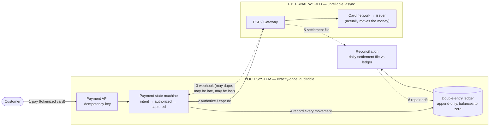
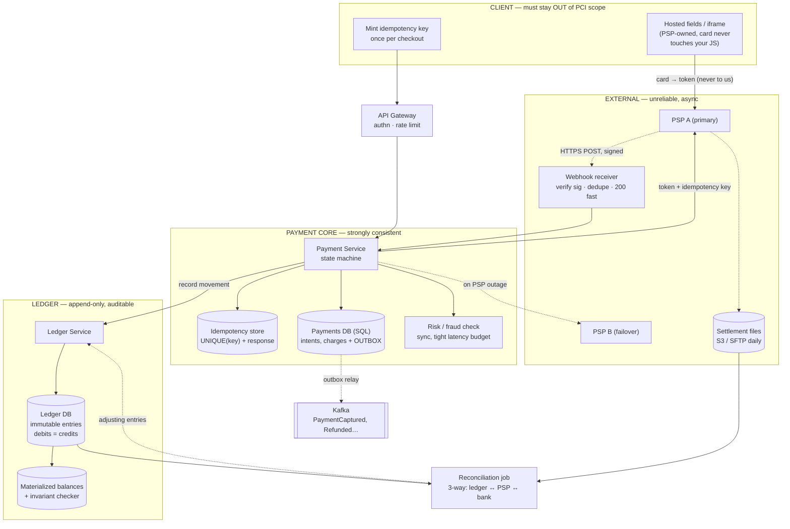

# Payment System — Simple Component Diagram

> The bare-minimum mental model. Two halves with opposite characters: **your internal ledger** (exactly-once, append-only, auditable, you control it) and **the external PSP** (unreliable, async, only *eventually* knowable).
> Everything else (refunds, payouts, disputes, FX, fraud) hangs off these boxes.

## The 6 components to remember

| Component | Job (one line) |
|---|---|
| **Payment API** | Accepts a payment attempt with an **idempotency key** so a retry can never become a second charge. |
| **Payment state machine** | The explicit lifecycle (`intent → authorized → captured → refunded/failed`); every transition is recorded, never inferred. |
| **Double-entry ledger** | Append-only record where every movement is a balanced pair of debit+credit — the auditable source of truth for every cent. |
| **PSP / Gateway** | The third party you call to actually charge the card; it times out, duplicates webhooks, and sometimes succeeds while telling you it failed. |
| **Webhooks** | The PSP's async "here's what really happened" — untrusted, deduped, and *never* your only source of truth. |
| **Reconciliation** | The daily job that compares the PSP's settlement file to your ledger and surfaces every mismatch. This is what makes the system trustworthy. |

## The one idea that ties it together

**You must know with certainty what happened to money — but the authoritative answer lives in a system you don't control.** Internally you get to be strict: one idempotency key per attempt, an explicit state machine, an append-only double-entry ledger where the entries must sum to zero. Externally you get none of that: the PSP call times out without telling you whether it charged, webhooks arrive twice or out of order or not at all, and a "failure" can turn out to have been a success. So the architecture is: **be exact inside, defensive at the boundary, and reconcile continuously.** The rule that follows from this — and the one that separates a real design from a naive one — is **never trust a timeout**. A timeout is not a failure; it is an *unknown*, and the only way to resolve an unknown is to query the PSP by your idempotency key or wait for reconciliation. Treating a timeout as failure is how you double-charge; treating it as success is how you ship goods for free.

---

# Detailed Diagram — with Services & Protocols

> Same two halves, now labeled with concrete service/technology picks and the protocols you'd name in a senior interview.
> Note: these are *defensible* picks, not the only valid ones. Pick and defend — don't memorize as gospel.

## Service cheat-sheet (what maps to what)

| Concept | Service / Technique | One-line why |
|---|---|---|
| Card data capture | **PSP hosted fields / iframe** (Stripe Elements-style) | Card never touches your JS or servers → keeps you out of most PCI DSS scope |
| Exactly-once charge | **Idempotency store: `UNIQUE(key)` + cached response** | A retry hits the constraint and replays the original result instead of charging again |
| Payment lifecycle | **Explicit state machine in SQL** | Money states must be inspectable and auditable, never implied by control flow |
| Source of truth for money | **Append-only double-entry ledger (SQL)** | Every movement is a balanced debit+credit pair; entries sum to zero or you have a bug |
| Fast balances | **Materialized balance + invariant checker** | Folding billions of rows per read is infeasible; a checker proves the materialized value still matches the fold |
| Atomic event emission | **Transactional outbox → Kafka** | Payment row + event commit together, so a captured payment can never fail to notify ([message-queues](../message-queues/)) |
| PSP outcomes | **Signed webhooks, deduped by event id** | The PSP's async truth — verified, idempotent, and never the *only* source |
| Drift detection | **Daily reconciliation vs settlement file** | The only thing that catches silent divergence between you, the PSP, and the bank |
| Provider independence | **PSP abstraction layer + secondary PSP** | Survive an outage and retain commercial leverage; keep provider concepts out of your domain |
| Money representation | **Integer minor units + explicit currency** | Never floats; rounding is a correctness bug, not a formatting choice |

## Protocols worth naming

- **Idempotency-Key header** — the client mints one key per checkout attempt and reuses it across every retry; the server enforces it with a `UNIQUE` constraint *in the same transaction* as the charge record ([api-design](../api-design/)).
- **Tokenization** — the card is exchanged (client-side, by the PSP) for a token; your system only ever handles tokens, which is what shrinks PCI scope.
- **Signed webhooks (HMAC over the raw body + timestamp)** — verify the signature before parsing, reject stale timestamps to stop replay, and return `200` fast then process async.
- **3-D Secure / SCA** — the issuer challenge flow; requires persisting checkout state *before* the redirect and resuming by idempotency key on return.
- **Transactional outbox** — commit the payment row and the `PaymentCaptured` event in one local transaction; a relay publishes at-least-once.
- **Settlement files (SFTP / S3, daily)** — the batch counterpart to real-time webhooks, and the input to reconciliation.
