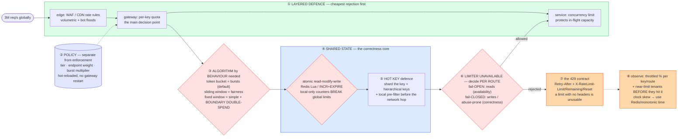

# Rate Limiting — Mermaid Diagrams

> **Reference:** [questions.md](./questions.md) · [answers.md](./answers.md) · [deep-dive.md](./deep-dive.md)
>
> **Note on this file:** the per-question diagram set (Diagrams 1–N per [`docs/instructions.md` §2.1](../../docs/instructions.md)) is still to be authored for this topic. The **one-page master diagram** below — the artifact you revise from and reproduce on the whiteboard — is complete.
>
> **Cross-links (depth lives there, not here):** [distributed-caching](../distributed-caching/) (hot keys, Redis topology) · [consistent-hashing](../consistent-hashing/) (sharding limiter state) · [api-design](../api-design/) (the `429` contract) · [seat-reservation](../seat-reservation/) (flash-sale admission control) · [circuit-breaker](../../fundamentals/circuit-breaker.md) · [observability](../observability/) (what to alert on)

---

## 🎯 The One-Page Master Diagram — THE ONE TO DRAW IN THE INTERVIEW (final consolidated design)

> **When to use:** final revision, 10 minutes before the interview — and the single diagram to reproduce on the whiteboard. If you can narrate it end-to-end and name the tradeoff at each **red** box, you're ready.
> Spec: [`docs/instructions.md` §2.1](../../docs/instructions.md) · AWS names: [`docs/AWS_SERVICE_MAP.md`](../../docs/AWS_SERVICE_MAP.md).
> ⚠️ AWS services are **defensible defaults**; every quota is an order-of-magnitude planning number to **verify against current docs**.

### The central split in one sentence

**Separate **policy** (who gets what quota — a slow-changing config problem) from **enforcement** (a sub-5ms hot-path decision), pick the algorithm from the *behaviour* you need rather than fashion (token bucket tolerates bursts, sliding window is fair, fixed window is only simple), and decide **per route** whether losing the limiter means fail-open or fail-closed — because a limiter that takes down the API it protects is worse than no limiter at all.**

### The 60-second narration

*(one line per numbered box ①–⑧)*

1. **Layer the defence so the cheapest rejection happens first.** Volumetric floods die at the edge (WAF/CDN rules), per-key quotas are enforced at the gateway, and services keep a *concurrency* limit — which is a different thing from a rate limit: it protects in-flight capacity rather than arrival rate.
2. **Policy is not enforcement.** Who gets what quota (free vs paid tier, endpoint weight, burst multiplier) is slow-changing config that must hot-reload without restarting gateways. Enforcement is a hot-path decision engine. Conflating them means a pricing change becomes a deploy.
3. **The first red box: pick the algorithm from the behaviour you need.** Token bucket is the default because it tolerates legitimate bursts while capping the sustained rate. Sliding window counters buy smoother fairness at bounded memory. Fixed windows are simple and have a real flaw worth naming — **boundary double-spend**: a client can send a full window's quota at 0:59 and again at 1:01, so a "100/min" limit permits 200 in two seconds.
4. **The second red box is the correctness core: the check-and-decrement must be atomic.** A read-then-write across the network is a race under concurrency, so it's a Redis Lua script (or an atomic `INCR` with `EXPIRE`) executed server-side. And say the thing that makes this a *distributed* systems question: **per-instance counters silently multiply your limit by the number of gateway replicas.**
5. **A single hot key is the scaling wall** — one abusive tenant, or one popular endpoint, funnels every decision through one Redis key. Shard the key, use hierarchical keys (tenant → user → endpoint), and add a local pre-filter so obviously-over-limit traffic is rejected without a network hop.
6. **The third red box is the one candidates forget: what happens when the limiter itself is down?** This is a *per-route* decision, not a global one. Fail **open** on non-critical reads (availability wins; you'd rather serve traffic than 503 everyone). Fail **closed** on writes and abuse-prone routes (correctness wins). Say both, and say which routes get which.
7. **A `429` without headers is a broken contract.** Return `Retry-After` plus the limit/remaining/reset triplet so a well-behaved client can back off correctly — otherwise every client's only strategy is to retry blindly, which turns your limiter into an amplifier.
8. **Observe throttle rate per key and per route**, and alert on tenants *approaching* their limit rather than only on rejections — the latter is a support ticket, the former is a conversation. Use Redis/monotonic time rather than instance clocks, because clock skew across gateways corrupts window boundaries.

### The five numbers that justify the design

| Number | Derivation | Therefore |
|---|---|---|
| **3M req/s globally** | stated peak | Every decision is on the hot path, so the limiter must be O(1) with one network round-trip at most — no scans, no multi-key transactions |
| **p99 ≤ 5 ms for the decision** | stated SLA | Rules out a database, rules out cross-region state; the limiter's state lives in-region, in memory |
| **Fixed window: 2× the intended limit** | boundary double-spend across the tick | The concrete arithmetic that justifies token bucket or sliding window over the "simple" option |
| **Local counters × N replicas = N × the limit** | per-instance state | The number that forces shared state (or a coordinated token-lease scheme) — quote it to justify Redis |
| **Hot key = 1 key × full tenant traffic** | key cardinality | Forces key sharding + a local pre-filter; a hot key is a *replication/aggregation* problem, not a partitioning one |

### The patterns this assembles

| Pattern | Where | The move |
|---|---|---|
| [Dealing with Contention](../../patterns/dealing-with-contention.md) **●** | ④ | Rung 1 — an atomic conditional/decrement, executed server-side (Lua), never read-then-write |
| [Scaling Writes](../../patterns/scaling-writes.md) **●** | ⑤ | Every request is a write to counter state: shard the key, pre-aggregate locally, batch where accuracy allows |
| [Scaling Reads](../../patterns/scaling-reads.md) ○ | ①⑤ | Local pre-filter is a cache of the decision; edge rules are the outermost tier |
| [Circuit breaker](../../fundamentals/circuit-breaker.md) ○ | ⑥ | The fail-open/closed decision is breaker policy, and the breaker is *your* code — no service provides it |
| [Consistent hashing](../consistent-hashing/) ○ | ⑤ | How limiter state is spread and how little moves when the cluster resizes |

### The three things that break (and the mitigation)

| Failure | Blast radius | Mitigation | How you detect it |
|---|---|---|---|
| **Redis (limiter state) is unreachable** | Every request must decide blind — fail-open lets an abuser through, fail-closed 503s your whole API | Per-route fail-open/closed policy decided *in advance*, a circuit breaker with fast timeouts, and a degraded local limiter as a floor so you're never fully blind | Limiter error/timeout rate; ratio of decisions made in degraded mode; breaker state per route |
| **A hot key saturates one shard** | One tenant's traffic makes the limiter itself the bottleneck for everyone on that shard | Key sharding (`user:1:shard:N` summed), hierarchical keys, local pre-filter, and admission control upstream at the edge | Per-key QPS distribution (p99 key vs median); single-shard CPU vs fleet; decision latency by key |
| **Clock skew between gateways** | Window boundaries disagree, so effective limits drift and become unexplainable to customers | Use the store's clock (Redis `TIME`) or monotonic counters rather than instance wall-clocks; prefer algorithms that don't need aligned windows (token bucket) | Skew between gateway clocks and the limiter store; unexplained variance in allowed-rate per replica |

### The AWS-specific traps to name unprompted

| Trap | Why it bites here | What you say |
|---|---|---|
| **API Gateway usage plans / WAF rate rules are coarse** | They're per-key or per-IP with limited granularity and window semantics | *"WAF and usage plans are my cheap outer tier for volumetric and per-key ceilings; the fine-grained per-tenant/per-endpoint policy is my own limiter behind them."* |
| **API Gateway throttling protects AWS's edge, not my database** | The dangerous assumption | *"Backpressure into my own system is mine: load shedding and queue-depth-driven admission control."* |
| **ElastiCache cluster-mode resharding** | Limiter state is on the hot path | *"Cluster-aware client, pre-scale before known peaks — a `MOVED` storm during a spike is exactly when the limiter must not wobble."* |
| **No managed circuit breaker** | Fail-open/closed needs one | *"SDK adaptive retry is not a breaker — the fail-open policy and its probe logic are my code."* |
| **Lambda concurrency limits are not a rate limiter** | Often conflated | *"Reserved concurrency is a blast-radius control, not a per-tenant quota — it can't express 'this customer gets 100/min'."* |
| **DynamoDB as limiter state** | Tempting for durability | *"A conditional-write counter works and is durable, but it costs more latency than ElastiCache and hot-partitions on a busy key — I'd only use it where the limit must survive a cache flush."* |

### If you only remember one thing

> **Separate policy from enforcement, make the check-and-decrement atomic in shared state (per-instance counters multiply your limit by the replica count), pick token bucket unless you can name why not — and decide fail-open versus fail-closed *per route* before launch, because the limiter must never be the reason the API goes down.**
