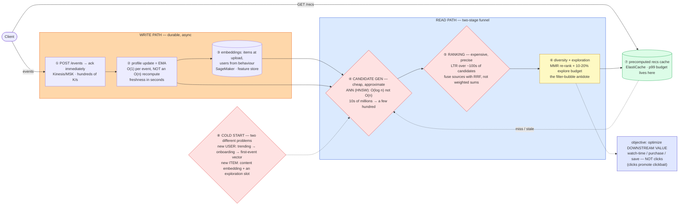

# Recommendation System — Mermaid Diagrams

> **Reference:** [questions.md](./questions.md) · [answers.md](./answers.md) · [deep-dive.md](./deep-dive.md)
>
> **Note on this file:** the per-question diagram set (Diagrams 1–N per [`docs/instructions.md` §2.1](../../docs/instructions.md)) is still to be authored for this topic. The **one-page master diagram** below — the artifact you revise from and reproduce on the whiteboard — is complete.
>
> Cross-links: [social-feed](../social-feed/) (ranking a timeline) · [distributed-caching](../distributed-caching/) · [message-queues](../message-queues/) (event ingestion) · [kv-store](../kv-store/) · [observability](../observability/) (online metrics)

---

## 🎯 The One-Page Master Diagram — THE ONE TO DRAW IN THE INTERVIEW (final consolidated design)

> **When to use:** final revision, 10 minutes before the interview — and the single diagram to reproduce on the whiteboard. If you can narrate it end-to-end and name the tradeoff at each **red** box, you're ready.
> Spec: [`docs/instructions.md` §2.1](../../docs/instructions.md) · AWS names: [`docs/AWS_SERVICE_MAP.md`](../../docs/AWS_SERVICE_MAP.md).
> ⚠️ AWS services are **defensible defaults**; every quota is an order-of-magnitude planning number to **verify against current docs**.

### The central split in one sentence

**Ingest fast, serve fast, and do all the expensive work in between: the write path takes hundreds of thousands of events/second and updates profiles incrementally (an EMA, O(1), not a batch recompute), while the read path is a **two-stage funnel** — cheap approximate candidate generation over millions of items, then expensive ranking over a few hundred — because ranking the whole catalogue per request is the thing you can never afford.**

### The 60-second narration

*(one line per numbered box ①–⑧)*

1. **The write path acknowledges and gets out of the way.** Hundreds of thousands of events/second land on a stream; nothing about a click should block on model work.
2. **Profiles update incrementally with an exponential moving average — O(1) per event.** Say the alternative and why it loses: recomputing a user vector from history is O(n) and lands you in batch-latency territory, where "recommendations reflect recent behaviour within seconds" is impossible. You trade a little accuracy for a lot of freshness.
3. **Embeddings come from two places:** items get a content embedding at upload time (which is what makes a brand-new item recommendable at all), users get one from behaviour.
4. **The first red box is the funnel's cheap half: approximate nearest-neighbour candidate generation.** HNSW gives you O(log n) over tens of millions of vectors in roughly 10–50 ms (illustrative — verify); exact KNN is O(n) and simply cannot hold a p99. This stage's job is *recall*, not precision — narrow millions to a few hundred.
5. **The second red box is the expensive half, and it is expensive *because it is small*:** learning-to-rank with many features over a few hundred candidates. When fusing multiple sources whose scores are on incompatible scales, use **reciprocal rank fusion** rather than a hand-tuned weighted sum — no training data needed and no scale calibration.
6. **Then re-rank for diversity and reserve an exploration budget** (~10–20%). Without it the system converges into a filter bubble and slowly starves itself of new signal — MMR-style diversity plus explicit exploration is the antidote.
7. **Serving is cache-first**, because your p99 budget is spent almost entirely here; the funnel runs on miss or on a staleness trigger.
8. **The third red box: cold start is two unrelated problems** with two answers. A new *user* walks a ladder — global trending → onboarding signals → a vector from their first events → EMA. A new *item* has no interactions by definition, so it needs a content embedding plus a deliberate exploration slot to earn its first signal. Collaborative filtering fails on new items; content-based filtering fails by showing people only what they already know — which is exactly why production systems are hybrids.

Say the objective out loud too: optimize **downstream value** (watch time, purchase, save), not clicks — click-optimization reliably promotes clickbait, and naming that unprompted is a senior signal.

### The five numbers that justify the design

| Number | Derivation | Therefore |
|---|---|---|
| **Hundreds of thousands of events/s** | stated constraint | Ingestion must be a stream with async processing; a synchronous profile write per event is impossible |
| **Tens of millions of items → a few hundred candidates** | funnel ratio | The two-stage split *is* the architecture: ~10⁵× reduction before you spend a single expensive feature computation |
| **ANN ~10–50 ms for ~50M vectors** (illustrative — verify) | HNSW O(log n) | Makes the candidate stage fit a p99 budget; exact KNN over 50M does not |
| **~1M vectors: pgvector's practical ceiling** (verify) | index behaviour | The number that decides "reuse Postgres" vs "adopt a dedicated vector store" — a real, defensible dividing line |
| **10–20% exploration budget** | industry practice | Explicit, budgeted cost of avoiding a filter bubble — quantified rather than hand-waved |

### The patterns this assembles

| Pattern | Where | The move |
|---|---|---|
| [Scaling Reads](../../patterns/scaling-reads.md) **●** | ⑦ | Precompute recommendations into a cache; the funnel is not on every request |
| [Long-Running Tasks](../../patterns/long-running-tasks.md) **●** | ①②③ | Accept → stream → async model/profile updates; training is entirely off the serving path |
| [Scaling Writes](../../patterns/scaling-writes.md) **●** | ①② | O(1) EMA updates instead of recomputes; partition by user |
| Gap: search & ranked retrieval | ④⑤ | The vector index is a **derived** store — rebuildable, never the source of truth |
| Gap: counting & top-K at scale | ⑧ | Trending lists for cold-start users are windowed top-K, not a model |

### The three things that break (and the mitigation)

| Failure | Blast radius | Mitigation | How you detect it |
|---|---|---|---|
| **Feedback loop / filter bubble** | The model recommends what it already recommended, engagement looks fine, and the catalogue quietly collapses to a narrow slice | A budgeted exploration slice (10–20%), MMR diversity re-ranking, and optimizing downstream value rather than clicks | Catalogue coverage and long-tail impression share over time; diversity metrics per user; novelty rate |
| **Cold start (user or item)** | New users get generic junk; new items are invisible forever because no one has interacted with them | Two separate ladders: trending → onboarding → first-event vector for users; content embedding + exploration slot for items | Time-to-first-meaningful-rec for new users; impression share for items in their first N hours |
| **A/B test interference** | Social sharing leaks the treatment into the control group, so the experiment reports a result that isn't real | Cluster-based experiment cells (randomize by social cluster, not user), plus holdback groups | Cross-cell exposure rate; sanity-check metrics that should be unaffected (a moving A/A metric means contamination) |

### The AWS-specific traps to name unprompted

| Trap | Why it bites here | What you say |
|---|---|---|
| **Personalize is a black box** | Tempting one-liner answer | *"Personalize is the batteries-included option and fine as a baseline; custom features and ranking mean SageMaker or self-hosted, and I'd say which I'm choosing and why."* |
| **OpenSearch k-NN vs pgvector vs a dedicated store** | Cost differs by ~an order of magnitude at scale | *"pgvector while I'm under roughly a million vectors and already on Postgres; OpenSearch k-NN if I need filtering plus vectors; a dedicated store past tens of millions — verify current limits."* |
| **Kinesis per-shard limits / hot key** | Event firehose skew | *"Partition by `user_id`; a celebrity item as the key would hot-spot a shard."* |
| **SageMaker endpoint cost + cold starts** | Ranking on the hot path | *"Ranking runs on a warm autoscaled endpoint with a strict timeout, and I degrade to the cached/precomputed list rather than blowing the p99."* |
| **Feature-store online/offline skew** | The classic ML production bug | *"Same feature definitions for training and serving — training/serving skew produces a model that scores well offline and badly in production."* |
| **DynamoDB TTL is not a scheduler** (**⚠️ verify**) | Rec-list expiry | *"TTL evicts stale rec lists; freshness is enforced at read time by comparing the profile version."* |

### If you only remember one thing

> **Two stages, two costs: cheap approximate candidate generation (ANN, O(log n)) narrows tens of millions of items to a few hundred, then expensive learning-to-rank runs only on those — with O(1) EMA profile updates for freshness, a hybrid to survive cold start, an explicit exploration budget to avoid a filter bubble, and an objective tied to downstream value rather than clicks.**
