# Ride Sharing (Uber / Lyft) — Mermaid Diagrams

> Interview-ready diagrams. Start with Diagram 1 — the **three-plane split (location ingest · matching · trip+tracking)** is the mental model everything else hangs off. Then drill into the layer the interviewer probes.
>
> Reference: [answers.md](./answers.md) · [simple-diagram.md](./simple-diagram.md)
>
> Cross-links: [distributed-caching](../distributed-caching/) · [message-queues](../message-queues/) · [sharding-replication](../sharding-replication/) · [consistent-hashing](../consistent-hashing/) · [api-design](../api-design/)

---

## Diagram 1 — End-to-End: Three Planes (Start Here)

> **When to use:** The very first thing to draw for "design Uber." Everything hangs off one split: the **location plane** is write-heavy (~250K/s) and ephemeral; the **matching plane** is latency-bound (< 1s); the **trip plane** is durable and real-time. Use it for Q1, Q2, Q5.

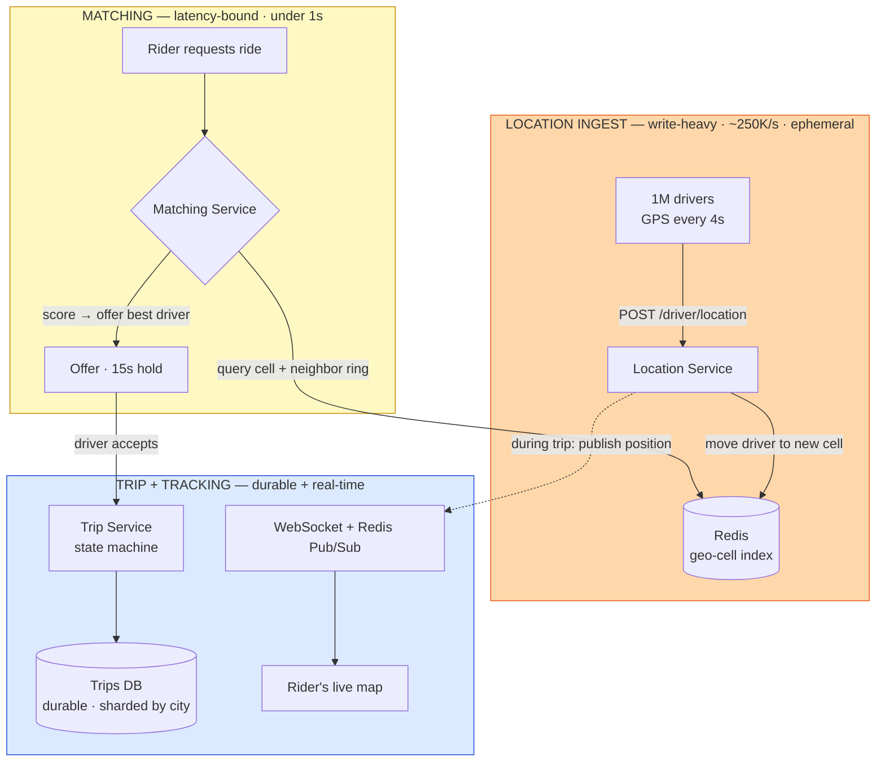

**What the interviewer is checking:**
- You *lead* with the hot/cold split, not a favourite database — locations are ephemeral (memory, 250K/s, fine to lose), trips are financial records (durable, far lower write rate, must never be lost). Mixing them is the #1 way this design fails.
- You name why each plane scales differently: ingest = throughput, matching = latency, trip = durability + real-time fan-out.
- The matching plane *reads* the hot layer and *writes* the durable layer — it's the bridge, not a datastore of its own.
- Bonus: availability matters more here than almost anywhere (Q5) — 2 minutes down = ~120K failed requests and stranded riders, so every plane needs independent failure domains.

---

## Diagram 2 — Geospatial Query: Cell + Neighbor Ring

> **When to use:** Q7 (find drivers within 2km), Q8 (edge problem), Q11 (density). The key visual: you never scan — you encode to a cell, read that cell **plus its ring of neighbors**, then filter to the exact radius.

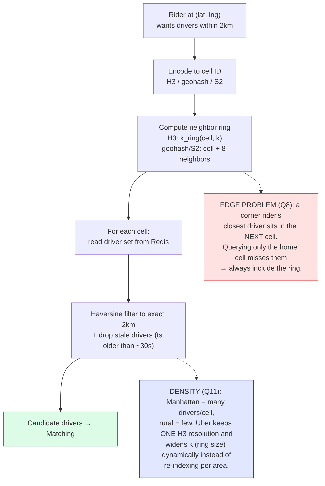

**Grid intuition (why the ring):**

```text
┌─────┬─────┬─────┐
│  NW │  N  │  NE │
├─────┼─────┼─────┤
│  W  │ ★R  │  E  │   ★ = rider's home cell
├─────┼─────┼─────┤     query R + all neighbors
│  SW │  S  │  SE │
└─────┴─────┴─────┘
```

**Cell system comparison (Q9):**

| | Geohash | S2 (Google) | H3 (Uber) |
|---|---|---|---|
| Cell shape | Rectangle | Square (on sphere) | Hexagon |
| Neighbors | 8 | 8 | 6 (equidistant) |
| Distance uniformity | Poor (varies by latitude) | Better | Best (center→edge equal) |
| Query primitive | prefix + `neighbors()` | cell ID + `neighbors()` | `k_ring(cell, k)` |

**What the interviewer is checking:**
- You understand *why* a spatial index beats `WHERE distance(...) < 2km` (Q2): the DB version is an O(n) scan + a distance computation per row, per request; the index turns it into a handful of set reads.
- You raise the edge problem **unprompted** — it's the classic "gotcha" that separates people who've built this from people who've read about geohash.
- You know hexagons (H3) give uniform center-to-neighbor distance, which is why Uber uses them, and that Uber open-sourced H3.
- You handle density with dynamic ring size, not a patchwork of per-region precisions.

---

## Diagram 3 — Location Write Path at 250K/s (Cell Move in Redis)

> **When to use:** Q3 (write throughput), Q12 (update flow), Q13 (Redis vs Postgres). The reshape: a location write is a cheap in-memory set-move, and the durable firehose forks off to Kafka *asynchronously*, off the hot path.

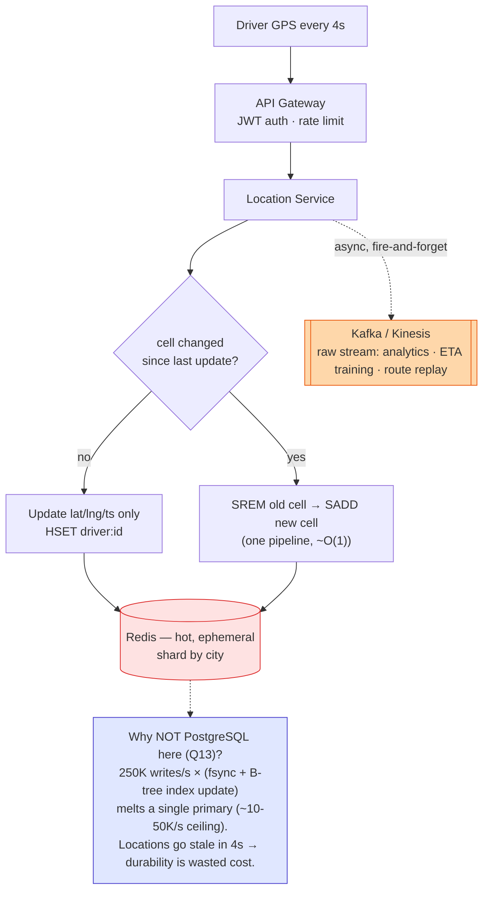

**What the interviewer is checking:**
- The scale math (Q3): 1M drivers ÷ 4s = **250K writes/s**, three-plus orders of magnitude past a single relational primary.
- The write is *cheap* because most updates don't cross a cell boundary (HSET only); only a boundary crossing costs a set-move — and even that is O(1).
- Kafka is on the **write path for durability of the raw stream, but off the critical path for matching** — the match reads Redis, not Kafka. Candidates often confuse "we need the data durably" with "the match must wait for durability."
- You justify losing durability: a value stale in 4 seconds does not deserve fsync.

---

## Diagram 4 — Stale Locations & GPS Drift

> **When to use:** Q14 (30s disconnect → stale data), Q15 (driver appears to teleport). Two guards on the same ingest path: reject physically impossible jumps, and evict drivers who go quiet.

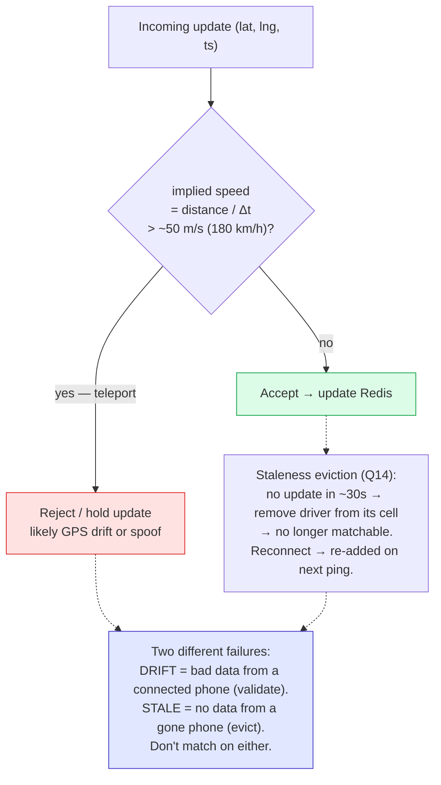

**What the interviewer is checking:**
- You distinguish the two failure modes: **drift** (connected phone, garbage reading — validate against max plausible speed) vs **stale** (disconnected phone, no reading — evict on a timeout sweep).
- A matchable driver must be *both* recent and plausible; matching on a teleported or 30s-old location produces a driver who can't actually be where the map says.
- Eviction is soft and self-healing — the driver re-enters the index on their next successful ping, no manual intervention.

---

## Diagram 5 — Matching: Score, then Offer One Driver at a Time

> **When to use:** Q18 (scoring 50 drivers), Q23 (why offer, not broadcast), Q24 (15s timeout). The control flow: score to a ranked list, then walk it with a *serial* offer loop.

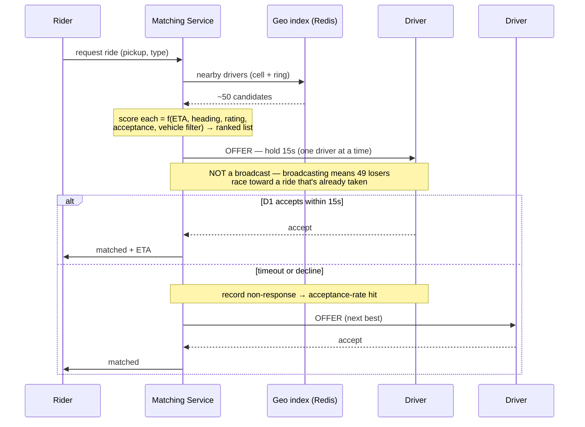

**What the interviewer is checking:**
- Scoring is **not distance-sort** (Q4, Q18): ETA (traffic + heading) dominates, with rating, acceptance rate, and a hard vehicle-type filter. You model it as a weighted scoring function and can defend the weights.
- Why serial offers (Q23): broadcasting creates a race — one winner, N−1 drivers who moved toward a ride they can't have. Serial offers trade a little latency for no wasted driver movement and no double-assignment.
- The timeout (Q24) is a first-class transition: no response in 15s → penalize acceptance rate → fall through to the next candidate. The loop must be bounded (max attempts / max time) or a rider waits forever.

---

## Diagram 6 — Batch (Bipartite) Matching vs Sequential

> **When to use:** Q19 (formal problem), Q22 (why batch beats one-at-a-time). Contrast greedy-on-arrival with a short batching window solved as an assignment problem.

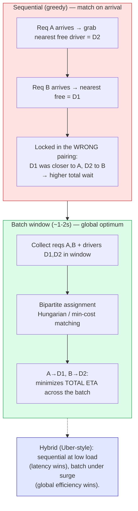

**What the interviewer is checking:**
- You can state it formally (Q19): sets of requests and drivers, an ETA/score cost per pair, constraints (one driver per ride, vehicle match, max distance), objective = minimize total ETA (or maximize total score) — i.e. **bipartite assignment**, solvable optimally with Hungarian or greedily under load.
- Why batch helps (Q22): greedy commits early and can lock in a globally worse pairing; a short window lets the optimizer swap assignments. The cost is a 1–2s delay, which is acceptable when it buys materially shorter waits.
- The mature answer is a **hybrid** keyed on load — you don't pay batch latency when there's no contention.

---

## Diagram 7 — Trip State Machine

> **When to use:** Q25 (draw the states), Q26 (cancellation), Q27 (no-show), Q28 (payment failure). The durable spine of the trip plane — every event is a guarded transition.

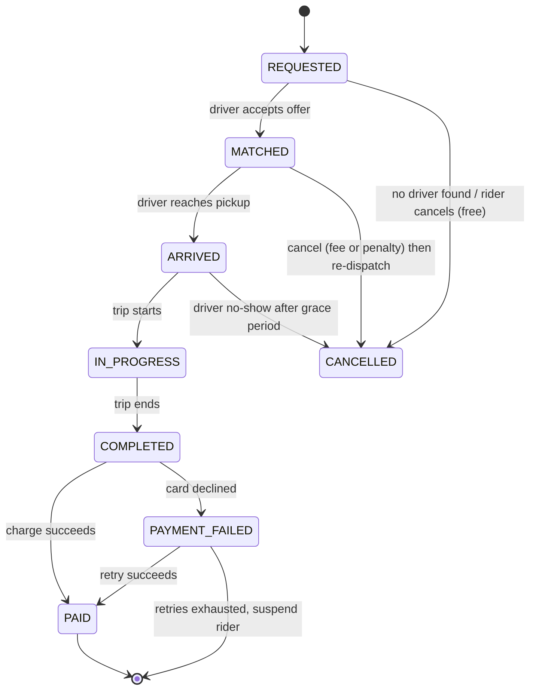

**What the interviewer is checking:**
- You treat the trip as an explicit **state machine**, not ad-hoc booleans — each edge is triggered by a specific event and may carry a side effect (fee, penalty, re-dispatch, charge).
- Cancellation semantics depend on *state* (Q26): free before match, fee after match, partial fare after pickup; a driver cancel penalizes the driver and **re-dispatches** (loops back), it doesn't dead-end the rider.
- `COMPLETED` and `PAID` are **distinct** (Q28): the ride physically ended before money moved, so a declined card lands in `PAYMENT_FAILED` (a real, persisted state) with bounded retry — you never silently lose the fare or block the car from ending the trip.
- No-show (Q27) is a timed transition out of `ARRIVED`/`MATCHED`, not a stuck trip.

---

## Diagram 8 — Real-Time Tracking: WebSocket + Redis Pub/Sub

> **When to use:** Q31 (how live tracking works), Q33 (scale to 1M sockets), Q34 (reconnect), Q35 (thin the stream). The reshape: a driver's GPS is *published once* and fanned out to the one rider watching, over a sticky socket.

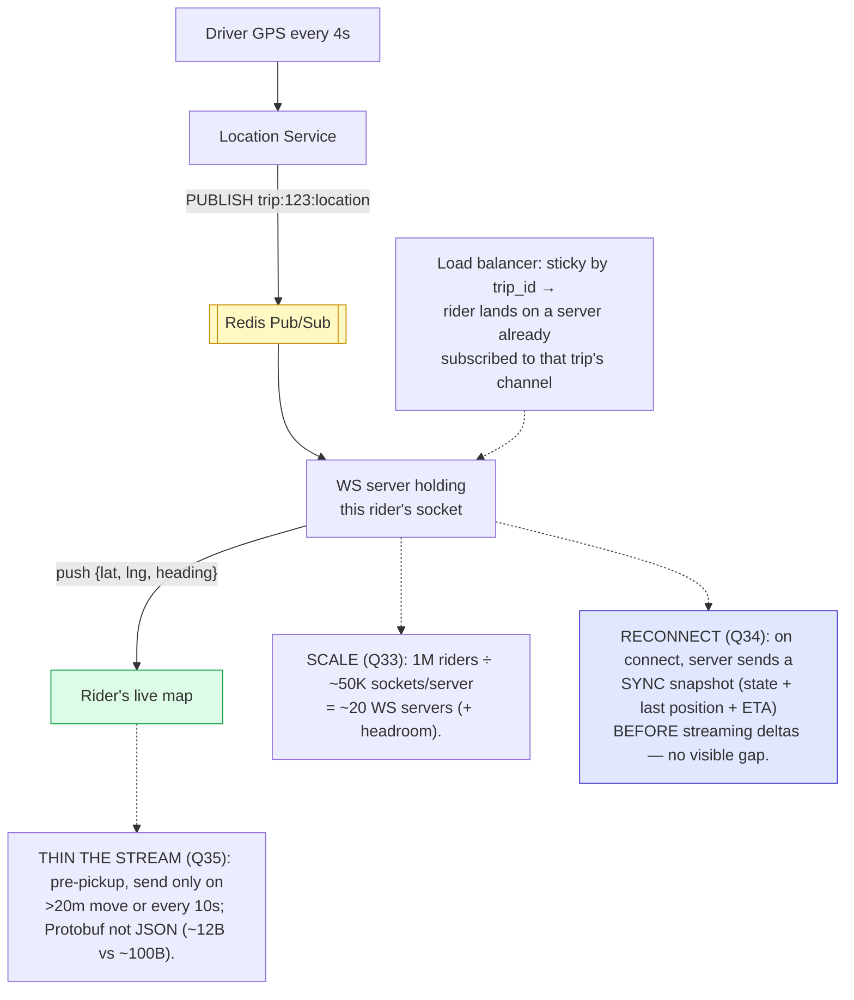

**What the interviewer is checking:**
- The pub/sub decoupling (Q31): the driver publishes to a channel; whichever WS server holds the watching rider is subscribed and pushes down. The driver never needs to know which server the rider is on.
- Transport choice (Q32): WebSocket over SSE/polling because it's bidirectional (also carries in-app messaging) and long-lived; SSE would suffice for tracking-only.
- Scale is a division problem (Q33) plus sticky routing so a reconnecting rider re-lands on a subscribed server.
- Reconnect sends a **snapshot before deltas** (Q34) so the map is correct immediately, and you **thin** the stream (Q35) because a map doesn't need 4s precision before pickup.

---

## Diagram 9 — Surge Pricing: Per-Zone Compute Loop + Smoothing

> **When to use:** Q36 (inputs), Q37 (zones, not per-ride), Q38 (spike response), Q39 (stop oscillation). The loop that turns supply/demand into a stable, zone-level multiplier.

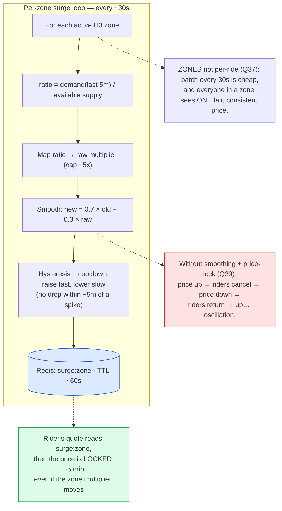

**What the interviewer is checking:**
- Inputs are **supply and demand in a window** (Q36), not a magic number — available drivers vs recent requests per zone, mapped to a capped multiplier.
- Zones over per-ride (Q37) for two reasons: cost (batch compute every 30s) and fairness/consistency (neighbors get the same price).
- Spike handling (Q38) is the same loop running fast — it's already event-reactive; you don't need a separate mechanism, just a shorter recompute trigger on detected spikes.
- Anti-oscillation (Q39) is explicit: exponential **smoothing**, asymmetric **hysteresis** (up fast, down slow), a spike **cooldown**, and a **committed price** the rider was quoted — otherwise the price-cancel feedback loop makes the system ring.

---

## Diagram 10 — Demand Spike & Thundering Herd → Graceful Degradation

> **When to use:** Q17 (8AM login herd), Q42 (matching failover), QB5 (concert lets out, 50K requests). Contrast the uncontrolled cascade with staged admission + a degradation ladder.

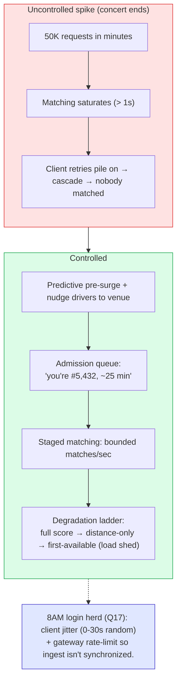

**What the interviewer is checking:**
- You see the **cascade**: overload → slow responses → client retries → more load. Naming the retry amplification is the senior signal.
- Controls come in layers: **predictive** (pre-surge, pre-position drivers), **admission** (queue with honest ETA rather than silent failure), **staging** (bounded throughput), and a **degradation ladder** (Q42: full scoring → distance-only → first-available) so the system sheds quality, not availability.
- The herd (Q17) is defused at the source with **client-side jitter** + gateway rate limits — you desynchronize the stampede instead of trying to absorb it.

---

## Diagram 11 — Multi-Region: Locality of Rides, Global Identity

> **When to use:** Q44 (50+ countries, multi-region). The placement rule: rides are intra-region, so location and trips stay local; only identity and analytics go global.

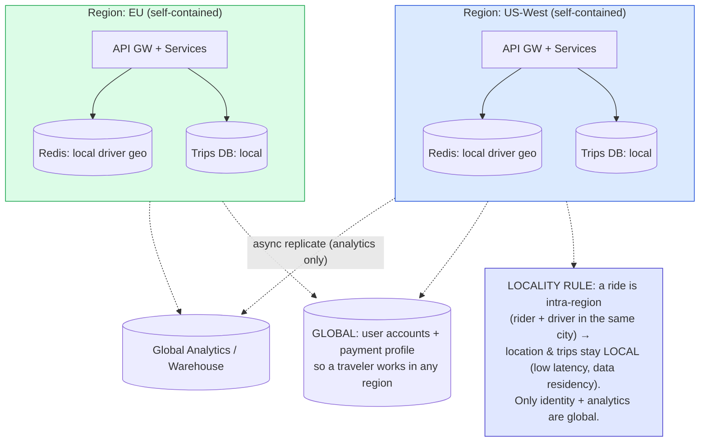

**What the interviewer is checking:**
- You exploit the domain: rides don't cross regions, so there's **no need for cross-region location replication** — the hard distributed-systems problem mostly disappears if you place data by locality.
- What *is* global and why: user identity and payment profile (travelers), plus analytics (async, eventual). Compliance/data-residency pushes trips and payments to stay regional.
- You're not paying multi-region consistency costs for data that never needs it.

---

## Quick Interview Reference

### Scale numbers (back-of-envelope)

| Quantity | Math | Result |
|---|---|---|
| Driver location writes | 1M drivers ÷ 4s | **250K writes/s** |
| Peak ride requests | stated peak | ~1,000 req/s |
| Match latency budget | requirement | < 1 s |
| WebSocket servers | 1M riders ÷ ~50K sockets/server | ~20 servers (+ headroom) |
| Location payload | lat, lng, heading, speed, ts | ~200 B raw / ~12 B Protobuf |
| Downtime cost | 1,000 req/s × 120 s | ~120K failed requests in 2 min |

*Numbers above 250K/s derive from the stated problem constraints; treat capacity-planning figures (sockets/server, instance counts) as order-of-magnitude planning estimates, not hard limits — verify against your real hardware.*

### Cell / precision quick ref

| System | Owner | Shape | Neighbors | Query primitive |
|---|---|---|---|---|
| Geohash | (public) | rectangle | 8 | prefix + `neighbors()` |
| S2 | Google | square-on-sphere | 8 | cell ID + `neighbors()` |
| H3 | Uber (open-sourced) | hexagon | 6 (equidistant) | `k_ring(cell, k)` |

### Canonical tradeoffs to memorize

- **Redis (hot/ephemeral) vs SQL (durable):** 250K/s in-memory, lose-on-restart-OK **vs** financial records that must survive.
- **Serial offer vs broadcast:** no wasted driver movement / no double-assign **vs** slightly higher match latency.
- **Batch (bipartite) vs sequential matching:** globally optimal total ETA **vs** immediate, simpler, lower latency.
- **WebSocket vs SSE vs polling:** bidirectional + covers messaging **vs** read-only-simple **vs** universal fallback.
- **Zone surge vs per-ride surge:** cheap batch compute + fair consistent price **vs** precise but expensive and jumpy.
- **H3 hexagons vs geohash rectangles:** uniform center-to-neighbor distance **vs** simple prefix adjacency.
- **Location stays regional vs replicated globally:** low latency + data residency, no cross-region cost **vs** unnecessary complexity for intra-region rides.

### Common mistakes to avoid

- Storing driver locations in PostgreSQL (250K/s of fsync'd writes melts a primary; use Redis).
- A `WHERE distance(...) < 2km` query (O(n) scan; use a cell index + neighbor ring).
- Forgetting the **edge problem** — querying only the rider's home cell misses closer drivers next door.
- Broadcasting a ride to all nearby drivers (race, double-assignment; use serial offers with a timeout).
- Treating "nearest" as "best" — ETA with heading and traffic beats raw distance.
- Collapsing `COMPLETED` and `PAID` into one state — payment can fail after the ride ends.
- Matching on stale/teleported locations — validate max speed and evict on a staleness timeout.
- Letting surge oscillate — you need smoothing, hysteresis, cooldown, and a committed rider price.
- Replicating ephemeral location data across regions — rides are intra-region; keep it local.
