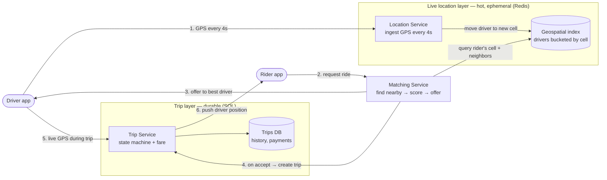
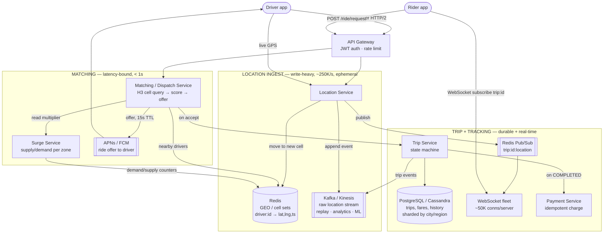

# Ride Sharing — Simple Component Diagram

> The bare-minimum mental model. Three flows: **location ingest (write-heavy)**, **matching**, and **trip + live tracking**.
> Everything else (surge, pooling, fraud, ETA ML, multi-region) hangs off these boxes.

## The 6 components to remember

| Component | Job (one line) |
|---|---|
| **Location Service** | Absorbs ~250K GPS updates/sec and keeps each driver in the right geo-cell. |
| **Geospatial index** | In-memory map of "which drivers are in which cell" so "who's near me?" is a handful of cell lookups, not a table scan. |
| **Matching Service** | Turns "drivers near the rider" into *one* chosen driver via a scoring function, then runs the offer/accept dance. |
| **Trip Service** | The durable state machine: `REQUESTED → MATCHED → ARRIVED → IN_PROGRESS → COMPLETED → PAID`. |
| **Trips DB** | Cheap-to-query, permanent record: trip history, fares, disputes, payments. |
| **Rider / Driver apps** | Stream GPS up; receive offers and live position down (push + WebSocket). |

## The one idea that ties it together

**Split the hot ephemeral layer from the durable layer.** A driver's location is worthless in 4 seconds — it lives in memory (Redis), churns at 250K writes/sec, and never needs to survive a restart. A trip is a financial record — it lives in a durable SQL store, is written far less often, and must never be lost. Matching is the bridge: it reads the hot layer to pick a driver, then writes a durable trip. Putting locations in your trips database (or trips in Redis) is the single most common way this design falls over.

---

# Detailed Diagram — with Services & Protocols

> Same three flows, now labeled with concrete service/technology picks and protocols you'd name in a senior interview.
> Note: these are *defensible* picks, not the only valid ones (e.g. DynamoDB/Cassandra instead of PostgreSQL for trips at global scale, MSK/Kinesis instead of one another). Pick and defend — don't memorize as gospel.

## Service cheat-sheet (what maps to what)

| Concept | Service | One-line why |
|---|---|---|
| Ingest 250K GPS/s | **Redis** (GEO or cell-keyed sets) | In-memory; a single node does ~100K writes/s, so shard by city — durability not needed for a value that's stale in 4s |
| Geospatial query | **H3 (Uber) / S2 / geohash** in Redis | "Drivers near me" = rider's cell + ring of neighbors, O(1)-ish lookups instead of a scan |
| Raw location firehose | **Kafka / Kinesis** | Durable log for analytics, ETA-model training, and trip-route replay — *not* the live match path |
| Ride offer to a backgrounded app | **APNs / FCM push** (+ WebSocket when foregrounded) | The driver's app may be closed; a push wakes it for the 15s offer |
| Trip state + history | **PostgreSQL** (→ Cassandra/DynamoDB at global scale) | Durable, queryable ("my last 50 trips"), sharded by city/region |
| Live driver position to rider | **WebSocket fleet + Redis Pub/Sub** | Fan a driver's GPS out to the one rider watching, ~50K sockets/server |
| Surge multiplier | **Surge Service** over Redis counters, **H3 zones** | Precompute per-zone every ~30s; riders in a zone see one consistent price |
| Payment | **Payment Service** with idempotency key = trip id | A retry must never double-charge a completed trip |

## Protocols worth naming

- **HTTP/2** — driver location POSTs and rider API calls; multiplexes over one warm connection.
- **WebSocket** — bidirectional, long-lived channel for live trip tracking (and in-app rider↔driver messaging). SSE would do for tracking-only, but WebSocket covers both.
- **APNs / FCM push** — delivers a ride offer to a driver whose app is backgrounded; the live path can't assume an open socket.
- **gRPC** — typical east-west protocol between internal services (Matching ↔ Trip ↔ Surge).
- **Protobuf** — compact wire format for high-frequency location messages (~12 bytes vs ~100 bytes JSON).
