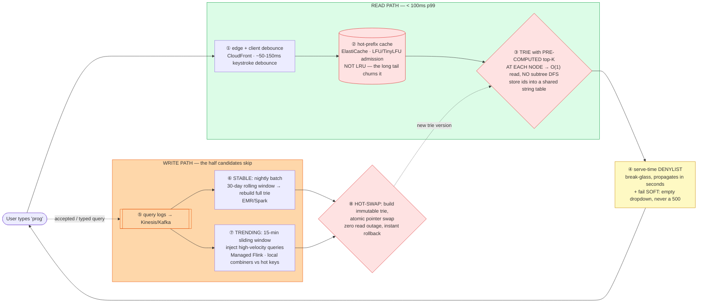

# Search Autocomplete (Google Suggest) — Mermaid Diagrams

> **Reference:** [questions.md](./questions.md) · [answers.md](./answers.md) · [deep-dive.md](./deep-dive.md)
>
> **Note on this file:** the per-question diagram set (Diagrams 1–N per [`docs/instructions.md` §2.1](../../docs/instructions.md)) is still to be authored for this topic. The **one-page master diagram** below — the artifact you revise from and reproduce on the whiteboard — is complete.
>
> Cross-links: [distributed-caching](../distributed-caching/) · [cdn-edge](../cdn-edge/) · [message-queues](../message-queues/) (the update pipeline) · [web-crawler](../web-crawler/) (upstream corpus) · [recommendation-system](../recommendation-system/) (ranking)

---

## 🎯 The One-Page Master Diagram — THE ONE TO DRAW IN THE INTERVIEW (final consolidated design)

> **When to use:** final revision, 10 minutes before the interview — and the single diagram to reproduce on the whiteboard. If you can narrate it end-to-end and name the tradeoff at each **red** box, you're ready.
> Spec: [`docs/instructions.md` §2.1](../../docs/instructions.md) · AWS names: [`docs/AWS_SERVICE_MAP.md`](../../docs/AWS_SERVICE_MAP.md).
> ⚠️ AWS services are **defensible defaults**; every quota is an order-of-magnitude planning number to **verify against current docs**.

### The central split in one sentence

**Two separate design problems, and most candidates only do the first: the **read path** must return 5 suggestions in under ~100 ms, which it does by storing the pre-computed top-K *at each prefix node* so there is no subtree traversal at query time; the **write path** must keep those lists fresh, which requires two different pipelines because stable queries change daily and trending queries must appear within minutes.**

### The 60-second narration

*(one line per numbered box ①–⑧)*

1. **Debounce on the client and terminate at the edge.** Autocomplete fires per keystroke, so the cheapest suggestion is the request you never send — then the next cheapest is one served at the edge.
2. **Cache hot prefixes — but not with LRU.** The prefix distribution has a long tail that churns an LRU cache constantly; LFU or TinyLFU admission keeps the genuinely hot prefixes resident. Naming that is a strong signal.
3. **The first red box is the key data-structure insight: a trie where each node already stores its top-K completions.** A plain trie needs a DFS over the subtree to rank completions — far too slow at scale. Pre-computing top-5 *per node* makes the read O(prefix length) with no traversal, at roughly 5× the memory (illustratively ~5 GB for 50M nodes × 5 strings × ~20 bytes — verify against your corpus). Store *ids* into a shared string table to dedupe that memory.
4. **Two product rules at serve time:** a denylist that can propagate in seconds (legal/safety takedowns can't wait for a rebuild), and **fail soft** — an autocomplete that returns an empty dropdown is invisible, one that 500s breaks the search box.
5. **Now the half that separates a pass from a hire: the write path.** Accepted and typed queries stream into a log.
6. **Stable queries get a nightly batch rebuild** over a ~30-day rolling window — most of the corpus barely moves, and batch gives you the best ranking quality per dollar.
7. **Trending queries get a streaming pipeline** on a ~15-minute sliding window, injecting high-velocity terms directly. A news event must show up in minutes, not tomorrow. Use local combiners/approximate counting so one viral query can't skew or hot-spot the pipeline.
8. **The third red box is deployment: build a new immutable trie and swap a pointer atomically.** Mutating a live trie in place under read traffic is where outages come from; an immutable build plus pointer swap gives zero read downtime *and* instant rollback to the previous version.

### The five numbers that justify the design

| Number | Derivation | Therefore |
|---|---|---|
| **< 100 ms p99 per keystroke** | interactivity budget | No DB, no traversal, no cross-region hop — and it justifies both the per-node top-K and the debounce |
| **~10⁸ trie nodes × ~100 B ≈ tens of GB** | corpus size × node cost | The system is bound by **memory, not QPS** — so you *shard for memory* and *replicate for QPS*, which are different decisions |
| **Top-K stored per node ≈ 5× memory** | 5 strings × ~20 B × 50M nodes ≈ ~5 GB (illustrative — verify) | An explicitly *acceptable* trade: 5× memory to remove a subtree DFS from the hot path |
| **~15-minute trending window vs ~30-day batch window** | two query populations | Two pipelines is not over-engineering — one window cannot serve both "how to make pasta" and "Super Bowl score" |
| **1-hour freshness SLO** | product requirement | Makes trie **age** a first-class alert: if the pipeline stalls, suggestions silently rot, and nothing else notices |

### The patterns this assembles

| Pattern | Where | The move |
|---|---|---|
| [Scaling Reads](../../patterns/scaling-reads.md) **●** | ①②③ | Precompute → cache → edge; the read path never computes a ranking |
| [Long-Running Tasks](../../patterns/long-running-tasks.md) **●** | ⑤⑥⑦ | Ingest fast, aggregate async in windows; the serving tier never waits on the pipeline |
| [Scaling Writes](../../patterns/scaling-writes.md) ○ | ⑦ | Local combiners + approximate counting so a viral term doesn't hot-spot a shard |
| [Dealing with Contention](../../patterns/dealing-with-contention.md) ○ | ⑧ | Immutable build + atomic pointer swap — avoid concurrent mutation entirely rather than locking it |
| Gap: counting & top-K at scale | ⑥⑦ | Windowed aggregation into a serving store; exact counts are rarely worth their cost here |

### The three things that break (and the mitigation)

| Failure | Blast radius | Mitigation | How you detect it |
|---|---|---|---|
| **Cache stampede on a viral prefix** | Thousands of concurrent misses for one prefix hammer the trie tier at once | Single-flight (one loader per key), probabilistic early expiry so keys don't expire in lockstep, and stale-while-revalidate | Miss-rate spike on a single key; loader concurrency per key; p99 divergence from p50 |
| **Update pipeline stalls** | Suggestions silently go stale — the failure produces *no errors at all*, which is what makes it dangerous | Alert on **trie age** against the freshness SLO (not on job success); keep the last-good trie serving; batch and stream fail independently | Trie build age vs SLO; window lag on the streaming job; last-successful-build timestamp |
| **A traffic spike or a bad build** | Either the serving tier saturates, or a corrupt trie serves garbage suggestions | Rate-limit and circuit-break to the stale cache, drop personalization first; and because builds are immutable, roll back by swapping the pointer to the previous version | Request rate vs capacity; suggestion CTR (a drop after a swap means a bad build); shed-request count |

### The AWS-specific traps to name unprompted

| Trap | Why it bites here | What you say |
|---|---|---|
| **OpenSearch is often the wrong tool here** | The instinct is "search → OpenSearch" | *"For autocomplete only, a trie snapshot in ElastiCache is far cheaper than a cluster — OpenSearch's completion suggester is defensible, but I'd justify the cluster with more than prefix lookup."* |
| **ElastiCache cluster-mode resharding** | The trie *is* the working set | *"Pre-scale ahead of known peaks; slot migration under load causes `MOVED` redirects and latency spikes."* |
| **Kinesis per-shard limits + hot partition key** | A viral query concentrates on one key | *"Partition by a salted prefix and pre-aggregate in the producer, so one term can't saturate a shard."* |
| **CloudFront caching too aggressively** | Suggestions must be fresh-ish | *"Short TTLs on the suggest endpoint with stale-while-revalidate — and the denylist is enforced at the origin, never only at the edge."* |
| **Lambda cold starts on a p99-sensitive path** | 100 ms budget | *"Serving runs on warm containers; Lambda is fine for the pipeline glue, not for the keystroke path."* |
| **EMR/Flink cost creep** | Two pipelines | *"Batch does the bulk cheaply on a schedule; only the trending sliver pays streaming prices."* |

### If you only remember one thing

> **Store the pre-computed top-K *at each prefix node* so a read is O(prefix) with no subtree traversal, then remember that the interview's second half is the write path — a nightly batch for stable queries plus a ~15-minute streaming window for trending ones — deployed as an immutable trie swapped in atomically.**
