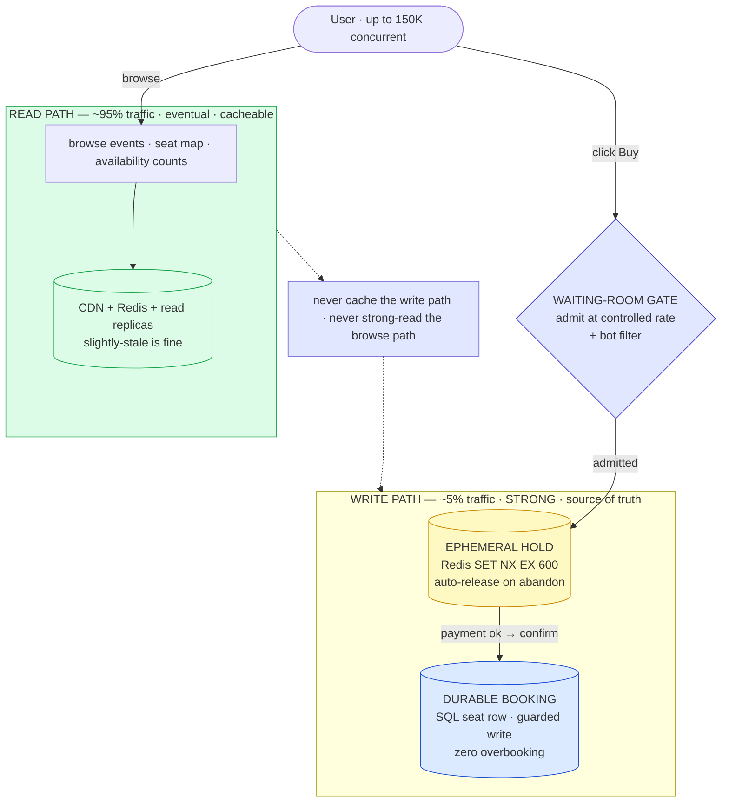
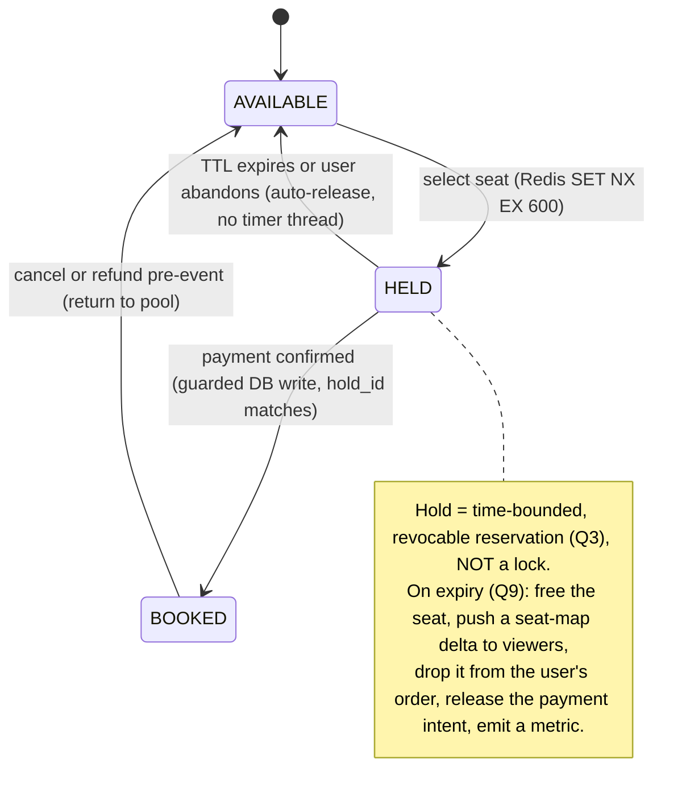
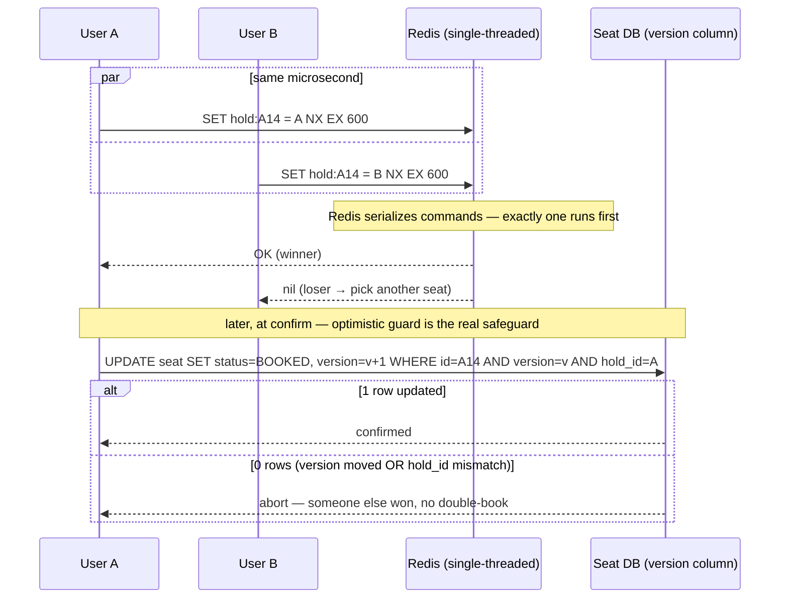
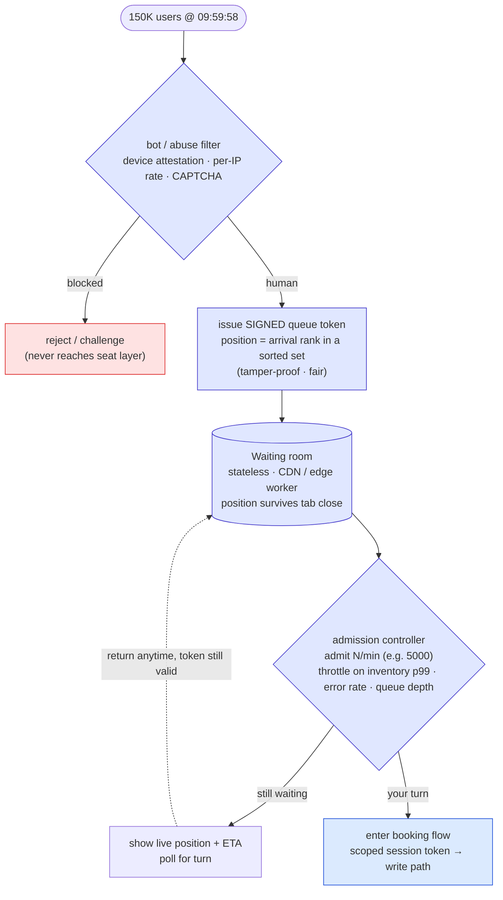
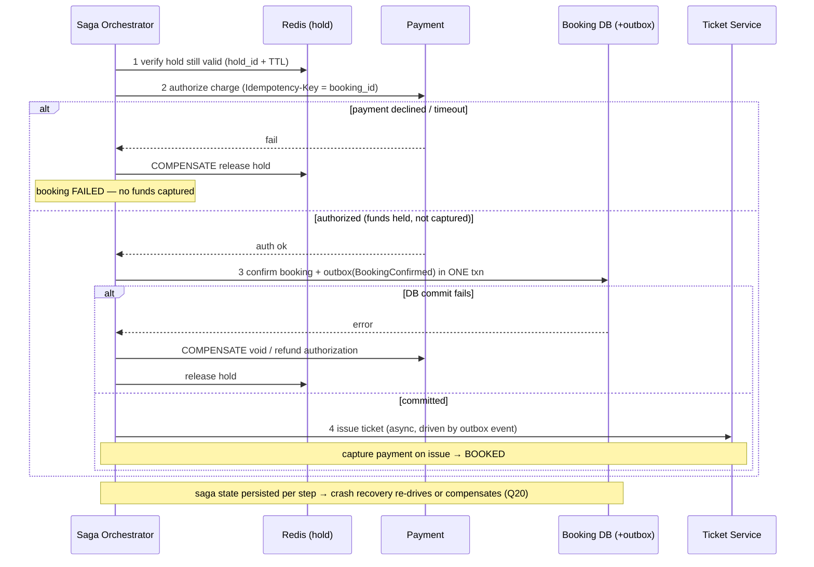
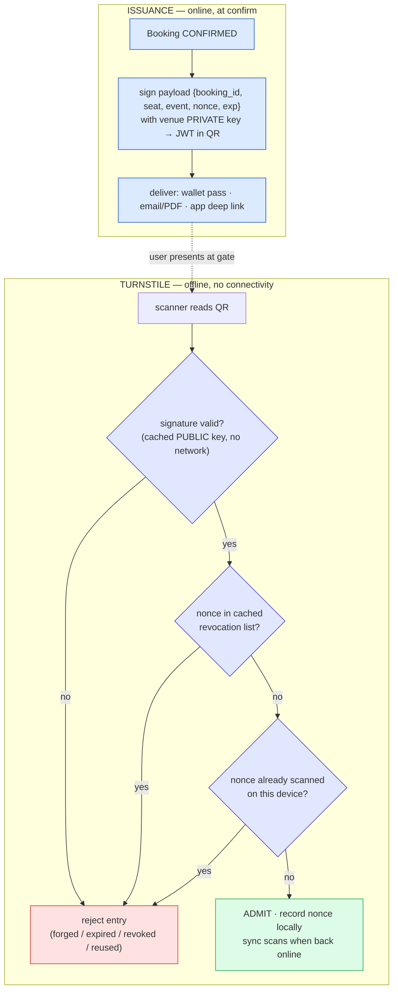
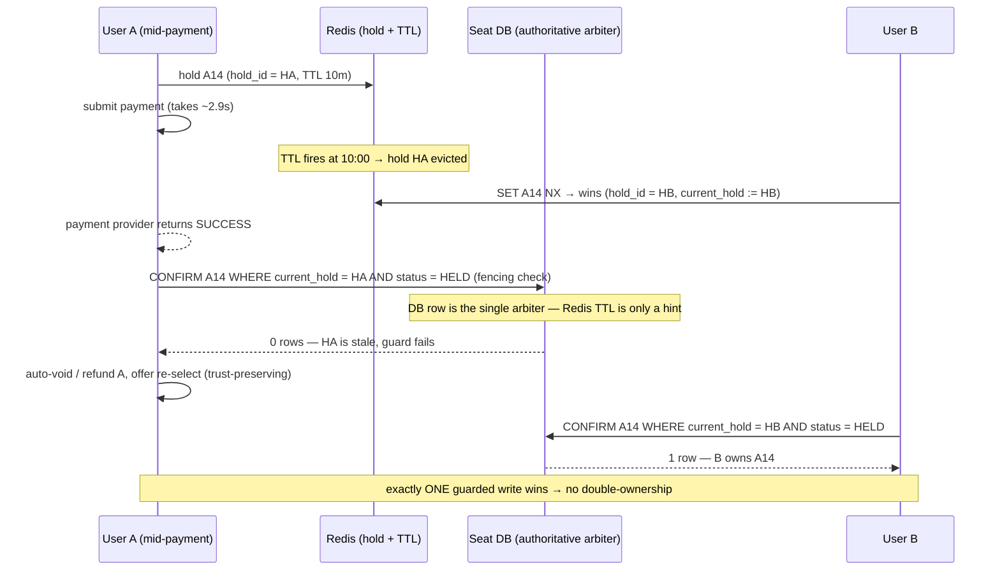

# Seat Reservation (Ticketmaster / BookMyShow) — Mermaid Diagrams

> Interview-ready diagrams. Start with Diagram 1 — the **read/write split** (cacheable browse vs strongly-consistent hold → pay → confirm, ephemeral Redis hold vs durable DB booking, fronted by a waiting-room gate) is the mental model everything hangs off. Then drill into the stage the interviewer probes.
>
> Reference: [answers.md](./answers.md) | [deep-dive.md](./deep-dive.md) | [simple-diagram.md](./simple-diagram.md)
>
> Cross-links: [distributed-caching](../distributed-caching/) (read-path seat-map + availability cache) · [distributed-transactions](../distributed-transactions/) (saga · idempotency · guarded confirm) · [message-queues](../message-queues/) (outbox → async ticket issuance) · [notification-system](../notification-system/) (confirmation + T-24h / T-1h reminders) · [rate-limiting](../rate-limiting/) (waiting-room admission + bot filter) · [consensus](../consensus/) (lease · fencing token · single-writer) · [communication-protocols](../communication-protocols/) (WebSocket vs SSE vs poll) · [sse](../sse/) (one-way seat-map push)

---

## Diagram 1 — The Central Split: Read Path vs Write Path (Start Here)

> **When to use:** The first thing to draw. Everything hangs off separating the **read path** (browse events / seat maps / counts — cacheable, eventual) from the **write path** (hold → pay → confirm — strong, source of truth), which is itself two-tier (ephemeral Redis hold vs durable DB booking) and fronted by a waiting-room gate. Use for Q1, Q2, Q3, Q4, Q5.



**What the interviewer is checking:**
- You **separate the availability problem from the inventory problem** first — read path is cacheable/eventual, write path is strongly consistent and hits the source of truth (Q1, Q2, Q5).
- The write path is **two-tier**: a fast, TTL-managed Redis hold vs the durable committed DB state — a hold is *not* a booking (Q3).
- Overbooking prevention is a **concurrency primitive** (atomic hold + guarded commit), not a business rule (Q4).
- The waiting-room gate throttles the herd so the inventory service never sees all 150K at once — capacity-plan for the *admitted* rate, not the arrival rate.

---

## Diagram 2 — Seat State Machine: AVAILABLE → HELD → BOOKED

> **When to use:** Q3, Q9. The seat lifecycle — what a hold is vs a booking, and every side effect the transitions must produce (especially release-on-expiry and cancel).



**What the interviewer is checking:**
- You draw the **hold vs booking** distinction as two distinct states with different durability and different triggers (Q3).
- **Release-on-expiry is implicit** — Redis evicts the key, no cron/timer sweeps millions of holds — but the DB is only ever written on confirm.
- Expiry has **many side effects**, not just "free the seat": seat-map fan-out, order cleanup, payment-intent release, metrics (Q9).
- BOOKED is not a dead end — cancel/refund returns a seat to the pool, so the machine is a cycle, not a line.

---

## Diagram 3 — SETNX Hold + TTL Lifecycle

> **When to use:** Q6, Q7, Q8, Q9. Step-by-step from "Select Seat" to the checkout timer, why Redis is the right store, the exact atomic command, the already-held case, and expiry.

```mermaid
sequenceDiagram
    participant U as User
    participant H as Hold Service
    participant R as Redis
    participant DB as Seat DB

    U->>H: click Select Seat A14
    H->>R: SET hold:event:123:seat:A14 = user:456 NX EX 600
    alt key did not exist (won the hold)
        R-->>H: OK
        H-->>U: HELD — 10-min checkout timer starts
        alt confirms before TTL
            U->>H: complete payment → confirm
            H->>DB: guarded UPDATE seat SET status=BOOKED WHERE hold_id = HA AND status ≠ BOOKED
            H->>R: DEL hold key
            H-->>U: BOOKED + ticket issued
        else TTL reaches 0
            R->>R: key auto-evicts (no timer thread needed)
            Note over R,DB: seat is implicitly AVAILABLE again; DB was never marked SOLD
        end
    else key exists (already held)
        R-->>H: nil
        H-->>U: seat taken — pick another
    end
```

**What the interviewer is checking:**
- The hot-path hold is a **single atomic command** (`SET ... NX EX`), not `SETNX` then a separate `EXPIRE` (which has a crash-between-them race) (Q8).
- Redis is chosen for **atomic conditional writes + native TTL + sub-ms latency**, so the DB is never touched during a hold (Q6, Q7).
- The already-held case returns immediately (`nil`) — the loser is told to pick another seat, never queued behind a lock (Q8).
- Expiry is **passive eviction** with explicit downstream side effects, not a durable state change (Q9).

---

## Diagram 4 — Concurrency Race Resolution: SETNX Winner + Optimistic Confirm

> **When to use:** Q12, Q13, Q14, Q15, Q16. Two users grab the same seat in the same microsecond — how the atomic hold picks one winner, and how the optimistic version/hold guard on the DB confirm is the final line that makes double-booking impossible even off a stale replica read.



**What the interviewer is checking:**
- You name all three strategies and their outcome: `SELECT FOR UPDATE` (pessimistic, blocks + kills pools), version column (optimistic, retry on conflict), and Redis `SET NX` (atomic, the hold winner) (Q12).
- The concrete rule: **optimistic for the common low-contention confirm; pessimistic/serialized only for a genuinely hot single seat** — and optimistic *degrades worse* under extreme contention on one row (watch the retry/abort rate) (Q13, Q15).
- The **guarded conditional write** (`WHERE version=v AND hold_id=...`, 0 rows ⇒ abort) is the lost-update fix and the single real overbooking guard (Q14).
- A **stale replica** showing AVAILABLE is harmless: the hold is atomic in Redis and the confirm re-checks against the authoritative row — the read lie never becomes a write (Q16).

---

## Diagram 5 — Virtual Waiting Room: Admission, Fair Tokens, Bot Mitigation

> **When to use:** Q24, Q25, Q26, Q27, Q28, Q29. Why a naive direct-to-DB architecture melts at 10:00:00, and how a waiting room issues tamper-proof positions, admits at a controlled rate, survives tab-close, and filters bots *before* the seat layer (the Ticketmaster 2022 lesson).



**What the interviewer is checking:**
- Naive = **all 150K hit the DB at once**, connection pool saturates in ms, cascading timeouts (the November 2022 failure) — you can articulate the failure before the fix (Q24).
- The waiting room is **stateless / edge-served**; positions are **signed and ordered** (sorted set by arrival) so they're fair and tamper-proof, and they **persist across tab-close** (Q25, Q26, Q27).
- Admission rate is **dynamically throttled** on real signals — inventory-service p99, error rate, queue depth — not a fixed guess (Q28).
- **Bot mitigation lives at the waiting-room layer, before seat selection** — the exact thing Ticketmaster got wrong; bots exhausted the token pool and entered the inventory flow (Q29).

---

## Diagram 6 — Booking Saga: Hold → Authorize → Confirm → Issue Ticket (with Compensations)

> **When to use:** Q18, Q19, Q20, Q21. Multi-service consistency without 2PC: the ACID boundary of the confirm, the idempotency key that survives a double-click, crash recovery, and a compensating action for every step.



**What the interviewer is checking:**
- The ACID boundary is tight: **booking row + outbox event in one local transaction**; "payment ok but DB write fails" is handled by voiding the auth, never a silent charge (Q18).
- The **idempotency key** (booking_id) makes a double-clicked "Pay Now" collapse to a single charge — the second request returns the first result (Q19).
- **Authorize now, capture on issue** — a crash after auth is recoverable because saga state is durable and capture is idempotent (Q20).
- **Saga, not 2PC**: each step has a concrete compensation (release hold, void auth, mark failed) with backward recovery ([distributed-transactions](../distributed-transactions/)) (Q21).

---

## Diagram 7 — QR Issuance + Offline Gate Validation

> **When to use:** Q43, Q44. What goes inside the QR (and why not the booking/seat id), and how a turnstile validates a ticket with **no connectivity** — signature check against a cached public key, cached revocation list, and scan-once.



**What the interviewer is checking:**
- The QR carries a **signed payload with a nonce and expiry**, not a raw booking_id — a plain id is guessable/enumerable and un-verifiable offline (Q43).
- The gate verifies with a **cached public key** — the signature makes the ticket **self-validating without a network call** (Q44).
- **Rotating (TOTP-style) code vs signed static token**: rotating defeats screenshot-and-share but needs a synced clock; signed static works fully offline — you can argue the tradeoff (Q44).
- **Scan-once** is enforced locally per device (record the nonce) with revocation-list sync — the honest limit is that cross-lane double-entry needs eventual scanner sync (Q44).

---

## Diagram 8 — Real-Time Seat-Map Fan-Out (WebSocket, Per-Section, Deltas Only)

> **When to use:** Q49. A seat must flip to "held" the instant someone grabs it — without pushing all 80K seat states to every client. Snapshot on open, subscribe per visible section, then push tiny deltas.


**What the interviewer is checking:**
- **Snapshot-then-delta**: initial state from the read cache, then only changes stream — you never re-send the whole map (Q49).
- **Per-section subscription** bounds fan-out — a client only receives deltas for sections it's viewing, not all 80K seats (Q49).
- Transport is a **persistent push channel** (WebSocket for bidirectional, or SSE for one-way map updates — [communication-protocols](../communication-protocols/), [sse](../sse/)); polling is rejected for the flip-instantly requirement (Q49).
- The delta payload is **tiny** (`{seatId, newState}`), so a hot section with rapid holds stays cheap on the wire and the client.

---

## Diagram 9 — Frontend Seat-Map Rendering: Virtualization + LOD + Hit-Testing

> **When to use:** Q48, Q53. Rendering up to ~80K seats smoothly: section-level LOD, Canvas/WebGL instead of 80K DOM/SVG nodes, viewport virtualization, spatial hit-testing on tap, and cheap real-time repaints.


**What the interviewer is checking:**
- **Canvas/WebGL over SVG/DOM** at 80K seats — one draw surface, not 80K nodes the browser must lay out and hit-test individually (Q48, Q53).
- **Level-of-detail**: sections/heatmap when zoomed out, real seats only when zoomed in — you never render more than the eye can use (Q48, Q53).
- **Viewport virtualization + a spatial index** (quadtree/grid) give O(log n) hit-testing on tap and smooth zoom/pan (Q48).
- Real-time updates are **dirty-rect repaints on an overlay layer**, so a flood of holds doesn't re-render the whole map — graceful on low-end devices (Q53).

---

## Diagram 10 — Failure Mode: Hold-Expiry-During-Payment Race → Fenced Atomic Confirm

> **When to use:** Q23, Q47. The hold TTL fires in Redis at the same instant payment is completing; another user grabs the seat. How a fenced, atomic DB confirm keeps the DB the single arbiter so two users can never both own A14 — and why the same commit makes ticket issuance exactly-once.



**What the interviewer is checking:**
- The DB confirm is a **fenced atomic write** keyed on the current valid hold (a monotonic hold epoch / `current_hold`) — a stale hold matches **0 rows**, so double-ownership is structurally impossible (Q23, [consensus](../consensus/) fencing).
- **Redis TTL is a hint, not the authority** — the durable DB row is the single arbiter; expiry never *itself* transfers ownership (Q23).
- The belt-and-suspenders is to **promote the hold to a durable PAYING state when payment starts** (extend TTL / persist), so B can't even grab it mid-payment — avoiding the refund entirely (Q23).
- Because the confirm is the **one durable commit**, ticket/QR issuance is a **retryable idempotent consumer** of that commit ([message-queues](../message-queues/) outbox) — a failed QR generation just retries and still yields **exactly one** valid ticket, never zero, never two (Q47).

---

## Quick Interview Reference

### Scale numbers (from README constraints — verify against current figures)

| Metric | Value | Note |
|---|---|---|
| Registered users | 500M | Global |
| Active events | ~10M | |
| Total seats (all events) | ~1B | Inventory rows |
| Peak concurrent (high-demand) | 150K | Taylor Swift-scale, one event |
| Seat hold TTL | 10 min | Redis `SET NX EX 600` |
| Overbooking tolerance | Zero | Hard constraint |
| Seat selection latency | < 500 ms p99 | Hot path |
| Payment end-to-end SLA | < 3 s | Authorize + confirm |
| Read/write ratio | ~95% / 5% | Browse dominates |
| Single-venue seats | up to ~80K | Seat-map render scale |
| Admission rate (example) | ~5K/min | Tune per inventory health |
| Ticketmaster 2022 peak | ~3.5B req/day vs ~40M normal | Approximate — the herd benchmark |

### Domain quick-ref

| Term | One-liner |
|---|---|
| **Hold** | Time-bounded, revocable reservation (Redis `SET NX EX`) — not a lock |
| **Booking** | Durable committed seat ownership (guarded DB write) |
| **Two-tier** | Redis ephemeral hold + DB durable state; DB is the arbiter |
| **Waiting room** | Stateless virtual queue admitting users at a controlled rate |
| **SET NX EX** | Atomic set-if-not-exists + TTL = the hold winner in one command |
| **Optimistic confirm** | `WHERE version=v AND hold_id=…` guard; 0 rows ⇒ abort |
| **Fencing token** | Monotonic hold epoch; a stale confirm is rejected |
| **Signed QR** | Offline-verifiable ticket (signature + nonce + revocation list) |
| **Outbox** | Booking + event in one txn → async, idempotent ticket/notify |

### Canonical tradeoffs

- **Read path vs write path** — cacheable/eventual browse vs strong/source-of-truth hold-pay-confirm.
- **Hold vs lock** — TTL auto-release (scales to millions) vs a DB lock held 10 min (kills connection pools).
- **Optimistic vs pessimistic** — retry-on-conflict for the common case vs serialize a genuinely hot seat; optimistic degrades worse under extreme single-row contention.
- **Redis hold vs DB-only** — speed + native TTL vs durability; the DB guarded write is always the final arbiter.
- **Fail-open vs fail-closed on Redis loss** — oversell risk vs halting sales; for zero-overbooking, fail-closed.
- **Waiting room vs direct** — fail-fast + fair admission vs melting the DB at sale open.
- **Signed static QR vs rotating code** — fully offline vs screenshot-proof (needs synced clock).

### Common mistakes

- One store / one consistency model for both browse and booking.
- Treating a hold as a **DB lock held for 10 minutes** → connection-pool exhaustion.
- Trusting **Redis TTL as the authority** instead of a guarded/fenced DB confirm.
- The availability **count/badge treated as the oversell guard** (it's the confirm write).
- **Bots let into the seat layer** (Ticketmaster 2022) — filter at the waiting room, before selection.
- Pushing **all 80K seat states to every client** instead of per-section deltas.
- QR = raw `booking_id` (forgeable, enumerable, un-verifiable offline) instead of a signed token.
- No **idempotency key** → double charge on double-click / retry.
- Releasing a seat to another user **while the first user's payment is in flight** (no fencing).
