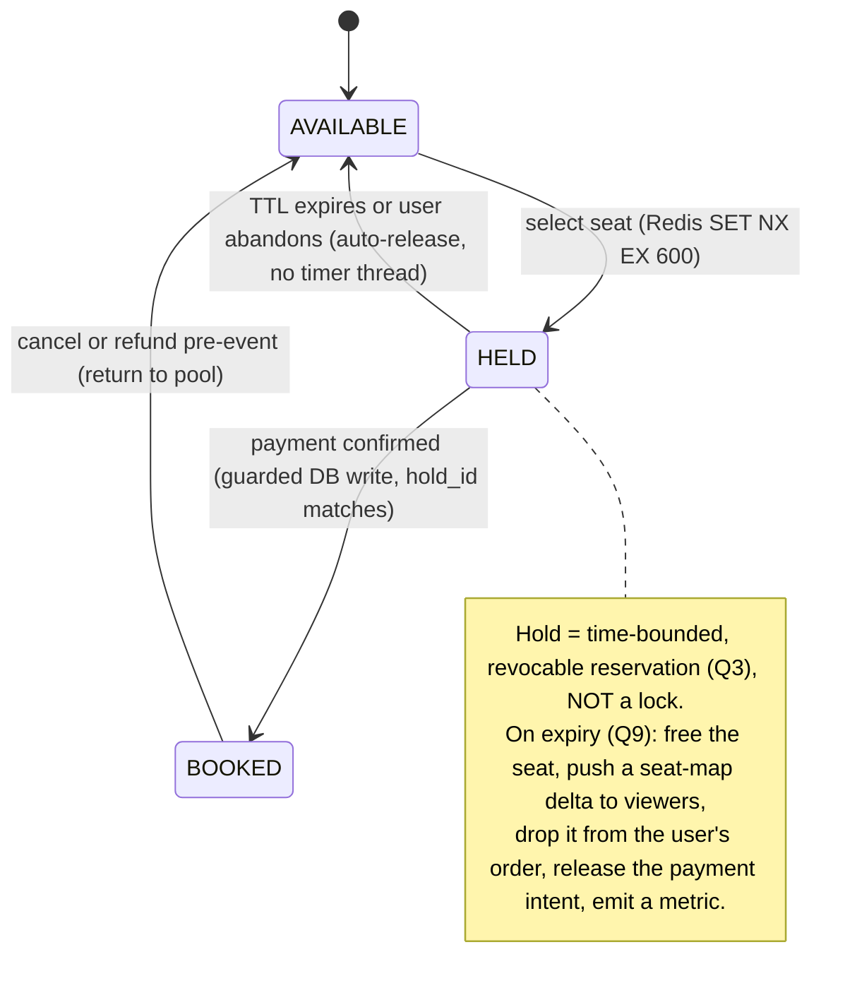
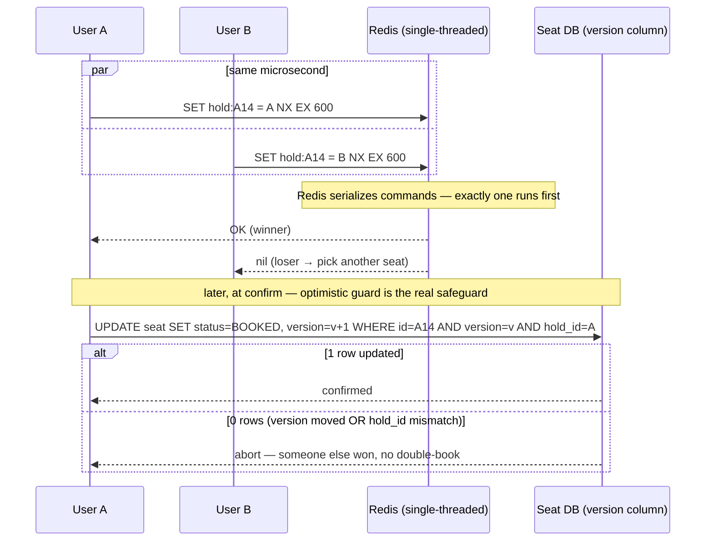
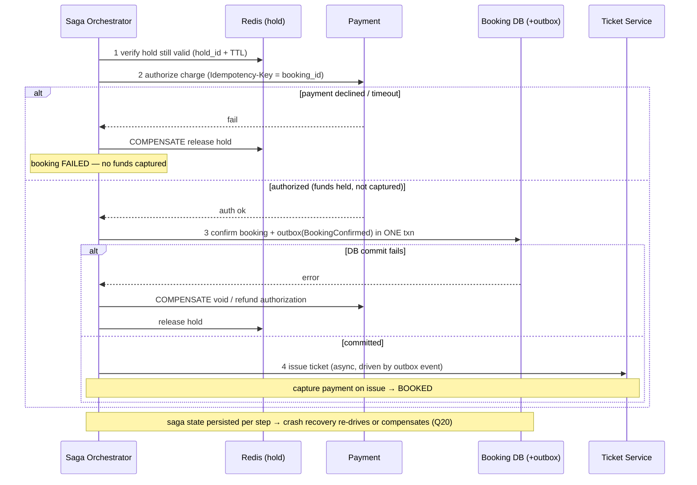
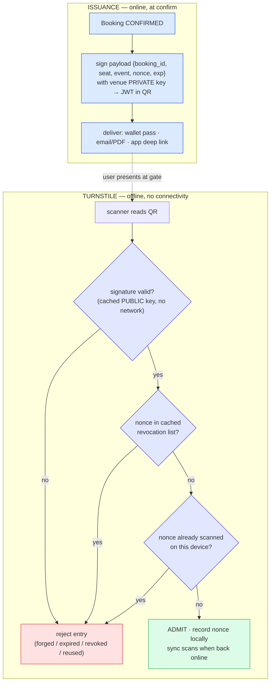
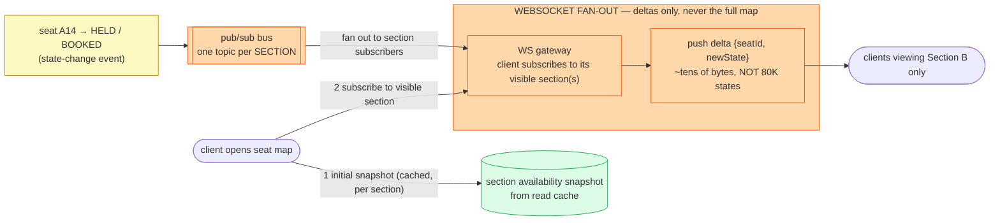
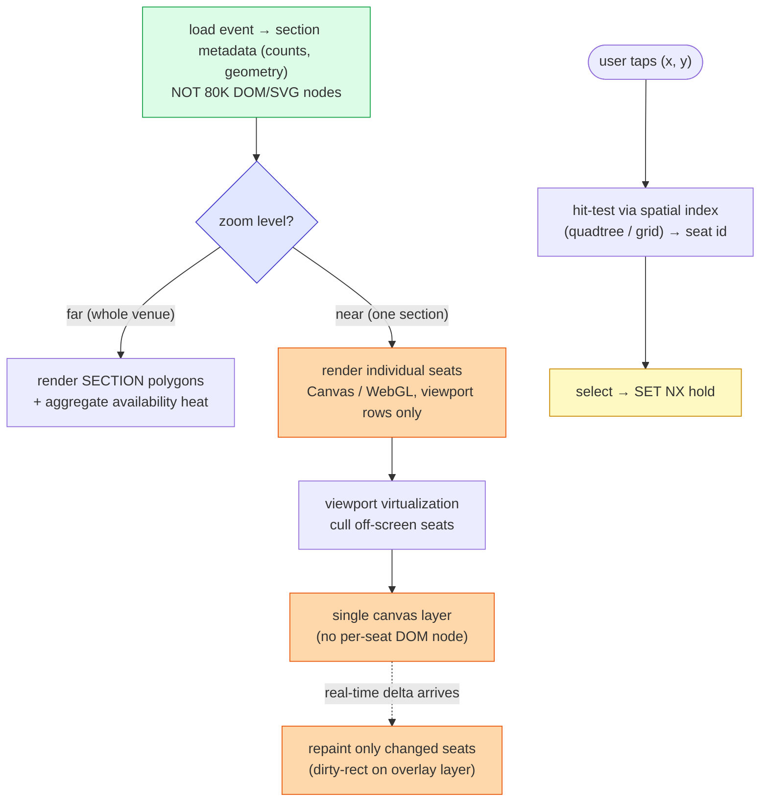
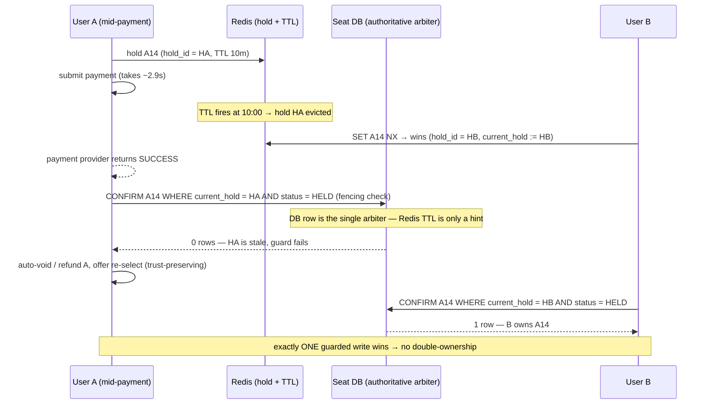

# Seat Reservation (Ticketmaster / BookMyShow) — Mermaid Diagrams

> Interview-ready diagrams. Start with Diagram 1 — the **read/write split** (cacheable browse vs strongly-consistent hold → pay → confirm, ephemeral Redis hold vs durable DB booking, fronted by a waiting-room gate) is the mental model everything hangs off. Then drill into the stage the interviewer probes.
>
> Reference: [answers.md](./answers.md) | [deep-dive.md](./deep-dive.md) | [simple-diagram.md](./simple-diagram.md)
>
> Cross-links: [distributed-caching](../distributed-caching/) (read-path seat-map + availability cache) · [distributed-transactions](../distributed-transactions/) (saga · idempotency · guarded confirm) · [message-queues](../message-queues/) (outbox → async ticket issuance) · [notification-system](../notification-system/) (confirmation + T-24h / T-1h reminders) · [rate-limiting](../rate-limiting/) (waiting-room admission + bot filter) · [consensus](../consensus/) (lease · fencing token · single-writer) · [communication-protocols](../communication-protocols/) (WebSocket vs SSE vs poll) · [sse](../sse/) (one-way seat-map push)

---

## Diagram 1 — The Central Split: Read Path vs Write Path (Start Here)

> **When to use:** The first thing to draw. Everything hangs off separating the **read path** (browse events / seat maps / counts — cacheable, eventual) from the **write path** (hold → pay → confirm — strong, source of truth), which is itself two-tier (ephemeral Redis hold vs durable DB booking) and fronted by a waiting-room gate. Use for Q1, Q2, Q3, Q4, Q5.


**What the interviewer is checking:**
- You **separate the availability problem from the inventory problem** first — read path is cacheable/eventual, write path is strongly consistent and hits the source of truth (Q1, Q2, Q5).
- The write path is **two-tier**: a fast, TTL-managed Redis hold vs the durable committed DB state — a hold is *not* a booking (Q3).
- Overbooking prevention is a **concurrency primitive** (atomic hold + guarded commit), not a business rule (Q4).
- The waiting-room gate throttles the herd so the inventory service never sees all 150K at once — capacity-plan for the *admitted* rate, not the arrival rate.

---

## Diagram 2 — Seat State Machine: AVAILABLE → HELD → BOOKED

> **When to use:** Q3, Q9. The seat lifecycle — what a hold is vs a booking, and every side effect the transitions must produce (especially release-on-expiry and cancel).



**What the interviewer is checking:**
- You draw the **hold vs booking** distinction as two distinct states with different durability and different triggers (Q3).
- **Release-on-expiry is implicit** — Redis evicts the key, no cron/timer sweeps millions of holds — but the DB is only ever written on confirm.
- Expiry has **many side effects**, not just "free the seat": seat-map fan-out, order cleanup, payment-intent release, metrics (Q9).
- BOOKED is not a dead end — cancel/refund returns a seat to the pool, so the machine is a cycle, not a line.

---

## Diagram 3 — SETNX Hold + TTL Lifecycle

> **When to use:** Q6, Q7, Q8, Q9. Step-by-step from "Select Seat" to the checkout timer, why Redis is the right store, the exact atomic command, the already-held case, and expiry.

```mermaid
sequenceDiagram
    participant U as User
    participant H as Hold Service
    participant R as Redis
    participant DB as Seat DB

    U->>H: click Select Seat A14
    H->>R: SET hold:event:123:seat:A14 = user:456 NX EX 600
    alt key did not exist (won the hold)
        R-->>H: OK
        H-->>U: HELD — 10-min checkout timer starts
        alt confirms before TTL
            U->>H: complete payment → confirm
            H->>DB: guarded UPDATE seat SET status=BOOKED WHERE hold_id = HA AND status ≠ BOOKED
            H->>R: DEL hold key
            H-->>U: BOOKED + ticket issued
        else TTL reaches 0
            R->>R: key auto-evicts (no timer thread needed)
            Note over R,DB: seat is implicitly AVAILABLE again; DB was never marked SOLD
        end
    else key exists (already held)
        R-->>H: nil
        H-->>U: seat taken — pick another
    end
```

**What the interviewer is checking:**
- The hot-path hold is a **single atomic command** (`SET ... NX EX`), not `SETNX` then a separate `EXPIRE` (which has a crash-between-them race) (Q8).
- Redis is chosen for **atomic conditional writes + native TTL + sub-ms latency**, so the DB is never touched during a hold (Q6, Q7).
- The already-held case returns immediately (`nil`) — the loser is told to pick another seat, never queued behind a lock (Q8).
- Expiry is **passive eviction** with explicit downstream side effects, not a durable state change (Q9).

---

## Diagram 4 — Concurrency Race Resolution: SETNX Winner + Optimistic Confirm

> **When to use:** Q12, Q13, Q14, Q15, Q16. Two users grab the same seat in the same microsecond — how the atomic hold picks one winner, and how the optimistic version/hold guard on the DB confirm is the final line that makes double-booking impossible even off a stale replica read.



**What the interviewer is checking:**
- You name all three strategies and their outcome: `SELECT FOR UPDATE` (pessimistic, blocks + kills pools), version column (optimistic, retry on conflict), and Redis `SET NX` (atomic, the hold winner) (Q12).
- The concrete rule: **optimistic for the common low-contention confirm; pessimistic/serialized only for a genuinely hot single seat** — and optimistic *degrades worse* under extreme contention on one row (watch the retry/abort rate) (Q13, Q15).
- The **guarded conditional write** (`WHERE version=v AND hold_id=...`, 0 rows ⇒ abort) is the lost-update fix and the single real overbooking guard (Q14).
- A **stale replica** showing AVAILABLE is harmless: the hold is atomic in Redis and the confirm re-checks against the authoritative row — the read lie never becomes a write (Q16).

---

## Diagram 5 — Virtual Waiting Room: Admission, Fair Tokens, Bot Mitigation

> **When to use:** Q24, Q25, Q26, Q27, Q28, Q29. Why a naive direct-to-DB architecture melts at 10:00:00, and how a waiting room issues tamper-proof positions, admits at a controlled rate, survives tab-close, and filters bots *before* the seat layer (the Ticketmaster 2022 lesson).


**What the interviewer is checking:**
- Naive = **all 150K hit the DB at once**, connection pool saturates in ms, cascading timeouts (the November 2022 failure) — you can articulate the failure before the fix (Q24).
- The waiting room is **stateless / edge-served**; positions are **signed and ordered** (sorted set by arrival) so they're fair and tamper-proof, and they **persist across tab-close** (Q25, Q26, Q27).
- Admission rate is **dynamically throttled** on real signals — inventory-service p99, error rate, queue depth — not a fixed guess (Q28).
- **Bot mitigation lives at the waiting-room layer, before seat selection** — the exact thing Ticketmaster got wrong; bots exhausted the token pool and entered the inventory flow (Q29).

---

## Diagram 6 — Booking Saga: Hold → Authorize → Confirm → Issue Ticket (with Compensations)

> **When to use:** Q18, Q19, Q20, Q21. Multi-service consistency without 2PC: the ACID boundary of the confirm, the idempotency key that survives a double-click, crash recovery, and a compensating action for every step.



**What the interviewer is checking:**
- The ACID boundary is tight: **booking row + outbox event in one local transaction**; "payment ok but DB write fails" is handled by voiding the auth, never a silent charge (Q18).
- The **idempotency key** (booking_id) makes a double-clicked "Pay Now" collapse to a single charge — the second request returns the first result (Q19).
- **Authorize now, capture on issue** — a crash after auth is recoverable because saga state is durable and capture is idempotent (Q20).
- **Saga, not 2PC**: each step has a concrete compensation (release hold, void auth, mark failed) with backward recovery ([distributed-transactions](../distributed-transactions/)) (Q21).

---

## Diagram 7 — QR Issuance + Offline Gate Validation

> **When to use:** Q43, Q44. What goes inside the QR (and why not the booking/seat id), and how a turnstile validates a ticket with **no connectivity** — signature check against a cached public key, cached revocation list, and scan-once.



**What the interviewer is checking:**
- The QR carries a **signed payload with a nonce and expiry**, not a raw booking_id — a plain id is guessable/enumerable and un-verifiable offline (Q43).
- The gate verifies with a **cached public key** — the signature makes the ticket **self-validating without a network call** (Q44).
- **Rotating (TOTP-style) code vs signed static token**: rotating defeats screenshot-and-share but needs a synced clock; signed static works fully offline — you can argue the tradeoff (Q44).
- **Scan-once** is enforced locally per device (record the nonce) with revocation-list sync — the honest limit is that cross-lane double-entry needs eventual scanner sync (Q44).

---

## Diagram 8 — Real-Time Seat-Map Fan-Out (WebSocket, Per-Section, Deltas Only)

> **When to use:** Q49. A seat must flip to "held" the instant someone grabs it — without pushing all 80K seat states to every client. Snapshot on open, subscribe per visible section, then push tiny deltas.



**What the interviewer is checking:**
- **Snapshot-then-delta**: initial state from the read cache, then only changes stream — you never re-send the whole map (Q49).
- **Per-section subscription** bounds fan-out — a client only receives deltas for sections it's viewing, not all 80K seats (Q49).
- Transport is a **persistent push channel** (WebSocket for bidirectional, or SSE for one-way map updates — [communication-protocols](../communication-protocols/), [sse](../sse/)); polling is rejected for the flip-instantly requirement (Q49).
- The delta payload is **tiny** (`{seatId, newState}`), so a hot section with rapid holds stays cheap on the wire and the client.

---

## Diagram 9 — Frontend Seat-Map Rendering: Virtualization + LOD + Hit-Testing

> **When to use:** Q48, Q53. Rendering up to ~80K seats smoothly: section-level LOD, Canvas/WebGL instead of 80K DOM/SVG nodes, viewport virtualization, spatial hit-testing on tap, and cheap real-time repaints.



**What the interviewer is checking:**
- **Canvas/WebGL over SVG/DOM** at 80K seats — one draw surface, not 80K nodes the browser must lay out and hit-test individually (Q48, Q53).
- **Level-of-detail**: sections/heatmap when zoomed out, real seats only when zoomed in — you never render more than the eye can use (Q48, Q53).
- **Viewport virtualization + a spatial index** (quadtree/grid) give O(log n) hit-testing on tap and smooth zoom/pan (Q48).
- Real-time updates are **dirty-rect repaints on an overlay layer**, so a flood of holds doesn't re-render the whole map — graceful on low-end devices (Q53).

---

## Diagram 10 — Failure Mode: Hold-Expiry-During-Payment Race → Fenced Atomic Confirm

> **When to use:** Q23, Q47. The hold TTL fires in Redis at the same instant payment is completing; another user grabs the seat. How a fenced, atomic DB confirm keeps the DB the single arbiter so two users can never both own A14 — and why the same commit makes ticket issuance exactly-once.



**What the interviewer is checking:**
- The DB confirm is a **fenced atomic write** keyed on the current valid hold (a monotonic hold epoch / `current_hold`) — a stale hold matches **0 rows**, so double-ownership is structurally impossible (Q23, [consensus](../consensus/) fencing).
- **Redis TTL is a hint, not the authority** — the durable DB row is the single arbiter; expiry never *itself* transfers ownership (Q23).
- The belt-and-suspenders is to **promote the hold to a durable PAYING state when payment starts** (extend TTL / persist), so B can't even grab it mid-payment — avoiding the refund entirely (Q23).
- Because the confirm is the **one durable commit**, ticket/QR issuance is a **retryable idempotent consumer** of that commit ([message-queues](../message-queues/) outbox) — a failed QR generation just retries and still yields **exactly one** valid ticket, never zero, never two (Q47).

---

## Quick Interview Reference

### Scale numbers (from README constraints — verify against current figures)

| Metric | Value | Note |
|---|---|---|
| Registered users | 500M | Global |
| Active events | ~10M | |
| Total seats (all events) | ~1B | Inventory rows |
| Peak concurrent (high-demand) | 150K | Taylor Swift-scale, one event |
| Seat hold TTL | 10 min | Redis `SET NX EX 600` |
| Overbooking tolerance | Zero | Hard constraint |
| Seat selection latency | < 500 ms p99 | Hot path |
| Payment end-to-end SLA | < 3 s | Authorize + confirm |
| Read/write ratio | ~95% / 5% | Browse dominates |
| Single-venue seats | up to ~80K | Seat-map render scale |
| Admission rate (example) | ~5K/min | Tune per inventory health |
| Ticketmaster 2022 peak | ~3.5B req/day vs ~40M normal | Approximate — the herd benchmark |

### Domain quick-ref

| Term | One-liner |
|---|---|
| **Hold** | Time-bounded, revocable reservation (Redis `SET NX EX`) — not a lock |
| **Booking** | Durable committed seat ownership (guarded DB write) |
| **Two-tier** | Redis ephemeral hold + DB durable state; DB is the arbiter |
| **Waiting room** | Stateless virtual queue admitting users at a controlled rate |
| **SET NX EX** | Atomic set-if-not-exists + TTL = the hold winner in one command |
| **Optimistic confirm** | `WHERE version=v AND hold_id=…` guard; 0 rows ⇒ abort |
| **Fencing token** | Monotonic hold epoch; a stale confirm is rejected |
| **Signed QR** | Offline-verifiable ticket (signature + nonce + revocation list) |
| **Outbox** | Booking + event in one txn → async, idempotent ticket/notify |

### Canonical tradeoffs

- **Read path vs write path** — cacheable/eventual browse vs strong/source-of-truth hold-pay-confirm.
- **Hold vs lock** — TTL auto-release (scales to millions) vs a DB lock held 10 min (kills connection pools).
- **Optimistic vs pessimistic** — retry-on-conflict for the common case vs serialize a genuinely hot seat; optimistic degrades worse under extreme single-row contention.
- **Redis hold vs DB-only** — speed + native TTL vs durability; the DB guarded write is always the final arbiter.
- **Fail-open vs fail-closed on Redis loss** — oversell risk vs halting sales; for zero-overbooking, fail-closed.
- **Waiting room vs direct** — fail-fast + fair admission vs melting the DB at sale open.
- **Signed static QR vs rotating code** — fully offline vs screenshot-proof (needs synced clock).

### Common mistakes

- One store / one consistency model for both browse and booking.
- Treating a hold as a **DB lock held for 10 minutes** → connection-pool exhaustion.
- Trusting **Redis TTL as the authority** instead of a guarded/fenced DB confirm.
- The availability **count/badge treated as the oversell guard** (it's the confirm write).
- **Bots let into the seat layer** (Ticketmaster 2022) — filter at the waiting room, before selection.
- Pushing **all 80K seat states to every client** instead of per-section deltas.
- QR = raw `booking_id` (forgeable, enumerable, un-verifiable offline) instead of a signed token.
- No **idempotency key** → double charge on double-click / retry.
- Releasing a seat to another user **while the first user's payment is in flight** (no fencing).

---

## 🎯 The One-Page Master Diagram — THE ONE TO DRAW IN THE INTERVIEW (final consolidated design)

> **When to use:** final revision, 10 minutes before the interview — and the single diagram to reproduce on the whiteboard. If you can narrate it end-to-end and name the tradeoff at each **red** box, you're ready. If you stall on a box, that's the section of [deep-dive.md](./deep-dive.md) to open. Narrative version: [story.md](./story.md).
> Spec for this section: [`docs/instructions.md` §2.1](../../docs/instructions.md) · AWS names: [`docs/AWS_SERVICE_MAP.md`](../../docs/AWS_SERVICE_MAP.md).
> ⚠️ AWS service names are **defensible defaults, not gospel**; every quota below is an order-of-magnitude planning number to **verify against current AWS docs**.

### The central split in one sentence

**A booking is *two-tier* — an ephemeral hold (Redis `SET NX PX`, high contention, auto-expiring, safe to lose) versus a durable booking (one guarded SQL `UPDATE`, money, zero overbooking) — fronted by a waiting room because at sale-open the *arrival* rate dwarfs what the inventory tier can absorb, with a cacheable read path split from the strong-consistency write path.**

```mermaid
flowchart LR
    FAN(["Fan<br/>150K concurrent"])

    subgraph READ["READ PATH — ~95% · EVENTUAL · may be stale"]
        direction TB
        GEO[("③ geometry<br/>CloudFront · immutable")]
        BITMAP[("status: 2 bits/seat<br/>ElastiCache · per section")]
        WS["deltas per SECTION<br/>WS on NLB + pub/sub"]
        SRCH[("search: OpenSearch<br/>CDC-fed · derived")]
        BITMAP --> WS
    end

    subgraph GATE["WAITING ROOM — stateless, at the EDGE"]
        direction TB
        WR["① queue + BOT FILTER<br/>signed position<br/>CloudFront + WAF"]
        ADM{"② admit ~5K/min<br/>not 150K<br/>AIMD: p99 · pool% · errors"}
        WR --> ADM
    end

    HOLDBOX["④ HOLD — safe to lose<br/>SET seat NX PX 600000<br/>ElastiCache · rung 1"]

    subgraph BOOK["DURABLE BOOKING — STRONG · money"]
        direction TB
        SAGA["⑤ saga · authorize→capture<br/>idem key UNIQUE in the txn<br/>Step Functions"]
        GUARD{"⑥ OVERBOOK GUARD<br/>WHERE status='HELD'<br/>AND hold_id=:mine<br/>1 row = yours · 0 = not"}
        PG[("Aurora · sync replica<br/>UNIQUE(event, seat)<br/>+ OUTBOX")]
        RACE["⑦ expiry-vs-payment<br/>PENDING_PAYMENT + fence<br/>charged + 0 rows → refund"]
        SAGA --> GUARD --> PG
        GUARD <-.-> RACE
    end

    subgraph ASYNC["AFTER COMMIT — all events"]
        direction TB
        BUS[["⑧ outbox → SQS/EventBridge"]]
        QR["signed QR · KMS<br/>gate verifies OFFLINE"]
        NOTIF["T-24h/T-1h · Scheduler<br/>UNIQUE ledger"]
        BUS --> QR
        BUS --> NOTIF
    end

    FAN -.->|"browse"| READ
    FAN -->|"sale open"| WR
    ADM -->|"admitted"| HOLDBOX
    READ -.->|"stale map = a wasted click,<br/>never a seat"| HOLDBOX
    HOLDBOX -->|"checkout"| SAGA
    PG -.->|"same txn"| BUS

    style READ fill:#dcfce7,stroke:#16a34a
    style GATE fill:#e0e7ff,stroke:#4338ca
    style BOOK fill:#dbeafe,stroke:#1d4ed8
    style ASYNC fill:#fed7aa,stroke:#ea580c
    style HOLDBOX fill:#fef9c3,stroke:#ca8a04
    style PG fill:#dbeafe,stroke:#1d4ed8
    style BUS fill:#fed7aa,stroke:#ea580c
    style WR fill:#fee2e2,stroke:#dc2626
    style GUARD fill:#fee2e2,stroke:#dc2626
    style RACE fill:#fee2e2,stroke:#dc2626
```



### The 60-second narration

*(one line per numbered box ①–⑧ — say it while your hand draws that box)*

1. **The waiting room is the front door, and it is stateless at the edge** — because it must survive exactly the load my service cannot. 150K fans get a *signed* position token (they can display it, never assert it), bots are filtered **here**, before inventory, which is the 2022 lesson. CloudFront + WAF Bot Control; positions from an ElastiCache `INCR` or sorted set.
2. **Admission is a thermostat, not a constant.** I admit at the rate the inventory tier can absorb — AIMD on inventory p99, DB pool utilization and error rate, holding the database near 60–70%. *The inventory tier is capacity-planned for the admitted rate, never the arrival rate.* That one sentence is the whole scene.
3. **A hold is not a booking, and it is not a lock.** One atomic `SET ... NX PX 600000` in ElastiCache: claim-if-absent **plus a real per-key timer**, in one command. A 10-minute `SELECT FOR UPDATE` would pin one connection per open cart and destroy the pool. Losing every hold to a crash is *annoying, not incorrect* — seats revert to AVAILABLE, which the durable database always agreed with.
4. **Payment is outside the transaction, so this is a saga.** Authorize then capture, with an idempotency key that is `UNIQUE` **inside the money transaction** — so a double-click never reaches the PSP twice. A 408 is an **unknown**, not a failure: retry with the same key or query by key; never re-charge blind.
5. **This red diamond is the entire answer to "how do you prevent overbooking."** One guarded `UPDATE ... WHERE status='HELD' AND hold_id=:mine`, fenced by a monotonic token. **1 row means you own the chair; 0 rows means you don't; there is no third answer.** Not the Redis hold — Redis may pause, skew, or lose keys, and the worst case is a double-*hold*. The booking row and its outbox event commit in the same transaction, so the event cannot be lost.
6. **The nastiest race lives next to it** (the second red box): the TTL fires at the exact millisecond the charge succeeds, another fan grabs the seat, and the payment lands. `PENDING_PAYMENT` makes it rare, the guarded CAS makes it harmless, and a sweeper enforces *money captured ⇒ eventually a booking or a refund*.
7. **The ticket is a downstream projection, never part of the payment transaction** — a signed, opaque, time-bounded token (KMS asymmetric, so a stolen gate scanner still cannot mint tickets) that the turnstile verifies **offline** against a cached public key plus a `(ticket_id, generation)`-scoped revocation list. Mint once under a `UNIQUE(booking_id)` guard; re-run delivery on every retry.
8. **Everything after the commit is an event**, so a sale spike becomes a backlog rather than a checkout meltdown. Reminders are durable rows on EventBridge Scheduler — *never* in-process timers — deduped by a `UNIQUE (user, event, type)` ledger that deliberately excludes the channel.

### The five numbers that justify the design

| Number | Derivation | Therefore |
|---|---|---|
| **~600K req in the first second** | 150K concurrent × ~4 requests each (seat map + counts + hold), all inside 10:00:00 (illustrative fan-out) | A ~500-connection pool saturates in **milliseconds**, then timeouts → retries → cascade. The waiting room is **mandatory, not an optimization** |
| **~5K admitted/min vs 150K arrivals** | admission rate = inventory's safe sustained throughput (≈5K holds/s at p99 < 500 ms, illustrative) | Stretch a 1-second stampede into a several-minute drip; size inventory for the **admitted** rate |
| **150K concurrent holds × 10 min** | every open checkout would pin 1 connection + 1 row lock for the full TTL | Pools are sized in the **hundreds**, carts in the **hundreds of thousands** → holds must live in Redis with a native TTL, not in the database |
| **80K seats × 2 bits = ~20 KB** | 80,000 × 2 ÷ 8 (illustrative arithmetic) | That is the **whole-venue** encoding density — you ship one *section* (a few hundred bytes) as a snapshot, then versioned deltas. Never 80K JSON rows, never the venue |
| **1B seat rows ÷ 10M events ≈ 80K/event** | README constraints | Shard by `event_id` so a multi-seat order stays a **single-shard transaction**; sub-shard a mega-event by *section* when one shard gets hot |

Supporting SLAs to quote: **< 500 ms p99** seat selection · **< 3 s** payment end-to-end · **~95/5** read/write · **10-min** hold TTL · **zero** overbooking tolerance.

### The patterns this assembles

| Pattern | Where | The move |
|---|---|---|
| [Dealing with Contention](../../patterns/dealing-with-contention.md) **●** | ③ hold, ⑤ guard | Rung 1 twice: `SET NX` for the hold, a **conditional `UPDATE`** for the confirm — plus a **fencing token**, because the lock is never the guarantee |
| [Multi-Step Processes](../../patterns/multi-step-processes.md) **●** | ④ saga, ⑤ outbox | hold → authorize → confirm → issue, each with a compensation; booking + event in **one** transaction, then relay |
| [Real-Time Updates](../../patterns/realtime-updates.md) **●** | ② live seat map | Hop 1 = WebSocket; **hop 2 is the real problem** — per-section pub/sub topics so a delta reaches only that section's subscribers |
| [Scaling Reads](../../patterns/scaling-reads.md) ○ | ② read path | CDN for immutable geometry → ElastiCache bitmap → read replicas → OpenSearch as a *derived* index (CDC-fed, never the truth) |
| [Scaling Writes](../../patterns/scaling-writes.md) ○ | ③④ inventory | Shard by `event_id`; sub-shard hot events by section; the queue caps demand so you don't over-shard |
| [Long-Running Tasks](../../patterns/long-running-tasks.md) ○ | ⑦ issuance | Commit → event → worker → DLQ; the booking (not the QR) is the entitlement if issuance never recovers |
| [ZooKeeper & coordination](../../patterns/zookeeper.md) ○ | Q39 | **Reject** ZK for millions of TTL holds (a quorum write per lock); keep it for the *handful* of coarse locks — reconciler leader election, admission ownership |

### The three things that break (and the mitigation)

| Failure | Blast radius | Mitigation | How you detect it |
|---|---|---|---|
| **ElastiCache node dies with 50K holds** | Every held seat reverts to AVAILABLE → mass re-contention, angry fans — but **no double-booking**, because the DB never said BOOKED | Multi-AZ replica (failover in seconds, not 30) + **fail closed** on the hold path with a circuit breaker — a "try again" beats an overbooking incident. Correctness stays in the Aurora CAS | Sudden drop in active holds + spike in hold error rate; `MOVED`/redirect spike if cluster-mode resharded mid-sale |
| **Hold expires while the payment is in flight** | Fan is charged, gets 0 rows on confirm, another fan owns the seat → money with no seat | `HELD → PENDING_PAYMENT` when the charge starts (makes it rare) · guarded + fenced CAS (makes it harmless) · **auto-refund** · sweeper enforcing *money ⇒ seat-or-refund* | Spike in prevented-double-books above the modeled shape; reconciler count of `CAPTURED` payments with no `CONFIRMED` booking — **alert on age, not count** |
| **Bots reach seat selection** (the 2022 failure) | Real fans get nothing; inventory is held by scripts that never pay | WAF Bot Control + verified-fan pre-registration + per-identity/ASN hold quotas + **non-enumerable** hold tokens — all **at the gate**, before inventory | Holds-per-identity and per-ASN anomalies; hold-then-release-just-before-expiry patterns; hold→book conversion collapsing while hold rate stays high |

### The AWS-specific traps to name unprompted

These are the highest-signal sentences in the whole answer — each is a place where the obvious AWS choice is *wrong for this system*. (All quotas ⚠️ **verify against current docs**.)

| Trap | Why it bites here | What you say |
|---|---|---|
| **DynamoDB TTL is not a scheduler** | Deletion is best-effort within roughly a 48-hour window — it cannot express a 10-minute hold expiry | *"A hold expiry needs a real per-key timer, so the hold lives in ElastiCache with `PX`. DynamoDB TTL is cleanup, not a timer — and either way the DB CAS re-validates, because Redis expiry is itself lazy."* |
| **DynamoDB Global Tables resolve conflicts last-writer-wins** | Two regions confirming the same seat would silently converge — a double-sold chair | *"Multi-region here is **home-region write authority** (Aurora Global Database, Route 53 latency routing for reads). Active-active LWW is off the table for non-fungible inventory."* |
| **API Gateway WebSocket is priced per message** | 150K concurrent viewers × per-section deltas makes it the wrong shape at venue scale | *"Self-managed WebSocket on an NLB plus an ElastiCache connection registry — hop 2 is the actual problem, and API Gateway hides it."* |
| **ElastiCache cluster-mode resharding** | Slot migration causes `MOVED` redirects and latency spikes — during on-sale, that is the hold path | *"Pre-scale before a known on-sale; never reshard during it. Cluster-aware client either way."* |
| **AWS gives you no managed lock, no exactly-once, no circuit breaker, no sweeper** | All four are load-bearing here | *"So the mutex is a conditional write with a fence, the idempotency key is a `UNIQUE` constraint inside the money transaction, the breaker is mine, and the sweeper is the thing that notices a stuck payment — no service notices for me."* |
| **Aurora replica lag** | The fan who just booked reads their booking from a replica and sees nothing | *"Route the buyer's own post-purchase reads to the writer; everyone else reads replicas."* |

### If you only remember one thing

> **The hold is an optimization; the guarded `UPDATE ... WHERE status='HELD' AND hold_id=:mine` is the guarantee — 1 row means you own the chair, 0 rows means you don't, and everything else in the design exists either to keep that statement fast enough to use (waiting room, caches, sharding) or to treat the fan fairly when they are the one who gets 0 (refund, re-select, apology).**

---

### 🎤 30-Minute Interview Transcript — What to Actually Say

> Practice reading this **out loud** while drawing the master diagram live, until it is your own words rather than a script. Timestamps are a **budget, not a stopwatch** — an interviewer's questions will move them, but the **order** (Requirements → Architecture → Data → API → deep-dives → Close) must hold. Every number here is already derived in [answers.md](./answers.md) / [story.md](./story.md) — quote it, don't re-derive it.

#### [00:00–02:30] Open — restate the problem and scope it

- "I'll design the backend for a ticketing system like Ticketmaster — browse events, view an interactive seat map, hold specific seats for 10 minutes while checking out, and confirm with a payment provider."
- "I'll focus on three things: the seat-map read path, the hold-and-confirm write path, and surviving a flash sale. I'll leave resale, dynamic pricing, and the recommendation surface aside unless you want them."
- "One requirement dominates everything: **zero overbooking**. Two people cannot sit in one chair, and unlike a shopping cart I can't apologize and backorder a seat."
- "I'll assume the Taylor Swift shape as the worst case — about 150,000 concurrent fans on a single high-demand event, a venue of up to 80,000 seats, a 10-minute hold, and a payment SLA under 3 seconds. Tell me if you'd rather size it differently."

#### [02:30–05:00] Size the problem before drawing anything

- "At sale open, 150,000 fans each fire roughly four requests — seat map, availability, hold attempt — so about 600,000 requests land in the first second."
- "A database connection pool is sized in the hundreds. Say 500. That saturates in milliseconds, then clients time out, then they retry, and the retry storm multiplies the load. That's the cascade that took Ticketmaster's Eras Tour presale down publicly in November 2022."
- "The second number that shapes the design: if I held seats with a database row lock for the full 10 minutes, 150,000 open carts would each pin a connection and a row lock. Hundreds of connections, hundreds of thousands of carts — that alone rules out a database lock for the hold."
- "So my takeaway before I draw: **the seat claim is a correctness problem, not a throughput problem** — 5% of traffic, but zero tolerance. Browsing is the opposite: 95% of traffic, and it's allowed to be slightly stale. I'll design those two as separate systems."

#### [05:00–15:00] Draw the architecture live, narrating each piece

> *One numbered block per numbered edge of the master diagram, in the same order.*

1. **"First, the front door — a waiting room."** Draw the gate. *"At 10:00:00 the arrival rate has nothing to do with what my inventory tier can absorb, so I put a stateless virtual queue at the edge — CloudFront with WAF bot control. It hands every fan a signed position token, so the browser can display a position but never assert one. Critically, bot filtering happens here, before seat selection — once automation is holding real seats it's already too late. That's the 2022 lesson."*
2. **"Admission is a closed loop, not a fixed rate."** Draw the controller. *"I admit at the rate inventory can sustain — additive increase, multiplicative decrease on inventory p99, DB pool utilization and hold error rate, targeting about 60–70% database utilization. The sentence I'd write on the board is: the inventory tier is capacity-planned for the admitted rate, never the arrival rate."*
3. **"Now the read path, which is allowed to lie."** Draw the green lane. *"Venue geometry is immutable per layout, so I version it by layout id and cache it hard on CloudFront. Seat status is dynamic, so I keep a compact bitmap — two bits per seat — in ElastiCache and ship one section as a snapshot, then versioned deltas over WebSocket, scoped to per-section topics. Browse and search live in OpenSearch, fed one-way by change data capture — a derived index, never the source of truth. All of this can be seconds stale, because it only paints pixels; it never grants a seat."*
4. **"The hold — and a hold is neither a booking nor a lock."** Draw the yellow box. *"One atomic command: `SET seat NX PX 600000` in ElastiCache. `NX` is the mutex — set only if absent. `PX` gives me a real 10-minute per-key timer, so an abandoned cart cleans itself up with no cron job. And here's the AWS-specific point I'd volunteer: DynamoDB TTL can't do this — deletion is best-effort within about a 48-hour window, so it's cleanup, not a timer."*
5. **"Checkout is a saga, because the card charge can't be inside my transaction."** Draw the blue lane. *"No `ROLLBACK` un-charges a card. So: authorize, then capture, with an idempotency key that's `UNIQUE` inside the money transaction — that's what makes a double-click one charge, and the loser of the race never reaches the provider. If the provider times out, that's an unknown, not a failure: I retry with the same key or query by key. I never re-charge blind."*
6. **"This diamond is the whole answer to no-overbooking."** Draw the red guard. *"One conditional update: set the seat to BOOKED where the status is still HELD and the hold id is mine, fenced with a monotonic token. One row updated means I own the chair. Zero rows means I don't. There is no third answer. Notice where the guarantee is **not** — it's not in Redis. Redis can pause, skew its clock, or lose every key, and the worst case is a double-*hold*, never a double-*book*. And the booking row and its outbox event commit in the same transaction, so the event can't be lost."*
7. **"The nastiest race sits right next to it."** Draw the second red box. *"The hold TTL fires at the exact millisecond the payment succeeds, another fan grabs the seat, then my charge lands. Three layers: I move the seat to PENDING_PAYMENT when the charge starts so it's rare; the guarded update makes it harmless; and if I was charged but got zero rows, I auto-refund. The invariant I'd state out loud is: money captured implies eventually either a valid booking or a refund — never money with no seat. A sweeper enforces it."*
8. **"Last, everything after the commit is an event."** Draw the orange lane. *"Ticket issuance is downstream, never inside the payment transaction — a fragile render must not be able to roll back real money. The QR carries a signed, opaque, time-bounded token, KMS-signed asymmetrically so a stolen gate scanner still can't mint tickets, and the turnstile verifies it offline against a cached public key plus a revocation list scoped by ticket id and generation. Reminders are durable scheduler rows, never in-process timers."*

#### [15:00–18:00] Data model — say this fast, don't over-model

- "The core split is venue-time versus event-time. `venues`, `sections`, `rows`, `seats` describe the physical building and are reused forever. `event_seats` is the per-event instance: status, hold id, price, version, fence token, with a composite primary key of event id and seat id."
- "That split is mandatory, not tidy. If status lived on the physical seat row, two shows at the same venue would clobber each other's inventory — and a convertible venue would be unrepresentable."
- "The indexes that matter: the composite primary key makes a single-seat hold a point lookup, and a covering index on event id gives me an index-only scan for the whole seat map."
- "`UNIQUE(event_id, seat_id)` is the structural backstop under the guarded update, and there's an outbox table in the same database so the confirmation event commits atomically with the booking."
- "Sharding: by `event_id`, so a multi-seat order is a single-shard transaction. What breaks is a single mega-event landing on one shard — I sub-shard that event by section — and cross-event queries, which I serve from the read model instead."

#### [18:00–21:00] API — the handful of endpoints that matter

- "`GET /events/{id}/seatmap` — cacheable, returns the compact section bitmap plus a version cursor. Slightly stale is fine by design."
- "`POST /events/{id}/seats/{seat}/hold` — the atomic claim. Returns the hold id and an absolute `expiresAt` **on the server's clock**, plus the server's current time so the client can correct for skew. The countdown the fan sees is a projection; only the server TTL releases anything."
- "`POST /bookings` — carries an `Idempotency-Key` header. This is the endpoint I'd call out specifically: the same key returns the same booking instead of a second charge."
- "A WebSocket for the live seat map, with subscribe and unsubscribe per section — genuinely bidirectional, because the client's viewport changes what it wants. And I'd say why not API Gateway WebSocket here: it's priced per message, and at 150,000 viewers I'd rather run WebSocket on an NLB with a connection registry."
- "Everything after confirmation — ticket issuance, receipts, reminders — is asynchronous off the event bus."

#### [21:00–29:00] Deep dive — the two hardest parts

> *If the interviewer doesn't pick, offer: "Where would you like me to go deeper — the flash sale, or the correctness of the confirm? I can do both."*

**Deep dive 1 — the flash sale (~4 min)**
- "The bottleneck isn't CPU, it's the connection pool and the hottest rows — everyone clicks the front row."
- "Options: scale the database (doesn't help, the arrival rate is three orders of magnitude off), shard harder (helps baseline, but one hot event still lands on one shard), or cap demand. I do the last one, and shard for baseline."
- "So: waiting room at the edge, closed-loop admission, shard by event, sub-shard a hot event by section. And note the mutex survives sharding — it's per seat, and each seat still has exactly one owner. Sharding doesn't weaken correctness at all."
- "Failure mode to name: if the queue admits faster than inventory can absorb, I've just rebuilt the thundering herd behind a nicer UI. That's why admission is driven by inventory's own p99 and pool utilization, and why those are the same metrics I alert on."

**Deep dive 2 — correctness of the confirm (~4 min)**
- "Two users, same seat, same microsecond. Three ways to resolve it: pessimistic `SELECT FOR UPDATE` — the loser blocks then re-reads; optimistic version compare-and-swap — the loser sees zero rows affected; or Redis `SET NX` — the loser gets nil."
- "My rule: optimistic or `SET NX` for the common case, pessimistic only for one genuinely hot row like the last general-admission ticket, and neither database lock for a hold that spans human think time."
- "The counter-intuitive part worth defending: optimistic degrades **worse** than pessimistic under high contention on one row. Ten thousand clients each read, fail the compare-and-swap, and retry — throughput collapses into a retry storm, where pessimistic would have formed an orderly queue. The metric that tells me to switch is the update-conflict rate; past roughly 20% I move that row to a serialized path."
- "And the honest limit: a steady, high rate of prevented double-bookings during an on-sale is **normal** — if 5,000 fans race for a 500-seat section, about 4,500 legitimately lose. So I alert on deviation from the modeled shape. What must be impossible is two BOOKED rows for one seat; if that ever fires it's a Sev-1 correctness breach, and `UNIQUE(event_id, seat_id)` is there so the database refuses it structurally."

#### [29:00–30:00] Close with the one-line thesis

- "To summarize: two tiers and one guarantee. The hold is ephemeral — Redis, a real TTL, high contention, and safe to lose, because a lost hold just returns a seat to available. The booking is durable — one guarded conditional update where one row means you own the chair and zero rows means you don't. The waiting room exists because the arrival rate has nothing to do with what inventory can absorb, the read path is a separate, cacheable system that's allowed to be stale because it only paints pixels, and everything after the commit is an event so a spike becomes a backlog instead of an outage. And everywhere I can't be atomic — the expiry-versus-payment race, a cross-shard seat upgrade — I choose the safe failure direction and compensate."

> 💡 **Practice tip:** read this aloud on a timer twice a week before a loop. The goal is not to memorize the words — it's to internalize the **structure** (scope → size → draw → data → API → two deep dives → close) so that when the interviewer interrupts at minute 7 and asks about the Redis crash, you can answer it and still find your way back to the guard.
