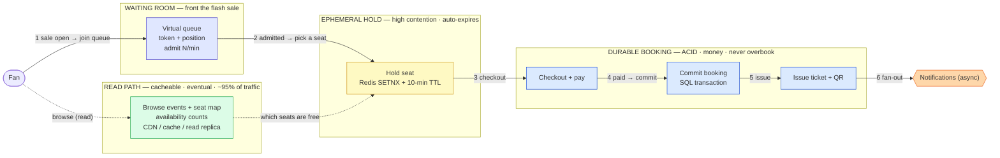
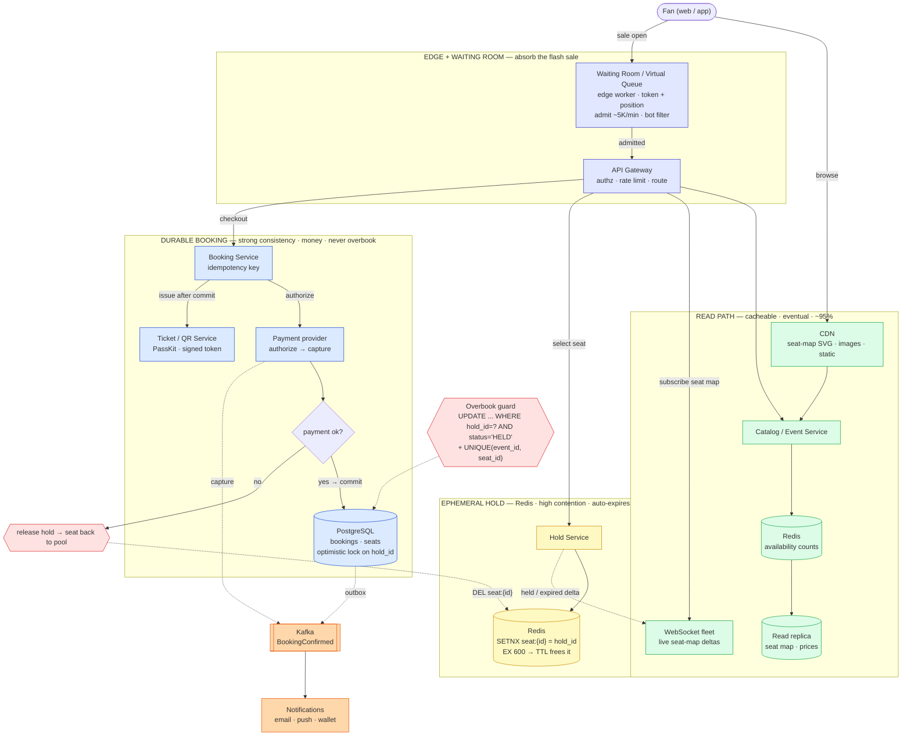

# Seat Reservation (Ticketmaster / BookMyShow) — Simple Component Diagram

> The bare-minimum mental model. A booking is a **two-tier** problem — an **ephemeral hold** (Redis + TTL, high contention, auto-expires) vs a **durable booking** (SQL/ACID, money, never overbook) — **fronted by a virtual waiting room** at sale-open, with a cacheable **read path** (browse events, seat-map availability) split from the strong-consistency **write path** (hold → pay → confirm → ticket).
> Everything else (bot mitigation, dynamic pricing, resale, multi-region, fraud) hangs off these boxes.

## The 7 components to remember

| Component | Job (one line) |
|---|---|
| **Waiting Room** | At sale-open 150K fans arrive at once; hand out position tokens and admit them in controlled batches so the inventory tier never sees the full herd. |
| **Seat-Map read service** | Serves event pages, the interactive seat map, and availability counts — read-heavy, cached hard, tolerates slightly stale data. |
| **Hold service (Redis TTL)** | Turns "I clicked seat 12B" into a 10-minute reservation via atomic `SETNX`; if the fan wanders off, the TTL expires and the seat returns to the pool with no cleanup job. |
| **Booking service (SQL/ACID)** | The durable, transactional commit that converts a valid hold into exactly one paid booking — the *only* place overbooking can truly be prevented. |
| **Payment** | Authorizes at checkout, captures on confirm; idempotency-keyed so a retry never double-charges. |
| **Ticket / QR service** | After commit, issues the ticket: a signed-token QR plus a wallet pass (PassKit / Google Wallet). |
| **Notifications** | Async fan-out of the confirmation (email / push / wallet update) so a spike is a queue, not a checkout meltdown. |

## The one idea that ties it together

**A hold and a booking are two different things, and the waiting room exists so the booking tier never melts.** The *hold* is ephemeral: an atomic `SETNX` in Redis with a 10-minute TTL, churning under heavy contention (everyone wants the front row), and losing one to a crash is harmless — the seat simply frees itself. The *booking* is durable: it is money, it lives in SQL, it must survive everything, and it is guarded so two fans can never win the same seat (`UPDATE ... WHERE hold_id = ?` plus `UNIQUE(event_id, seat_id)`). Wrapped around both is the read/write split: ~95% of traffic is browse and seat-map reads that tolerate stale data → CDN, cache, replicas; only hold → pay → confirm touches the source of truth. The **waiting room fronts the write path** because at 10:00:00 AM the *arrival* rate (150K) dwarfs the rate the booking tier can safely absorb — admit a trickle, queue the rest. Routing the full herd straight at the inventory database is exactly how Ticketmaster fell over in November 2022.

---

# Detailed Diagram — with Services & Protocols

> Same flow, now labeled with concrete service/technology picks and the protocols you'd name in a senior interview.
> Note: these are *defensible* picks, not the only valid ones (DynamoDB instead of Postgres at global scale; SQS/Kinesis instead of Kafka). Pick and defend — don't memorize as gospel.

## Service cheat-sheet (what maps to what)

| Concept | Service | One-line why |
|---|---|---|
| Absorb the sale-open herd | **Waiting Room (edge worker) + rate limiter** | 150K arrive at 10:00:00; admit ~5K/min, queue the rest, filter bots *before* inventory sees them ([rate-limiting](../rate-limiting/)) |
| Static seat map + assets | **CDN** | The seat-map SVG and images are the bulk of the bytes; cache at the edge, purge on a layout change |
| Availability counts + seat map | **Redis cache + read replica** | ~95% of traffic is reads that tolerate slight staleness — never hit the source of truth for a browse ([distributed-caching](../distributed-caching/)) |
| Live seat map (greys out as seats go) | **WebSocket fleet** | Push held/sold deltas so two fans rarely fight for the same seat ([communication-protocols](../communication-protocols/)) |
| Ephemeral hold | **Redis `SET seat:{id} hold_id NX EX 600`** | Atomic claim + 10-min TTL; abandonment self-heals and a crash just frees seats — durability is *not* wanted here |
| Durable booking | **PostgreSQL, optimistic lock on `hold_id`** | The money record; guarded `UPDATE` + `UNIQUE(event_id, seat_id)` is the only real overbook guard |
| Pay + confirm atomicity | **Payment provider + saga / idempotency key** | Authorize at checkout, capture on confirm; a retry returns the *same* booking, never a second charge ([distributed-transactions](../distributed-transactions/)) |
| Confirmed → fan-out | **Kafka + transactional outbox** | Commit the booking and emit `BookingConfirmed` atomically; everything downstream is async ([message-queues](../message-queues/)) |
| Ticket delivery | **Ticket/QR service, PassKit / Google Wallet** | Signed-token QR issued after commit; wallet passes push gate/time changes without a re-download |
| Confirmation + reminders | **Multi-channel notifications** | Email / push / wallet, off the hot path ([notification-system](../notification-system/)) |
| Single writer per hot event | **Leader per event / section shard** | One owner for a hot event avoids cross-node contention on the same seats ([consensus](../consensus/)) |

## Protocols worth naming

- **WebSocket** — the live seat map: the server pushes "seat 12B just went grey" to everyone viewing the same section; polling would be stale *and* hammer the read path ([communication-protocols](../communication-protocols/)).
- **Atomic `SETNX` hold** — `SET seat:{id} hold_id NX EX 600` does the whole hold in one round trip: claim-if-absent *plus* expiry, with no read-then-write race window.
- **Idempotency-Key on pay / confirm** — `POST /bookings` and the payment call carry a key; a retry after a client timeout returns the same booking and never double-charges.
- **PassKit / Google Wallet** — the issued ticket lives in the phone wallet; pushable updates (gate, start time, cancellation) reach the fan without a fresh download.
- **Signed-token QR (JWT / HMAC)** — the QR encodes a *signed* booking token, not a raw id, so a screenshot can't be forged and the gate scanner can verify it offline.
