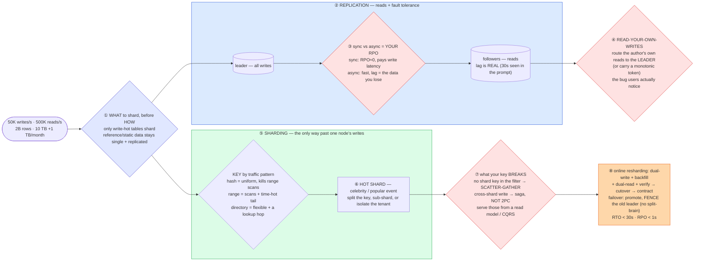

# Database Sharding & Replication — Mermaid Diagrams

> **Reference:** [questions.md](./questions.md) · [answers.md](./answers.md) · [deep-dive.md](./deep-dive.md) · use-case survey: [fundamentals/Use_Cases_for_Redundancy_and_Replication.md](../../fundamentals/Use_Cases_for_Redundancy_and_Replication.md)
>
> **Note on this file:** the per-question diagram set (Diagrams 1–N per [`docs/instructions.md` §2.1](../../docs/instructions.md)) is still to be authored for this topic. The **one-page master diagram** below — the artifact you revise from and reproduce on the whiteboard — is complete.
>
> **Cross-links (depth lives there, not here):** [consistent-hashing](../consistent-hashing/) (how keys map, and how little moves) · [scaling-reads](../../patterns/scaling-reads.md) / [scaling-writes](../../patterns/scaling-writes.md) · [distributed-transactions](../distributed-transactions/) (cross-shard atomicity) · [storage-engines](../storage-engines/) (what one node does) · [fundamentals/leader-and-follower.md](../../fundamentals/leader-and-follower.md) · [fundamentals/split-brain.md](../../fundamentals/split-brain.md) · [fundamentals/quorum.md](../../fundamentals/quorum.md)

---

## 🎯 The One-Page Master Diagram — THE ONE TO DRAW IN THE INTERVIEW (final consolidated design)

> **When to use:** final revision, 10 minutes before the interview — and the single diagram to reproduce on the whiteboard. If you can narrate it end-to-end and name the tradeoff at each **red** box, you're ready.
> Spec: [`docs/instructions.md` §2.1](../../docs/instructions.md) · AWS names: [`docs/AWS_SERVICE_MAP.md`](../../docs/AWS_SERVICE_MAP.md).
> ⚠️ AWS services are **defensible defaults**; every quota is an order-of-magnitude planning number to **verify against current docs**.

### The central split in one sentence

**Replication and sharding solve two different problems and are chosen independently: **replication** buys read scale and fault tolerance (and its sync-vs-async knob *is* your RPO), while **sharding** is the only way past a single node's write ceiling — so shard only the write-hot tables, choose the key by traffic pattern, and accept that the shard key you pick decides which queries become scatter-gather forever.**

### The 60-second narration

*(one line per numbered box ①–⑧)*

1. **Ask *what* to shard before *how*.** Not every table needs it — only write-hot ones. Reference and static data stays on a single replicated node, because sharding it buys nothing and costs you joins. Saying this first shows you're sizing the problem rather than reaching for the biggest hammer.
2. **Replication first, because it's the cheaper win:** one leader takes writes, followers serve reads and stand ready to be promoted.
3. **The first red box: sync versus async replication *is* your RPO.** Synchronous means an acknowledged write exists on a replica, so RPO ≈ 0 — paid for in write latency on every commit. Asynchronous is fast, and the replication lag is precisely the window of data you lose on failover. Choose **per route**: money and inventory paths sync, feeds and analytics async.
4. **The second red box is the bug users actually notice: read-your-own-writes.** A 30-second replica lag means someone updates their profile, reloads, and sees the old value — and concludes your product is broken. Route the *author's own* reads to the leader for a window, or carry a monotonic position token. Everyone else reads replicas.
5. **Sharding is the only way past a single node's write ceiling**, and the key is chosen by traffic pattern: **hash** for uniform user-centric access (kills range scans), **range** for chronological data (and creates a write-hot "today" tail), **directory** when the key space is irregular or reassignment is frequent (and adds a lookup hop plus its own availability problem).
6. **Every shard scheme has a hot shard** — the celebrity user, the popular event, the biggest tenant. Split the key, sub-shard that entity, or move it to its own isolated shard. Name the mitigation *before* the interviewer asks.
7. **The third red box: state what your shard key breaks, out loud.** Any query without the shard key in its filter becomes scatter-gather across every shard; any write spanning shards can no longer be one transaction, so it becomes a saga (see [distributed-transactions](../distributed-transactions/)) — never a blocking 2PC on the hot path. The escape hatch is a separate read model fed by CDC (CQRS) for the cross-shard queries.
8. **Then the two operations that make it real.** Online resharding: dual-write to old and new, backfill, dual-read and verify, cut over, contract — never a big-bang migration. Failover: promote the lowest-lag replica, redirect, and **fence the old leader** so it cannot accept a single further write, because two leaders is [split-brain](../../fundamentals/split-brain.md) and unmergeable divergence.

### The five numbers that justify the design

| Number | Derivation | Therefore |
|---|---|---|
| **50K writes/s on one CPU-bound node** | stated peak | The write ceiling is the *only* reason to shard; if writes fit on one node, replicate and stop |
| **500K reads/s** | stated peak | Read scale comes from replicas + cache, not from sharding — separating these two is the whole framing |
| **30 s observed replica lag** | stated symptom | Async replication's cost made concrete: it's both an RPO of 30 s *and* a read-your-own-writes bug |
| **RPO < 1 s, RTO < 30 s** | stated objectives | RPO drives sync-vs-async per route; RTO drives automated promotion + fencing, not a human runbook |
| **10 TB growing 1 TB/month** | stated growth | Sharding is a *when*, not an *if* — and it forces online resharding to be designed before you need it |

### The patterns this assembles

| Pattern | Where | The move |
|---|---|---|
| [Scaling Writes](../../patterns/scaling-writes.md) **●** | ⑤⑥ | Partition by a high-cardinality key; write-shard or isolate the hot entity |
| [Scaling Reads](../../patterns/scaling-reads.md) **●** | ②④ | Replicas + cache, with an explicit answer for read-your-own-writes |
| [Multi-Step Processes](../../patterns/multi-step-processes.md) **●** | ⑦ | Cross-shard writes become sagas with compensations; CDC feeds the read model |
| [Consistent hashing](../consistent-hashing/) **●** | ⑤⑧ | Keeps resharding to ~1/N of keys instead of nearly all of them |
| [ZooKeeper & coordination](../../patterns/zookeeper.md) ○ | ⑧ | Leader election + fencing tokens are what make failover safe rather than fast |

### The three things that break (and the mitigation)

| Failure | Blast radius | Mitigation | How you detect it |
|---|---|---|---|
| **Failover with async replication** | Writes inside the lag window are simply gone — and if the old leader comes back thinking it's still primary, you get divergent history that cannot be merged | Sync (or lowest-lag) replica for the money path, automated promotion, and **fence the old leader** (STONITH); reconcile with idempotency keys and a sweeper | Replication lag per replica (alert on the p99, not the mean); promotion events; rejected-writes-from-fenced-node counter |
| **A hot shard** | One shard saturates while others idle — and because the key is baked into the data layout, you cannot fix it by adding capacity | Sub-shard that key, split the entity across suffixes, or isolate the whale tenant on dedicated infrastructure | Per-shard QPS/CPU skew ratio; top-N keys by traffic; latency divergence between shards |
| **A query without the shard key** | Scatter-gather across every shard: p99 becomes the *slowest* shard, and it degrades as you add shards — growth makes it worse, which is deeply counter-intuitive | Serve those queries from a CDC-fed read model or search index; keep the sharded store for keyed access only | Fraction of queries that fan out; p99 by shard-count touched; slow-query log grouped by whether the key was present |

### The AWS-specific traps to name unprompted

| Trap | Why it bites here | What you say |
|---|---|---|
| **Aurora replica lag breaks read-your-own-writes** | Usually low but never zero **⚠️ verify** | *"Writer for the author's own reads (or a session token), replicas for everyone else — 'usually low' is not a guarantee."* |
| **Aurora Global Database is async cross-region** | Assumed to be strongly consistent | *"Fast promotion, but RPO is not zero across regions — so a global write path means single-region write ownership."* |
| **DynamoDB per-partition ceiling** (~1,000 WCU / ~3,000 RCU **⚠️ verify**) | Sharding is managed, hot keys are not | *"Adaptive capacity helps but doesn't remove the ceiling — a hot key needs a write-sharded suffix and scatter-gather on read."* |
| **Global Tables resolve conflicts last-writer-wins** | Silent write loss | *"Where loss is unacceptable I partition write ownership by region rather than relying on conflict resolution."* |
| **Aurora DSQL / distributed SQL** **⚠️ verify** | Newer, changing | *"Distributed SQL removes manual sharding at the cost of cross-region write latency — I'd verify current GA status and limits before designing on it."* |
| **RDS/Aurora failover is not instant** | RTO assumptions | *"Managed HA promotes in seconds-to-tens-of-seconds; I'd design the app to retry idempotently through a promotion rather than assume it's invisible."* |

### If you only remember one thing

> **Replication and sharding are independent decisions: replication buys reads and fault tolerance (and sync-vs-async *is* your RPO), sharding is the only way past one node's write ceiling — so shard only write-hot tables, and be explicit that your shard key permanently decides which queries become scatter-gather and which writes become sagas.**
