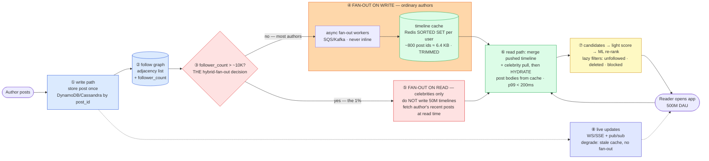

# Social Feed (Twitter / X home timeline) — Mermaid Diagrams

> **Reference:** [questions.md](./questions.md) · [answers.md](./answers.md) · [deep-dive.md](./deep-dive.md)
>
> **Note on this file:** the per-question diagram set (Diagrams 1–N per [`docs/instructions.md` §2.1](../../docs/instructions.md)) is still to be authored for this topic. The **one-page master diagram** below — the artifact you revise from and reproduce on the whiteboard — is complete.
>
> Cross-links: [distributed-caching](../distributed-caching/) (timeline cache) · [message-queues](../message-queues/) (fan-out workers) · [recommendation-system](../recommendation-system/) (ranking) · [kv-store](../kv-store/) (posts + graph) · [cdn-edge](../cdn-edge/) (media) · [chat-system](../chat-system/) (real-time push)

---

## 🎯 The One-Page Master Diagram — THE ONE TO DRAW IN THE INTERVIEW (final consolidated design)

> **When to use:** final revision, 10 minutes before the interview — and the single diagram to reproduce on the whiteboard. If you can narrate it end-to-end and name the tradeoff at each **red** box, you're ready.
> Spec: [`docs/instructions.md` §2.1](../../docs/instructions.md) · AWS names: [`docs/AWS_SERVICE_MAP.md`](../../docs/AWS_SERVICE_MAP.md).
> ⚠️ AWS services are **defensible defaults**; every quota is an order-of-magnitude planning number to **verify against current docs**.

### The central split in one sentence

**Reads outnumber writes ~1000:1, so you pay at *write* time by pre-computing each follower's timeline — except that a celebrity's single post would become 50M writes, so the answer is **hybrid fan-out**: push for ordinary users, pull-and-merge for the few accounts with enormous followings, with the timeline itself a bounded Redis sorted set rather than a query.**

### The 60-second narration

*(one line per numbered box ①–⑧)*

1. **The post itself is stored exactly once** — the timeline will only ever hold *ids*. Storing post bodies per follower would multiply storage by the follower count for no benefit.
2. **The follow graph is an adjacency list, and it carries a denormalized `follower_count`** — because that counter is what the very next decision reads.
3. **The red diamond is the entire answer to this question: is this author above the celebrity threshold (~10K followers, Twitter's documented heuristic)?** Everything else follows from that branch. Say the naive options first and why they fail: pure fan-out-on-read is ~200 shard queries per feed load at 500M DAU (the database melts), and pure fan-out-on-write makes one celebrity post 50M writes (a fan-out storm that takes minutes).
4. **Below the threshold: fan-out on write.** Async workers push the post id into each follower's timeline — a Redis sorted set scored by time, **trimmed to ~800 ids**. Bounded is the important word: a timeline is a cache of the recent past, not a complete history.
5. **Above the threshold: do not write those timelines at all.** Followers pull the celebrity's recent posts at read time. The asymmetry is deliberate — the expensive-to-write accounts are also the ones nearly everyone follows, so the pull is well-cached.
6. **The read path merges the pushed timeline with the celebrity pull, then hydrates** — ids to bodies from the post cache — inside a ~200 ms p99 budget. Hydration is a multi-get, never a join.
7. **Ranking is three stages** (candidate generation → cheap scoring → ML re-rank), and deletions/unfollows/blocks are applied as **lazy filters at read time** rather than eagerly rewriting millions of cached timelines. Eager deletion is the trap.
8. **Live updates ride a push channel**, and this system has an explicit degradation ladder: shed fan-out for low-priority accounts, serve a slightly stale timeline, batch notifications — a feed that is a few seconds behind is fine, a feed that 500-errors is not.

### The five numbers that justify the design

| Number | Derivation | Therefore |
|---|---|---|
| **Read:write ≈ 1000:1** | 500M DAU loading feeds vs 500M posts/day | Pay at write time. This single ratio is why pre-computation (fan-out on write) is the default at all |
| **~200 followees × 500M DAU** | naive fan-out-on-read | ~10¹¹ read ops/day just for timelines — the number that kills the naive design; quote it |
| **A mega-celebrity post = up to ~50M timeline writes** | >10M-follower accounts | The number that kills *pure* fan-out-on-write, and therefore forces the hybrid — the two numbers together are the whole design |
| **~800 post ids ≈ 6.4 KB per timeline** | 800 × 8 bytes | Makes a per-user cached timeline affordable at 500M users; bounded size is what keeps Redis memory finite |
| **p99 < 200 ms feed load** | stated SLA | Read path is merge + multi-get from cache only — no fan-out, no joins, no cross-shard scatter at read time |

### The patterns this assembles

| Pattern | Where | The move |
|---|---|---|
| [Scaling Reads](../../patterns/scaling-reads.md) **●** | ④⑥ | Precompute into a per-user cache — the far end of the read-scaling ladder, past caching a query result |
| [Scaling Writes](../../patterns/scaling-writes.md) **●** | ③④⑤ | Hybrid fan-out is a *write*-scaling decision; the celebrity branch exists purely to cap write amplification |
| [Multi-Step Processes](../../patterns/multi-step-processes.md) **●** | ④ | Queued fan-out workers with retries; a fan-out storm becomes a backlog, not an outage |
| [Real-Time Updates](../../patterns/realtime-updates.md) ○ | ⑧ | WS/SSE + pub/sub for live posts, with explicit degradation |
| [Large Blobs](../../patterns/large-blobs.md) ○ | media | Presigned upload to S3, served via CDN; the timeline stores a URL |

### The three things that break (and the mitigation)

| Failure | Blast radius | Mitigation | How you detect it |
|---|---|---|---|
| **A celebrity posts during peak** | Fan-out queue depth explodes; ordinary users' timelines go stale behind the storm | The hybrid threshold means it is never fanned out at all; plus a circuit breaker that sheds low-priority fan-out and prioritizes active users | Fan-out queue depth and lag by priority class; timeline staleness p99; breaker state |
| **Timeline cache is cold or evicted** | A returning user sees an empty feed — indistinguishable from "the product is broken" | Rebuild on demand from the follow graph + recent posts (bounded), and treat the cache as *reconstructible* rather than authoritative | Cache-miss rate on feed load; rebuild latency p99; empty-feed served counter |
| **Delete / unfollow / block after fan-out** | The post id sits in millions of cached timelines; eager cleanup is a second fan-out storm | **Lazy filter at read time** — check tombstones and the current graph during hydration; the timeline is allowed to contain ids that are no longer renderable | Filtered-at-read ratio (a rising ratio means the cache is drifting); reports of deleted content still visible |

### The AWS-specific traps to name unprompted

| Trap | Why it bites here | What you say |
|---|---|---|
| **ElastiCache cluster-mode resharding** | Timelines are the whole product's working set | *"Cluster-aware client, and pre-scale before a known event — slot migration during peak causes `MOVED` storms and latency spikes."* |
| **DynamoDB hot partition** (~1,000 WCU **⚠️ verify**) | A celebrity's author-id partition | *"Posts keyed by `post_id` spread naturally; it's the *graph* reads that concentrate, so the follower list is paginated and cached."* |
| **Kinesis per-shard head-of-line blocking** | Fan-out events behind one slow record | *"SQS if I want per-message retry isolation for fan-out jobs; Kinesis/MSK only where I need ordered replay."* |
| **DynamoDB Streams as the outbox** | Post → fan-out must not dual-write | *"Streams gives me a log-based outbox for free — the post write *is* the fan-out trigger."* |
| **CloudFront invalidation is slow** | Deleted media | *"Versioned immutable media keys plus signed URLs; revocation is at the signing layer, not by invalidating the edge."* |
| **No exactly-once** | Duplicate fan-out | *"Sorted-set insertion is idempotent by construction — same member, same score — so a retried fan-out job is harmless. That's a design choice, not luck."* |

### If you only remember one thing

> **Two numbers decide everything: reads beat writes ~1000:1 (so pre-compute timelines at write time) and a mega-celebrity post would be ~50M writes (so don't). Hybrid fan-out — push for the many, pull-and-merge for the few — with a bounded sorted-set timeline of ids, hydration from cache, and deletions handled as lazy read-time filters.**
