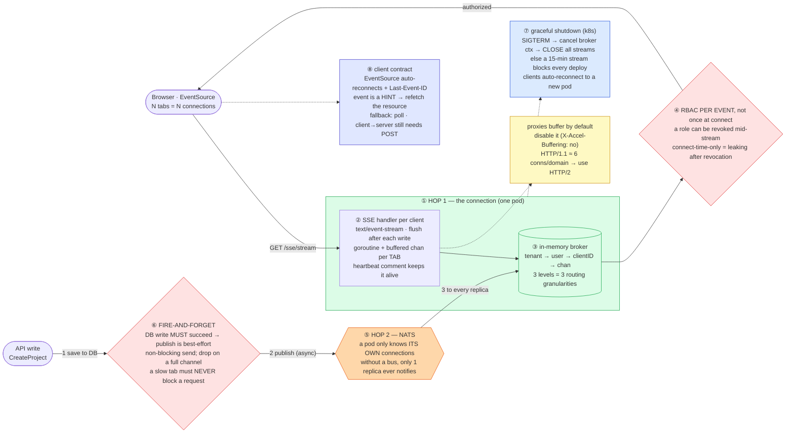

# Server-Sent Events (SSE) — Mermaid Diagrams

> **Reference:** [sse-deep-dive-qa.md](./sse-deep-dive-qa.md) (Q1–Q10, with Go implementation) · [golang-react-sse-technical-background.md](./golang-react-sse-technical-background.md)
>
> **Note on this file:** this folder is a **production-experience deep dive** rather than a standard `interviews/<topic>/` folder (it has no `questions.md` / `answers.md` / `deep-dive.md`), so it has no numbered diagram set. The **one-page master diagram** below is the revision artifact — the whole architecture on one screen, keyed to the Q&A.
>
> **Cross-links (depth lives there, not here):** [communication-protocols](../communication-protocols/) (WS vs SSE vs poll, the decision that precedes this) · [realtime-updates pattern](../../patterns/realtime-updates.md) (hop 1 vs hop 2) · [chat-system](../chat-system/) (the same hop-2 problem at scale) · [message-queues](../message-queues/) (the bus underneath) · [notification-system](../notification-system/) (when a push must be durable instead)

---

## 🎯 The One-Page Master Diagram — THE ONE TO DRAW IN THE INTERVIEW (final consolidated design)

> **When to use:** final revision, 10 minutes before the interview — and the single diagram to reproduce on the whiteboard when asked "walk me through the real-time system you built." If you can narrate it end-to-end and name the tradeoff at each **red** box, you're ready.
> Spec: [`docs/instructions.md` §2.1](../../docs/instructions.md) · AWS names: [`docs/AWS_SERVICE_MAP.md`](../../docs/AWS_SERVICE_MAP.md).
> ⚠️ AWS services are **defensible defaults**; every quota is an order-of-magnitude planning number to **verify against current docs**.

### The central split in one sentence

**SSE gives you server→client push over one ordinary HTTP response with auto-reconnect for free — but a pod only holds *its own* connections, so the real architecture is **hop 1** (the `text/event-stream` response plus a goroutine and a channel per tab) versus **hop 2** (a bus like NATS that gets an event to whichever pod holds the target's socket) — and the two decisions that make it production-grade are checking authorization **per event** rather than once at connect, and treating delivery as **fire-and-forget** so a slow browser can never block a database write.**

### The 60-second narration

*(one line per numbered box ①–⑧)*

1. **Hop 1 is one long-lived HTTP response, and that's the whole appeal of SSE:** no upgrade handshake, no new protocol — `Content-Type: text/event-stream` on an ordinary GET, and the browser's built-in `EventSource` gives you **auto-reconnect and `Last-Event-ID` resume for free**, which you'd have to hand-write on a WebSocket.
2. **Each connected tab gets a goroutine and a buffered channel**, and the handler flushes after every write (without an explicit flush the response sits in a buffer and the client sees nothing). A periodic heartbeat comment keeps intermediaries from timing the connection out.
3. **The broker is a directory of who is currently connected, nested three deep — `tenant → user → clientID → channel`** — because those are exactly the three granularities you need to route at: broadcast to a whole tenant, notify one user across their devices, or target a single tab.
4. **The first red box is the security decision that separates a real implementation from a demo: check authorization *per event*, not once at connection time.** A stream can live for minutes; a role can be revoked inside that window. Authorizing only at connect means a user keeps receiving data after their access was removed — and that's a leak, not a latency bug.
5. **Hop 2 is the part people miss entirely.** A pod's in-memory broker only knows the connections *it* holds, so with several replicas behind a load balancer, an event published on pod A reaches nobody on pod B. NATS (or any pub/sub bus) fans the event to *every* replica, and each replica delivers to whichever of its own connections match.
6. **The second red box is the reliability decision: fire-and-forget.** The database write must succeed and is what the API response reflects; publishing the event is explicitly best-effort, done asynchronously, with a non-blocking send that **drops** if a tab's channel is full. A slow or stalled browser must never be able to slow down or fail someone's write — and the fallback is benign, because the client refetches on the next heartbeat or refresh.
7. **Graceful shutdown is where SSE fights Kubernetes.** On `SIGTERM`, waiting for connections to drain naturally means a long-lived stream can hold the pod alive for its full lifetime and block every deploy. So the broker's context is cancelled, all streams are actively closed, and clients — thanks to `EventSource` — simply auto-reconnect onto a new pod.
8. **Two client-contract points worth volunteering:** treat an event as a **hint** ("something changed, refetch it") rather than as the authoritative payload, which makes a dropped event harmless; and remember SSE is **one-way** — client→server still goes over normal POSTs, which is precisely the tradeoff versus WebSocket. Also name the two classic infrastructure gotchas: reverse proxies buffer responses by default (disable it, e.g. `X-Accel-Buffering: no`), and HTTP/1.1's ~6-connections-per-domain limit means several tabs can starve each other unless you're on HTTP/2.

### The five numbers that justify the design

| Number | Derivation | Therefore |
|---|---|---|
| **N tabs = N connections per user** | one `EventSource` per tab | The broker needs a third level (`clientID`), and per-user connection counts are multiples — capacity planning is per *tab*, not per user |
| **~6 connections per domain on HTTP/1.1** | browser limit | A handful of tabs can exhaust the budget and starve ordinary API calls — the concrete argument for HTTP/2 |
| **Stream lifetime up to ~15 min** | max connection lifetime in this design | Directly forces active close on `SIGTERM`; otherwise this is your worst-case deploy delay per pod |
| **1 replica of N sees a locally-published event** | in-memory broker scope | The arithmetic that proves hop 2 (NATS) is mandatory, not an optimization |
| **Publish latency is off the request path** | fire-and-forget, async goroutine | The API's p99 is unaffected by how many tabs are connected or how slow they are |

### The patterns this assembles

| Pattern | Where | The move |
|---|---|---|
| [Real-Time Updates](../../patterns/realtime-updates.md) **●** | ①⑤ | Hop 1 (the stream) vs hop 2 (reach the node holding it) — this folder is a worked example of exactly that split |
| [Long-Running Tasks](../../patterns/long-running-tasks.md) **●** | ⑥ | Respond to the caller, do the notification asynchronously; a failed publish never fails the request |
| [Multi-Step Processes](../../patterns/multi-step-processes.md) ○ | ⑥ | The honest gap: fire-and-forget is *not* durable — if delivery must be guaranteed, this needs an outbox, per [message-queues](../message-queues/) |
| [Scaling Reads](../../patterns/scaling-reads.md) ○ | ⑧ | Event-as-hint means the refetch hits your normal cached read path rather than fattening the stream |
| [Dealing with Contention](../../patterns/dealing-with-contention.md) ○ | ③ | Concurrent map access from many goroutines needs a lock or sharded maps — a real correctness detail in Go |

### The three things that break (and the mitigation)

| Failure | Blast radius | Mitigation | How you detect it |
|---|---|---|---|
| **A slow or dead browser tab** | Its channel fills; a blocking send would stall the publishing goroutine and, in the worst arrangement, the API request behind it | Buffered channel + **non-blocking send that drops** on full, plus a write deadline and connection reaping; the client's next refetch repairs state | Dropped-event counter per tenant/tab; channel-full occurrences; connection age distribution |
| **A pod dies or is rolled** | Every stream it held disconnects at once; if all clients reconnect immediately you get a reconnect stampede onto the survivors | `EventSource` reconnects automatically — add jittered backoff and stagger it; active close on `SIGTERM` so the disconnect is clean rather than a timeout | Reconnect rate spike; connection-count cliff per pod; time-to-resteady after a deploy |
| **Permissions revoked mid-stream** | The user keeps receiving events they are no longer entitled to — a silent authorization leak that no error surfaces | Evaluate RBAC **per event** against current state (cache the decision briefly if needed), and close the stream on session/role invalidation | Events-denied-at-delivery counter; audit trail of deliveries after a revocation timestamp |

### The AWS-specific traps to name unprompted

| Trap | Why it bites here | What you say |
|---|---|---|
| **ALB / API Gateway idle timeouts** **⚠️ verify** | A stream idle longer than the timeout is cut | *"Heartbeat comments below the idle timeout keep the stream alive; I'd confirm the current default and set it explicitly rather than relying on it."* |
| **Buffering proxies break SSE** | Nothing arrives until the buffer flushes | *"Disable response buffering at every hop (`X-Accel-Buffering: no` on nginx) — the symptom is 'it works locally, nothing streams in staging'."* |
| **SSE on ALB vs WebSocket on NLB** | Different fit | *"SSE is plain HTTP so an ALB is fine; if I needed duplex I'd move to WebSocket, and at very high socket counts to NLB — see [communication-protocols](../communication-protocols/)."* |
| **API Gateway WebSocket is per-message priced; SSE isn't the same product** | Cost comparison | *"One reason SSE is attractive here: it's an ordinary HTTP response through my existing ALB, with no per-message pricing model."* |
| **ElastiCache pub/sub vs SNS vs MSK as hop 2** | NATS isn't an AWS service | *"NATS is self-managed; the AWS-native equivalents are ElastiCache Redis pub/sub (cheap, at-most-once), SNS fan-out to each replica, or MSK if I need replay — the tradeoff is durability versus simplicity."* |
| **Fire-and-forget is not durable delivery** | The honest boundary | *"If an event must not be missed, best-effort pub/sub is the wrong mechanism — that needs an outbox plus a durable queue, which is a different design."* |

### If you only remember one thing

> **SSE is one HTTP response with auto-reconnect for free, but a pod only holds its own connections — so the architecture is hop 1 (stream + goroutine + channel per tab) plus hop 2 (a bus that reaches whichever replica holds the socket), with authorization checked **per event** and delivery treated as fire-and-forget so a slow tab can never block a write.**
