# Storage Engines (LSM-Tree vs B-Tree) — Mermaid Diagrams

> **Reference:** [questions.md](./questions.md) · [answers.md](./answers.md) · [deep-dive.md](./deep-dive.md)
>
> **Note on this file:** the per-question diagram set (Diagrams 1–N per [`docs/instructions.md` §2.1](../../docs/instructions.md)) is still to be authored for this topic. The **one-page master diagram** below — the artifact you revise from and reproduce on the whiteboard — is complete.
>
> **Cross-links (depth lives there, not here):** [fundamentals/write-ahead-log.md](../../fundamentals/write-ahead-log.md) · [segmented-log](../../fundamentals/segmented-log.md) · [bloom-filters](../../fundamentals/bloom-filters.md) · [checksum](../../fundamentals/checksum.md) · consumers: [kv-store](../kv-store/) (LSM under a Dynamo-style store), [sharding-replication](../sharding-replication/) (what one shard runs), [distributed-caching](../distributed-caching/) (the tier above it)

---

## 🎯 The One-Page Master Diagram — THE ONE TO DRAW IN THE INTERVIEW (final consolidated design)

> **When to use:** final revision, 10 minutes before the interview — and the single diagram to reproduce on the whiteboard. If you can narrate it end-to-end and name the tradeoff at each **red** box, you're ready.
> Spec: [`docs/instructions.md` §2.1](../../docs/instructions.md) · AWS names: [`docs/AWS_SERVICE_MAP.md`](../../docs/AWS_SERVICE_MAP.md).
> ⚠️ AWS services are **defensible defaults**; every quota is an order-of-magnitude planning number to **verify against current docs**.

### The central split in one sentence

**Start from physics, not product names: sequential I/O is far cheaper than random I/O, so a **B-tree** updates pages in place (read-optimized, space-tight, every write is a random-ish page write) while an **LSM-tree** appends and merges later (write-optimized, but a read may consult many files and space temporarily balloons) — and the RUM conjecture says you optimize two of Read/Update/Memory and pay in the third, so the choice is a consequence of the workload, not taste.**

```mermaid
flowchart LR
    OPS(["PUT · GET · SCAN<br/>ack only when durable"])

    PHYS{"① PHYSICS FIRST<br/>random I/O ≫ sequential I/O in cost<br/>every engine = a strategy to turn the<br/>workload into SEQUENTIAL I/O"}

    RUM{"② THE RUM CONJECTURE (2016)<br/>Read / Update / Memory-space:<br/>optimize TWO, pay in the THIRD<br/>everything below is a lever on one axis"}

    subgraph BTREE["③ B-TREE — read-optimized, in-place"]
        direction TB
        BT["sorted pages, high fanout → height ~3-4<br/>one bounded descent per read<br/>range scans are natural"]
        BTW["cost: small change rewrites a WHOLE page<br/>page splits · fill factor<br/>torn-page defence: full_page_writes / doublewrite"]
        BT --> BTW
    end

    subgraph LSM["④ LSM-TREE — write-optimized, append + merge"]
        direction TB
        W["WAL append + memtable insert → ACK<br/>(sorted skip list → ordered flush)"]
        SS["flush → immutable SSTable<br/>data + sparse index + BLOOM filter"]
        R["read: memtable → SSTables NEWEST-first<br/>Bloom skips files that cannot hold the key"]
        W --> SS --> R
    end

    COMPACT{"⑤ COMPACTION is the whole tradeoff<br/>size-tiered: low write-amp, high read/space-amp<br/>leveled: low read/space-amp, high write-amp<br/>without it, reads AND space explode"}

    DUR{"⑥ DURABILITY: 'in memory' ≠ 'on stable storage'<br/>fsync is the boundary; group commit amortizes it<br/>recovery: LSM replays WAL into a fresh memtable;<br/>B-tree redoes/undoes from a checkpoint"}

    TOMB["⑦ tombstones: a delete is a WRITE<br/>retained for gc_grace or deleted data RESURRECTS<br/>+ scan cost until compaction drops them"]
    STALL["⑧ the operational sharp edges<br/>compaction behind → L0 piles up → WRITE STALL<br/>write-amp = SSD wear = a capacity line item"]

    OPS --> PHYS --> RUM
    RUM --> BT
    RUM --> W
    R --> COMPACT
    BTW --> DUR
    COMPACT --> DUR
    DUR --> TOMB --> STALL

    style BTREE fill:#dbeafe,stroke:#1d4ed8
    style LSM fill:#dcfce7,stroke:#16a34a
    style TOMB fill:#fed7aa,stroke:#ea580c
    style STALL fill:#fed7aa,stroke:#ea580c
    style PHYS fill:#e0e7ff,stroke:#4338ca
    style RUM fill:#fee2e2,stroke:#dc2626
    style COMPACT fill:#fee2e2,stroke:#dc2626
    style DUR fill:#fee2e2,stroke:#dc2626
```

### The 60-second narration

*(one line per numbered box ①–⑧)*

1. **Open with physics, not a product name.** Disk — even SSD — is orders of magnitude slower than RAM, and *sequential* I/O is far cheaper than *random*. Every storage engine is a strategy for converting the workload's access pattern into as much sequential I/O as possible while keeping enough index in memory to find things fast. That framing makes B-tree-vs-LSM a consequence of the workload rather than a preference.
2. **The first red box names the fundamental tension: the RUM conjecture** (Athanassoulis et al., 2016). You can optimize for **R**eads, **U**pdates, or **M**emory/space — improving two typically worsens the third. Every knob below (Bloom filters, compaction strategy, block cache) is a lever on one of those three axes, which is why there is no universally best engine.
3. **B-tree: sorted pages with high fanout**, so height is about 3–4 levels and a read is one bounded descent — and range scans are natural because the leaves are ordered. The cost is on writes: changing one row rewrites a whole page, pages split as they fill (a 100% fill factor under inserts means constant splitting), and a partially-written page is corruption, so you need WAL-based torn-page protection (Postgres `full_page_writes`, InnoDB's doublewrite buffer).
4. **LSM: append to a WAL, insert into an in-memory sorted structure, and ack** — that's why writes are fast, and why the memtable is sorted (so the flush is ordered and range scans still work). Flushing produces an **immutable** SSTable carrying its own sparse index and Bloom filter. A read checks the memtable, then SSTables newest-first, with the Bloom filter skipping any file that definitely cannot contain the key.
5. **The second red box: compaction *is* the tradeoff, not an implementation detail.** Size-tiered compaction gives low write amplification at the cost of read and space amplification; leveled compaction inverts it. Without compaction, reads degrade (more files to probe) and space grows unbounded — so the compaction strategy is where you spend your RUM budget.
6. **The third red box separates two things candidates blur: "the write is in memory" versus "the write is on stable storage."** `fsync` is that boundary, and group commit amortizes its cost across concurrent transactions. Then state recovery per engine: an LSM replays the WAL into a fresh memtable; a B-tree redoes and undoes from its last checkpoint.
7. **A delete is a write.** Tombstones must be retained for a grace period (Cassandra's `gc_grace`) or deleted data can *resurrect* when a stale replica gossips it back — and until compaction drops them, tombstones make scans slower, which is the classic "why did my range query get slow after a mass delete."
8. **Close on the operational sharp edges before you're asked:** if compaction falls behind, L0 files pile up and the engine throttles or blocks writes — a **write stall**, which looks like an outage. And write amplification multiplies SSD wear, so it's a hardware capacity line item, not just a performance number.

### The five numbers that justify the design

| Number | Derivation | Therefore |
|---|---|---|
| **B-tree height ~3–4** | high fanout over a large key count | A point read is a small bounded number of I/Os, and the upper levels stay cached — this is why B-trees win reads |
| **LSM write path = 1 sequential append + 1 memory insert** | WAL + memtable | The write cost is independent of data size, which is the entire write-throughput argument |
| **Bloom filter ~10 bits/element ≈ 1% false positive** | standard sizing | Turns "probe every SSTable" into "probe one or two"; no false negatives, so a "no" is authoritative |
| **Read amplification worst case = every overlapping SSTable** | non-existent key without Bloom filters | The number that justifies Bloom filters existing at all |
| **Write amplification: STCS low / LCS high** | compaction strategy | Directly sets SSD wear and background I/O — the same data written many times over its lifetime |

### The patterns this assembles

| Pattern | Where | The move |
|---|---|---|
| [Scaling Writes](../../patterns/scaling-writes.md) **●** | ④⑤ | Convert random writes into sequential appends; defer the merge cost to background compaction |
| [Scaling Reads](../../patterns/scaling-reads.md) **●** | ③④ | Bloom filters + sparse indexes + block cache are all read-path shortcuts around disk |
| [Dealing with Contention](../../patterns/dealing-with-contention.md) ○ | ⑥ | MVCC/snapshot reads so a reader never sees a half-written state and never blocks a writer |
| [fundamentals/write-ahead-log.md](../../fundamentals/write-ahead-log.md) **●** | ④⑥ | Durability is the WAL; the rest of the engine is an optimization over it |
| [fundamentals/bloom-filters.md](../../fundamentals/bloom-filters.md) **●** | ④ | The one-way error property (no false negatives) is what makes skipping safe |

### The three things that break (and the mitigation)

| Failure | Blast radius | Mitigation | How you detect it |
|---|---|---|---|
| **Compaction falls behind** | L0 file count grows, reads get slower, then the engine throttles or blocks writes entirely — an incident that looks like a total outage but is really background debt | Provision compaction throughput as a first-class resource, pick the strategy to match the workload (TWCS for time-series), and rate-limit ingest before the engine does it for you | L0/pending-compaction backlog; write-stall duration counter; read amplification trend |
| **Mass delete then range scans** | Tombstones must be scanned and skipped, so queries over that range slow dramatically — and dropping them early risks data resurrection | Respect `gc_grace` (it exists so a stale replica can't resurrect deleted rows), prefer TTL/partition-drop over row-by-row deletes, and compact deliberately after a bulk delete | Tombstone-per-read ratio; scan latency for ranges with heavy deletes; resurrection reports (rare and severe) |
| **Crash before fsync** | Everything acked-but-unflushed is gone — and if you acked before the WAL was durable, you broke the durability promise, which is unrecoverable trust-wise | Ack only after the WAL is on stable storage; use group commit to make that affordable; verify with checksums on recovery and page-level torn-write protection | fsync latency p99; group-commit batch size; checksum/corruption counters on startup recovery |

### The AWS-specific traps to name unprompted

| Trap | Why it bites here | What you say |
|---|---|---|
| **EBS gp3 vs instance-store NVMe** | The engine's I/O profile decides | *"LSM compaction is I/O-hungry: instance-store NVMe gives the lowest latency and highest IOPS but is ephemeral, so it's only safe when replication provides durability. EBS gp3 when I need the volume to survive the instance."* |
| **fsync on network-attached storage** | Durability semantics change | *"An `fsync` to EBS is a network round-trip, so group commit matters more than on local NVMe — and I'd measure it rather than assume local-disk numbers."* |
| **Aurora doesn't have a classic B-tree WAL story** | Managed engines differ | *"Aurora pushes the log to a distributed storage layer rather than writing pages from the instance — so 'tune `full_page_writes`' advice doesn't transfer. Verify before quoting."* |
| **DynamoDB/Keyspaces are LSM underneath** | Explains their behaviour | *"That's *why* they're write-friendly and why deletes cost you — tombstones and compaction are the reason a mass delete isn't free."* |
| **SSD write amplification is a cost line** | Not just a perf metric | *"Write amp multiplies device wear; on provisioned IOPS it's literally a bill, so compaction strategy is a cost decision."* |
| **Timestream / TWCS for time-series** | Wrong compaction = wrong system | *"Time-windowed compaction (or a purpose-built time-series store) so old windows are dropped whole instead of merged forever."* |

### If you only remember one thing

> **B-trees update in place (read-optimized, write-amplifying); LSMs append and merge later (write-optimized, read/space-amplifying) — and the RUM conjecture says you always pay on the third axis. Durability is the WAL plus `fsync`, compaction is where the real operational risk lives, and a delete is a write.**
