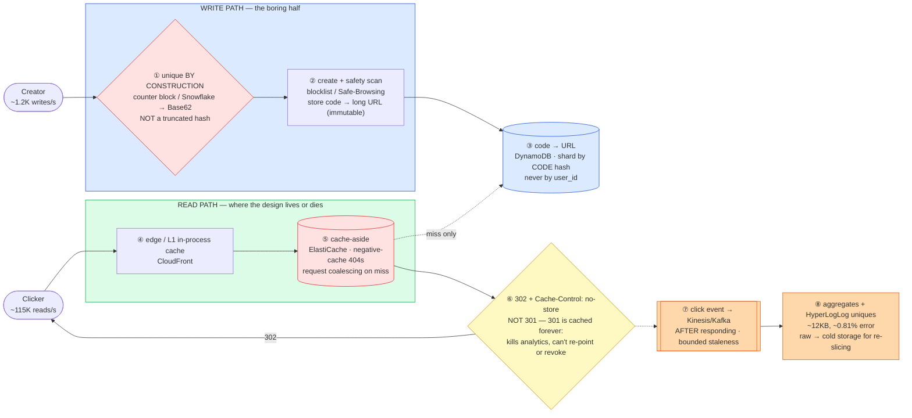

# URL Shortener (Bitly / TinyURL) — Mermaid Diagrams

> **Reference:** [questions.md](./questions.md) · [answers.md](./answers.md) · [deep-dive.md](./deep-dive.md)
>
> **Note on this file:** the per-question diagram set (Diagrams 1–N per [`docs/instructions.md` §2.1](../../docs/instructions.md)) is still to be authored for this topic. The **one-page master diagram** below — the artifact you revise from and reproduce on the whiteboard — is complete.
>
> Cross-links: [distributed-caching](../distributed-caching/) (the redirect path) · [cdn-edge](../cdn-edge/)  · [consistent-hashing](../consistent-hashing/) (sharding) · [message-queues](../message-queues/) (async clicks) · [rate-limiting](../rate-limiting/) (enumeration defence) · [kv-store](../kv-store/)

---

## 🎯 The One-Page Master Diagram — THE ONE TO DRAW IN THE INTERVIEW (final consolidated design)

> **When to use:** final revision, 10 minutes before the interview — and the single diagram to reproduce on the whiteboard. If you can narrate it end-to-end and name the tradeoff at each **red** box, you're ready.
> Spec: [`docs/instructions.md` §2.1](../../docs/instructions.md) · AWS names: [`docs/AWS_SERVICE_MAP.md`](../../docs/AWS_SERVICE_MAP.md).
> ⚠️ AWS services are **defensible defaults**; every quota is an order-of-magnitude planning number to **verify against current docs**.

### The central split in one sentence

**The write path is boring and the read path is the entire design: at 100:1 reads with a sub-10 ms p99, a redirect must never touch the database, the short code must be unique *by construction* (ID → Base62, never a truncated hash), and click analytics must be emitted asynchronously — because counting a click synchronously puts your analytics pipeline on the critical path of every redirect.**

### The 60-second narration

*(one line per numbered box ①–⑧)*

1. **The first red box is the one candidates get wrong: generate the code from a unique *id*, not from a hash of the URL.** A counter block or Snowflake id encoded to Base62 is unique **by construction** — no collision check, no read-before-write. Truncating MD5/SHA feels clever and is a trap: by the birthday bound you hit a 50% collision probability at roughly 2.2M URLs for a 7-character code, and a collision here sends a user to *someone else's page*, which is worse than a 404.
2. **Creation also does safety work** — blocklist/Safe-Browsing at create time plus continuous re-scan — and the mapping is then immutable.
3. **Storage is a plain key-value point lookup, sharded by a hash of the code.** Not by `user_id`: that turns every redirect into a scatter-gather and makes a whale account a hotspot.
4. **The read path starts at the edge** — a CDN and an in-process L1 cache — because the cheapest redirect is the one that never reaches your service.
5. **The second red box is cache-aside with two details that matter:** negative-cache the 404s (or an enumeration scan becomes a database DoS), and coalesce concurrent misses on the same key (or one viral link stampedes the shard).
6. **Return 302, not 301, and pair it with `Cache-Control: no-store`.** A 301 is cached by browsers effectively forever: you lose every subsequent click from analytics *and* you can never re-point or revoke that link. Choosing 302 is what keeps revocation possible for a malware link.
7. **Emit the click event *after* responding**, onto a stream. The redirect's p99 must not include your analytics pipeline; consumer lag becomes bounded staleness rather than an outage.
8. **Aggregate downstream** — counters plus HyperLogLog for unique visitors (~12 KB fixed, ~0.81% error, versus an unbounded set of IPs) — and keep raw events in cheap cold storage so you can re-slice later.

### The five numbers that justify the design

| Number | Derivation | Therefore |
|---|---|---|
| **~115K reads/s vs ~1.2K writes/s (100:1)** | stated ratio at target scale | The redirect path defines the architecture; the write path is an afterthought. Cache-first, DB on miss only |
| **62⁷ ≈ 3.52 trillion codes** | Base62, 7 characters | A sparse namespace (~5% density) is what makes enumeration expensive — and it's why 7 characters is the sweet spot |
| **50% collision probability at ~2.2M URLs** | birthday bound, P ≈ 1 − e^(−k²/2N) | Kills the hash-truncation approach outright. Quote this number — it's the highest-signal arithmetic in the topic |
| **< 10 ms p99 redirect** | stated SLO | No database, no synchronous analytics, no cross-region hop on the hot path |
| **Redis down = 115K/s onto a DB sized for ~2K/s** | 0% hit rate × read rate | The cache is *load-bearing*, not an optimization — so it needs HA, a circuit breaker, and request coalescing |

### The patterns this assembles

| Pattern | Where | The move |
|---|---|---|
| [Scaling Reads](../../patterns/scaling-reads.md) **●** | ④⑤ | The full ladder: L1 in-process → distributed cache → CDN edge; the DB is the last resort |
| [Scaling Writes](../../patterns/scaling-writes.md) ○ | ① | Counter *blocks* handed to servers so id minting is local and survives the counter service being down |
| [Long-Running Tasks](../../patterns/long-running-tasks.md) ○ | ⑦⑧ | Respond first, process later; the analytics pipeline gets its own SLO (e.g. < 5 min) |
| [Dealing with Contention](../../patterns/dealing-with-contention.md) ○ | ① custom alias | A user-chosen alias *is* contended — that one needs a conditional write (rung 1) |
| [Consistent hashing](../consistent-hashing/) ○ | ③ | Worth it when shard count changes: moves ~1/N keys instead of modulo's ~(N−1)/N |

### The three things that break (and the mitigation)

| Failure | Blast radius | Mitigation | How you detect it |
|---|---|---|---|
| **The cache tier goes down** | Hit rate → 0, so ~115K/s lands on a database provisioned for ~2K/s → saturation → full outage | HA cache (multi-AZ, replicas), an in-process L1 as a second line, request coalescing, a circuit breaker that serves a graceful error rather than melting the DB | Cache hit ratio (alert on a *drop*, not just on errors); DB QPS vs provisioned; redirect p99 |
| **One viral link = one hot key** | A single shard/key saturates while the rest idle; resharding does *not* help because it's one key | L1 in-process cache (absorbs most of it), key fan-out to replicas, and push it to the CDN edge — hot-key problems are solved by *replication*, not partitioning | Per-key QPS distribution; single-shard CPU vs fleet; edge hit ratio for that path |
| **Enumeration scan** | A bot walks the code space, generating a flood of misses that each cost a DB read, and harvests live links | Non-sequential codes, sparse namespace, **negative caching**, and per-IP 404 rate limits. Say the honest limit: this is abuse mitigation, *not* an access-control system — a short link is a bearer token | 404 rate per IP/ASN; miss-ratio spike with low unique-code overlap; negative-cache hit ratio |

### The AWS-specific traps to name unprompted

| Trap | Why it bites here | What you say |
|---|---|---|
| **DynamoDB per-partition ceiling** (~3,000 RCU **⚠️ verify**) | A viral code is one partition key | *"Adaptive capacity helps but doesn't remove the ceiling — the fix for a hot *read* key is caching and replication, not write-sharding."* |
| **CloudFront caching a 301** | Revocation becomes impossible | *"302 plus `no-store` — and revocation is why. A cached 301 for a malware link is unrecallable."* |
| **CloudFront invalidation is slow / rate-limited** | Tempting as a revocation tool | *"I don't design around invalidation; short TTLs on the redirect response and revocation checked at the origin."* |
| **Kinesis per-shard limits + head-of-line blocking** | The click firehose | *"Partition by code hash; a poison record gets a side-channel DLQ so one shard's consumer can't stall the pipeline."* |
| **DynamoDB TTL is not a scheduler** (~48 h **⚠️ verify**) | Link expiry looks like a TTL job | *"TTL is eventual cleanup; expiry is enforced at *read* time by checking `expires_at`, otherwise an expired link keeps working for up to two days."* |
| **Global Tables are LWW** | Multi-region uniqueness | *"Region-partitioned id ranges so codes are globally unique by construction — I never rely on conflict resolution for uniqueness."* |

### If you only remember one thing

> **Make the code unique by construction (id → Base62, never a truncated hash — 50% collisions by ~2.2M URLs), serve every redirect from cache/edge with a 302 so links stay revocable and countable, and emit the click asynchronously — the write path is trivial, the read path is the product.**
