# Video Streaming (Netflix / YouTube) — Mermaid Diagrams

> Interview-ready diagrams. Start with Diagram 1 — the **write-path vs read-path** split is the mental model everything else hangs off. Then drill into the layer the interviewer probes.
>
> Reference: [answers.md](./answers.md) | [conducive-sentences.md](./conducive-sentences.md)
>
> Cross-links: [file-storage](../file-storage/) · [message-queues](../message-queues/) · [api-design](../api-design/) · [sharding-replication](../sharding-replication/) · [distributed-caching](../distributed-caching/)

---

## Diagram 1 — End-to-End Architecture: Write Path vs Read Path (Start Here)

> **When to use:** The very first thing to draw for "design a video streaming platform." Everything hangs off one split: the **write path** (upload → transcode → store) is throughput-bound and async; the **read path** (play → CDN → viewer) is latency-bound and read-heavy. Use it for Q1, Q2, and Q4.

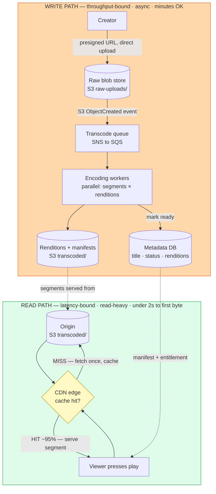

**What the interviewer is checking:**
- You *lead* with the two-path split, not with a favourite technology — and you name why each path scales differently (write = throughput/async/minutes; read = latency/reads/sub-2s).
- You explain the coupling danger: sharing infra means a transcode-pipeline failure can take down streaming (availability risk) and upload spikes compete with reads (performance risk).
- The read path is **CDN-first**: content lives at the edge, not the origin, because the same immutable bytes are requested by millions (Q4 — the Tokyo-viewer latency story).
- Bonus: "uploaded" ≠ "streamable" — the video only becomes playable after async transcoding completes.

---

## Diagram 2 — Resumable Chunked Upload with Presigned URLs

> **When to use:** Q5 (why chunk), Q6 (resume without restarting), Q7 (presigned direct-to-storage). The key visual: the app server mints URLs but the bytes flow *straight to storage*, and the server tracks which parts landed.

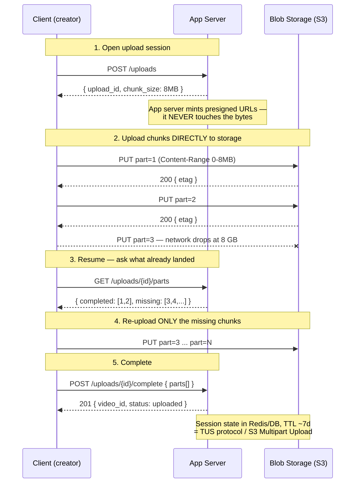

**What the interviewer is checking:**
- Why chunk (Q5): re-upload only the failed chunk, fit each piece inside proxy/gateway timeouts, parallelize to saturate the uplink, and report progress. Typical chunk 5–25 MB.
- Resume (Q6) works because progress is tracked **server-side** — the client *queries* which parts exist and sends only the missing ones; the client can crash and still resume.
- Presigned URLs (Q7) keep the app server out of the data path — it would otherwise handle the bytes twice (in + out). Signed URLs expire and are scoped to one key, so this is *more* secure, not less.
- This is exactly S3 Multipart Upload / the TUS protocol — deeper in [file-storage](../file-storage/).

---

## Diagram 3 — Event-Driven Pipeline Trigger + SNS→SQS Fan-out

> **When to use:** Q8 (how the pipeline knows the upload finished — never poll), plus QB1 (thumbnails/subtitles) and QB3 (moderation) as parallel non-blocking jobs. One upload event fans out to independent consumers.

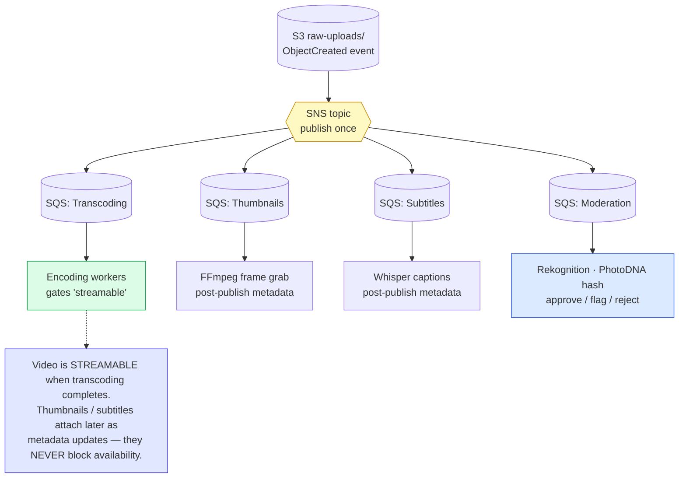

**What the interviewer is checking:**
- **Never poll storage** for new files — an `ObjectCreated` event drives the next stage, eliminating polling overhead and the "missed upload" bug class (Q8).
- One SNS publish fans out to many SQS queues, each an independent, durable pipeline that fails/retries/scales on its own (the SNS→SQS pattern — deeper in [message-queues](../message-queues/)).
- Availability is gated **only** on transcoding; thumbnails, subtitles, and moderation run in parallel and attach afterward (QB1, QB3).
- Moderation is a first-class status machine (`uploaded → analyzing → approved / flagged / rejected`) so nothing reaches viewers unchecked.

---

## Diagram 4 — Parallel Transcoding + Idempotent, Checkpointed Retry

> **When to use:** Q9 (why transcode), Q10 (3 hours → 15 minutes via parallelism), Q11 (rendition ladder), Q12 (crash at 70% without reprocessing). Show the segment × rendition fan-out and the crash-recovery loop.

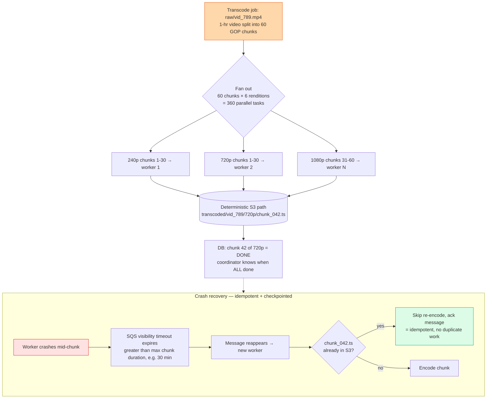

**What the interviewer is checking:**
- Why transcode (Q9): raw is huge (100 GB/hr 4K), in undecodable codecs (ProRes), one fixed quality, unsegmented → convert to H.264/HEVC/AV1, 6+ renditions, 2–4s segments.
- Two parallelism axes (Q10): parallel *renditions* × parallel *GOP chunks* = 360 tasks, ~15 min on ~50 workers vs 3 hrs sequential.
- Crash safety (Q12) rests on three things: **deterministic S3 paths** (re-run is idempotent), **one message per chunk** (tiny failure unit), and **visibility timeout > chunk duration** (no premature requeue).
- Rendition ladder (Q11): 240p→4K, each rung matching a bandwidth class; Netflix per-title encoding ("Dynamic Optimizer") saves 30–40% by tuning bitrate per title/scene.

---

## Diagram 5 — ABR: Manifest Hierarchy + Player Quality-Switch Loop

> **When to use:** Q13 (why ABR beats fixed quality), Q14 (the `.m3u8` manifest), Q15 (when to switch), Q16 (short segments). Two things in one figure: the manifest the player reads, and the loop that decides quality.

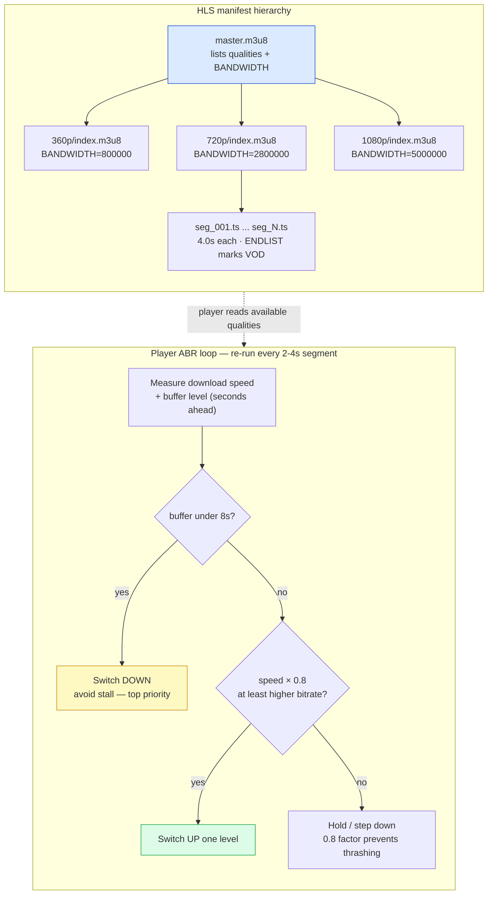

**What the interviewer is checking:**
- ABR (Q13): the *player* picks quality to match bandwidth — degraded 480p beats a buffering spinner at 1080p. This is what makes 200M concurrent streams affordable (most drop below 1080p).
- Manifest (Q14): a two-level map — master lists qualities → per-quality playlist lists segments. The player fetches master, then playlist, then segments, re-measuring throughout.
- Switch logic (Q15): buffer-based safety first (buffer < ~8s → down regardless), throughput check with a 0.8 safety factor to avoid *thrashing* (BOLA / MPC algorithms).
- Segment length (Q16): short 2–4s (CMAF) segments give fast switching, precise seeking, low live latency; Netflix moved 10s→4s (2016), LL-HLS gets <2s live.

---

## Diagram 6 — CDN Delivery: Cache Policy by Object Type + Byte-Range

> **When to use:** Q17 (why a generic "cache all for 1 hour" is wrong), Q18 (byte-range requests for seeking), Q19 (Open Connect). Video is not one object type — segments, manifests, thumbnails each need a different TTL.

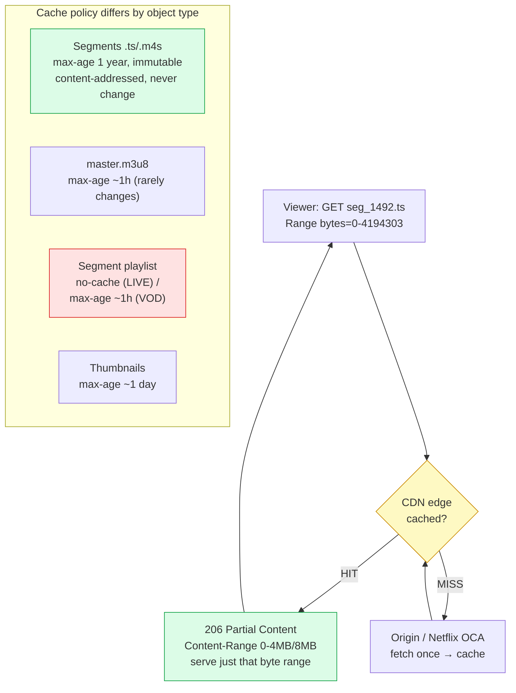

**What the interviewer is checking:**
- Why the default is wrong (Q17): segments are **immutable** → TTL should be ~infinite, not 1 hour (short TTL re-hammers the origin). But live segment playlists change every ~2s → `no-cache`. Different objects, different rules.
- Byte-range (Q18): `Range` header → `206 Partial Content` lets you fetch segment 1,492 without downloading 1–1,491; enables instant seek, parallel download, and partial-object caching at the edge.
- With HLS/DASH, seeking is mostly at *segment* granularity; byte-range is used *within* a segment for format seeks and HTTP/2 efficiency.
- Open Connect (Q19): Netflix installs appliances *inside ISP networks* with proactive nightly push — ~95% of traffic served without leaving the ISP.

---

## Diagram 7 — Thundering Herd → Request Coalescing + Warm-up

> **When to use:** Q20 (10M viewers request the same first segment at once) and QB2 (CDN warm-up for a scheduled drop). Contrast the failure with the coalescing fix, plus the proactive warm-up.

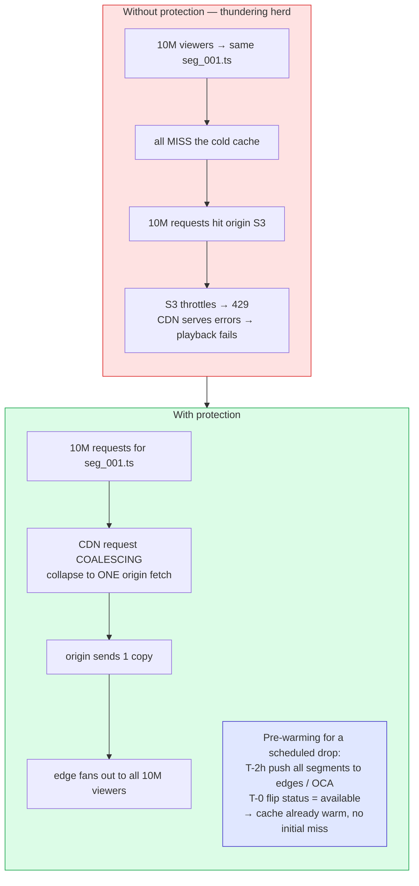

**What the interviewer is checking:**
- The failure mode (Q20): cold cache + synchronized demand → origin stampede → 429s → mass playback failure.
- **Request coalescing** (aka request collapsing) is the linchpin: the edge collapses N identical concurrent misses into ONE origin fetch, then fans the single copy out.
- **Pre-warming** (QB2) is the scheduled counterpart: for a known drop, populate edges *before* T-0 so there is no cold miss to coalesce around. Mature platforms use both.
- Origin resilience underneath: S3 Transfer Acceleration or CloudFront as a second caching tier.

---

## Diagram 8 — Storage Layout + Metadata/Blob Split + Dedup

> **When to use:** Q21 (blob layout for 8 variants × hundreds of segments), Q22 (dedup), Q23 (why metadata lives separately), Q24 (deletion). The core idea: blob storage holds cheap immutable bytes; the DB holds queryable, mutable metadata that *points at* them.

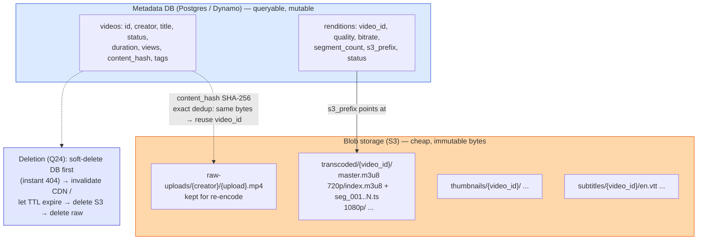

**What the interviewer is checking:**
- Layout (Q21): content-addressed segment names (immutable → easy caching + idempotent re-encode), raw kept separate from transcoded, `video_id` as top-level key for simple delete/ACL/invalidation.
- Split (Q23): S3 = cheap (~$0.023/GB-mo), immutable, GET-by-key only; DB = pricier, mutable, rich queries (`WHERE genre ORDER BY views`). You can't `ORDER BY views` a bucket, and you won't pay DB prices for GBs of segments.
- Dedup (Q22): **exact** (SHA-256, identical bytes → skip/reuse) vs **perceptual** (audio/pHash fingerprints for copyright, e.g. YouTube Content ID) — different questions, different tools.
- Deletion (Q24): soft-delete for instant API 404, then propagate outward through CDN → S3; legal takedowns force immediate CDN invalidation. See [file-storage](../file-storage/).

---

## Diagram 9 — Watch Progress at 40M writes/s (Kafka → Aggregate → Sharded DB)

> **When to use:** Q25 (cross-device resume), Q26 (40M writes/s), Q27 (idempotency), Q28 (completion analytics). The reshape: never point a firehose of ephemeral updates straight at a database.

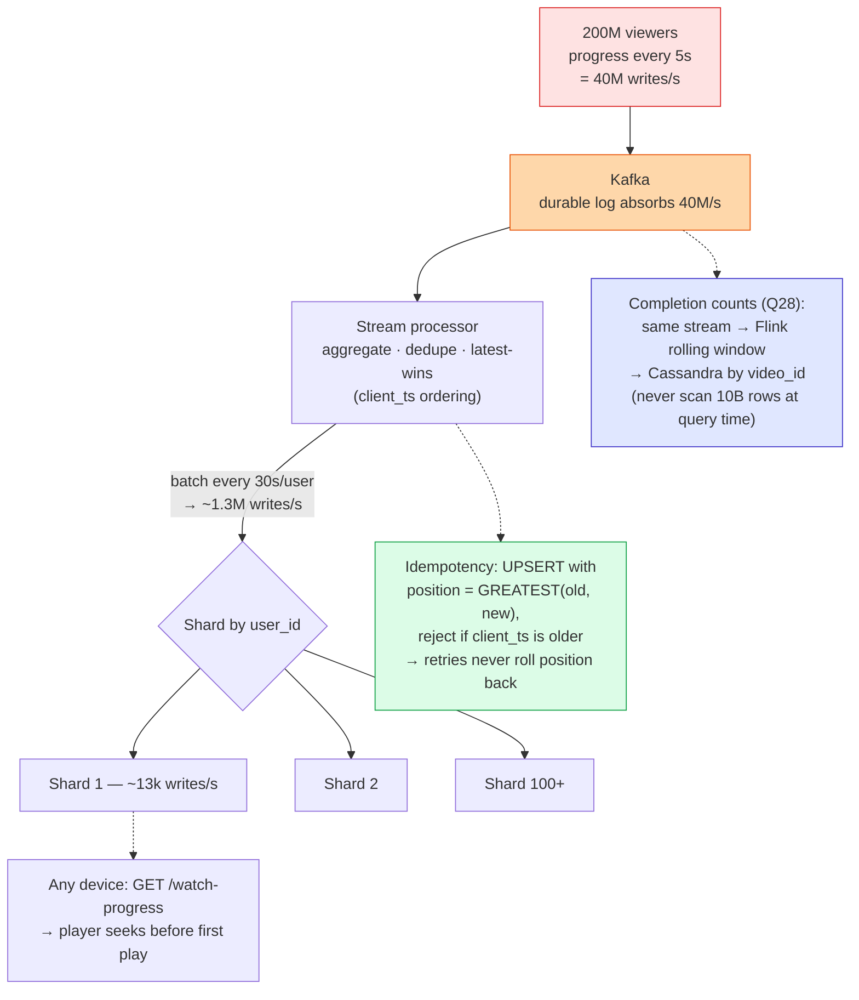

**What the interviewer is checking:**
- The scale math (Q26): 200M / 5s = 40M writes/s — three orders of magnitude past a single Postgres primary. Reshape via Kafka (absorb) → batch (30s/user → 1.3M/s) → shard by user_id (→ ~13k/s each).
- Resume (Q25) works because progress is stored **centrally**, fetched at play start; the player seeks before the first frame.
- Idempotency (Q27): client timestamp orders reports; `GREATEST(position)` guarded by newer timestamp means a delayed duplicate can't roll you backward. Same idea as payment idempotency keys — [api-design](../api-design/).
- Analytics (Q28): maintain the answer *as events flow* (counters / streaming aggregation / HyperLogLog), never a full-table scan. Sharding depth: [sharding-replication](../sharding-replication/).

---

## Diagram 10 — DRM: Content/Key Separation at Play Time

> **When to use:** Q29 — DRM without adding per-segment latency. The core visual: encrypted segments sit in the CDN, but the key travels a *separate*, authenticated path and is cached for the session.

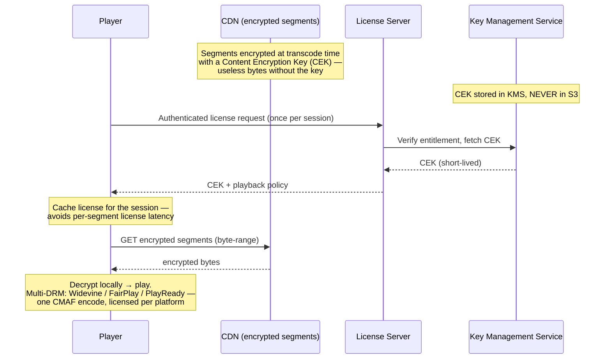

**What the interviewer is checking:**
- The separation: encrypted content in S3/CDN is worthless without the CEK, and the CEK lives in a **KMS**, never beside the content. Possessing the segments alone gets you nothing.
- Latency (Q29): a license request adds ~50–200ms *once*; **cache the license for the session** so DRM isn't a per-segment tax that blows the sub-2s start budget.
- Multi-DRM reality: Widevine (Chrome/Android), FairPlay (Apple), PlayReady (Windows) — encrypt once with CMAF, license per platform.
- Interviewers at streaming companies *expect* you to raise content protection unprompted.

---

## Diagram 11 — Live Streaming Pipeline vs VOD

> **When to use:** Q30 — how live differs from on-demand. Live is *generated in real time*: real-time transcode, a rolling playlist with no end marker, short TTLs, and catastrophic (unrecoverable) failure.

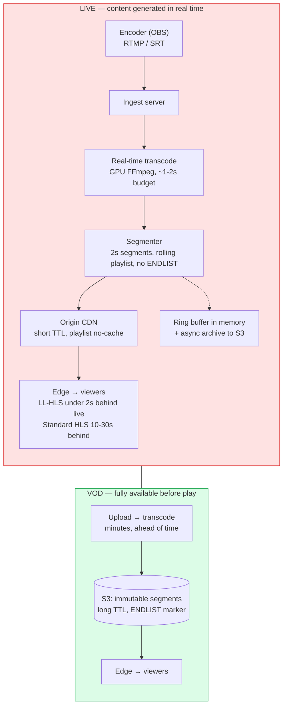

**What the interviewer is checking:**
- The axes that flip (Q30): content availability (real-time vs pre-built), transcoding timing (live 1–2s budget vs offline minutes), playlist (rolling window/no end marker vs fixed with `EXT-X-ENDLIST`), CDN (short TTL/`no-cache` vs immutable/long TTL), and failure impact (**catastrophic** vs recoverable).
- The live chain: RTMP/SRT encoder → ingest → real-time GPU transcode → 2s segmenter → origin (short TTL) → edge → viewers.
- Latency is a dial: standard HLS ~10–30s behind live; LL-HLS with partial segments <2s.
- Storage differs: live buffers in memory (ring buffer) and archives to S3 asynchronously; VOD sits in S3 from the start.

---

## Diagram 12 — Reliability: Detecting a Worker Crash Before It Reports Success

> **When to use:** Q31 — the worker writes output to S3 but crashes before updating the metadata DB. The recovery principle: make the *observable state of storage* (or a transactional record) the source of truth, not a fire-and-forget notification.

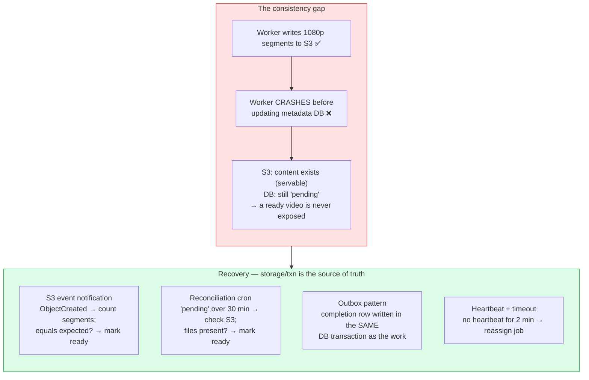

**What the interviewer is checking:**
- You name the gap precisely: physical truth (S3) and recorded truth (DB) diverge because a single in-process "done" write was lost to a crash.
- At least two recovery mechanisms, and *why* each works: S3 events and reconciliation trust the **effect in storage**; the outbox ties the notification to the work in one **transaction**; heartbeats detect liveness.
- This connects to A8/A31 — the whole write path prefers event-driven, idempotent completion over trusting a worker's promise.
- Cost-side sibling (Q32): prune quality variants for long-tail content — see the tiering table below.

---

## Quick Interview Reference

### Scale numbers (back-of-envelope)

| Quantity | Math | Result |
|---|---|---|
| CDN egress bandwidth | 200M viewers × 4 Mbps avg | ~800 Tbps |
| Watch-progress writes | 200M / 5s | 40M writes/s |
| Segments per quality | 1-hr video ÷ 4s segments | ~900 segments |
| Storage per full title | 8 qualities × 900 segments × ~2 MB | ~14 GB |
| Library storage | 100M titles × 14 GB | ~1.4 exabytes (→ tiering) |

### Storage tiering by popularity (Q32 — Pareto: top 1% of titles ≈ 90% of views)

| Tier | Content | Renditions kept |
|---|---|---|
| S3 Standard (hot) | Top ~10% by last-30-day views | Full ladder (all 8) |
| S3 Infrequent Access (warm) | Medium tail | Up to 1080p |
| S3 Glacier (cold) | Long tail | Original + 480p fallback |
| Glacier Deep Archive | Dormant | Original only (restore on demand) |

*Netflix reports ~40–50% storage savings from tiered encoding + lifecycle. Keep the **raw original** (YouTube/Netflix both do) so you can re-encode for a new codec (H.264 → HEVC → AV1) later.*

### Canonical tradeoffs to memorize

- **Short segments (2–4s) vs long (10s):** faster switching + lower live latency **vs** fewer HTTP requests.
- **Presigned direct-to-S3 vs app-server upload:** app server out of the data path **vs** more control over the stream.
- **Push CDN (Open Connect) vs pull CDN:** lower last-mile latency + predictable warm cache **vs** simpler operations.
- **Exact dedup (SHA-256) vs perceptual (fingerprint):** cheap storage save **vs** copyright enforcement.
- **Store raw + renditions vs renditions only:** re-encode flexibility (option value) **vs** lowest storage cost.

### Common mistakes to avoid

- Uploading a 10 GB file *through* the app server (use a presigned S3 URL).
- Treating the video as streamable on upload completion (transcoding is async).
- Treating watch progress as a plain DB write (40M/s needs Kafka + batching + sharding).
- Storing metadata and bytes in the same system (DB for metadata, S3 for bytes).
- Assuming one generic CDN config fits video (segments immutable/long-TTL; live playlists `no-cache`).
- Forgetting DRM and the thundering-herd coalescing story — both are expected unprompted.
