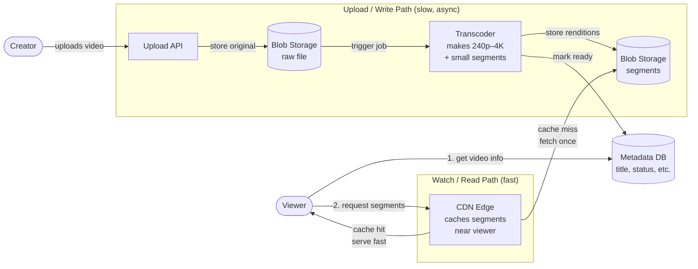
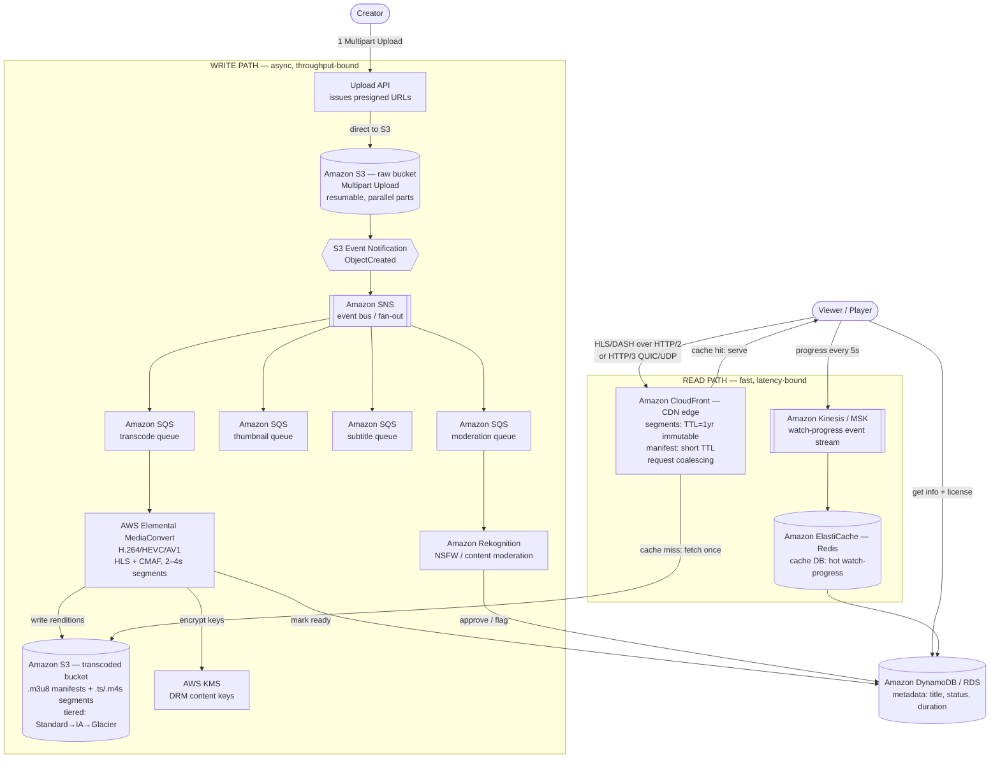

# Video Streaming — Simple Component Diagram

> The bare-minimum mental model. Two flows: **upload (write)** and **watch (read)**.
> Everything else (transcoding tricks, DRM, dedup, CDN internals) hangs off these boxes.

## The 6 components to remember

| Component | Job (one line) |
|---|---|
| **Upload API** | Receives the video, saves the raw file. |
| **Blob Storage** | Cheap storage for the big video bytes (raw + segments). |
| **Transcoder** | Converts raw video into multiple qualities, chopped into small segments. |
| **Metadata DB** | Small structured data: title, status (ready?), duration. |
| **CDN** | Caches segments close to the viewer so playback is fast. |
| **Player (Viewer)** | Asks the DB "is it ready + where", then pulls segments from the CDN. |

## The one idea that ties it together

**Write is slow and async; read is fast.** A creator's upload takes minutes to process, but a viewer pressing play must start in ~2 seconds. Keeping the two paths separate (and caching segments in the CDN) is what makes that possible.

---

# Detailed Diagram — with AWS Services & Protocols

> Same two flows as above, now labeled with the actual AWS services and protocols you'd name in a senior interview.
> Note: service picks aren't the only valid choice (e.g. EventBridge instead of SNS as the event bus, Kinesis/MSK instead of one another) — pick and defend, don't memorize as gospel.

## AWS service cheat-sheet (what maps to what)

| Concept | AWS Service | One-line why |
|---|---|---|
| Big-file upload | **S3 Multipart Upload** + presigned URLs | Resumable, parallel parts; client uploads direct, app server out of the data path |
| Upload → pipeline trigger | **S3 Event Notification** | Event-driven, never poll |
| Event bus / fan-out | **Amazon SNS** (or EventBridge) | One upload event → many consumers |
| Work queues | **Amazon SQS** (one per job type) | Decoupled, retryable, small failure unit |
| Transcoding | **AWS Elemental MediaConvert** | Produces HLS + CMAF, multiple bitrates, small segments |
| Content moderation | **Amazon Rekognition** | Detects NSFW / unsafe frames before publish |
| DRM keys | **AWS KMS** | Store content encryption keys, never in S3 |
| Segment/manifest storage | **Amazon S3** (Standard→IA→Glacier tiers) | Cheap, durable, tiered by popularity |
| Metadata | **DynamoDB / RDS** | Structured, queryable, "is it ready?" |
| CDN + cache TTL | **Amazon CloudFront** | Edge cache; segments TTL=1yr immutable, manifests short TTL; request coalescing |
| Hot cache DB | **ElastiCache (Redis)** | Absorbs 40M writes/s of watch-progress before DB |
| Event stream | **Kinesis / MSK (Kafka)** | Durable firehose for progress events, batched to DB |

## Protocols worth naming

- **HLS / DASH** — the streaming formats (playlist `.m3u8` + segments); **CMAF** lets one encode serve both.
- **HTTP/2** — multiplexes many segment requests over one warmed-up connection (avoids repeated TCP slow-start).
- **HTTP/3 (QUIC over UDP)** — best option: each segment stream recovers from packet loss independently, no head-of-line blocking.
- **Byte-range (HTTP 206)** — fetch exactly the bytes needed for a seek, not the whole segment.
