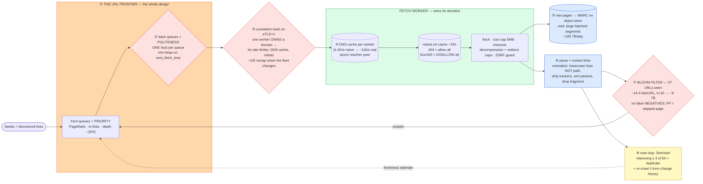

# Web Crawler (Googlebot / Common Crawl) — Mermaid Diagrams

> **Reference:** [questions.md](./questions.md) · [answers.md](./answers.md) · [deep-dive.md](./deep-dive.md)
>
> **Note on this file:** the per-question diagram set (Diagrams 1–N per [`docs/instructions.md` §2.1](../../docs/instructions.md)) is still to be authored for this topic. The **one-page master diagram** below — the artifact you revise from and reproduce on the whiteboard — is complete.
>
> Cross-links: [consistent-hashing](../consistent-hashing/) (domain → worker) · [rate-limiting](../rate-limiting/) (politeness) · [message-queues](../message-queues/) (frontier) · [search-autocomplete](../search-autocomplete/) (downstream) · [large-blobs pattern](../../patterns/large-blobs.md) (WARC storage)

---

## 🎯 The One-Page Master Diagram — THE ONE TO DRAW IN THE INTERVIEW (final consolidated design)

> **When to use:** final revision, 10 minutes before the interview — and the single diagram to reproduce on the whiteboard. If you can narrate it end-to-end and name the tradeoff at each **red** box, you're ready.
> Spec: [`docs/instructions.md` §2.1](../../docs/instructions.md) · AWS names: [`docs/AWS_SERVICE_MAP.md`](../../docs/AWS_SERVICE_MAP.md).
> ⚠️ AWS services are **defensible defaults**; every quota is an order-of-magnitude planning number to **verify against current docs**.

### The central split in one sentence

**The URL frontier *is* the system: it is not a queue but a two-level structure that separately encodes **priority** (which URLs are worth fetching), **freshness** (when to re-fetch), and **politeness** (at most ~1 request/host/second) — and politeness is an architectural constraint, which is why domains are consistently hashed to workers so one owner holds each host's rate limiter, DNS cache, and robots rules.**

### The 60-second narration

*(one line per numbered box ①–⑧)*

1. **Start by rejecting "it's BFS with a queue."** The web graph has ~50 billion nodes, infinite cycles and spider traps, and wildly uneven value — so the frontier's *front* queues encode priority: source PageRank, in-link count, domain authority, URL depth (OPIC approximates this online).
2. **The first red box is the Mercator two-level trick: back queues encode politeness, one host per queue**, with a min-heap on each host's next allowed fetch time. Priority and politeness are *separate* concerns and mixing them into one queue is the classic failure — you either crawl junk or get IP-banned.
3. **The second red box: consistently hash the registrable domain (eTLD+1) to a worker.** That gives each host exactly one owner, so its rate limiter, DNS cache and robots rules are all *local* — no distributed coordination per fetch. And when the fleet resizes, only ~1/N of domains move.
4. **DNS would be the hidden bottleneck** — a naive design needs ~11,600 lookups/s; a per-worker cache (which domain ownership makes effective) cuts it to roughly 116 real lookups/s. Keep negative-cache TTLs short so a genuinely new domain isn't blackholed.
5. **Robots is fetched, cached ~24 h (RFC 9309), and interpreted conservatively:** a 404 means allow-all, but a 5xx or 429 means **disallow-all** — you do not hammer a site that is already failing.
6. **Raw pages go to object storage as large batched WARC segments**, compressed — many small objects would be the real cost driver at ~100 TB/day.
7. **The third red box is deduplication at 5 trillion URLs.** An exact hash set is ~40 TB of memory — impossible. A Bloom filter at ~14.4 bits/URL with k≈10 gives ~0.1% false positives in about 9 TB, shardable. Know the direction of the error: Bloom has **no false negatives**, so a false positive means you *skip* a real page (a coverage loss you accept), never that you re-crawl forever.
8. **Then a second dedup layer for near-duplicates** — SimHash, with Hamming distance ≤ 3 of 64 bits meaning "same content, different URL" — and a re-crawl scheduler that estimates each page's change rate λ (Poisson: P(changed) = 1 − e^(−λt)) so budget goes to pages that actually change *and* matter.

### The five numbers that justify the design

| Number | Derivation | Therefore |
|---|---|---|
| **5T URLs seen → ~40 TB as an exact set** | 5×10¹² × 8 bytes | Exact dedup is off the table; Bloom at ~14.4 bits/URL ≈ **9 TB**, sharded, is the only viable answer |
| **0.1% false-positive rate ⇒ ~5B pages never crawled** | 0.001 × 5T | The tradeoff stated honestly — and it's *acceptable*, which is the point. Know `(1 − e^(−kn/m))^k` and `k = (m/n)·ln2` |
| **1 req/host/s × 10M domains** | politeness constraint | Politeness caps per-host throughput, so total throughput comes from *breadth* across hosts — which is exactly why domain→worker ownership is the architecture |
| **~11,600 DNS lookups/s naive → ~116/s cached** | fetch rate ÷ cache hit rate | DNS is a first-class subsystem with its own async resolver pool, not a library call |
| **~100 TB/day of raw pages** | pages/day × avg page size | Batched, compressed WARC segments on object storage; per-page objects would be cost and request-rate suicide |

### The patterns this assembles

| Pattern | Where | The move |
|---|---|---|
| [Scaling Writes](../../patterns/scaling-writes.md) **●** | ⑤ | Batch small pages into large compressed segments; spread keys across prefixes |
| [Long-Running Tasks](../../patterns/long-running-tasks.md) **●** | ①②④ | The frontier is a durable work queue; a crashed worker's domains are reassigned and replayed from an offset |
| [Consistent hashing](../consistent-hashing/) **●** | ③ | Domain → worker with ~1/N remap; the reason politeness state can be local |
| [Rate limiting](../rate-limiting/) **●** | ②④ | Per-host, per-IP, *and* per-provider limits — the shared-hosting gap is the one people miss |
| [Dealing with Contention](../../patterns/dealing-with-contention.md) ○ | ⑦ | Bloom + a durable exact set for the ~0.1% suspected hits |

### The three things that break (and the mitigation)

| Failure | Blast radius | Mitigation | How you detect it |
|---|---|---|---|
| **Accidental DDoS of a shared host** | You respect 1 req/s *per domain*, but 500 domains share one IP — so that server gets 500 req/s and blocks you | Layer the limits: per-domain **and** per-IP/subnet **and** per-hosting-provider, plus adaptive backoff on rising latency or 429/5xx | 429/5xx rate grouped by IP and ASN (not by domain); latency trend per IP; block/ban reports |
| **Spider trap / infinite URL space** | A calendar or faceted-search page generates unbounded URLs and consumes the entire crawl budget | Per-domain page budget proportional to authority, depth caps, URL-pattern detection, and normalization that strips tracking/session params | Pages-per-domain distribution; new-URL-per-page ratio; budget consumed vs unique content gained |
| **A fetch worker crashes** | Its domains have no owner: their politeness state, DNS cache and in-flight URLs are gone | The frontier is a durable log partitioned by domain — a new owner takes over and replays from the last offset (at-least-once, so fetches are idempotent) | Unowned-partition alarm; per-domain fetch-gap; duplicate-fetch rate after failover |

### The AWS-specific traps to name unprompted

| Trap | Why it bites here | What you say |
|---|---|---|
| **S3 request rate is per prefix** (~3,500 PUT **⚠️ verify**) | 100 TB/day of writes | *"Batched WARC segments plus hash-spread prefixes — a date-based prefix would be the hotspot."* |
| **SQS message size + `DelaySeconds` ≤ 15 min** **⚠️ verify** | Politeness delays can be hours | *"The frontier isn't a plain SQS queue: next-fetch-time lives in a store I schedule from, with SQS carrying only ready work."* |
| **Lambda runtime ceiling + cold starts** **⚠️ verify** | Headless-browser rendering | *"JS rendering is a Fargate/ECS fleet — a headless Chromium render is far too heavy and long for a function."* |
| **NAT egress and cross-AZ data cost** | Crawling *is* egress | *"Bandwidth, not compute, dominates the bill — I'd keep fetchers and storage in one AZ/region and watch NAT costs."* |
| **DynamoDB per-partition ceiling** **⚠️ verify** | URL-seen writes | *"The Bloom filter absorbs the volume; the durable exact set is only touched on a suspected hit, so the hot path never hits that ceiling."* |
| **Kinesis head-of-line blocking** | One malformed page | *"Per-shard retry with a DLQ; parser failures must not stall a partition."* |

### If you only remember one thing

> **The frontier is the system: two levels — front queues for priority, back queues for politeness with one host each — plus consistent hashing of domains to workers so every host's rate limiter, DNS cache and robots rules are local, and a Bloom filter (no false negatives; false positives just cost coverage) to remember 5 trillion URLs in ~9 TB instead of 40.**
